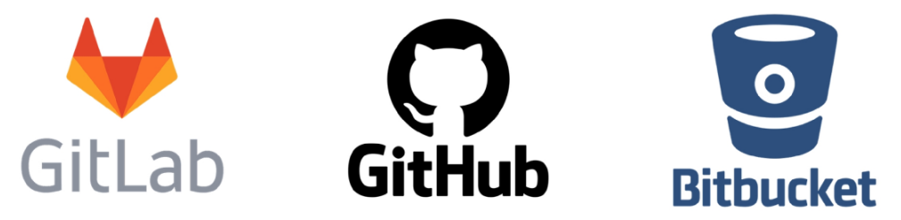

# 운영체제 & 터미널
### 운영체제별 터미널
- 운영체제가 다르면 터미널도 다름 → 터미널이 다르면 명령어도 다름
- Windows: cmd
- Unix 계열: bash (우리는 Git Bash 사용)

### 기본 명령어 정리
| 명령어     | 설명                             |
| ------- | ------------------------------ |
| `.`     | 현재 디렉토리                        |
| `..`    | 상위 디렉토리                        |
| `touch` | 파일 생성                          |
| `mkdir` | 디렉토리 생성                        |
| `ls`    | 현재 디렉토리의 폴더/파일 목록 출력           |
| `cd`    | 디렉토리 이동                        |
| `start` | 폴더/파일 열기 (Mac은 `open`)         |
| `rm`    | 파일 삭제 (`-r` 옵션 추가로 디렉토리 삭제 가능) |
| `pwd`   | 현재 디렉토리의 절대 경로 출력              |
| `clear` | 터미널 화면 지우기 (단축키: `Ctrl + L`)   |


### 경로 개념
- 루트 디렉토리 /: 전체 경로의 시작
- 홈 디렉토리 ~: 기본 시작 위치
- **절대 경로**: 루트부터 전체 경로
- **상대 경로**: 현재 위치 기준

# Markdown
### 마크다운 문법
```
# 제목
## 소제목
### 더 작은 제목

1. 순서가
2. 있는
3. 리스트

- 순서가
  - 없는
- 리스트

**굵게**
*기울임*
~~취소선~~

### 코드 블록
<pre> ```python print('hello') ``` ```c++ cout << "hello"; ``` </pre>
링크
[google](https://www.google.com/) 
이미지



이미지 크기 조절은 마크다운 불가 (HTML 사용 필요)
상대 경로가 빠름
대체 텍스트는 이미지가 안 뜰 때 표시됨
```
# Git
### 버전 관리 시스템(Git)
- **버전 관리**: 변경사항을 기록하고 추적
- **분산 구조**: 중앙 서버 없이도 작업 가능

### 장점
1. 협업 중 충돌 감소
2. 중앙 서버 문제 발생 시 복구 용이
3. 오프라인 작업 가능

### Git의 역할
- 코드 버전 이력 관리
- 변경사항 추적
- 협업 시 필수 도구

### Git의 3가지 영역
1. Working Directory
실제 작업 파일들이 존재하는 영역
2. Staging Area
커밋 대상 파일들을 임시 저장하는 영역
3. Repository
커밋으로 영구 저장되는 영역

→ git add → git commit → 저장소에 기록됨

### 주요 Git 명령어
| 명령어                                      | 설명                   |
| ---------------------------------------- | -------------------- |
| `git init`                               | 로컬 저장소 초기화           |
| `git add <file>`                         | 파일을 Staging Area에 추가 |
| `git commit -m "message"`                | 커밋 생성 (버전 저장)        |
| `git status`                             | 현재 상태 확인 (WD/SA 상태)  |
| `git rm --cached <file>`                 | Staging에서 파일 제거      |
| `git log`                                | 커밋 히스토리 확인           |
| `git log --oneline`                      | 한 줄로 커밋 로그 보기        |
| `git config --global user.name "Name"`   | 사용자 이름 설정            |
| `git config --global user.email "email"` | 사용자 이메일 설정           |
| `git config --global -l`                 | 전체 설정 보기             |
| `git commit --amend`                     | 마지막 커밋 수정            |


### 주의사항
- Git 저장소 안에 또 다른 Git 저장소를 만들지 말 것

    → .git 폴더 삭제로 초기화 가능
---
# 기타 참고 사항
### 로컬(Local) 개념
- 현재 사용 중인 개인 컴퓨터나 시스템을 의미

`git commit --amend`
- 직전 커밋 수정
- 커밋 메시지 또는 전체 커밋 변경 가능
- 커밋 해시값은 변경되므로 협업 시 주의

### Vim 에디터 모드
1. 명령 모드
    - 나가기, 저장 등
    - 진입: `ESC`

2. 수정 모드

    - 입력 모드

    - 진입: `i`

3. 명령 예시

    - 저장 후 종료: `:wq`
---
### 오늘 배운 내용 요약
- 운영체제와 터미널의 차이와 관련된 기본 명령어를 정리하였고, 경로의 개념(절대/상대)을 이해했다.

- 마크다운 문법을 실습하여 문서화, 코드 정리, 링크/이미지 삽입 방식에 익숙해졌다.

- Git의 개념과 구조(Working Directory, Staging Area, Repository), 주요 명령어 사용법을 학습하였다.

- `git commit --amend`, .git 주의사항 등 사용 시 주의점도 함께 익혔다.

- Vim 에디터의 모드 전환 및 명령어 활용법도 학습하였다.

이 내용을 기반으로 TIL 마크다운 파일을 작성하고, 매일 학습한 내용을 정리하는 습관을 들여보자!

