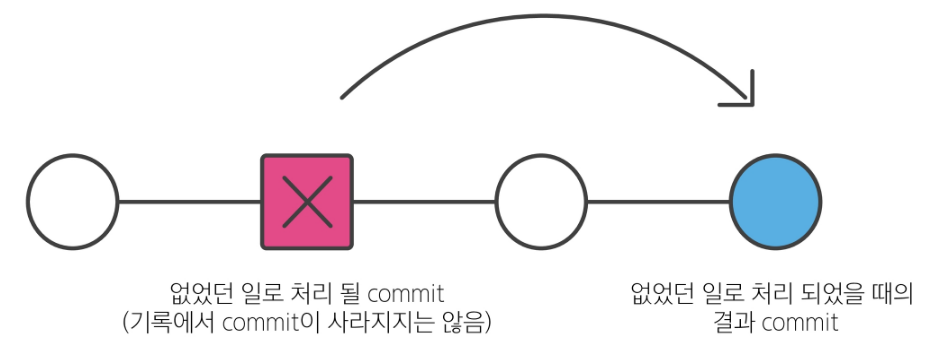
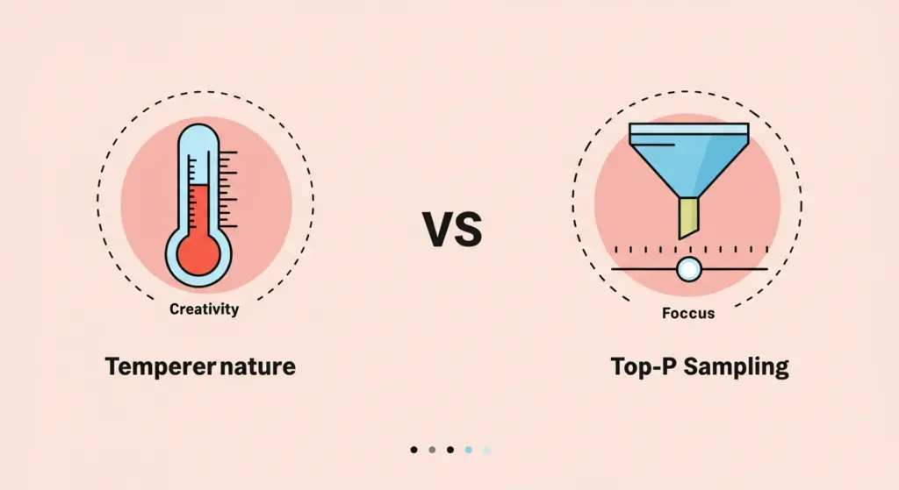
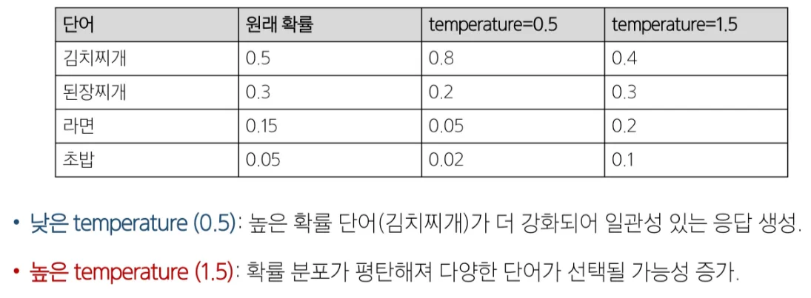
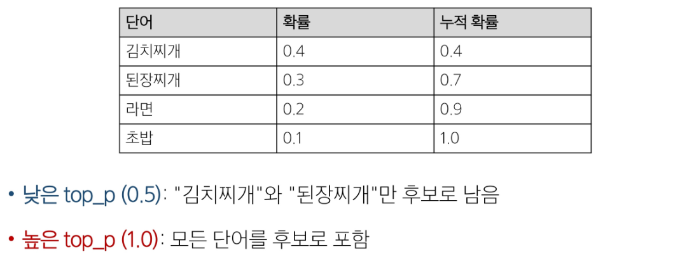

# Git revert & reset

### Git revert

: 특정 commit을 없었던 일로 만드는 작업

`git revert <commit id>` : revert 명령어

### Git revert 작동 원리

- “재설정”
- 단일 commit을 실행 취소 하는 것
- 프로젝트 기록에서 commit을 없었던 일로 했을때의 그 결과를 새로운 commit으로 추가함
- 해당 commit이 지워지진 않는다⭐



### Git revert 정리

- 변경 사항을 안전하게 실행 취소할 수 있도록 도와주는 순방향 실행 취소 작업
- commit 기록에서 commit을 삭제하거나 분리하는 대신, 지정된 변경사항을 반전시키는 새 commit을 생성
    
    → git에서 기록이 손실되는 것을 방지하며 기록의 무결성과 협업의 신뢰성을 높임
---

### Git reset

: 특정 commit으로 되돌아가는 작업 → 현업에선 보통 쓰지 않음

`git reset [옵션] <commit id>` : reset 명령어

### Git reset 작동 원리

- “되돌리기”
- 시계를 마치 과거로 돌리는 듯한 행위
- 특정 commit으로 되돌아갔을 때, 되돌아간 commit 이후의 commit은 모두 삭

### reset의 3가지 옵션

- `--soft` `--mixed` `--hard`
- reset은 과거 commit으로 되돌아간 후 되돌아간 commit 이후 commit들이 삭제됨
- 그런데 삭제되는 commit들의 기록을 어떤 영역에 남겨둘 것인지 옵션을 활용해 조정할 수 있음

### 옵션 별 동작 원리

| `--soft` | 삭제된 commit의 기록을 staging area에 남김 |
| --- | --- |
| `--mixed` | 삭제된 commit의 기록을 working directory에 남김 (default 값) |
| `--hard` | 삭제된 commit의 기록을 남기지 않음 |
- 보통은 mixed로 진행함


### 참고

### 이미 삭제한 commit으로 돌아가고 싶다면?

`git reflog`

- HEAD가 이전에 가리켰던 모든 commit을 보여줌
- reset의 `—hard` 옵션을 통해 지워진 commit도 reflog로 조회하여 복구가능
---

# ChatGPT

### Generative AI

: 오디오, 비디오, 이미지, 텍스트, 코드, 시뮬레이션 등의 새로운 콘텐츠를 생성하는 인공지능 모델

→ 최근 언어 및 이미지 분석에서 큰 파급력을 보임

### ChatGPT: Generative / Pre-trained / Transformer

생성 모델 / 사전 훈련 / 트랜스포머 AI 모델

→  GPT 모델을 기반으로 한 대화형 AI

- **Generative**
    - 기존 패턴을 기반으로 오디오, 비디오, 이미지, 텍스트, 코드, 시뮬레이션 등의 새로운 콘텐츠를 생성하는 인공지능 모델
- **Pre-trained**
    - 거대 언어 모델 + 추가 학습 데이터 + 추가 강화 학습
- **Transformer**
    - 문장 속의 단어 간 관계를 추적해 맥락과 의미를 학습
    - 인간처럼 일관되고 연관성이 높은 언어를 구사하여 대화형 작업에 강점

### 트랜스포머(Neural Network Architecture)

: 문장의 맥락을 효과적으로 이해하고 처리 → **Attention 메커니즘**

### Transformer 주요 개념

- Self-Attention 메커니즘
    - 입력 데이터 간의 관계와 중요도를 계산
- 병렬 처리 가능
    - RNN과 달리 순차 처리가 필요 없어 속도가 빠름
- 스케일링 가능
    - 대규모 데이터 및 파라미터로 확장가능

<aside>
💡

GPT 모델은 특히 Transformer의 디코더 부분만을 사용

</aside>

GPT, Google Gemini, Claude

요즘엔 Google Gemini, Claude 더 많이 씀. 특히 Claude는 코딩 특화

### 참고

### Attention 메커니즘

- AI가 데이터의 맥락과 중요도를 이해하도록 돕는 필수 기술
- 입력 데이터의 각 요소가 출력에 얼마나 중요한지 중요도(weight)를 계산하는 기법
- “중요한 것에 집중한다”는 아이디어를 바탕으로 설계됨
- 종류
    - Self-Attention: 입력 데이터 내부에서 각 요소 간 중요도를 계산
    - Multi-Head Attention: 다양한 관심사(관점)를 병렬로 계산하여 성능 향상

---

# API

### Interface

: 서로 다른 두 개의 시스템(기기, 소프트웨어 등)이 정보를 교환할 때, 그 사이에 존재하는 접점

→ 사용자가 기기를 쉽게 동작 시키거나, 기계와 기계가 통신할 때 필요한 ‘약속된 방식’

### Interface 예시

- 키보드, 마우스, 모니터
    - 컴퓨터와 사람 사이의 물리적 인터페이스
- TV 리모컨
    - TV와 사람 사이의 인터페이스
- 자동차 운전대, 페달
    - 자동차의 내부 장치와 운전자 사이를 연결
- 스마트폰 터치 스크린
    - 디지털 인터페이스

### UI(User Interface)

: 사람(사용자)이 소프트웨어에 접근하는 그래픽적, 화면적 요소

### User Interface 예시

- ATM의 언어 선택 화면
- 브라우저의 뒤로가기 버튼
- 스마트폰 앱의 아이콘 등

우리가 당연하다고 생각하는 UI가 다른 세대는 모를 수도 있음

### 눈에 보이지 않는 영역의 통신

- 실제로는 기계과 기계, 시스템과 시스템 사이에서도 수많은 ‘인터페이스’를 통해 정보를 주고받고 있음
- 여기서는 화면(UI)이 없을 뿐, 약속된 방식으로 데이터를 주고 받음

<aside>
💡

눈에 보이지 않는 영역에서도 수많은 통신이 이루어지고 있다.

</aside>

---

# 클라이언트 —> 서버

### **클라이언트(Client)**

: 서비스를 요청하는 쪽

ex) 사용자의 웹 브라우저(크롬), 모바일 앱

### **서버(Server)**

: 요청을 받아서 처리하고, 결과를 응답해주는 쪽

ex) 웹 서버, 데이터베이스 서버

### API(Application Programming Interface)

: 두 소프트웨어(또는 시스템)가 서로 통신할 수 있게 하는 메커니즘

→ ‘약속된 방식의 인터페이스’로, 특정 규칙에 따라 데이터를 요청하고 응답하는 규칙을 제공

### Application

: 특정 기능을 수행하는 모든 소프트웨어

→ 웹, 모바일, 데스크톱 앱 등, 우리가 만든 서비스나 프로그램도 모두 앱의 일종

### API 활용

**API 예시 1 - 소셜 로그인**

ChatGPT에서 Google로 로그인 하기

- Google 로그인 계정으로 로그인을 성공했을 경우 Google API는 ChatGPT에게 로그인에 성공한 인증된 사용자 정보를 넘겨줌
- 사용자 정보를 넘겨받은 ChatGPT는 해당 정보를 활용해 회원가입 및 로그인을 진행

**API 예시 2 - 날씨**

- 날씨 데이터를 얻으려면?
    - 기상청 서버에는 날씨 정보를 얻고 싶으면 이런 식으로 요청해야 한다는 지정된 형식들이 작성되어 있음
- “이렇게 요청을 보내면, 이렇게 정보를 제공해 줄 것이다”라는 매뉴얼
    - 소프트웨어와 소프트웨어 간 지정된 정의(형식)으로 소통하는 수단 → API
    

**API 예시 3 - OP.GG**

- op.gg가 게임 서버에 요청하고 게임 데이터 응답 받는 방식
- 게임 서버 죽으면 op.gg도 멈춤

---

### API Key

: API에게 요청을 보내는 애플리케이션을 구별하기 위한 고유한 식별 문자열

→ ex) abdcks123jb32jh3h4… 처럼 랜덤하게 생성된 키를 서버가 발급

→ API 요청을 하기 위해 안전한 사용자라는 것을 인증하기 위한 수단

→ 가끔 무료 API의 경우 Key 발급이 필요하지 않은 경우도 있음

### API Key가 필요한 이유

- 보안 강화
    - 무단 접근을 막고, 승인된 사용자(또는 앱)만 요청할 수 있도록
- 데이터 관리
    - API 호출 횟수, 사용량 모니터링
    - 일정량 이상으로 사용 시 제한 또는 과금 정책 적용 가능

### API Key 사용 시 주의사항

- 공개된 곳에 노출하지 말 것
- 키가 유출될 경우 무단 사용 위험 → 정기 갱신 필요
- 서버-클라이언트 구조에서 키를 안전하게 저장하는 방법들 고려

### API 정리

- API는 클라이언트와 서버 이 둘 사이의 “눈에 보이지 않는 인터페이스” 역할
- API Key는 이 통신을 더욱 안전하게 만들기 위한 핵심 수단

---

# Prompt Engineering

## GPT 4o-mini 버전 API 실습 [초급]

### 1. API 사용법 숙지

- [API 공식 문서](https://www.google.com/url?q=https%3A%2F%2Fplatform.openai.com%2Fdocs%2Fapi-reference%2Fchat)
- [사용 가능한 모델](https://www.google.com/url?q=https%3A%2F%2Fplatform.openai.com%2Fdocs%2Fmodels%2Fgpt-4o)

**GPT API 활용 사례**

- 콘텐츠 생성: 블로그 게시물, 광고 카피, 소셜 미디어 콘텐츠 생성.
- 고객 지원: 자동 응답 봇, FAQ 응답 시스템.
- 교육: 학습 자료 생성, 문제 풀이 설명, 힌트 제공.
- 연구: 데이터 분석, 논문 요약, 정보 검색.

---

### 2. 토큰

- **정의**: GPT와 같은 인공지능 모델에서 텍스트 데이터를 처리하고 이해하는 기본 단위 (토큰은 문장에서 단어로 생각할 수 있음)
    - 각 토큰별로 고유한 숫자가 매겨져있음.
    - 영어보다 한글 문장을 표현하는데 더 많은 토큰 소요됨
        - 이유: 한글은 다양한 조합형 문자로 인해 많은 토큰이 필요
- **최대 입력 토큰 제한**: 각 LLM 모델마다 최대로 입력할 수 있는 토큰 수가 제한됨
- **토큰 수 확인**: OpenAI Docs Tokenizer 페이지 활용 [클릭](https://www.google.com/url?q=https%3A%2F%2Fplatform.openai.com%2Ftokenizer)

---

### **3. API 주요 파라미터**

- 필수 파라미터
    - model: GPT 모델 이름 (예: gpt-4o-mini)
    - messages: 대화 메시지 기록

- 응답 다양성 제어
    
    
    
    - temperature: 다음 토큰 예측을 위한 확률 분포를 부드럽게 하는 역할
        - 0에서 2사이의 값을 가지며, 1.0 이상일 경우 확률 분포가 평탄해지며 더 창의적이고 예측할 수 없는 결과를 생성
        - 응답의 창의성과 다양성 조정
            
            
            
    - top_p: 누적 확률을 기준으로 선택할 토큰의 범위를 제한
        - 0에서 1사이의 값을 가지며, 1에 가까울수록 모델은 더 다양한 토큰을 고려
        - 누적 확률 기반으로 응답의 범위 제한(상위 확률의 단어들만 제한)
            
            
            

**낮은 temperature + 높은 top_p**

- temperature가 낮아 확률 분포의 차이가 더 강조됨
    
    → 높은 확률의 단어에 집중
    
- top_p가 높아 누적 확률 범위가 넓음 → 상위 확률 단어들을 다양하게 고려
    - 응답이 안정적이고 예측 가능
- 활용: 기술 문서 작성, 고객 지원

**높은 temperature + 낮은 top_p**

- temperature가 높아 확률 분포가 평탄해짐 → 다양한 단어가 선택될 가능성 증가
- top_p가 낮아 누적 확률 범위가 좁음 → 선택 후보가 제한적
    - 창의적이고 독창적인 응답
- 활용: 아이디어 도출, 소셜 생성

---

### 3.1 기본 사용 방법

- API 파라미터 숙지
    - 아래 실습 코드의 `API 호출 부분`
- GPT API에서 Role은 챗봇의 다양한 사용 사례에 따라 서로 다른 방식으로 응답을 생성할 수 있도록 하는 기능

```
1. system: 
	- 역할: 기본 지침을 설정하고 대화의 전체적인 방향을 설정합니다.
	- 특징: 대화의 톤, 스타일, 특정 규칙 등을 정의합니다.
	
2. user:
	- 역할: 사용자의 입력을 나타냅니다.
	- 특징: 질문이나 명령 등 사용자가 챗봇에게 전달하는 메세지를 포함합니다.
	 챗봇은 이를 바탕으로 응답을 생성합니다.
	- 여기다가 프롬프트 입력.

3. assistant:
	- 역할: 챗봇의 응답을 나타냅니다.
	- 특징: 시스템의 지침과 사용자의 입력을 토대로 생성된 응답을 나타냅니다.
```

**실습 내용**

- GPT API의 파라미터를 바꿔가면서 어떠한 출력이 나오는지 확인한다.
    1. max_tokens의 값을 10으로 바꾸고 어떻게 출력되는지 본다
    2. n=2로 바꿔서 값이 어떻게 출력되는지 본다
    3. 질문의 content를 바꿔서 출력해본다.

**주의사항**

- n값을 너무 크게 설정하면 API호출 과비용 발생

---

# Vibe Coding

### Vibe Coding 주의사항

- 같은 질문을 해도 매번 같은 코드를 줄 수도, 다른 코드를 줄 수도 있음.
- 코드의 실행 결과가 항상 동작하리라는 보장은 없음
    - 매번 테스트를 하며 기능 검증에 신경 써야 함
- 구체적인 요청일수록 프로젝트의 완성도가 높아짐
    - 어떤 프로젝트를 만들 것인가?
    - 해당 기능은 어떻게 동작할 것인가?

# 바이브 코딩(Vibe Coding) 가이드

---

### 1. 바이브 코딩(Vibe Coding)이란?

<aside>
💡

코딩 지식 없이도 가능, 자연어 기반 개발, AI가 코드 생성

</aside>

- 프로그래밍 지식이 없어도 누구나 **일상 언어로 프로그램을 만들 수 있는 방식**
    
    > 사용자는 “로그인 기능 만들어줘”, “화면에 오늘 날짜를 보여줘”와 같은 요청을 AI에게 전달하면, AI가 이를 해석해 실제 동작하는 코드를 자동으로 생성
    > 
- 기존의 “코드를 직접 작성해야 하는 방식”에서 벗어나, **아이디어만 있으면 개발이 가능한 환경**을 제공
- **개발을 전문으로 하지 않는 사람**에게 개발 참여의 장벽을 크게 낮춰줌

---

### 2. 바이브 코딩의 장점

<aside>
💡

비전공자의 접근성, 빠른 개발, 협업 효율 향상, 다양한 언어 지원

</aside>

기존 프로그래밍 방식과 달리, 바이브 코딩은 **사용자의 의도 전달**만으로 많은 작업이 가능

- **개발을 전문으로 하지 않는 사람도 바로 시작 가능**
    
    복잡한 문법, 에러 메세지, 디버깅을 몰라도 프로젝트를 진행할 수 있음
    
- **빠른 MVP 제작**
    
    초기 기획안을 빠르게 결과물로 옮길 수 있어 창업 아이디어나 실습 프로젝트에 매우 유용함
    
- **의사소통 비용 감소**
    
    기획자가 직접 실행해보며 기능을 구현할 수 있어, 개발자와의 커뮤니케이션 단계를 줄일 수 있음
    
- **다양한 코드 언어로 확장**
    
    Python, JavaScript, HTML 등 다양한 언어로 코드 생성을 요청할 수 있어 확장성도 뛰어남 
    
    ---
    
    ### 3. 실습 도구 및 환경
    
    <aside>
    💡
    
    VSCode, Cursor AI, 브라우저, GitHub 등은 실습 필수 도구
    
    </aside>
    
- **VSCode, 터미널**
    
    VSCode는 기본적인 코드 편집기와 명령어 실행 환경 터미널은 생성된 코드를 직접 실행하고 수정할 수 있음
    
- **Cursor AI**
    
    VSCode와 유사한 인터페이스에서 AI와 자연어로 주고 받으며 개발할 수 있는 툴
    
- **웹 브라우저**
    
    HTML/CSS/JS로 만든 결과물을 확인할 수 있는 가장 기본적인 실행 환경
    
- **Notion, Git**
    
    Notion으로 프로젝트에 관련된 문서를 작성하여 관리할 때 유용
    
    Git으로 소스 코드의 버전 관리를 위해 필수로 활용됨
    
    ---
    
    ### 4. 바이브 코딩의 원리와 흐름
    
    <aside>
    💡
    
    **프롬프트 입력** → **코드 생성** → **실행** → **수정 반복** 
    
    이 흐름이 바이브 코딩의 핵심
    
    </aside>
    
    바이브 코딩은 AI와 대화하듯 작업이 이루어집니다.
    
    ### 4-1. 문제 정의
    
    가장 **중요한 단계**이며 만들고 싶은 프로젝트를 구체적으로 설명해야 좋은 프로젝트가 만들어짐
    
    - 나쁜 예시
        
        > “로그인 기능 만들기”
        > 
    - 좋은 예시
        
        > “이메일과 비밀번호를 입력하는 두 개의 입력창이 있고, 로그인 버튼을 누르면 메인 화면으로 이동하며 사용자 이름을 환영 메세지로 보여주는 웹 페이지 만들기”
        > 
    
    ### 4-2. 프롬프트 입력
    
    <aside>
    💡
    
    **프롬프트 작성** Tip!
    
    - **행동 동사**를 사용하자 : `"~해줘"`, `"~하게 해줘"`, `"출력해줘"`
    - **구체적인 요구 조건 포함**하자 : `"입력 필드 2개"`, `"클릭 시 알림"`, `"반응형 디자인"`
    - **기술 스택을 명시** 하자 : `"HTML/CSS/JS만 사용해줘"`, `"React는 제외해줘"`
    - **추가 조건을 명확히** 하자 : `"반응형으로 보여줘"`, `"버튼은 파란색으로 해줘"`
    </aside>
    
    - **프롬프트(prompt)**는 사용자가 AI에게 **자연어로 작업을 요청하는 문장**
    - 바이브 코딩에서는 이 **프롬프트가 가장 핵심 역할**을 하며, 프롬프트에 따라 생성되는 코드의 품질도 결정
        - 나쁜 예시
            
            > “덧셈 문제 내주는 프로그램 만들어줘”
            > 
        - 좋은 예시
            
            > “덧셈 문제 10개를 무작위로 출제하는 웹 페이즈를 만들고 싶어. 사용자가 입력한 답을 제출하면, 채점해서 점수와 정답을 알려주는 기능도 포함해줘.”
            > 

### 4-3. 코드 자동 생성

- 프롬프트에 포함된 요구 조건, 기술 스택, 기능 설명 등을 바탕으로 코드 구성 결정됨
- 학습된 패턴을 기반으로 가장 가능성 높은 코드 조합을 생성하며, 반복적으로 수정 가능
- 구체성이 부족한 프롬프트의 경우 의도와 다른 코드가 생성될 수 있음

### 4-4. 실행 및 테스트

생성된 코드가 의도대로 작동하는지 검증하는 단계로 다음과 같은 방식으로 테스트 진행

- **기능 정상 동작 여부 확인**
    - 입력, 클릭, 이동 등 사용자 상호작용이 의도대로 동작하는지 확인
    - 버튼, 입력창, 화면 출력 등 주요 요소 직접 조작
- **다양한 시나리오 테스트**
    - 정상 입력뿐 아니라 빈 값, 잘못된 값 등도 시도
    - 에러 발생 여부 및 예외 처리 확인
- **콘솔/오류 메시지 점검**
    - 브라우저 콘솔, 터미널 로그 등을 통해 경고나 오류 유무 확인
    - 문제가 있을 경우 AI에게 수정 요청하거나 수동 디버깅

### **4-5. 수정 및 반복 요청**

- **의도와 다른 결과 발생 시 즉시 수정 요청**
    - 버튼 위치가 다르거나 텍스트가 잘못된 경우 등 눈에 보이는 문제 바로 피드백
    - `“버튼을 오른쪽 아래로 옮겨줘”`, `“글씨 크기를 20px로 변경해줘”` 등 구체적으로 지시
- **기능 추가 또는 제거 요청**
    - “로그인 후 환영 메시지를 추가해줘”, “에러 메시지는 제거해줘” 등으로 기능 범위 조정 가능함
    - 기존 코드 기반으로 추가 작성되기 때문에 연속 작업에 적합함
- **불필요한 요소 제거**
    - 자동 생성된 코드에 불필요한 부분 있으면 자연어로 제거 요청함
        
        > “사용하지 않는 변수 지워줘”, “주석 제거해줘”
        > 
- **조건 변경 또는 상세화**
    - 색상, 크기, 동작 조건 등 세부 요구사항 변경 가능
        
        > “버튼 클릭 시 알림 말고 페이지 이동하게 해줘”
        > 
- **다양한 방식 시도**
    - 동일 기능이라도 구현 방식을 다양한 방법으로 요청
        
        > “자바스크립트 대신 파이썬으로 만들어줘”, “React 없이 구현해줘”
        > 
- **작은 단위로 나눠 반복**
    - 한 번에 많은 걸 고치기보다, 한 기능씩 요청하며 점진적으로 완성도 높일 수 있음

---

### 5. 유의할 점 & 실수 방지 팁

<aside>
💡

**요구 명확히, AI는 도우미일 뿐, 보안 주의, 기초 개념 중요, 프롬프트 훈련 필요**

</aside>

- **요구사항을 구체적으로 입력**
    
    “로그인 기능 만들어줘”보다는 “아이디와 비밀번호 입력창, 로그인 버튼, 로그인 성공 시 환영 메시지” 등 상세하게 설명하는 것이 가장 좋음
    
- **AI는 인간처럼 사고하지 않음**
    
    AI는 정확한 맥락보다는 통계적 가능성에 따라 답을 주므로, 결과물에 대한 검토는 필수
    
- **민감한 정보 입력 금지**
    
    개인정보, 인증키, 서버 정보 등은 절대로 AI에게 입력하지 않아야 함
    
- **기초 개념은 알고 있을 것**
    
    프론트엔드/백엔드, 데이터베이스, API 같은 기본 개념은 알고 있으면 훨씬 수월하게 코딩을 요청할 수 있음
    
- **프롬프트 작성법 연습 필요**
    
    원하는 결과를 얻기 위해서는 '질문을 잘 하는 능력'이 중요함
    
    ---
    
    ## 6. 실전 꿀팁
    
    <aside>
    💡
    
    **작게 요청**, **예시 포함**, **검색과 질문 등을** **지속적으로 반복**
    
    </aside>
    
    - **작게 쪼개서 요청**
        
        한꺼번에 “로그인 + 회원가입 + 관리자 페이지”를 요청하기보다, 하나씩 순차적으로 요청하는 것이 결과의 품질이 더 좋은 경우가 많음
        
    - **원하는 결과의 예시를 보여주기**
        
        “이런 모양의 버튼”, “이런 형태의 챗봇 대화 흐름” 등 명확한 예시를 포함하면 AI가 더 정확하게 이해할 수 있음
        
    - **자주 저장하고 백업하기**
        
        생성된 코드는 GitHub, Notion 등에 정리해두는 것이 좋음
        
    - **막히면 검색하고 질문하기**
        
        커뮤니티, 유튜브, 기술 포럼 등을 적극 활용하기
        
    - **작은 것부터 완성하며 진행**
        
        완벽한 코드보다, 하나의 기능을 성공시키고 그걸 확장하는 방식이 좋음
        

# Vibe 코딩 후기: 챗봇 만들기

이번 Vibe 코딩 챌린지에서는 챗봇을 만드는 전 과정을 GitHub Copilot과 함께 진행해보았다.

### 테마 커스터마이징

먼저, 챗봇의 UI와 스타일을 적용하는 것부터 시작했다. 점차 다양한 디자인 요소와 기능들을 자유롭게 추가해나갔다.

- `레트로`, `올해의 컬러` 등 다양한 테마 적용
- 다크모드 / 라이트모드 전환 기능
- 채팅 말풍선 스타일 변경

또한 사용성을 고려해 다음과 같은 기능들도 직접 구현해보았다.

- 버튼 위치 조정
- 반응형 레이아웃 구성
- 자동 스크롤
- 메시지별 시간 표시

사소하지만 변화를 살펴보기 위해 다양한 시도를 해보며 챗봇의 실제 사용 환경을 고려한 UI/UX 구성을 완성할 수 있었다.

### API 키 관리

AI 채팅 기능과 이미지 생성 기능을 추가하는 과정에서 OpenAI API 연동이 필요했고, 이를 통해 API Key의 안전한 관리 방식에 대해 고민해볼 수 있었다.

처음에는 `script.js`에 직접 Key를 삽입했지만, 브라우저에서 코드가 그대로 노출되는 구조라 보안상 위험하다는 점을 알게 되었다. 이에 따라 실무에서 자주 사용하는 `.env` 파일을 활용한 보안 관리 방식을 찾아보았다.`.env` 파일은 프로젝트 루트 디렉토리에 생성하며, 프론트엔드에서는 직접 접근할 수 없기 때문에 Key 유출 위험을 줄일 수 있다.

또한, Node.js와 Express를 활용해 API 프록시 서버를 구성하는 방식도 학습했다. 프론트엔드에서 백엔드 서버로 요청을 보내고, 서버가 `.env`에 저장된 Key를 사용해 OpenAI에 요청하는 구조였다. Node.js 설치 및 설정 과정이 길어 이번에는 직접 구현하진 못했지만, 기회가 된다면 꼭 완성해보고 싶다.

### AI와 함께한 협업 개발

AI와의 대화를 통해 다음과 같은 경험을 할 수 있었다.

- 실시간 코드 오류 수정
- 원하는 UI/UX 즉각 적용
- 시행착오를 줄이고 빠른 기능 구현

AI를 통해 코딩에 대한 지식 없이 쉽고 빠르게 원하는 서비스를 개발해 볼 수 있었다. 덕분에 기능 구현에 부담이 줄어들어 창의성에 집중한 개발이 가능했다.

### 느낀 점

Vibe 코딩을 통해 처음으로 챗봇 개발 전 과정을 직접 해보면서 예상치 못한 문제들을 많이 마주했다. 레이아웃이 어긋나거나 기능이 제대로 작동하지 않을 때마다 원인을 찾아 수정하는 과정이 생각보다 복잡했고, 그 과정에서 답답함도 컸다. 하지만 그런 경험을 통해 AI에게 어떻게 질문하고 요청해야 원하는 방향으로 결과를 이끌어낼 수 있는지 조금씩 감을 잡을 수 있었다. 기능을 다듬기 위해 AI와 계속 대화하면서 자연스럽게 더 정확하고 효율적인 프롬프트 작성법을 익히게 되었고, AI와 함께 개발하는 흐름에 점점 익숙해질 수 있었다.