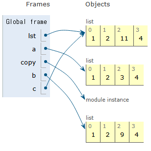

### 리스트

- 여러 개의 값을 순서대로 저장하는, 변경 가능한(mutable) 시퀀스 자료형
- 리스트 표현
    - 대괄호 [] 안에 값들을 `,` 로 구분하여 생성
    - 모든 종류의 데이터를 담을 수 있음 (숫자, 문자열, 다른리스트)
    - 값을 추가, 수정, 삭제 등 변경 가능
    
    ```python
    my_list_1 = []
    my_list_2 = [1,'a', 3, 'b', 5]
    my_list_3 = [1, 2, 3, 'Python', ['hello', 'world', '!!!']]
    ```
    
    **중첩 리스트** : 자료 구조 안에 같은 종류의 자료 구조가 포함된 형태 
    
    ```python
    my_list_3[4] -> ['hello', 'world', '!!!']
    my_list_3[4][1] -> 'world'
    my_list_3[4][1][0] -> 'w'
    ```
    
    **Mutable(변경 가능)**
    
    ```python
    my_list_2[1] = 'two' 
    -> my_list_2 = [1,'two', 3, 'b', 5]
    
    my_list_2[3:] = ['four','five']
    -> my_list_2 = [1,'two', 3, 'four', 'five']
    
    my_list_2[2:4] = ['three', 'four','ssafy']
    -> my_list_2 = [1,'two', 'three', 'four','ssafy', 'five']
    ```
    

### 튜플

- 여러 개의 값을 순서대로 저장하는 변경 불가능한 시퀀스 자료형
- 소괄호 () 안에 값들을 `,` 로 구분하여 생성
- 모든 종류의 데이터를 담을 수 있음
- 리시트와 거의 모든 면에서 비슷하지만, 한번 만들어지면 절대 수정 불가능
- 소괄호 없이도 만들 수 있다

```python
my_tuple = 10, 'a', 4, 6 
my_tuple -> (10, 'a', 4, 6)
```

- 하나의 요소 튜플 만들때 (1)  는 1 이고 (1,) 이렇게 해야 생성된다는 점 주의

**튜플은 어디에 쓰일까?(불변 자료형인 이유)**

- 파이썬 내부 동작과 안전한 데이터 전달에 사용
- 다중 할당, 값 교환, 함수, 다중 반환 값 등

```python
# 다중 할당
x, y = 10, 20
print(x) -> 10
print(y) -> 20

# 실제 내부 동작
(x, y) = (10, 20)

# 값 교환
x, y = 1, 2
x, y = y, x

# 실제 내부 동작
temp = (y, x) #튜플 생성
x, y = temp #튜플 풀어냄
print(x, y) -> 2, 1
```

### range

- 연속된 정수 시퀀스를 생성하는, 변경 불가능한(immutable) 자료형
- 주로 반복문과 함께 사용되어 특정 횟수만큼 코드를 반복 실행할때 매우 유용

**range (stop)**

- 매개변수가 하나면 stop으로 인식
- start는 0이, step은 1이 기본값으로 자동 설정

```python
my_range_1 = range(5)
print(my_range_1) -> range(0,5)
print(list(my_range_1)) -> [0, 1, 2, 3, 4]
```

**range(start, stop)**

- 매개변수가 두 개면 start와 stop으로 인식
- step은 1이 기본값으로 자동 설정
- range(2, 5) → 2, 3, 4

```python
my_range_2 = range(1, 10)
print(my_range_2) -> range(1, 10)
print(list(my_range_2)) -> [1, 2, 3, 4, 5, 6, 7, 8, 9]
```

**range(start, stop, step)**

```python
my_range_3 = range(5, 0, -1)
print(my_range_3) -> range(5, 0, -1)
print(list(my_range_3)) -> [5, 4, 3, 2, 1]
```

### range의 규칙

1. 값의 범위 규칙
    - stop 값은 생성되는 시퀀스에 절대 포함되지 않음
    - range(1, 5)는 → 1, 2, 3, 4
2. 증가/감소 값(step) 규칙
    1. step이 양수일 때
        - 숫자가 start부터 stop을 향해 증가
    2. step이 음수일 때
        - 숫자가 start부터 stop을 향해 감소
        - start값이 stop보다 반드시 커야 함
        - 작으면? → 그냥 빈 리스트 (오류는 안남)

주로 반복문과 함께 활용 !!

```python
for i in range(1, 10):
		print(i)
for i in range(1, 10, 2):
		print(i)
```

### 딕셔너리

- key-value쌍으로 이루어진
    
    순서 X  →  인덱스가 없
    
    중복 X
    
    변경 가능한 자료형
    
- 중괄호 {} 안에 값들이 `,` 로 구분되어 있음
- 값 1개는 키와 값이 쌍으로 이루어져 있음
    
    **Key(키)**
    
    - 값을 식별하기 위한 고유한 ‘이름표’ (중복불가)
    - 변경 불가능한(immutable) 자료형만 사용 가능
        - O (가능) : str, int, float, tuple
        - X (불가능) : list, dict
    
    **Value(값)**
    
    - 키에 해당하는 실제 데이터
    - 어떤 자료형이든 자유롭게 사용할 수 있음
    
- 각 값에는 순서가 없음!! - 몇번째 데이터? 이거 틀린 말임

<aside>
💡

딕셔너리의 순서?

- 딕셔너리는 순서가 없는 자료형이지만 파이썬 3.7 이상에서는 입력한 순서는 출력시 유지는 됨
- 하지만 여전히 순서가 없는 자료형이고 Key를 통한 접근!!
</aside>

**딕셔너리 값 접근 방법**

- Key를 사용하여 해당 Value를 꺼내옴
- Key에 접근 시 대괄호 [] 사용
    - 존재하지 않는 key로 접근하면 KeyError 발생
- 값 추가 및 변경

```python
my_dict = {'apple' : 12, 'list' : [1,2,3]}
# 추가
my_dict['banana'] = 50
# 변경
my_dict['apple'] = 100
```

### 세트 (set)

- 순서와 중복이 없는 변경 가능한 자료형
- 세트 표현
    - 중괄호 {} 안에 값들을 `,` 로 구분하여 만듦
    - 비어있는 세트는 딕셔너리와 구분하기 위해 `set()` 함수로 생성해야함
    - 수학에서의 집합과 동일한 연산 처리 가능
- 세트의 두 가지 핵심 특징
    1. 중복을 허용하지 않음
        - 똑같은 값은 단 하나만 존재할 수 있음
    2. 순서가 없음
        - 인덱싱(set[0])이나 슬라이싱을 사용할 수 없음
- 세트의 집합 연산

합/차/교

### None

- 파이썬에서 ‘값이 없음’을 표현하는 특별한 데이터 타입
- 마치 내용물이 없는 ‘빈 상자’와 같음
- 숫자 0이나 빈 문자열(’’)과는 다른 ‘값이 존재하지 않음’ 또는 ‘아직 정해지지 않음’이라는 상태를 나타내기 위해 사용됩니다.

### Boolean

- `True` 와 `False` 단 두 가지 값만 가지는 데이터 타입
- On / OFF 스위치 처럼 맞다 틀리다 판단하는 역할을
- 주로 조건 / 반복문과 함께 사용함

### Collection

- 여러 개의 값을 하나로 묶어 관리하는 자료형들을 통칭하는 말

| 컬렉션명 | 변경 가능 여부 | 순서 존재 여부 |
| --- | --- | --- |
| str | X | O |
| list | O | O |
| tuple | X | O |
| dict | O | X |
| set | O | X |
| range | X | O |

순서 존재( O ) ⇒ 시퀀스 

순서 비존재( X ) ⇒ 비시퀀스

- 불변 vs 가변
    - 컬렉션 타입은 생성 후 내용을 변경할 수 있는지 없는지에 따라 ‘불변’ 과 ‘가변’ 두 그룹으로 나뉨

| 구분 | 불변(Immutable) | 가변(Mutable) |
| --- | --- | --- |
| 특징 | 변경 불가, 안전성, 예측 가능 | 변경 가능, 유연성, 효율성 |
| 종류 | str, tuple, range | list, dict, set |

# ✍️추가 학습

**<얕은 복사** 와 **깊은복사** 추가로 알아보기 !>

```python
# immutable: 예시) int 자료형 
a = 1
b = a
print(a, b) -> 1 1
b = 2
print(a, b) -> 1 2

# mutable: 예시) list 자료형
a = [1, 2, 3, 4]
b = a
print(a, b) -> [1, 2, 3, 4] [1, 2, 3, 4]
b[1] = 0 
print(a, b) -> [1, 0, 3, 4] [1, 0, 3, 4]
#why -> a와 b는 같은 주소값을 참조하고 list는 Mutable 하기 때문

## Deepcopy를 하게 되면 원본 배열보존가능 ##
## test
lst = [1,2,3,4]
a = lst.copy()
lst[2] = 9

import copy
b = copy.deepcopy(lst)

lst[2] = 10

c = lst
lst[2] = 11
```

- test 코드 Python tutor



`.copy()` 는 얕은 복사인데 `copy.deepcopy` 와 왜 차이가 나지 않을까 궁금했다.

```python
#CASE 1
lst = [1l, 22, ['a', 'b', 'c']]
lst_copy = lst.copy()
lst[2] = ['aaa', 'bbb', 'ccc']
print(lst, lst_copy) ->[1l, 22, ['aaa', 'bbb', 'ccc']]  [1l, 22, ['a', 'b', 'c']]

#CASE 2
lst = [1l, 22, ['a', 'b', 'c']]
lst_copy = lst.copy()
lst[2][0] = 'aaa'
lst[2][1] = 'bbb'
lst[2][2] = 'ccc'
print(lst, lst_copy) ->[1l, 22, ['aaa', 'bbb', 'ccc']]  [1l, 22, ['aaa', 'bbb', 'ccc']] 
```

위와 같이 두 가지 CASE의 결과가 다른 이유를 찾아보기 위해 Python Tutor로 확인해보았다

- CASE 1


- CASE 2


### 추가 학습으로 알게된 점

얕은 복사와 깊은 복사의 차이를 정확히 알 수 있었다. 

- **단순한 리스트에 경우**는 얕은 복사와 깊은 복사 모두 결과가 같다. (test python tutor에서 확인)
- 하지만 **중첩 리스트에서**는 얕은 복사를 할 경우 바깥 리스트만 복사하고 내부에 중첩된 리스트는 원본과 같은 것을 참조한다. (CASE 2에서 확인)

때문에 내부 중첩된 리스트에 값을 수정하면 얕은 복사로 복사된 것도 함께 변하는 것이다.

### CASE 1과 CASE 2의 차이

- CASE 1에서 얕은 복사를 했음에도 원본과 복사본이 달랐던 것은 개념이 좀 달랐다.
- CASE 1은 복사를 한것이 아닌 또 다른 값을 바꿔 끼워버린 것이다.
    - 원본(`lst`)과 복사본(`lst_copy`)이 얕은 복사로 인해 내부 중첩된 리스트를 함께 참조하고 있는 상황에서 원본(`lst`)이 또 새로운 리스트 값을 생성해 참조를 옮긴 것이고  복사본은 여전히 기존에 내부 중첩된 리스트를 참조하고 있어서 결과가 다른 것이다.

**결국 얕은 복사, 깊은 복사는 가변 가능한 list, dict에서 적용되는 개념이다.** 

불가변 예시로 int가 참조하는 과정 또한 추가로 확인하고 마무리했다.


```python
#왼쪽
a = 200
b = 200
#오른쪽
a = [200. 300]
a = [200. 300]
```


True

False

### 형변환 (Type Conversion)

- 한 데이터 타입을 다른 데이터 타입으로 변환하는 과정
- 형변환은 2가지가 있음
    1. 암시적 형변환: 파이썬이 자동으로 처리
        
        ```python
        #정수와 실수의 덧셈
        print(3 + 5.0) -> 8.0
        #불리언(bool)과 정수(int)의 덧셈
        print(True + 3) -> 4
        
        #불리언간의 덧셈
        print(True + False) -> 1
        ```
        
    2. 명시적 형변환: 개발자가 직접 지시
        
        
        | 함수 | 설명 | 예시 | 결과 |
        | --- | --- | --- | --- |
        | int() | 정수로 변환 | int(”123”) | 123 |
        | float() | 실수로 변환 | float(”3.14”) | 3.14 |
        | str() | 문자열로 변환 | str(100) | “100” |
        | list() | 리스트로 변환 | list(’abc’) | [’a’, ‘b’, ‘c’] |
        | tuple() | 튜플로 변환 | tuple([1,2]) | (1, 2) |
        | set() | 세트로 변환 | set([1,2,2]) | {1, 2} |

### 복합 연산자

- 연산과 할당이 함께 이뤄짐
    
    
    | 기호 | 예시 | 의미 |
    | --- | --- | --- |
    | += | a += b | a = a + b |
    | -= | a -= b | a = a - b |
    | *= | a *= b | a = a * b |
    | /= | a /= b | a = a / b |
    | //= | a //= b | a = a // b |
    | %= | a %= b | a = a % b |
    | **= | a **= b | a = a ** b |

### 비교 연산자

- 두 값을 비교하여 그 관계가 맞는지 틀리는지를 True 또는 False로 반환
    
    
    | 기호 | 내용 |
    | --- | --- |
    | < | 미만 |
    | <= | 이하 |
    | > | 초과 |
    | >= | 이상 |
    | == | 같음 |
    | != | 같지 않음 |
    | is | 같음 |
    | is not | 같지 않음 |
- **“==” 연산자** VS “**is” 연산자**
    
    
    | == 연산자 | is 연산자 |
    | --- | --- |
    | 값(데이터)이 같은지를 비교 | 객체 자체가 같은지를 비교 |
    | 동등성(equality) | 식별성(identity) |
    | print(2 == 2.0) → True | print(2 is 2.0) → False |
    | print(1 == True) → True | print(1 is True) → False |
- is 연산자는 두 변수가 완전히 동일한 객체를 가리키는지, 즉 메모리 주소가 같은지를 확인할 때 사용

- **”is” 연산자는 언제 사용하는가?**
    - 주로 싱글턴 객체를 비교할 때 사용함
    
    <aside>
    💡
    
     **싱글턴 객체란?**
    
    - 특정 값에 대해 파이썬 전체에서 단 하나의 객체만 생성되어 재사용되는 특별한 객체
    - 여러 변수가 이 값을 가지더라도, 모두 미리 만들어진 하나의 객체를 함께 가리키게 되므로 항상 같은 메모리 주소를 가짐
    - 파이썬의 대표적인 싱글턴 객체: None, True, False
    </aside>
    
- **리스트나 객체 비교 시 주의사항**
    - 리스트 또는 다른 가변 객체(mutable)를 비교할 때, 값 자체가 같은 지 확인하려면 `==` 를 사용
    - 두 변수가 완전희 동일한 객체를 가리키는지를 확인해야 한다면 `is` 를 사용

### 논리 연산자

- 여러 개의 조건을 조합하거나, True/False 값을 반대로 뒤집을 때 사용
    
    
    | and | 논리곱 | 두 피연산자 모두 True인 경우에만 전체 표현식을 True로 평가 |
    | --- | --- | --- |
    | or | 논리합 | 두 피연산자 중 하나라도 True인 경우 전체 표현식을 True로 평가 |
    | not | 논리부정 | 단일 피연산자를 부정 |
- 논리 연산자 활용
    
    ```python
    print(True and False) -> False
    print(True or False) -> True
    print(not True) -> False
    print(not 0) -> True
    
    num = 15
    result = (num > 10) and (num % 2 == 0)
    print(result) -> False
    
    name = 'Alice'
    age = 25
    result = (name == 'Alice') or (age == 30)
    print(result) -> True
    ```
    

### 단축 평가

- 논리 연산에서 두 번째 피연산자를 평가하지 않고 결과를 결정하는 동작
- 파이썬의 True 와 False에 대한 새로운 시각
    - 거짓으로 취급되는 값들
        - False, 숫자 0, 빈 문자열 “”, 빈 리스트 [], None 등 ‘비어있거나 없다’는 느낌의 값들
    - 참으로 취급되는 값들
        - True 그리고 ‘거짓’이 아닌 모든 값
        - 1, -10, “hello”, [1, 2]
- 단축 평가 동작 정리
    - and 연산자
        - 하나라도 ‘거짓’이면 바로 ‘거짓’
        - 연산을 왼쪽에서 오른쪽으로 진행하다가, 처음 만나는 ‘거짓’값을 바로 반환
        - 만약 끝까지 갔는데 모두 참이면 True 반환
    - or 연산자
        - 하나라도 ‘참’이면 바로 ‘참’
        - or는 연산을 왼쪽에서 오른쪽으로 진행하다가, 처음 만나는 ‘참’값을 바로 반환
        - 만약 끝까지 갔는데 모두 ‘거짓’이면 False 반환
- **단축 평가를 하는 이유**
    - 코드 실행 최적화, 불필요한 연산을 피할 수 있도록 함
    - True / False 논리 연산을 넘어, 코드의 흐름을 제어하고, 오류를 방지하며 간결한 코드 작성을 유용하게 하는 기능

### 멤버십 연산자

- 특정 값이 시퀀스나 다른 컬렉션 안에 포함되어 있는지 확인하는 연산자
    
    
    | 기호 | 내용 |
    | --- | --- |
    | in | 왼쪽 피연산자가 오른쪽 피연산자의 시퀀스에 속하는지를 확인 |
    | not in | 왼쪽 피연산자가 오른쪽 피연산자의 시퀀스에 속하지 않는지를 확인 |

### 시퀀스형 연산자

- 시퀀스 자료형(문자열, 리스트, 튜플)에 특별한 의미로 사용되는 연산자
- `+` 는 시퀀스를 연결하는 기능 `*` 는 시퀀스를 반복하는 기능

### Trailing Comma

- 기본 규칙
    - 각 요소를 별도의 줄에 작성
    - 마지막 요소 뒤에 trailing comma 추가
    - 닫는 괄호는 새로운 줄에 배
- 장점
    1. 가독성 향상
        - 각 줄이 동일한 패턴을 가짐
        - 코드 리뷰가 용이함
    2. 유지보수 용이성
        - 항목 추가/ 제거가 간단
        - 실수로 인한 구문 오류 방지