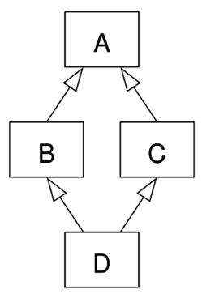

# 상속

- 한 클래스(부모)의 속성과 메서드를 다른 클래스(자식)가 물려받는 것
- 상속이 필요한 이유
    1. 코드 재사용
        - 상속을 통해 기존 클래스의 속상과 메서드를 재사용할 수 있음
        - 기존 클래스를 수정하지 않고도 기능을 확장할 수 있음
    2. 계층 구조
        - 상속을 통해 클래스들 간의 계층 구조를 형성할 수 있음
        - 부모 클래스와 자식 클래스 간의 관계를 표현하고, 더 구체적인 클래스를 만들 수 있음
    3. 유지 보수의 용이성
        - 상속을 통해 기존 클래스의 수정이 필요한 경우, 해당 클래스만 수정하면 되므로 유지 보수가 용이해짐
        - 코드의 일관성을 유지하고, 수정이 필요한 범위를 최소화할 수 있음
- 클래스의 상속개념 다이어그램 예시
    
    
    
    ```python
    # 부모 클래스
    class Animal:
    		def eat(self):
    				print('먹는 중')
    
    # 자식 클래스				
    class Dog(Animal):
    		def bark(self):
    				print('멍멍')
    				
    my_dog = Dog()
    my_dog.eat() # 먹는 중
    ```
    

### 클래스 상속

- 상속 없이 구현하는 경우
    - 교수/학생 클래스로 각각 선언하여 구현함
    - 클래스를 각각 분리 했지만 메서드가 중복으로 정의될 수 있음
    
    ```python
    class Professor:
    	def __init__(self, name, age, department):
    		self.name = name
    		self.age = age
    		self.department = department
    	
    	def talk(self): # 중복
    		print(f"반갑습니다. {self.name}입니다.")
    	
    ```
    
    ```python
    class Student:
        def __init__(self, name, age, gpa):
            self.name = name
            self.age = age
            self.gpa = gpa
    
        def talk(self):  # 중복
            print(f'반갑습니다. {self.name}입니다.')
    ```
    
- 상속을 사용한 계층 구조 변경
    
    ```python
    # 상속을 사용한 계층구조 변경
    class Person:
        def __init__(self, name, age):
            self.name = name
            self.age = age
    
        def talk(self):  # 메서드 재사용
            print(f'반갑습니다. {self.name}입니다.')
    
    class Professor(Person):
        def __init__(self, name, age, department):
            self.department = department
            self.name = name
            self.age = age
    
    class Student(Person):
        def __init__(self, name, age, gpa):
            self.name = name
            self.age = age
            self.gpa = gpa
    
    # 부모 Person 클래스의 talk 메서드를 활용
    p1 = Professor('김교수', 50, '컴퓨터공학과')
    p1.talk()
    
    # 부모 Person 클래스의 talk 메서드를 활용
    s1 = Student('김학생', 20, 4.0)
    s1.talk()
    ```
    

### 메서드 오버라이딩

- 부모 클래스의 메서드를 같은 이름, 같은 파라미터 구조로 재 정의하는 것
- 메서드 오버라이딩 예시
    - 자식 클래스가 부모 클래스의 메서드를 덮어써서 새로운 동작을 구현할 수 있음
    - Animal class를 상속받은 Dog 클래스에서 eat 메서드를 다시 정의하는 것
    
    ```python
    class Animal:
        def eat(self):
            print('Animal이 먹는 중')
    
    class Dog(Animal):
        # 오버라이딩 (부모 클래스 Animal의 eat 메서드를 재정의)
        def eat(self):
    		    print("Dog가 먹는 중")
    my_dog = Dog()
    my_dog.eat() # Dog가 먹는 중
    ```
    

# ✍️추가 학습

- 오버라이딩 주의사항
    - **파라미터 구조를 동일하게 유지하라!”**
    - 왜 파라미터를 바꾸면 안 될까? (다형성)
        - `다형성` : 서로 다른 클래스의 객체가 동일한 메서드 호출에 대해 각자의 방식대로 다르게 응답하는 능력
        - 파라미터 구조를 다르게 오버라이딩하면 객체 지향 프로그래밍의 핵심 개념인 다형성을 위반하여 예기치 않은 오류를 유발!
        
        ```python
        class Animal:
            def eat(self):
                print('Animal이 먹는 중')
        
        class Dog(Animal):
            # 잘못된 오버라이딩: 부모와 파라미터 구조가 다름
            def eat(self, food):
                print(f'Dog가 {food}를 먹는 중')
        
        class Cat(Animal):
            # 올바른 오버라이딩: 부모와 파라미터 구조가 같음
            def eat(self):
                print('Cat이 조용히 먹는 중')
        
        # 동물들에게 밥을 주는 함수 (다형성 활용)
        def feed_animal(animal):
            # 이 함수는 animal 객체에 eat() 메서드가 있을 것이라고 기대함
            animal.eat()
        
        # 객체 생성
        dog = Dog()
        cat = Cat()
        
        feed_animal(cat)  # 문제 없이 실행됨
        feed_animal(dog)  # TypeError 발생
        ```
        
    
    **결론**
    
    - 메서드 오버라이딩은 메서드 내부 동작을 바꾸기 위함
    - 안정적이고 예측 가능한 코드를 위해, 오버라이딩 시 메서드 이름과 파라미터 구조를 반드시 부모 클래스와 동일하게 유지하자
    - 이 원칙을 지켜야만 다형성을 올바르게 활용하고, 예기치 않은 TypeError를 방지할 수 있음

### 다중 상속

- 다중 상속?
    - 둘 이상의 상위 클래스로부터 여러 행동이나 특징을 상속받을 수 있음
    - 상속받은 모든 클래스의 요소를 활용 가능
    - 중복된 속성이나 메서드가 있는 경우 상속 순서에 의해 결정
- 다중 상속 예시
    
    ```python
    # 다중 상속 예시
    class Person:
        def __init__(self, name):
            self.name = name
    
        def greeting(self):
            return f'안녕, {self.name}'
    
    class Mom(Person):
        gene = 'XX'
    
        def swim(self):
            return '엄마가 수영'
    
    class Dad(Person):
        gene = 'XY'
    
        def walk(self):
            return '아빠가 걷기'
    
    class FirstChild(Dad, Mom):
        def swim(self):
            return '첫째가 수영'
    
        def cry(self):
            return '첫째가 응애'
    
    baby1 = FirstChild('아가')
    print(baby1.cry())  # 첫째가 응애
    print(baby1.swim())  # 첫째가 수영
    print(baby1.walk())  # 아빠가 걷기
    print(baby1.gene)  # XY <- Dad를 먼저 상속했기 때문!! 작성 순서 중요
    ```
    
- 다이아몬드 문제
    
    
    ```python
    class D(B, C):
    ```
    
    라면? D → B → C → A 순서!
    
    - MRO(Method Resolution Order) 알고리즘을 사용하여 클래스 목록을 생성
    - 부모 클래스로부터 상속된 속성을 정해진 내부 알고리즘에 따라 검색
    - 이 순서는 기본적으로 왼쪽에서 오른쪽으로 진행되며, 계층 구조에서 중복되는 클래스는 한 번만 확인
    - 그래서, 속성이 D에서 발견되지 않으면, B 에서 찾고, 거기에서도 발견되지 않으면, C 에서 찾고, 이런식으로 진행됨
    
    
    

### super() 메서드

- 메서드  해석 순서(MRO)에 따라, 현재 클래스의 부모(상위) 클래스의 메서드나 속성에 접근할 수 있게 해주는 내장 함수
- super() 특징
    - 단순히 “부모 클래스의 메서드를 호출”하기 위한 용도 뿐만 아니라, 다중 상속이 있을 때도, 올바른 순서(MRO)에 따라 상위 클래스의 메서드를 찾아 실행하기 위해 super()를 사용
- super()의 2가지 사용 사례
    1. 단일 상속 구조
        - 명시적으로 부모 클래스 이름을 적지 않아도 부모 메서드를 안전하게 호출할 수 있음
        - Student의 생성자에서 super().__init__() 를 호출하면, Person의 __init__() 메서드가 호출되어 name, age, number, email 속성을 초기화한 뒤 Student 고유의 student_id 속성을 추가
        - 이때 Person 클래스를 직접 명시하지 않고 super()를 사용하므로, 나중에 클래스 이름이 바뀌거나 상속 구조가 변경되어도 super() 호출 부분을 그대로 사용할 수 있어 유지 보수성이 향상
        - **단일 상속 구조에서 super 함수**
            - “부모 클래스의 생성자(또는 메서드)를 호출하기 위해 사용”
            - 명시적으로 이름을 지정하지 않고 부모 클래스를 참조할 수 있으므로, 코드를 더 유지 관리하기 쉽게 만들 수 있음
            - 클래스 이름이 변경되거나 부모 클래스가 교체되어도 super()를 사용하면 코드 수정이 더 적게 필요
        
        ```python
        class Person:
        	def __init__(self, name, age, number, email):
        		self.name = name
        		self.age = age
        		self.number = number
        		self.email = email
        		
        class Student(Person):
        	def __init__(self, name, age, number, email, student_id):
        		# super()를 통해 Person의 __init__메서드 호출
        		super().__init__(name, age, number, email)
        		self.student_id = student_id
        ```
        
    2. 다중 상속 구조
        
        ```python
        class ParentA:
        	def __init__(self):
        		self.value_a = 'ParentA'
        	def show_value(self):
        		print(f"Value from ParentA: {self.value_a}")
        ```
        
    
    정리좀따하자
    
    super() 는 대체누구를 가리켜? 아직모른다! 객체를 생성했을땐 알수있음. MRO에 따라 순차적으로 다음 순서에 있는 것을 호출하는 것!
    
- **MRO가 필요한 이유**
    - 부모 클래스들이 여러 번 액세스 되지 않도록, 각 클래스에서 지정된 왼쪽에서 오른쪽으로 가는 순서를 보존하고, 각 부모를 오직 한 번만 호출하고, 부모들의 우선순위에 영향을 주지 않으면서 서브 클래스를 만드는 단조적인 구조 형성

# 에러와 예외

### 디버깅

- 소프트웨어에서 발생하는 버그를 찾아내고 수정하는 과정
- 프로그램의 오작동 원인을 식별하여 수정하는 작업
- **버그** : 소프트웨어에서 발생하는 오류 또는 결함, 프로그램의 예상된 동작과 실제 동작 사이의 불일치
- 디버깅 방법
    1. print 함수 활용
        - 특정 함수 결과, 반복/조건 결과 등 나눠서 생각, 코드를 bisectiopn으로 나눠서 생각
    2. 개발 환경(text editor, IDE)등에서 제공하는 기능 활용
        - breakpoint, 변수 조회 등
    3. Python tutor 활용 (단순 파이썬 코드인 경우)
    4. 뇌 컴파일, 눈 디버깅 등

### 에러

- 프로그램 실행 중에 발생하는 예외 상황
- 파이썬의 에러 유형
    1. 문법 에러 : 프로그램의 구문이 올바르지 않은 경우 발생
        - `Invalid syntax` 문법 오류
        - `assign to literal`  잘못된 할당
    2. 예외 : 프로그램 실행 중에 감지되는 에러
        - 내장 예외 : 예외 상황을 나타내는 예외 클래스들(KeyError, IndexError 등 ..)

### 예외

- 예외 처리
    - 예외가 발생했을 때 프로그램이 비정상적으로 종료되지 않고 적절하게 처리할 수 있도록 하는 방법
- 예외처리 사용 구문
    - `try`
        - 예외가 발생할 수 있는 코드 작성
    - `except`
        - 예외가 발생했을 때 실행할 코드 작성
    - `else`
        - 예외가 발생하지 않았을 때 실행할 코드 작성
    - `finally`
        - 예외 발생 여부와 상관없이 항상 실행할 코드 작성
- `try-except 구조`
    
    ```python
    try:
    		result = 10 / 0
    except ZeroDivisionError:
    		print('0으로 나눌 수 없습니다.')
    		
    try:
    		num = int(input('숫자입력 : '))
    except ValueError:
    		print('숫자가 아닙니다.')
    		
    '''
    숫자입력 : a
    숫자가 아닙니다.
    '''
    ```
    
- 복수 예외 처리 연습
    - 100을 사용자가 입력한 값으로 나누고 출력하는 코드
        - 먼저, 발생 가능한 에러가 무엇인지 예상해보기
        
        ```python
        num = int(input("100으로 나눌 값을 입력하시오 : "))
        print(100 / num)
        ```
        
        → 문자 a 입력 : ValueError
        
        → 숫자 0을 입력: ZeroDivisionError
        
        ```python
        try:
        		num = int(input("100으로 나눌 값을 입력하시오 : "))
        		print(100 / num)
        except ValueError:
        		print('숫자를 넣어주세요.')
        except ZeroDivisionError:
        		print('0으로 나눌 수 없습니다.')
        except:
        		print('에러가 발생하였습니다.')
        ```
        

### EAFP & LBYL

- EAFP : 예외처리를 중심으로 코드를 작성하는 접근 방식(try-except)
    - “Easier to Ask for Forgiveness than Permission”
- LBYL : 값 검사를 중심으로 코드를 작성하는 접근 방식(if-else)
    - “Look Before You Leap”

| EAFP | LBYL |
| --- | --- |
| “일단 실행하고 예외를 처리” | “실행하기 전에 조건을 검사” |
| 코드를 실행하고 예외가 발생하면 예외처리를 수행 | 코드 실행 전에 조건문 등을 사용하여 예외 상황을 미리 검사하고, 예외 상황을 피하는 방식 |
| 코드에서 예외가 발생할 수 있는 부분을 미리 예측하여 대비하는 것이 아니라, 예외가 발생한 후에 예외를 처리 | 코드가 좀 더 예측 가능한 동작을 하지만, 코드가 더 길고 복잡해질 수 있음 |
| 예외 상황을 예측하기 어려운 경우에 유용 | 예외 상황을 미리 방지하고 싶을 때 유용 |

# 클래스의 의미와 활용

### 왜 클래스를 배웠을까?

- 지금까지 우리는 변수와 함수만으로도 간단한 프로그램을 만들 수 있었다
- 그러나 프로그램 규모가 커지면 서로 관련 있는 정보와 기능을 따로따로 관리하기가 점점 어려워짐
- 클래스를 사용하면 관련된 데이터와 기능을 ‘한 덩어리’로 묶어 구조를 명확히 할 수 있음
- 이로써 작성한 코드가 훨씬 깔끔해지고, 나중에 수정하거나 기능을 추가할 때 더 쉽고 안전해짐

# ✍️추가 학습

1. 클래스 메서드가 필요한 이유
    - 인스턴스 없이 클래스 자체 데이터(클래스 변수)를 관리 가능
        - 아래 코드 예시로 보면, 클래스 변수인 total_count를 클래스 메소드 get_total_count로 관리하고 있음.
    - 상속 관계에서 부모의 기능을 재사용하고, 자식 클래스만의 속성,로직을 쉽게 추가 가능
2. 핵심 포인트
    - `@classmethod` 데코레이터 사용
    - 첫 번째 매개변수는 `cls` → 메서드를 호출한 클래스 자신
    - 부모 클래스의 클래스 메서드도 자식 클래스에서 그대로 활용 가능
3. 코드 예시
    
    ```python
    class Animal:
        total_count = 0  # 전체 동물 수
    
        def __init__(self, name):
            self.name = name
            Animal.total_count += 1
    
        @classmethod
        def get_total_count(cls):
            return f'전체 동물 수: {cls.total_count}'
            
    class Dog(Animal):
        dog_count = 0
    
        def __init__(self, name, breed):
            super().__init__(name)
            self.breed = breed
            Dog.dog_count += 1
    
        @classmethod
        def get_dog_info(cls):
            return f'{cls.get_total_count()}, 강아지 수: {cls.dog_count}'
    
    class Cat(Animal):
        cat_count = 0
    
        def __init__(self, name, breed):
            super().__init__(name)
            self.breed = breed
            Cat.cat_count += 1
    
        @classmethod
        def get_cat_info(cls):
            return f'{cls.get_total_count()}, 고양이 수: {cls.cat_count}'
    ```
    

실행결과

```python
Dog('멍멍이', '삽살개')
Dog('바둑이', '진돗개')
Cat('노아', '페르시안')
Cat('루비', '코숏')

print(Dog.get_dog_info())  # 전체 동물 수: 4, 강아지 수: 2
print(Cat.get_cat_info())  # 전체 동물 수: 4, 고양이 수: 2
```

**결론**

- 클래스 메서드는 클래스 단위 데이터 관리에 최적
- cls를 사용하면 상속 구조에서도 유연하게 데이터 접근 가능
- 코드 중복 줄이고 유지보수성 높이는 핵심 도구

# 문제 풀다 알게된 것

```python
no = ''
if not no.strip():
    print(True)
print(no.strip() == False)

# True
# False
```

<aside>
💡

빈문자열은 평가식으로 평가될 때에는 False로 평가가 된다. 하지만 그 값이 False는 아님!!

</aside>