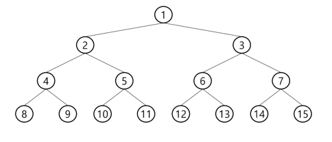
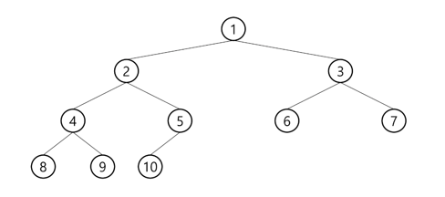
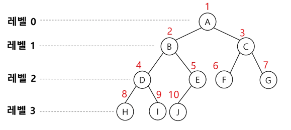
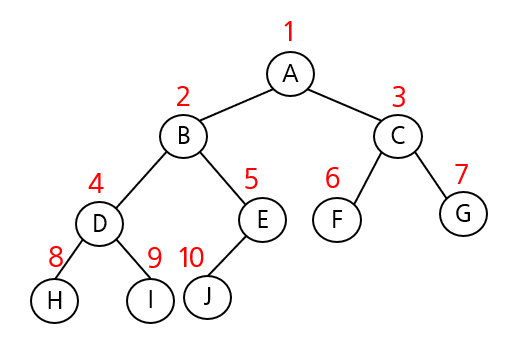

# Tree

## 1. 트리란

### 1.1 개념: 가족 관계도(Family Tree)

- 트리(Tree)는 이름처럼 나무를 거꾸로 뒤집어 놓은 것 같은 자료구조
    - 하나의 뿌리(조상)에서 시작하여 여러 자손으로 가지를 뻗어 나가는 ‘가족 관계도’와 같은 자료구조
- 가장 중요한 특징은 데이터들이 상하 관계를 갖는 **계층형** 구조이자, 하나의 부모가 여러 자식을 가질 수 있는 **비선형 구조**라는 점

**비선형 구조**

- 하나의 데이터 뒤에 여러 개의 데이터가 올 수 있는 구조
- 데이터가 한 줄로만 늘어서 있는 선형 구조와 구분되는 특징

> **[참고] 선형 구조 vs 비선형 구조**
> 
> 
> **선형 구조 (Linear Structure)**
> 
> - **개념:** 데이터가 **기차처럼** 한 줄로 연결된 구조.
> - **특징:** 하나의 데이터 뒤에는 **반드시 하나의 데이터**만 올 수 있다.
> - **예시:** 리스트(List), 스택(Stack), 큐(Queue)
> 
> **비선형 구조 (Non-linear Structure)**
> 
> - **개념:** 데이터가 **가족 관계도**처럼 여러 갈래로 뻗어나가는 구조.
> - **특징**: 하나의 데이터 뒤에 **여러 개의 데이터**가 올 수 있다.
> - **예시:** 트리(Tree), 그래프(Graph)

### 1.2 트리의 주요 용어


- **노드(Node):** 트리를 구성하는 각각의 요소
- **루트 노드(Root):** 가장 위에 있는 시작 노드 (부모가 없는 최상위 노드)
- **부모(Parent) / 자식(Child) / 형제(Sibling):** 노드 간의 관계를 나타내는 용어
- **리프/단말 노드(Leaf):** 자식이 없는, 가장 마지막에 달린 노드
- **간선(Edge):** 노드와 노드를 연결하는 선
- **차수 (Degree)**
    - **노드의 차수:** 특정 노드가 가진 **직계 자식 노드의 개수** (예: 리프 노드의 차수는 0)
    - **트리의 차수:** 트리 내 모든 노드의 차수 중 **가장 큰 값** (예: 이진 트리의 차수는 2)
- **깊이 (Depth) 와 레벨 (Level)**
    - **`루트(시작점)**에서부터 **아래로** 얼마나 내려왔는가?`
    - **노드의 깊이(Depth):** **루트 노드에서 특정 노드까지**의 경로 길이(간선의 수). 루트 노드의 깊이는 0.
- **높이 (Height)**
    - **`리프 노드(끝 지점)**에서부터 **위로** 얼마나 올라가야 하는가?`
    - 특정 노드에서 가장 멀리 있는 리프 노드까지의 거리
    - **노드의 높이(Height):** 특정 노드에서 **가장 아래에 있는 리프 노드까지**의 가장 긴 경로 길이. 리프 노드의 높이는 0.
    - **트리의 높이(Height):** **루트 노드의 높이**와 같습니다. 즉, 트리에서 가장 긴 경로의 길이
    
    ```
           A (깊이:0, 높이:3)
          / \
         B   C (깊이:1, 높이:1)
        / \   \
       D   E   F (깊이:2, 높이:0)
      /
     G (깊이:3, 높이:0)
    ```
    

---

## 2. 그래프(Graph)의 관점에서의 트리

<aside>
💡

트리는 **사이클이 없는(acyclic) 무향 연결 그래프**의 한 종류

</aside>

트리는 **그래프(Graph)의 특별한 한 종류**

그래프의 관점에서 트리는 다음 세 가지 조건을 모두 만족하는 자료구조를 의미

1. **연결 그래프 (Connected Graph)**
    - 모든 노드들이 서로 떨어져 있지 않고, **하나의 덩어리로 연결**되어 있다는 의미. (어떤 노드에서든 다른 노드로 가는 경로가 존재)
2. **무향 그래프** (Undirected Graph)
    - 노드를 잇는 간선(Edge)에 **방향이 없다**는 뜻
    - A와 B가 연결되어 있다면, A에서 B로도, B에서 A로도 갈 수 있음
3. **사이클이 없는 (Acyclic) 그래프**
    - 특정 노드에서 출발하여 다시 자기 자신으로 돌아오는 **순환 경로가 존재하지 않는다**

| 구분 | **트리** | **일반 그래프** |
| --- | --- | --- |
| **구조적 특징** | 사이클이 없고, 명확한 부모-자식 계층 구조 | 사이클이 있을 수 있고, 계층 구조가 없음 |
| **노드 간 관계** | 부모는 여러 자식을, 자식은 단 하나의 부모를 가짐 | 복잡하고 자유로운 연결 (다대다) |
| **필요한 정보** | 특정 노드의 **왼쪽/오른쪽 자식** | 특정 정점에 **연결된 모든 정점** |
| **최적 표현법** | **자식 정보 배열** (`left`, `right` 리스트) | 인접 행렬, 인접 리스트 |

---

## 3. 이진 트리 (Binary Tree)

- **이진 트리**는 모든 노드가 **최대 2개의 자식(왼쪽, 오른쪽)만** 가질 수 있도록 규칙이 추가된 트리(차수가 2인 트리)
- 알고리즘에서 가장 빈번하게 사용되는 트리의 형태

### 3.1 이진 트리 종류

1. **포화 이진 트리(Full)** : 모든 레벨이 꽉 찬 완벽한 삼각형 모양의 트리
    
    
    
2. **완전 이진 트리(Complete)** : 마지막 레벨을 제외하면 포화 상태이고, 마지막 레벨은 왼쪽부터 차곡차곡 채워진 트리 (오른쪽 자식만 존재하는 경우는 없음)
    
    
    
3. **편향 이진 트리(Skewed)** : 노드들이 한쪽으로만 치우쳐 연결된 비효율적인 트리
    
    
    

---

## 4. 이진 트리의 표현 및 생성

먼저 알고리즘 문제에서 주어진 입력으로 트리 구조를 만드는 방법을 알아보면

보통. 주로 배열(리스트)를 이용해 트리를 표현함

**리스트를 이용한 이진트리**

- 이진 트리에 각 노드 번호를 다음과 같이 부여
- 루트의 번호를 `1` 로 함
- 레벨 `n` 에 있는 노드에 대해 왼쪽부터 오른쪽으로 `$2^n$` 부터 `$2^{n+1}-1$` 까지 번호를 차례로 부여
    
    
    
- 노드 번호가 `$i$` 일 때
    
    
    | 부모 노드 번호 | `$i  //  2$` |
    | --- | --- |
    | 왼쪽 자식 노드 번호 | `$i * 2$` |
    | 오른쪽 자식 노드 번호 | `$2 * i + 1$` |
    | 레벨 n의 노드 번호 시작 번호 | `$2^n$` |
- **노드 번호를 리스트의 인덱스로 사용**
    
    
    
    - 높이가 `h`인 이진 트리를 위한 배열의 크기
        - 레벨 `n`의 최대 노드 수는? `$2^n$`
        - 따라서 모든 노드의 수는? 1 + 2 + 4 + … + 2i = $Σ2i$ = `$2^{n+1} –1$`
        - 리스트의 크기는? `$2^{h+1}$`

### 단계 1: 입력 데이터 확인


다음과 같은 입력이 주어졌다고 가정

```
13
1 2 1 3 2 4 3 5 3 6 4 7 5 8 5 9 6 10 6 11 7 12 11 13
```

- 첫 줄 `13` 은 노드의 총 개수 (`V`) 임
- 둘째 줄은 `부모 자식 부모 자식 ...` 순서로 간선 정보가 주어짐

### 단계 2: 트리 저장을 위한 자료구조 준비

순회를 하려면, 먼저 입력으로 주어진 간선 정보를 컴퓨터가 다룰 수 있는 트리 형태로 만들어야 함

여기서는 두 개의 리스트(배열)를 이용해 각 노드의 자식 정보를 저장하는 방법을 사용

각 노드의 왼쪽 자식과 오른쪽 자식 정보를 저장할 두 개의 리스트를 만듬

- `left[i]` : `i` 번 노드의 왼쪽 자식 노드 번호 저장
- `right[i]` : `i` 번 노드의 오른쪽 자식 노드 번호 저장

노드 번호가 1번 부터 시작하므로, 인덱스를 편하게 사용하기 위해 리스트의 크기를 `V+1`로 설정

```python
V = int(input()) # V: 정점(Vertex)의 총 수
E = V - 1 # E: 간선(Edge)의 수

# 노드 번호와 인덱스를 일치시키기 위해 V+1 크기로 생성
# 노드 번호가 1번부터 시작하니까, 인덱스를 편하게 쓰기 위해 V+1 크기로 만드는 것
left = [0] * (V + 1) # 각 노드의 왼쪽 자식 정보
right = [0] * (V + 1) # 각 노드의 오른쪽 자식 정보
```

### 단계 3: 간선 정보로 트리 구조 완성하기

주어진 간선 정보를 순회하며, `left`와 `right` 리스트에 자식 노드 정보를 채워 넣어 트리 구조를 완성함

```python
edge = list(map(int, input().split()))

# 간선 정보를 2개씩 (부모, 자식) 짝지어 순회
for i in range(E):
		parent, child = edge[i * 2], edge[i * 2 + 1]
		
		# parent 노드의 왼쪽 자식이 비어있으면(0) 왼쪽 자식으로 등록
		if left[parent] == 0:
				left[parent] = child
		# 왼쪽 자식이 이미 있다면, 오른쪽 자식으로 등록
		else:
		    right[parent] = child
		
# --- 트리 구조 생성 결과 확인 ---
# print('왼쪽 자식 정보:', left)
# print('오른쪽 자식 정보:', right)
```

```
왼쪽 자식 정보: [0, 2, 4, 5, 7, 8, 10, 12, 0, 0, 0, 13, 0, 0]
오른쪽 자식 정보: [0, 3, 0, 6, 0, 9, 11, 0, 0, 0, 0, 0, 0, 0]
```

---

## 5. 트리 순회 (Traversal)

### 5.1 순회

- 트리의 각 노드를 중복되지 않게 전부 방문(visit)하는 것
- 하지만 트리는 비선형 구조이기 때문에 선형구조에서와 같이 선후 연결 관계를 알 수 없음

- 3가지의 기본적인 순회 방법
    1. **전위순회(preorder traversal): VLR**
        - 루트 노드를 **가장 먼저** 방문(처리)한 뒤, 왼쪽과 오른쪽 서브트리를 차례로 방문하는 방식
    2. **중위순회(inorder traversal): LVR**
        - 왼쪽 서브트리를 **모두 방문한 후**, 루트 노드를 방문(처리)하고, 그 다음 오른쪽 서브트리를 방문
    3. **후위순회(postorder traversal): LRV**
        - 왼쪽과 오른쪽 서브트리를 **모두 방문한 후**, **마지막으로** 루트 노드를 방문한다.


<aside>
💡

순회는 재귀 함수를 통해 간결하게 구현 가능

</aside>

### **5.2 전위 순회 (Preorder Traversal)**

<aside>
📌

루트 노드를 **가장 먼저** 방문(처리)한 뒤, 왼쪽과 오른쪽 서브트리를 차례로 방문하는 방식.

</aside>

> 규칙: Visit (나) → Left (왼쪽) → Right (오른쪽)
> 
> 
> 
> 

```python
def preorder(node):
		if node != 0:
				print(node, end=' ')
				preorder(left[node])
				preorder(right[node])
```

```
1 2 4 7 12 3 5 8 9 6 10 11 13
```

### **5.3 중위 순회 (Inorder Traversal)**

<aside>
📌

왼쪽 서브트리를 **모두 방문한 후**, 루트 노드를 방문(처리)하고, 그 다음 오른쪽 서브트리를 방문합니다.

</aside>

> 규칙: Left (왼쪽) → Visit (나) → Right (오른쪽)
> 
> 
> 
> 

```python
def inorder(node):
		if node != 0:
				inorder(left[node])
				print(node, end = ' ')
				inorder(right[node])
```

```
12 7 4 2 1 8 5 9 3 10 6 13 11
```

### **5.4 후위 순회 (Postorder Traversal)**

<aside>
📌

왼쪽과 오른쪽 서브트리를 **모두 방문한 후**, **마지막으로** 루트 노드를 방문(처리)합니다.

</aside>

> 규칙: Left (왼쪽) → Right (오른쪽) → Visit (나)
>
```python
def postorder(node):
		if node != 0:
				postorder(left[node])
				postorder(right[node])
				print(node, end= ' ')
```

```
12 7 4 2 8 9 5 10 13 11 6 3 1
```