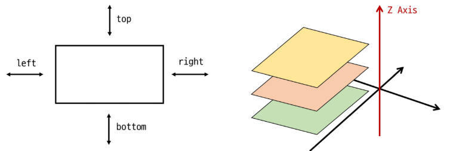

# CSS Box Model

### display 속성(박스의 화면 배치 방식)

- 박스 타입
    - 박스 타입에 따라 페이지에서의 배치 흐름 및 다른 박스와 관련하여 박스가 동작하는 방식이 달라짐
- 박스 타입 종류
    - Block 타입
    - Inline 타입

## block 타입

블록 타입은 하나의 독립된 덩어리처럼 동작하는 요소(like 책의 각 문단)

- 항상 새로운 행으로 나뉨 (한 줄 전체를 차지, 너비 100%)
- width, height, margin, padding 속성을 모두 사용할 수 있음
- padding, margin, border로 인해 다른 요소를 상자로부터 밀어냄
- width 속성을 지정하지 않으면 박스는 inline 방향으로 사용 가능한 공간을 모두 차지함
    - 상위 컨테이너 너비 100%로 채우는 것
- 대표적인 block 타입 태그
    - <h1 ~6>, <p>, <div>, <ul>, <li>

## inline 타입

문장 안의 단어처럼 흐름에 따라 자연스럽게 배치되는 요소(like 문장 속 단어를 형광펜으로 칠하기)

- 줄바꿈이 일어나지 않음 (콘텐츠의 크기만큼만 영역을 차지)
- width와 height 속성을 사용할 수 없음
- 수직 방향 (상하)
    - padding, margin, border가 적용되지만, 다른 요소를 밀어낼 수 는 없음
- 수평 방향 (좌우)
    - padding, margin, border가 적용되어 다른 요소를 밀어낼 수 있음
- 대표적인 inline 타입 태그
    - <a>, , <span>, <strong>


```html
<!DOCTYPE html>
<html lang="ko">

<head>
  <meta charset="UTF-8">
  <title>Block vs. Inline 예시</title>
  <style>
    /* 모든 div 요소에 적용 (Block 타입) */
    div {
      background-color: lightblue;
      border: 2px solid blue;
      padding: 15px;
      margin: 10px;
    }

    /* 모든 span 요소에 적용 (Inline 타입) */
    span {
      background-color: lightcoral;
      border: 2px solid red;
      padding: 10px;
      margin: 30px;
      /* 상하 마진은 다른 요소를 밀어내지 못함 */
    }

    /* width 속성 비교를 위한 div */
    .custom-width {
      width: 300px;
      /* block 타입은 width 지정 가능 */
    }
  </style>
</head>

<body>

  <h2>Block 타입 예시 (div)</h2>
  <div>
    첫 번째 div 블록입니다. width를 지정하지 않으면, <strong>한 줄 전체 너비</strong>를 차지합니다.
  </div>
  <div class="custom-width">
    두 번째 div 블록입니다. <strong>width를 300px로 지정</strong>했습니다. 블록 요소는 너비 지정이 가능합니다.
  </div>
  <div>
    세 번째 div 블록입니다. block 요소들은 <strong>자동으로 줄바꿈</strong>이 됩니다.
  </div>

  <hr>

  <h2>Inline 타입 예시 (span)</h2>
  <p>
    문장 속에서
    <span>첫 번째 span</span>
    처럼 흐름에 따라 자연스럽게 배치됩니다.
    <span>두 번째 span</span>
    처럼 줄바꿈 없이 이어지며, <strong>자신의 내용만큼만 공간을 차지</strong>합니다.
    span에 적용된 상하 여백(margin)은 다른 줄에 영향을 주지 못하는 것을 확인해 보세요.
  </p>

</body>

</html>
```

## Normal flow

일반적인 흐름 또는 레이아웃을 변경하지 않은 경우 웹 페이지 요소가 배치되는 방식

<aside>
💡

워드(word) 문서로 예로 들면, 엔터를 눌러 문단을 나누는 것이 block 요소의 배치 방식, 엔터를 누르지 않고 계속 타이핑하는 것이 inline 요소의 배치 방식

</aside>

## 기타 display 속성

1. inline-block 타입
    - inline과 block의 특징을 모두 가진 특별한 display 속성 값
    - Block과 inline의 특징을 합친 것(줄바꿈 없이, 크기 지정 가능)
    - width 및 height 속성 사용 가능
    - padding, margin 및 border로 인해 다른 요소가 상자에서 밀려남

| 구분 | Block | Inline-block |
| --- | --- | --- |
| 차지 영역 | 한 줄 전부 차지 | 내용 크기만큼 |
| 기본 정렬 | 왼쪽 | 텍스트처럼 흐름 |
| 가운데 정렬 방법 | `margin: 0 auto;` (width 필요) | 부모에 `text-align: center;` |

## none 타입

요소를 화면에 표시하지 않고, 공간조차 부여되지 않음 (like 축구팀의 ‘후보 선수’)

자바스크립트에서 웹 조작? 같은거 할때 사용한데

# CSS Layout

### CSS Layout

- 각 요소의 위치와 크기를 조정하여 웹 페이지의 디자인을 결정하는 것
- 요소들을 상하좌우로 정렬하고, 간격을 맞추고, 전체적인 페이지의 뼈대를 구성
- 핵심 속성: display(block, inline, flex, grid, …)

### CSS Position

- 요소를 Normal Flow에서 제거하여 다른 위치로 배치하는 것
- 다른 요소 위에 올리기, 화면 특정 위치에 고정시키기 등
- 핵심 속성 : position(static, relative, absolute, fixed, sticky,…)

### Position 이동 방향

- 네 가지 방향 속성(상, 하, 좌, 우)를 이용해 요소의 위치를 조절할 수 있음
- 겹치는 요소의 쌓이는 순서를 조절할 수 있음



```html
   static은 normal flow에 따라 배치하고 top left bottom right속성이 적용되지 않음
   
   .relative {
      position: relative; 
      background-color: lightblue;
      top: 100px;
      left: 100px;
    }
    위 코드는 top과 left에 100씩 주는 건데 마진느낌 준것처럼
    이 박스탑과 왼쪽에 공간을 줌으로써 아래,오른쪽으로 이동한 것처럼 보임
    요소를 Normal Flow에 따라 배치하고 자신의 원래 위치 static을 기준으로 이동해
    top, bottom, left, right속성으로 위치를 조정하고
    다른 요소의 레이아웃에 영향을 주지 않음
    (요소가 차지하는 공간은 static일 때와 같음)
    
    position absolute는 요소를 normal flow에서 제거하고 가장 가까운 relative부모요소를 기준으로 이동해
    만족하는 부모요소가 없으면 body태그를 기준으로함
    ttop, right, bottom, left속성으로 위치를 조정하고 문서에서 요소가 차지하는 공간이 없어짐
   relative는 상대위치 absolute는 절대위치의 느낌이라는게 맞는지도 궁금해
```

## Z-index

요소의 쌓임 순서를 정의하는 속성

- 정수 값을 사용해 Z축 순서를 지정
- 값이 클수록 요소가 위에 쌓이게 됨
- static이 아닌 요소에만 적요됨
- 기본값은 auto 로 부모 요소의 z-index 값에 영향을 받음
- 같은 부모 내에서만 z-index 값을 비교하고, 값이 같으면 HTML 문서 순서대로 쌓임
- 부모의 z-index가 낮으면 자식의 z-index가 아무리 높아도 부모보다 위로 올라갈 수 없음

## CSS Flexbox

inner display타입

- 박스 내부의 요소들이 어떻게 배치될지를 결정
- CSS Flexbox (속성: flex)

**요소를 행과 열 형태로 배치하는 1차원 레이아웃 방식**

→ ‘공간 배열’ & ‘정렬’


### Flexbox 구성 요소

- **main axis (주 축)**
    - flex item들이 배치되는 기본 축
    - main start에서 시작하여 main end 방향으로 배치 (기본 값)
- **cross axis**
    - main axis에 수직인 축
    - cross start에서 시작하여 cross end 방향으로 배치 (기본 값)
- **flex container**
    - `display: flex;` 혹은 `display: inline-flex;` 가 설정된 부모 요소
    - 이 컨테이너의 1차 자식 요소들이 Flex item이 됨
    - flexbox 속성 값들을 사용하여 자식 요소 Flex Item들을 배치하는 주체
- **flex item**
    - Flex Container 내부에 레이아웃 되는 항목
    - 이후 배우는 내용을 이용해 자유로운 순서 변경 및 정렬 가능


### Flexbox 속성 목록

- Flex Container 관련 속성
    - display
    - flex-direction
    - flex-wrap
    - justify-content
    - align-items
    - align-content
- Flex Item 관련 속성
    - align-self
    - flex-grow
    - flex-basis
    - order

1. Flex Container 지정
    - display 속성을 flex로 설정하면, Flex Container로 지정됨
    - flex item은 기본적으로 행(주 축의 기본값인 가로 방향)으로 나열
    - flex item은 주 축의 시작 선에서 시작
    - flex item은 교차 축의 크기를 채우기 위해 늘어남


1. flex-direction
    - flex item이 나열되는 방향을 지정
    - 속성
        - row(기본값): 아이템을 가로 방향으로, 왼쪽에서 오른쪽으로 배치
        - column: 아이템을 세로 방향으로, 위에서 아래로 배치
        - “-reverse”로 지정하면 flex item 배치의 시작 선과 끝 선이 서로 바뀜

1. flex-wrap
    - flex item 목록이 flex container의 한 행에 들어가지 않을 경우, 다른 행에 배치할지 여부 설정
    - 속성
        - nowrap(기본 값): 줄 바꿈을 하지 않음
        - wrap: 여러 줄에 걸쳐 배치될 수 있게 설정

1. justify-content
    - 주 축을 따라 flex item 들을 정렬하고 간격을 조정
    - 속성
        - flex-start(기본값): 주 축의 시작점으로 정렬
        - center: 주 축의 중앙으로 정렬
        - flex-end: 주 축의 끝점으로 정렬
2. align-content
    - 컨테이너에 여러 줄의 flex item이 있을 때, 그 줄들 사이의 공간을 어떻게 분배할지 지정
        - flex-wrap이 wrap 또는 wrap-reverse로 설정된 여러 행에만 적용됨
        - Flex 아이템이 두 줄 이상일 때만 의미가 있음(flex-wrap이 nowrap으로 설정된 경우)
    - 속성
        - stretch(기본값): 여러 줄을 교차 축에 맞게 늘려 빈 공간을 채움
        - center: 여러 줄을 교차 축의 중앙에 맞춰 정렬
        - flex-start: 여러 줄을 교차 축의 시작점(보통 위쪽)에 맞춰 정렬
        - flex-end: 여러 줄을 교차 축의 끝점(보통 아래쪽)에 맞춰 정렬
3. align-items
    - 컨테이너 안에 있는 flex item 들의 교차 축 정렬 방법을 지정
    - 속성
        - stretch(기본값): 아이템을 교차 축 높이를 꽉 채우도록 늘어남
        - center: 아이템을 교차 축의 중앙에 맞춰 정렬
        - flex-start: 아이템을 교차 축의 시작점(가로 방향일 경우 위쪽)에 맞춰 정렬
        - flex-end: 아이템을 교차 축의 끝점(가로 방향일 경우 아래쪽)에 맞춰 정렬
4. align-self
    - 컨테이너 안에 있는 flex item 들을 교차 축을 따라 개별적으로 정렬
    - 속성
        - auto(기본값): 부모 컨테이너의 align-items 속성 값을 상속
        - stretch: 해당 아이템만 교차 축 방향으로 늘어나 컨테이너를 꽉 채우도록 정렬
        - center: 해당 아이템만 교차 축의 중앙에 정렬
        - flex-start: 해당 아이템만 교차 축의 시작점(가로 방향일 경우 위쪽)에 정렬
        - flex-end: 해당 아이템만 교차 축의 끝점(가로 방향일 경우 아래쪽)에 정렬

### 목적에 따른 속성 분류

- 배치 ( flex-direction, flex-wrap )
- 공간 분배 (justify-content, align-content)
- 정렬 (align-items, align-self)

### 속성 쉽게 이해하는 방법

- justify - 주축
- align - 교차 축

1. flex-grow
    - 남는 행 여백을 비율에 따라 각 flex item에 분배
    - flex item이 컨테이너 내에서 확장하는 비율을 지정


1. flex-basis
    - flex item의 초기 크기 값을 지정
    - flex-basis와 width 값을 동시에 적용한 경우 flex-basis가 우선

### 반응형 레이아웃 작성

- 다양한 디바이스와 화면 크기에 자동으로 적응하여 콘텐츠를 최적으로 표시하는 웹 레이아웃 방식
- flex-wrap을 사용해 반응형 레이아웃 작성
    1. .card 요소를 flex 컨테이너로 설정
    2. 컨테이너의 공간이 부족할 경우, 여러 줄로 나뉘어 배치되도록 허용
    3. 각 flex item의 기본 너비를 설정
    4. 컨테이너에 여유 공간이 있을 때 공간을 차지하며 늘어날 수 있도록 함