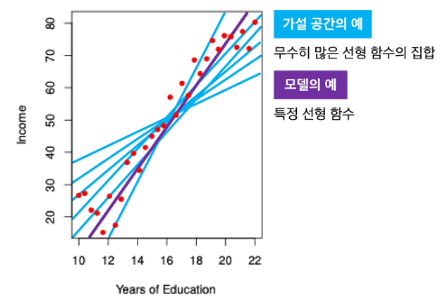
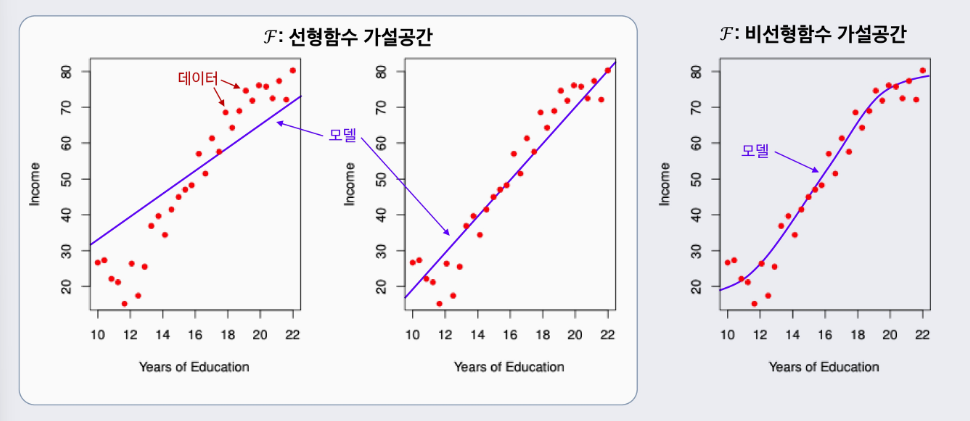
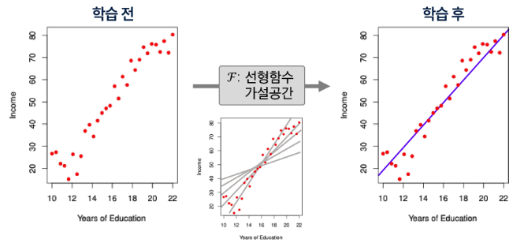
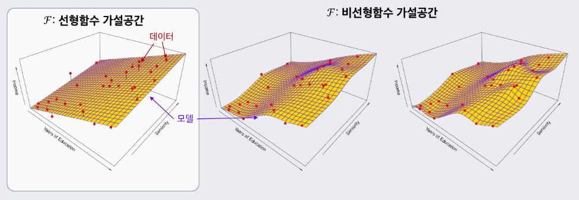

# 1. AI, ML, DL의 정의

- AI
    - 주어진 환경/ 데이터를 인지·학습·추론을 통해 목표 달성을 하도록 예측·행동 선택·계획하는 시스템
- ML
    - AI 범주 내에서 데이터로부터 학습하여 목적을 달성하는 접근 방법론
    - 예: 언어 모델, 이미지 분류 모델, 추천 시스템
- DL
    - ML 범주 내에서 신경망 함수를 사용한 학습 방법론
- AL - ML(ML이 아닌 AI 시스템)의 예
    - 규칙 기반 시스템
    - 휴리스틱 기반(최적화) 알고리즘

# 2. 데이터와 학습의 이해

### 2-1. 데이터 구성 요소

- 데이터가 왜 중요한가
    - 머신러닝은 규칙을 직접 코딩하지 않고, 데이터에서 규칙을 학습
    - 데이터(Feature, Label)의 분포와 관계가 머신러닝의 학습 결과를 결정
- Feature(특성)
    - 모델이 예측에 사용하는 입력정보
    - 예측, 판단의 근거/단서
- Label(목표값)
    - 모델이 예측하려는 정답
    - 학습의 목표값

# 3. 단일 피쳐 기반 학습

### 3-1. 1D 피쳐 기반 학습

- 1D 피처 기반 학습(단일 피처 학습)이란?
    - **1D = 1차원**
    - Feature(특징)가 하나일 때 머신러닝이 학습하는 **가장 단순한 형태**
- 수식 표현

$Incomei=f^∗(Years of Educationi)+εi$

| 항목 | 설명 |
| --- | --- |
| $f^*$ | **미지의 함수** (Feature와 Label 간의 실제 평균 관계)→ 직접 관측할 수 없으며, 오차가 포함된 데이터만 관측 가능 |
| $\varepsilon$ | **측정 오차** (데이터에 포함된 노이즈)→ 측정기기의 한계, 환경적 요인 등으로 발생 |

> 피처와 라벨의 관계를 잘 나타내는 함수 $f$ 는 무엇일까?
> 
- 머신러닝의 목표는 미지의 참 함수 $f^*$를 **가능한 한 근사**하는 함수를 찾는 것이다.
- 데이터를 설명하는 여러 함수 후보가 존재하는데
- 어떤 함수가 가장 잘 맞는지 **학습**해야 한다

### 3-2. 모델과 가설 공간

**학습 (Learning)**

- 입력(Feature) → 출력(Label) 관계를 찾는 과정
- 평균 관계를 하나의 함수로 표현함
- 하지만 관계를 표현할 수 있는 함수는 무수히 많음

**가설 공간 (Hypothesis Space)**

- 관계를 표현할 수 있는 모든 후보 함수들의 모음
- 피처 공간과 라벨 공간 위에서 정의된 함수들의 집합 $F$

**모델 (Model)**

- 가설공간 $F$에 속한 특정 함수 f

 

### 3-3. 학습이란

- 주어진 데이터와 성능척도를 바탕으로 가설공간 $F$의 후보들 중 최적의 모델을 선택하는 과정
- 데이터$D$ → 가설공간$F$ → 선택된 모델$f$

# 4. 복수 피쳐 기반 학습

### 4-1. 2D 피쳐 기반 학습

### 4-2. 일반적 용어 정리 및 모델 가정

**Income = $f^*$(Years of Education, Seniority, …) + ε → Y = $f^*(X)$ + ε**

- **Income**: 우리가 예측하려는 라벨(반응/목표) 변수 → $Y$로 표기
- **Years of Education**: 첫번째 피처(입력/예측) 변수 → $X₁$로 표기
- **Seniority**: 두번째 피처(입력/예측) 변수 → $X₂$로 표기
- 다른 i번째 피처가 있다면 역시 $Xᵢ$로 표기
- **일반적인 p차원 피처(총 p개의 피처) 벡터:**
    - $X = [X₁, X₂, …, Xₚ]$ ∈ ℝᵖ
- **모델(함수형):**
    - $f^*$: ℝᵖ → ℝ
    - $Y$ = $f^*$(X) + ε
- **측정오차 ε:**
    - ε는 피처 $X$와 독립이며 $E[ε]$ = 0로 가정함

### 4-3. 왜 f()를 학습하는가?

- 에측
    - 잘 학습된 $f$가 있으면, 새로운 입력 $X = x$에서 반응/목표 $Y$를 예측할 수 있음
- 중요 특성 파악
    - 피쳐들 $X = (X_1, X_2, … , X_p)$의 어떤 특성이 $Y$를 설명하는데 중요하고, 어떤 것은 덜 중요(무관)한지 알 수 있음
- 해석 가능성
    - $f$의 복잡도에 따라 각 구성요소 $X_j$ 가 $Y$에 어떻게 영향을 미치는지(증가/감소 방향, 민감도 등) 이해할 수 있음