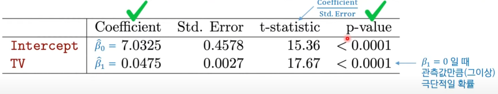
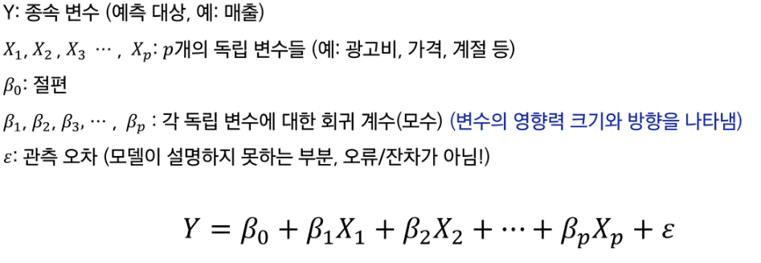
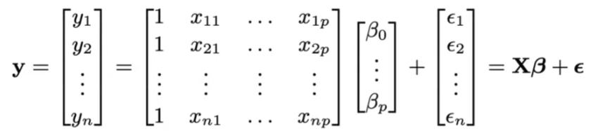
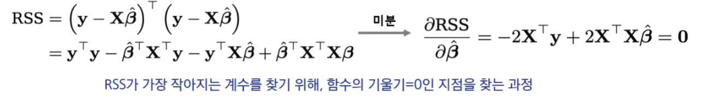
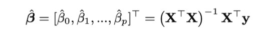
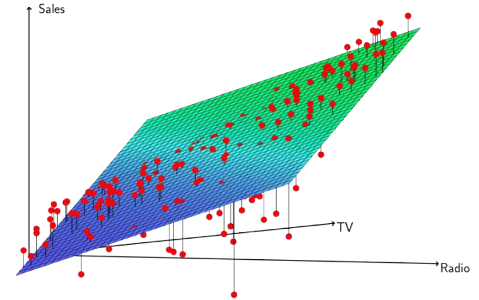
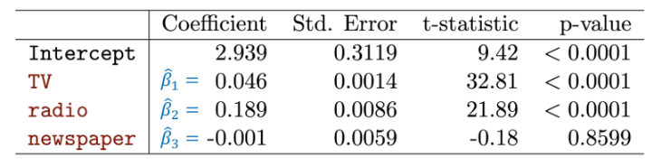

# 선형회귀

### 선형회귀란?

- 직선 형태로 근사, 예측하는 방법
- 지도학습의 가장 기초

데이터를 바라보고 선형회귀를 한다고 할 때, 데이터에 꼭 선형성이 있어야 하는 건 아님. 

---

## 단순선형회귀

- 한 개의 설명변수(X)와 하나의 반응변수(Y) 사이의 선형 관계를 찾는 방법
- 목표: 데이터를 잘 설명하는 직선을 찾아 예측에 활용하자

### 최소제곱법(least squares)

- 실제 관측값과 예측값의 차이(잔차)를 제곱해 합한 값(RSS)을 최소화하는 방법
- 목표: 데이터를 가장 잘 설명하는 직선을 찾기 위해 계수($\beta_0, \beta_1$)를 추정

- 잔차 정의 : $e_i = y_i - \hat{y}_i$
- RSS(잔차제곱합) 정의: RSS는 각 잔차(데이터만큼 존재)를 제곱해서 더한다.
- 최소화 방법: 2차 함수니까 미분

### 단순선형회귀 결과 해석

- 계수 해석
    - ex 광고데이터: x = 광고비, y = 평균 판매량
    - 절편(Intercept) = 7.03 → 광고비가 0이어도 평균 판매량은 7.03이라는 의미
    - 광고비 계수 = 0.0475 → 광고비가 1단위 오르면 평균 매출이 약 0.0475 x 1단위 증가한다는 의미
- 유의성 검정
    - 계수의 P-value < 0.0001(매우 작음, <<0.05) 이므로 통계적으로 매우 유의하다

---

## 다중선형회귀

- 독립 변수(설명 변수, Feature)가 여러 개 존재할 때 사용하는 회귀 분석 기법

- 각 변수의 의미
    
    
    

### 계수 추정의 수학적 유도

- 행렬 표현
    - 우리는 x나 y만 관측이 가능하고 사실 각 관측 오차와 회귀 계수들은 모름
    
    
    
- 최소제곱법 목적: RSS 최소화
    
    
    
- 정규방적식 해
    
    
    

**단순선형회귀와 달리 더 이상 선이 아니라 평면(hyper plain)이 된다**

### 다중선형회귀 결과 해석

- p-value들이 매우 낮음: 각 독립 변수들이 유의미한 관계를 갖음
- 신문 광고비는 통계적으로 유의하지 않음(p-value = 0.8599)

### 모형 적합도($R^2$ 높을 수록, 1에 가까울 수록 좋음)

- 단순선형회귀 결정계수: 0.612
- 다중선형회귀 결정계수: 0.897

---

## 선형회귀 결과 검증 및 테스트 성능

- 훈련 데이터에서의 성능
    - 회귀식을 만들 때 최소제곱 해는 훈련 데이터만 보고 계산됨
    - 때문에 테스트 성능을 과소평가할 가능성이 높음
- 테스트 성능 평가 필요
    - 선형회귀도 변일반화 성능을 확인하려면 새로운 데이터에 적용해 봐야 함
    - 수가 많거나 고차항을 사용하면 **오버피팅** 문제가 여전히 발생할 수 있음
    - 검증/교차검증을 통해 적절한 적합을 찾아보자

### 선형회귀를 통해 대답할 수 있는 질문들

- 이상적 상황: 변수들이 연관(correlation)되지 않고, 독립적일 때 → 계수 해석이 명확함
- 문제 상황: 변수들이 서로 연관되어 있다면 → 계수 추정 불안정, 해석에 혼동이 발생할 수 있음
- 주의: 상관관계로 인과 관계를 주장해서는 안됨