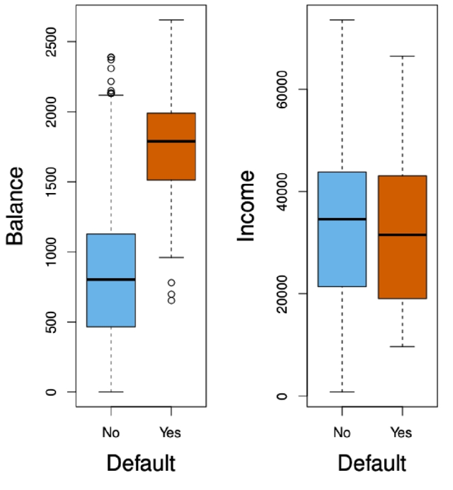
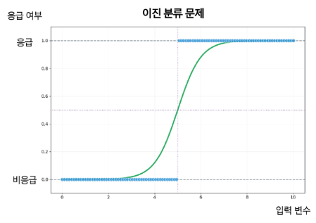

# 분류(Classification)

### 분류의 정의

- 분류: 정해진 범주 중 하나로 지정하는 것
- 범주형 변수: 수치의 크고 작음이 아니라 유한한 범주(혈액형, 성별, 지역 등)로 표현하는 변수

### 분류 함수의 목표

- 입력: X, 특성 벡터
- 출력: Y, 범주
- 분류 함수 $f(X)$를 학습하여 입력 X가 속할 범주를 예측
    - 범주의 직접 예측보다 **각 범주에 속할 확률을 추정**하는 것이 더 유용할 때가 많음

### 예시: 신용카드 연체(Default)

**신용카드 사용량·소득별 연체 여부 산점도 개요**

- 변수
    - **Balance(신용카드 사용량)**, **Income(소득)**: 서로 **독립변수**
    - **Default(연체 여부)**: 종속변수(라벨), 표식/부호로 구분
- 시사점
    - **연체자(+)**는 **Balance가 큰 구간**에 상대적으로 더 많이 분포
    - **비연체자(O)**는 **Balance가 작은 구간**에 상대적으로 많이 분포
    - **Income**은 연체 여부와 **뚜렷한 분리**가 잘 드러나지 않음

**그룹별 분포(Boxplot) 해석**

- Balance(신용카드 사용량) vs Default(연체)
    - **연체자**의 **중앙값**이 더 높고, **분산(상자·수염 길이)**도 더 큼
        
        → 연체자는 전반적으로 **카드 사용량이 많다**는 경향
        
- Income(소득) vs Default(연체)
    - **연체 여부에 따른 소득 차이 거의 없음**
    - 중앙값이 약간 다르지만 **분포가 크게 겹침**
        
        → 소득만으로는 연체 여부 **분류력이 낮음**
        

---

### 분류 문제에 선형회귀를 써도 될까?

1. 이진 분류 문제에서의 부적절성
    - **선형회귀**는 실수 범위의 예측값을 출력(제약 없음)
    - **확률**은 [0,1][0,1][0,1] 범위여야 하나, 선형회귀는 이를 **보장하지 못함**
        - 예: 응급 여부(0=비응급, 1=응급)와 같은 **이진 라벨** 예측 시
        - 선형회귀는 **0보다 작거나 1보다 큰 값**을 예측할 수 있어 **확률 해석 불가**
    
    
    
2. 다중 범주 분류에서의 부적절성
    - 선형회귀는 라벨에 **정수형 코딩(1,2,3, …)**을 부여했을 때
        - **범주 간 동일 간격**을 **암묵적으로 가정**
    - 그러나 **범주(카테고리)**는 **순서/거리의 개념이 없음**
        - 예: 환자 진단 {1: 뇌졸중, 2: 약물 과다복용, 3: 간질발작}
        - 실제로 **1↔2↔3 간 ‘거리’**가 존재하지 않음
            
            → 따라서 선형회귀는 **분류 문제에 구조적으로 부적절**
            
    
    
    

---

### 분류 문제에서 적합한 모델: 로지스틱 회귀(Logistic Regression)

- 핵심 아이디어
    - **시그모이드(Sigmoid)** 변환을 통해 예측값을 **확률**로 매핑
    - 입력의 선형결합을 확률로 변환하여 0~1 **범위를 보장**

### 로지스틱 함수와 선형회귀의 관계

- 로지스틱 함수는 선형 함수를 내포하고 있다
- 이 두 함수 간의 관계를 해석하기 위해 오즈와 로짓 변환에 대해 알아보자

**오즈**

- 성공확률이 실패확률에 비해 몇 배 더 높은 가를 나타냄
    
    $odds = \frac{p(y=1|x)}{p(y=0|x)} = \frac{p(y=1|x)}{1-p(y=1|x)}$
    

**로짓 변환 = Log odds**

- 오즈에 log를 취한 함수 형태

**로지스틱 함수 모형식에 로짓 변환을 수행하면? = 선형모형**

- 즉 로지스틱 모형식은 선형 모형식과 시그모이드 함수의 결합이다
- 로짓 변환 시 선형 회귀 모형식으로 표현이 가능하다

### MLE 활용 모수 추정

확률을 추정하는 모델을 결정했으니 모수를 추정하는 방법을 알아보자

- 우도
    - 현재 확률 함수가 데이터를 얼마나 잘 설명하는지를 나타낸 지표
    - 선형회귀에선
        - **평균 제곱 오차**를 지표로 삼음
    - 확률을 계산하는 함수를 평가하기 위해선
        - **우도(Likelihood)**를 지표로 삼음

때문에 모델의 학습은? 

우도 값을 높여 최대화가 되도록 하는 것!! 이것이 MLE(Maximum Likelihood Estimation) 이다. 

### MLE

- 로지스틱 회귀같은 이진 분류 문제에선 우도를 최대화 해야하는데.. 곱으로 이루어져있다
    
    → 곱으로 이루어진 함수는 $\beta$에 대해 미분이 어려움
    
- 양 변에 $log$를 취해 곱셈을 더하기로 변환하여 최대화 하자!!
    - 로그함수는 **단조 증가 함수**이기 때문에 최대화하는 $\beta$는 둘다 같다

### 로지스틱 회귀 결과 해석

- 추정 결과 $\hat{\beta}_1$ = 0.0055
    - 즉 Balance가 1 단위 증가할 때 연체의 로짓이 0.0055 증가함
- 입력 값이 2배 증가할 때 예측 확률값은 97배 증가함
- Balance 사용량 이외에도 다양한 입력을 추가하여 여러 변수를 함께 모형에 사용하면 회귀 계수를 통해 연체할 확률을 계산할 수 있다
