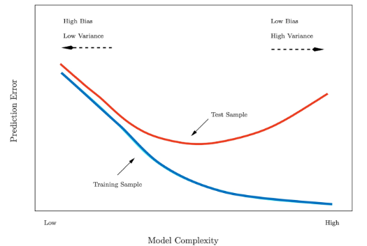

# 1. 테스트 성능 평가

### 훈련 오류 vs 테스트 오류

- 훈련 오류: 모델을 학습시킨 같은 데이터에 다시 적용해 계산한 오류
- 테스트 오류: 학습에 쓰지 않은 새 관측지에 대해 모델을 적용했을 때의 평균 예측 오류

- 파란색 선: 훈련 오류
- 빨간색 선: 테스트 오류
- 훈련 오류는 계속 낮아지고 테스트 오류는 U자형
- 목적: 테스트 오류의 U자형 바닥이 되도록 하는 적절한 모델 찾기

- 테스트 예측 오류 계산
    - 이상적 케이스: 충분히 큰 별도 테스트 데이터 셋
        - 현실적으로 구하기 어려움
    - 대안: 데이터를 나눠 여러 번 “훈련 평가”를 반복해 테스트 오류를 가늠하자
        - 검증셋, K-Fold
        - 데이터를 더 효율적으로 사용하여 일반화 오차 추정

# 2. 검증셋(Validation Set) 접근

- 검증셋(홀드아웃) 방법
    - 가용 샘플들을 무작위로 훈련셋과 검증셋(hold-out)으로 분할
    - 훈련셋으로 모델 적합(학습)
    - 검증셋으로 예측 후 검증 오류를 계산(성능평가)
    
- 검증셋 방법 예시
    
    
    
    - 예시에서 보이는 방법의 단점
        - 어떤 표본이 훈련/검증에 들어가느냐에 따라 오류 추정치가 매우 가변적이다
        - 검증 접근에서는 훈련 셋(=전체의 일부)만으로 모델을 적합하므로, 전체 데이터로 학습했을 때보다 성능이 낮게 추정(즉, 테스트 오류를 과대 추정)될 수 있음
            - why? : 학습에 데이터를 부분만 사용하기 때문

# 3. K-fold 교차검증

- 테스트 오류 추정의 **표준적 접근**
- 추정치는 **모델 선택과 최종 모델의 테스트 오류 규모 파악**에 활용
- 데이터 전체를 **크기 동일한 K개 폴드로 무작위 분할**
    
    → 폴드를 검증, 나머지 K−1개를 훈련에 사용
    
- k=1,⋯ ,K에 대해 반복 후, **평균 오류**로 테스트 오류를 추정

**K-fold 교차검증 단계**

- 데이터를 먼저 셔플링
    - 총 n 개의 데이터를 겹치지 않는 K개 그룹으로 분할
- 각 그룹이 번갈아 검증셋, 나머지는 훈련셋
- K개의 MSE를 평균해 테스트 오류를 추정

**K-겹 교차검증 오류 계산**

- Leave-One-Out 교차검증
    - 훈련셋: 관측치 하나만 제외한 나머지 전부
    - 검증셋: 제외한 1개 관측치
    - 이 과정을 n번 반복해 나온 n개의 MSE 평균으로 테스트 오류를 추정

**LOOCV vs 10-fold 교차검증**

- 자동차 데이터에서 두 검증 결과 비교
- 경향과 최적 차수가 비슷

