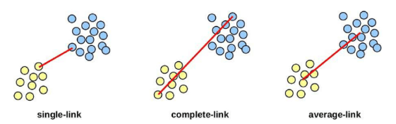

# 1. 비지도 학습

**비지도학습이란?**

- **정의**: 레이블(정답) 없이 데이터의 구조·패턴·집단(잠재 서브그룹)을 찾아내는 학습
- **대표 과제**: 군집화(clustering), 차원축소(PCA 등), 밀도추정/이상치 탐지
- **출력**: “정답 예측”이 아니라 구조/요약/표현(embedding)

**핵심 질문**

- 무엇을 비슷함/다름으로 볼 것인가 (거리·유사도 선택)
- 전처리(스케일 표준화 등)를 어떻게 할 것인가
- 출력: “정답 예측”이 아니라 구조/요약/표현(embedding)

# 2. 클러스터링(Clustering)

- **클러스터링**: 데이터 안에서 하위 집단(클러스터)을 찾는 기법들의 총칭
- **목표**: 집단 내부는 서로 유사, 집단 간은 상이하도록 데이터를 분할
- **유사/상이 정도**는 도메인 맥락에 따라 정의가 달라질 수 있음
- **문제**: 데이터 특성에 의존

**두 가지 대표 클러스터링 기법**

- K-means: K(클러스터 수)를 미리 정해 분할
- 계층적 군집: K를 사전에 고정하지 않음

# 3. K-means 클러스터링

- K-means의 핵심 아이디어
    - 좋은 군집화 = 클러스터 내부 변동이 작은 분할
    - 목표: 클러스터 내부 변동의 합이 최소가 되도록 분할을 찾음
    - 모든 클러스터의 내부 흩어짐 총합이 가장 작은 분할

- 단계
    1. 초기화: 관측치들에 무작위로 1~K 클러스터를 임시 부여
    2. 반복(할당이 더 이상 바뀌지 않을 때까지)
        1. 각 클러스터의 중심(centroid) 계산
        2. 각 관측치를 가장 가까운 중심의 클러스터에 재할당
    
    
    
- 알고리즘 특성
    - 위 반복은 매 단계 목표함수 값을 감소시킴
    - 단, 전역(global) 최솟값 보장은 아님 → 초기값에 따라 지역 최솟값으로 수렴 가능

- 다른 초기값의 영향
    - 서로 다른 초기 레이블에서 최종 분할과 목표값이 달라짐
    - **초기화의 중요성**: 여러 번 시도 권장

# 4. 계층적 군집(Hierarchical Clustering)

- K-means 클러스터링 vs 계층적 군집
    - K-means 클러스터 수 K를 미리 지정해야 하는 단점이 존재
    - 계층적 군집은 K를 고정하지 않고 전체 구조를 덴드로그램으로 제공
    - 이번 강의는 상향식을 다룬다

- 단계
    - n개 관측에 대해 쌍별 비유사도 계산, 각 관측치를 하나의 클러스터로 시작
    - 반복
        - i개 클러스터 간 쌍별 비유사도를 모두 계산해 가장 유사한 두 클러스터를 병합
        - 병합 후 남은 i-1개 클러스터 사이의 새 비유사도를 다시 계산
        - 1개의 단일 클러스터가 될 때까지 진행(매 단계에서 병합이 이루어짐)

- 계층적 군집의 계산량
    - 매 단계에서 모든 클러스터 쌍 간의 거리를 계산해야 함
    - 즉, 데이터 수가 많은 경우 K-means에 비해 계산량이 많다

- 링크의 유형
    - **Single(최소 거리) 링크**: 두 개 클러스터 내 데이터 쌍별 거리 중 최솟값을 군집 간 거리로
    - **Complete(최대 거리) 링크:** 두 개 클러스터 내 데이터 쌍별 거리 중 최대값을 군집 간 거리로
    - **Average(평균 거리) 링크**: 두 개 클러스터 내 데이터 쌍별 거리의 평균을 군집 간 거리로
    
    
    
    - 링크에 따라 결과가 달라짐!
        - 여러 종류의 링크를 시도하며 선택하는 것을 권장

# 5. 클러스터링시 주의점

- 스케일링: 표준화가 필요한가?
    
    → Yes, 변수 단위 차이 영향 큼
    
- 몇 개의 클러스터가 적합한지
    - 정답이 없음 여러 번 시도하면서 결정