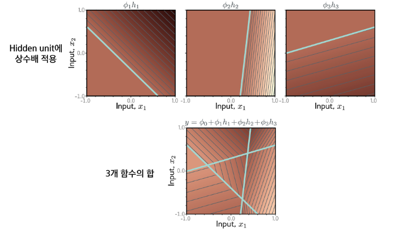

## Shallow 네트워크

layer가 하나인 네트워크

### shallow 네트워크

- 모수($\phi$)가 정해지면 특정 함수 $f([x, \phi])$가 결정된다.
- 모수가 주어지면 추론(식을 계산, 예측)할 수 있다.
- 훈련 데이터가 주어지면 손실함수를 정의하고 손실을 최소화하도록 모수를 조정한다.

### 단계별 계산

- 활성화 함수($a$)를 적용한다: hidden units
    - 히든 유닛의 수만큼 꺾인 점이 생긴다.
- 모수($\phi$)를 적용한다.
- 입력 구간별로 선형 함수를 합하여 하나의 함수로 만든다.

### 네트워크 도식화

### Hidden Units

- 충분히 많은 hidden unit이 있다면 임의의 1차원 함수를 원하는 정확도로 근사할 수 있다.
    - 그만큼 꺾인 점이 많아지기 때문
- **hidden unit 이 달라지지 않는 이상, 꺾인 점의 위치는 똑같다.**

### 다중 입출력 네트워크

- 2개 출력의 네트워크

- 2개 입력의 네트워크

## Deep 네트워크

### Deep 네트워크

- 2개의 네트워크를 하나로 합성

### Shallow 네트워크 vs Deep 네트워크

- deep 네트워크가 더 표현력이 좋다.

### 수식 표현

- 네트워크를 **합성 함수**로 봄
- 두 번째 히든 유닛들의 pre-activation(전활성값)은 출력 n개를 갖는 one-layer 네트워크로 볼 수 있다.

### 단계별 계산

### 벡터 및 행렬 표현

