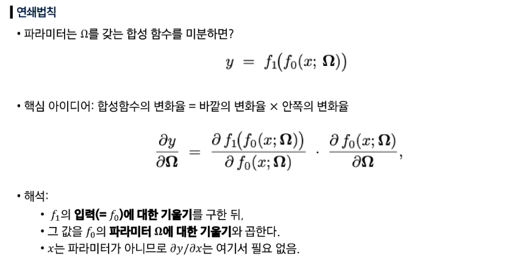

## 선형회귀

### 손실 함수 (Loss function)

- 모델이 얼마나 잘못 예측하는지를 측정하는 함수
- 값이 작을수록 모델이 더 정확하게 학습되었다는 의미
- 학습: 손실함수를 최소화하는 파라미터(모델의 가중치)를 찾는 과정

### MSE (최소 제곱 손실함수)

- 1D 선형회귀에서의 손실함수

## 경사 하강 (gradient descent)

### 경사 하강 알고리즘

- 경사 하강법은 손실함수를 최소화하기 위해 파라미터를 반복적으로 갱신하는 알고리즘
- 경사 하강법: 손실 함수의 값이 줄어드는 방향으로 파라미터를 이동하는 과정

### 단계별 계산

- 기울기 계산: 손실 함수를 파라미터($\phi$)에 대해 편미분 진행
- 파라미터 업데이트: 기울기(미분값)의 반대 방향으로 이동해야 손실 함수가 줄어든다.

### Convex vs Non-convex

- Convex: 곡선이 항상 U자처럼 아래로 볼록한 함수
    - 그래프 위 임의의 두 점을 잇는 직선이 그래프 위 또는 같은 위치에 있다.
    - 전역(global) 최소값이 유일하다.
    - 최적화가 쉽다.
- Non-convex: 봉우리, 골짜기, 오목한 구간이 섞인 모양
    - 두 점을 이은 직선이 그래프 아래로 내려가는 구간이 생긴다.
    - 여러 개의 지역(local) 최소값 또는 saddle 점이 있다.
    - 최적화가 어렵다.
- 손실 함수 모양에 따라 최적화의 난이도가 달라진다.

## 확률적 경사 하강법 (Stochastic Gradient Descent)

### 경사 하강법의 한계

- non-convex 문제에서 지역(local) 최소점에 빠지기 쉽다.
- 매 스텝마다 전체 데이터에 대한 미분값을 구해 업데이트하기 때문에 스탭별 계산양이 많다.

### 확률적 경사 하강법 (SGD)

- 전체 데이터를 한 번에 쓰는 대신, **무작위로 선택한 데이터 샘플**을 사용한다.
- 무작위 확률로 샘플된 일부 데이터(batch)만 사용하여 기울기를 계산한다.
- local 최소점에 빠질 위험이 상대적으로 낮다.

### 확률적 경사 하강법 (SGD)의 특성

- 국소 최소값 (노이즈)
    - 노이즈가 오히려 local minima, saddle point에서 빠져나오는 데 도움이 된다.
    - 미니 배치의 기울기는 정확한 전체 기울기는 아니지만, 평균적으로 올바른 방향을 가리킨다.
    - 학습이 점전적으로 최적점 방향으로 수렴한다.
- 계산 비용 절감
    - 반복(스텝) 당 연산량이 적다.
    - 큰 데이터셋에서 효율적으로 학습 가능
- 수렴
    - full batch처럼 매끄럽게 수렴하지 않고, 무작위성 때문에 더 많이 진동(jitter, 지그재그)하면서 움직인다.
    - 전역 최소값 근처의 좋은 해에 도달할 수 있다.
    - convex 문제에서는 full-batch 경사하강보다 수렴이 늦을 수 있다.

**전체 데이터(경사 하강법) vs 확률적 샘플 데이터를 활용한 확률적 경사 하강법 실행**

## 역전파 (Backpropagation)

### 네트워크 파라미터의 미분

- 어떻게 구해???
- 네트워크는 합성함수
    - layer 별로 파라미터가 존재하고, 서로 영향을 미친다.

### 역전파

- 출력 오차를 기준으로 그래프를 거꾸로 따라가면 연쇄법칙으로 각 노드(파라미터 포함)의 미분값을 계산하는 절차
- 손실로부터 각 layer별 파라미터의 미분을 거꾸로 구할 수 있다.

1. 각 단계별 계산을 분해한다.
2. 각 layer별 값($f_{k}$)을 계산한다.
3. 각 layer별 값에 대한 출력 손실($l_i$)의 미분을 구한다.
4. 파라미터에 대한 미분을 구한다.