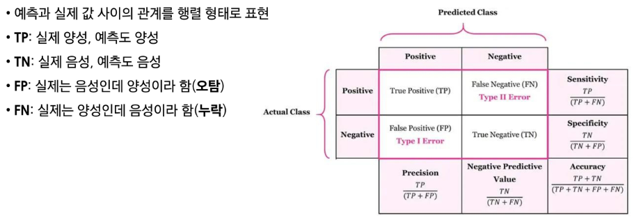

# 1. 지도학습의 개념

### 1-1. 지도학습(supervised learning)이란?

- 데이터
    - 입력(특성, 피쳐)과 정답(라벨)이 쌍으로 있는 데이터
- 목표
    - 새 입력이 들어오면 정답을 잘 맞추는 규칙을 학습
- 지도학습의 종류
    - 회귀: 예측값이 숫자(가격, 점수, 온도)
    - 분류: 예측값이 범주(스팸/정상, 질병 유/무)

### 1-2. 지도학습 용어

- 특성(Feature, x)
    - 예측에 쓰는 설명 변수
- 라벨(Label, y)
    - 맞춰야 하는 정답
- 예측값(**ŷ**)
    - 모델이 내놓은 결과(숫자 또는 범주)
- 오류(Error)
    - 예측값(**ŷ**)과 라벨(y)의 차이: **ŷ** - y

# 2. 회귀(Regression)

### 2-1. 회귀(Regression) 문제

- 라벨 및 예측 모델의 출력
    - 연속적인 수치

### 2-2. 회귀 오류: 평균제곱오차(MSE)

- 평균제곱오차(Mean Squared Error)
    - 각 데이터에서 정답($y_i$)과 예측(**$ŷ_i$)의 평균 제곱 차이 값**
    - $MSE = \frac{1}{n} \Sigma_{i=1}^{n}{(y_i-ŷ_t)^2}$
- 해석
    - 큰 오류를 더 크게 벌주므로, 전체 오류 수준을 한눈에 봄
- 참고
    - 데이터와 같은 단위를 쓰고 싶으면 RMSE(MSE의 제곱근)도 사용
    - $RMSE = \sqrt{MSE}$

### 2-3. 회귀 설명력: $R^2$(결정계수)

- **결정계수**
    - 라벨의 분산 중에서 특성으로 설명되는 비율
    - “평균만 쓰는 단순한 예측”보다 얼마나 더 잘 맞추는지를 0~1 사이로 나타낸 값
        
        $R^2 = 1 - \frac{\sum_{i=1}^{n}(y_i - \hat{y}_i)^2}{\sum_{i=1}^{n}(y_i - \bar{y})^2}$   $\bar{y}=y_i$들의 평균값
        
- **해석**
    - 1에 가까울수록 설명력이 높고, 낮을수록 설명력이 낮음
- **질문**
    - $R^2$가 음수가 나올 수 있을까?
        - 있다: 예측 값들이 평균 값보다도 못한다면..

# 3. 분류(Classification)

### 3-1. 분류(Classification) 문제

- 범주 라벨(이진/다중)

### 3-2. 분류 정확도(Accuracy)

- 정확도
    - 전체 중 맞춘 비율
- 정확도만 보면 발생하는 문제
    - 불균형 데이터(양성 1%, 음성 99%)에서는 전부 음성이라 해도 정확도가 99%로 보일 수 있음
- 결론
    - 정확도만 보지 말고 다른 지표도 함께 봐야 안전

### 3-3. 혼동행렬(Confusion Matrix)

- 정밀도(Precision)
    - 양성이라 판정한 것 중 진짜 양성의 비율 = TP/(TP+FP)
- 재현율(Sensitivity or Recall)
    - 진짜 양성 가운데 잡아낸 예측 양성 비율 = TP/(TP+FN)
- F1-score
    - 정밀도와 재현율의 조화 평균

# 4. 학습의 목적

- 학습의 목적은 테스트 예측(일반화)
    - 학습 모델의 성능 평가는 모델이 처음 보는 (학습에 사용되지 않은) 테이터로 평가
    - 훈련 데이터에서 성능이 아무리 좋아도, 새로운 데이터에서 성능이 떨어지면 실전엔 사용할 수 없음
    - 다음 차시에서 일반화 성능을 추청(검증/교차검증)하는 방법을 배울 예정

### 4-1. 오버피팅

- 훈련 데이터의 우연한 패턴/잡음 까지 외워버려서 훈련에서는 잘 맞지만 테스트에서는 성능이 나빠지는 현상
- 표본(sample)의존, 불안정: 훈련 데이터는 모집단의 일부 표본이라 우연한 잡음이 섞임. 이 것에만 과하게 맞추어 학습하면 샘플이 변하면 예측이 크게 흔들림(분산이 커짐)
- 일반화 실패: 보지 못한 데이터 오류가 커짐. 모집단 성능과 격차가 벌어짐

### 4-3. 오버피팅에 대한 오해

- 오버피팅이 **분포 변화로 인한 에러 증가이다???** → NO
    - 분포 변화로 인한 오류: 훈련 데이터 분포와 테스트 분포가 다름으로(환경 계절 센서 변경 등) 성능이 떨어지는 현상
    - 분포 변화로 인한 에러 증가는 모델이 과적합하지 않아도 발생 가능

### 4-4. 오버피팅 vs 언더피팅

- 오버피팅 vs 언더피팅(균형 잡기)
    - 오버피팅: 모델이 너무 복잡
    - 언더피팅: 모델이 너무 단순하거나 학습이 완료되지 않음
- 해결 실마리
    - 더 많은 데이터
    - 테스트 데이터를 활용한 모델 선정
    - 교차 검증