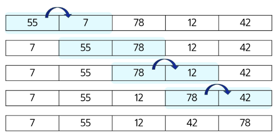

# 알고리즘

- 문제를 해결하기 위한 절차나 방법
- 컴퓨터가 어떤 일을 수행하기 위한 단계적 방법

### 의사코드(슈도코드, Pseudocode)와 순서도

- 컴퓨터 분야에서 알고리즘을 표현하는 방법

### 알고리즘의 성능

- APS 과정의 목표 중 하나 : 보다 좋은 알고리즘을 이해하고 활용하기
- 좋은 알고리즘이란?
    - **정확성** : 얼마나 정확하게 동작하는가
    - **작업량** : 얼마나 적은 연산으로 원하는 결과를 얻어내는가
    - **메모리 사용량** : 얼마나 적은 메모리를 사용하는가
    - **단순성** : 얼마나 단순한가
    - **최적성** : 더 이상 개선할 여지없이 최적화되었는가
- 주어진 문제를 해결하기 위해 여러 개의 다양한 알고리즘이 가능
    - 어떤 알고리즘을 사용해야 하는가를 고려해야 함
- 알고리즘의 성능 분석 필요
    - 많은 문제에서 성능 분석의 기준으로 알고리즘의 작업량을 비교
- 알고리즘 성능 비교 예시
    - 1부터 100까지 합을 구하는 문제
    
    | 알고리즘 1 | 알고리즘 2 |
    | --- | --- |
    | 덧셈 100번 | 100 x (1 + 100) / 2 |
    | 100번의 연산 | 3번의 연산 |

### 알고리즘의 시간 복잡도

- 알고리즘의 작업량을 표현할 때 시간 복잡도로 표현함
- **시간 복잡도**
    - 실제 걸리는 시간을 측정
    - 실행되는 명령문의 개수를 계산
- 시간 복잡도 표시
    - “빅-오 표기법” 을 언급하는 경우가 많음
    - 시간 복잡도 함수 중에서 가장 큰 영향력을 주는 n에 대한 항만을 표시
    - 계수는 생략하여 표시
    
    ```
    O(3n + 2) = O(3n) = O(n)
    
    O(2n^2 + 10n + 100) = O(n^2)
    O(4) = O(1)
    ```
    

---

# 배열 (Array)

- 일정한 자료형의 변수들을 하나의 이름으로 열거하여 사용하는 자료구조

**배열의 필요성**

- 프로그램 내에서 여러 개의 변수가 필요할 때
    - 일일이 다른 변수명을 이용하여 자료에 접근하는 것은 매우 비효율적
- 배열을 사용하면 하나의 선언을 통해 둘 이상의 변수를 선언
- 단순히 다수의 변수 선언을 의미하는 것이 아님
    - 다수의 변수로는 하기 힘든 작업을 배열을 활용해 쉽게 가능

ex) append 보다 미리 필요한 크기의 리스트 배열을 만들어 놓는 것이 좋다! 

### 배열 원소의 합 s 계산하기

```python
s = 0
for i in range(N):
	s += arr[i]
```

### 배열 원소 중 최댓값 max_v 찾기

```python
max_v = arr[0]
for i in range(1, N):
		if max_v < arr[i]:
				max_v = arr[i] # arr[i]가 더 그면 max_v 갱신
```

### 배열 원소 중 최댓값의 인덱스 max_idx 찾기

```python
max_idx = 0
for i in range(1, N):
		if arr[max_idx] < arr[i]:
				max_idx = i  # 더 큰값을 만나면 max_idx 갱신
```

### 배열 원소 중 최댓값이 여러 개인 경우 마지막 인덱스 max_idx 찾기

```python
max_idx = 0
for i in range(1, N):
		if arr[max_idx] <= arr[i]: # 값이 같아도 갱신!
				max_idx = i
```

### 찾는 값이 배열에 있으면 해당 원소의 인덱스, 없으면 -1을 idx에 넣기

```python
V = '찾는 값'
idx = -1 # 찾는 값이 없다고 가정
for i in range(N):
		if arr[i] == V:
				idx = i
				break
```

---

### 대표적인 정렬 방식의 종류

- 버블 정렬
- 카운팅 정렬
- 선택 정렬
- 퀵 정렬
- 삽입 정렬
- 병합 정렬

# 버블 정렬

- 인접한 두 개의 원소를 비교하며 자리를 계속 교환하는 방식

### 버블 정렬 과정

1. 첫 번째 원소부터 인접한 원소끼리 계속 자리를 교환하면서 맨 마지막 자리까지 이동한다
2. 한 단계가 끝나면 가장 큰 원소가 마지막 자리로 정렬된다. (맨 끝은 자리 픽스)
3. 교환하며 자리를 이동하는 모습이 물 위에 올라오는 거품 모양과 같다고 하여 버블 정렬이라고 한다



### 시간 복잡도

- O(n^2)

### 버블 정렬 알고리즘

```python
def bubble_sort(arr, N):
		# 0은 스탑조건, 0이되면 생성하지 않을 거야.
		for i in range(N-1, 0, -1): # 단계를 반복할수록 끝자리는 고정되니까 교환 횟수 점점 감소 
				for j in range(i): # 자리 교환 포문
						if arr[j] > arr[j+1]:
								arr[j], arr[j+1] = arr[j+1], arr[j] 
```