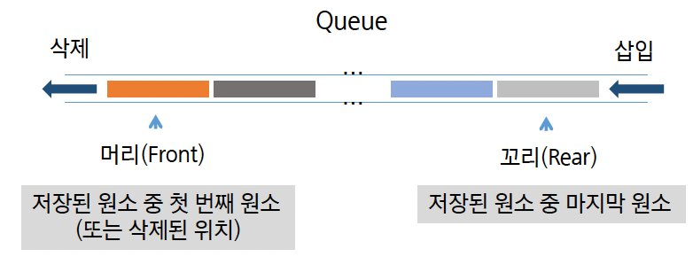
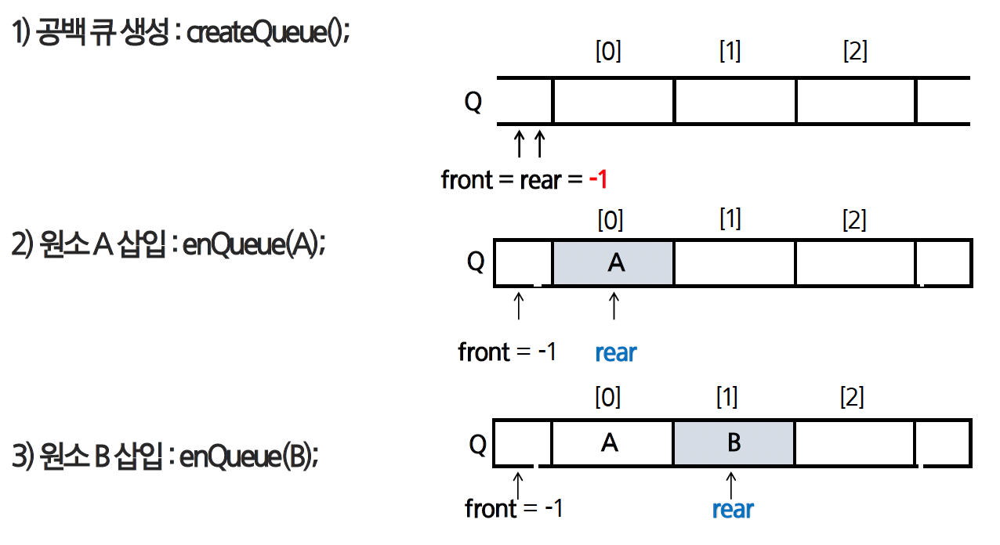
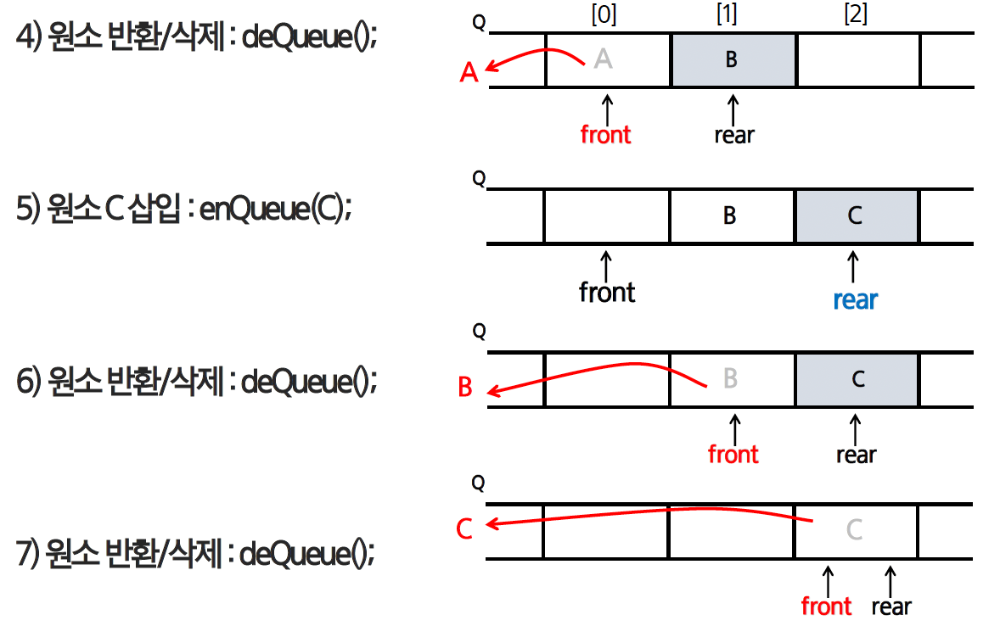

# 큐(Linear Queue, 선형 큐)

## 1. 큐의 구조와 작동 원리

### 1.1 큐란 무엇인가

- 큐(Queue)는 데이터를 처리하는 순서가 정해져있는 자료규조로, 마치 놀이공원에 줄을 서는 것과 같음
- 가장 줄을 먼저 선 사람이 먼저 타는 것처럼, 선입선출 원리를 갖음
- 큐에서 항목을 넣는 것을 enqueue, 꺼내는 것을 dequeue

### 1.2 `front` 와 `rear` : 창구와 마지막 대기자

이를 명확히 하기 위해, 큐 내부에서는 두 개의 인덱스(혹은 포인터)인 front와 rear를 사용



1. front
    - 데이터가 나가는 ‘창구’의 위치를 가리킴
    - **큐의 맨 앞 위치**를 가리키는 인덱스
    - **삭제(dequeue) 연산**이 일어나는 위치
    - `dequeue` 가 일어나면 `front` 는 다음 데이터로 이동
2. rear
- 줄의 가장 뒤에 있는 ‘마지막 대기자’의 위치를 가리킴
- **큐의 맨 뒤 위치**를 가리키는 인덱스
- **삽입(enqueue) 연산**이 일어나는 위치
- `enqueue` 가 일어나면 `rear` 는 그 데이터를 가리키도록 이동

**정리**

- `front` 는 데이터가 나가는 곳, `rear` 는 데이터가 들어오는 곳을 관리
- 큐가 비었는지, 가득 찾는지는 이 둘의 상대적인 위치로 판단

### 1.3 큐의 주요 연산

- is_empty : 큐가 비어 있는지 확인
- is_full : 큐가 꽉 찾는지 확인 (배열 기반일 때 사용)
- enqueue : 큐의 맨 뒤(rear)) 부분에 데이터 삽입
- dequeue : 큐의 맨 앞(front) 부분에서 데이터 제거 및 반환
- peek : 큐의 맨 앞(front) 데이터를 꺼내지 않고 확인만 진행
- get_size : 큐에 들어 있는 요소 개수 확인

---

## 2. 큐 구현

<aside>
📌

실제 프로그래밍에서는 deque나 간단한 append/pop만으로도 큐처럼 사용이 가능하지만, 자료구조로서 큐의 ‘핵심 동작 원리’를 이해하고, 시간 복잡도, 효율성과 메모리 구조를 직접 체감하기 위해 클래스로 구현해보는 학습 과정이 필요

</aside>

**큐의 기본 연산 과정**





1. 공백 Queue 생성
    - 고정 배열에서 Queue의 사이즈를 지정
    - front와 rear의 값을 `-1` 로 초기화
        - 이때 파이썬에서 음수 인덱스 유의
2. 원소 A 삽입
    
    삽입 과정은 rear의 증가
    
    - front → `-1`
    - rear → `0 (+1)`
3. 원소 B 삽입
    
    삽입 과정은 rear의 증가
    
    - front → `-1`
    - rear → `1 (+1)`
4. 원소 반환/삭제
    
    삭제 과정은 front의 증가
    
    - front → `0 (+1)`
        - 이때 해당 자리에 있었던 원소 반환
    - rear → `1`
5. 원소 C 삽입
    - front → `0`
    - rear → `2 (+1)`
6. 원소 반환/삭제
    - front → `1 (+1)`
    - rear → `2`
7. 원소 반환/삭제
    - front → `2 (+1)`
    - rear → `2`
    - **front와 rear가 같아진다** → `공백 상태`

### 2.1 리스트의 append, pop 활용

파이썬의 리스트를 사용해 간단히 큐 로직을 흉내낼 수 있음

- `append(item)` : 리스트의 뒤에 item 추가 → enqueue
- `pop(0)` : 리스트의 첫 번째 원소 제거 → dequeue

<aside>
⚠️

`list.pop(0)` 의 비효율성

이 방법은 코드가 간결하지만 **매우 비효율적일 수 있음.** 리스트의 맨 앞에서 원소를 제거(`pop(0)`)하면, 그 뒤에 있던 모든 원소들을 한 칸씩 앞으로 당기는 과정이 필요. 큐가 길어질수록 이 작업은 매우 느려지므로(`O(N)`), **알고리즘 문제 풀이에서는 `collections.deque` 를 사용하는 것이 좋음**

</aside>

### 2.3 클래스를 활용한 큐 구현

```python
class Queue:
		def __init__(self, capacity=10):
				self.capacity = capacity
				self.items = [None] * self.capacity
				
			  self.front = -1
			  self.rear = -1
			  
	  def is_empty(self):
			  return self.front == self.rear
			  
		def is_full(self):
				return self.rear == self.capacity - 1
				
		def enqueue(self, item):
				if self.is_full():
						raise IndexError("Queue is full")
						
				self.rear += 1
				self.item[self.rear] = item
				
		def dequeue(self):
				if self.is_empty():
						raise IndexError("Queue is empty")
				self.front += 1
				item = self.items[self.front]
				self.items[self.front] = None
				
				return item
				
		def peek(self):
				if self.is_empty():
						raise IndexError("Queue is empty")
				return self.items[self.front + 1]
				
		def get_size(self):
				return self.rear - self.front
```

**큐의 상태 표현**

- 초기 상태 → `front == rear == -1`
- 빈 상태 → `front == rear`
- 포화 상태 → `rear == n-1`

### 2.4 선형 큐의 한계점 “False Full”

배열의 앞부분에 빈 공간이 생겨도 재활용할 수 없음

ex) `Queue(4)` 를 생성하고 아래와 같이 동작 시키면,

1. `enqueue(10)`, `enqueue(20)`, `enqueue(30)`, `enqueue(40)` 실행
    - `rear`는 3이 되고, `is_full()`은 `True`가 됨. 큐는 가득 참.
    - `items` 상태: `[10, 20, 30, 40]`
    - `front = -1`, `rear = 3`
2. `dequeue()`, `dequeue()` 실행
    - 데이터 2개를 꺼내면, `front`는 1이 됨.
    - `items` 상태: `[None, None, 30, 40]`
    - `front = 1`, `rear = 3`
3. **문제 발생**
    - 현재 큐에는 `30`, `40` 두 개의 데이터만 들어있고, 앞의 두 칸은 비어있다.
    - 하지만 `is_full()` 메서드는 여전히 `rear`가 `3`이므로 `True`를 반환.
    - 따라서 `enqueue(50)`을 실행하면 **실제로는 공간이 비어있음에도 불구하고 "Queue is full" 예외가 발생**. 포화 상태의 잘못된 인식 → `rear = n - 1`

- 해결법
    - 1차원 배열을 사용하되, 논리적으로는 배열의 처음과 끝이 연결되어 원형 형태의 큐를 이룬다고 가정하고 사용
    - `front` 뒤의 빈 자리를 재활용할 수 있는 원형 큐(Circular Queue)를 구현

---

## 3. 원형 큐 (Circular Queue)

### 3.1 원형 큐란?

**원형 큐**는 일반적인 선형 큐(Linear Queue)의 단점을 보완, 한정된 메모리 공간을 재활용하는 매우 효율적인 큐 자료구조임. 배열의 처음과 끝이 논리적으로 연결되어 있다고 가정하여, 마치 **’원’처럼 공간을 순환하며 사용하는 것**이 핵심

### 3.2 원형 큐의 구조와 동작 원리

원형 큐는 선형 큐의 ‘가짜 포화상태’ 문제를 해결하기 위해 **배열의 처음과 끝이 연결된 원형**으로 간주함. 

 ****이러한 ‘순환’ 동작은 **모듈러 연산(`%`)을 통해 구현할 수 있음**. 포인터를 한 칸 이동 시킬 때 마다 `(rear + 1) % 배열의 전체 크기` 와 같이 계산하면, 포인터가 배열의 끝에 도달했을 때 자연스럽게 0으로 돌아가 앞쪽의 빈 공간을 재활용할 수 있음.

- rear가 배열의 끝에 도달한 뒤, 다시 `0` 인덱스로 연결
- 큐가 비었는지, 가득 찼는지를 판별하기 위해 `(rear+1) % capacity == front` 같은 로직 활용

### 3.3 공백 상태와 포화 상태 구분하기

원형 큐에서는 포인터가 순환하다 보면, 큐가 완전히 비어있는 상태와 가득 찬 상태 모두 `front` 와 `rear` 포인터가 같은 위치를 가리키게 되어 구분이 모호해지는 문제가 발생할 수 있음.

이를 해결하기 위한 가장 널리 사용되는 방법은, 큐에 **항상 최소 한 칸을 의도적으로 비워두는 것**임. 즉, `N` 개의 데이터를 저장하고 싶다면, 실제 배열의 크기는 `N+1` 로 만드는 것.

이렇게 하면 두 상태를 명확하게 구분할 수 있음.

- **공백 상태 (Empty)** : `front` 와 `rear` 포인터가 같은 위치를 가리킬 때
- **포화 상태 (Full)** : `rear` 포인터의 바로 다음 위치가 `front` 일 때, 즉 `(rear + 1) % capacity == front` 일 때

### 3.4 원형 큐 구현

- 1차원 배열을 사용하되, 논리적으로는 배열의 처음과 끝이 연결되어 원형 형태의 큐를 이룬다고 가정하고 사용
    
    ```python
    class CircularQueue:
    		def __init__(self, capacity):
    				self.capacity = capaciry + 1
    				self.items = [None] * self.capacity
    				
    				self.front = 0
    				self.rear = 0
    				
    		def is_empty(self):
    				return self.front == self.rear
    				
    		def is_full(self):
    				return (self.rear + 1) % self.capacity == self.front
    				
    		def enqueue(self, item):
    				if self.is_full():
    						raise IndexError("Queue is full")
    				
    				self.rear = (self.rear + 1) % self.capacity
    				self.items[self.rear] = item
    				
    		def dequeue(self):
    				if self.is_empty():
    						raise IndexError("Queue is empty")
    						
    				self.front = (self.front + 1) % self.capacity
    				item = self.items[self.front]
    				self.items[self.front] = None
    				
    				return item
    				
    		def peek(self):
    				if self.is_empty():
    						raise IndexError("Queue is empty")
    						
    				return self.items[(self.front + 1) % self.capacity]
    				
    		def get_size(self):
    				return (self.rear - self.front + self.capacity) % self.capacity
    ```
    

### 3.5 원형 큐의 장점

- **공간 효율성**: 배열의 모든 공간을 재활용하여 낭비가 없음
- **빠른 속도**: `enqueue`와 `dequeue` 연산 모두 포인터 이동만으로 이루어지므로, 큐의 크기와 상관없이 항상 빠른 속도(`$O(1)$`)를 보장.

### 3.6 원형 큐 활용처

1. 알고리즘 문제 풀이 (코딩 테스트)
    
    **너비 우선 탐색(BFS)의 핵심 도구**
    
    원형 큐를 배우는 가장 큰 이유 중 하나는 **너비 우선 탐색(BFS)** 때문. BFS는 미로 찾기, 최단 경로 문제 등에서 시작점으로부터 가까운 곳부터 차례대로 탐색하는 알고리즘.
    
    - **동작 방식**: BFS는 '다음에 탐색할 곳'들을 큐에 넣어두고, 가장 먼저 들어온 순서(FIFO)대로 꺼내서 탐색을 진행함.
    - **왜 큐인가?**: 큐의 선입선출(FIFO) 특징이 "가까운 곳 먼저" 탐색하는 BFS의 동작 원리를 완벽하게 구현해주기 때문.
    - **왜 원형 큐(deque)인가?**: BFS 탐색 중에는 큐에 수많은 정점(위치) 정보가 들어왔다 나가기를 반복. 이때 `list.pop(0)`을 사용하면 매우 비효율적이므로, `O(1)` 속도를 보장하는 원형 큐 구조(파이썬에서는 `deque`)가 필수적임.
        - BFS 문제를 만났을 때, deque를 이용한 큐 구현은 거의 공식처럼 사용된다.
2. 실제 컴퓨터 시스템 (현실 세계)
    
    **'버퍼(Buffer)'의 구현: 데이터 흐름 제어**
    
    원형 큐는 크기가 한정된 메모리 공간을 재활용해야 하는 **버퍼(Buffer)** 를 구현하는 데 가장 이상적인 자료구조입니다. 버퍼는 데이터를 생산하는 속도와 소비하는 속도의 차이를 완충해주는 임시 저장 공간입니다.
    
    - **유튜브 영상 스트리밍**
        - **생산자(Producer)**: 인터넷에서 동영상 데이터를 빠르게 다운로드하여 버퍼(원형 큐)에 채워 넣습니다. (Enqueue)
        - **소비자(Consumer)**: 플레이어가 버퍼에서 데이터를 순서대로 꺼내 화면에 재생합니다. (Dequeue)
        - 원형 큐 덕분에, 인터넷이 잠시 느려져도 이미 버퍼에 저장된 내용을 재생할 수 있어 영상이 끊기지 않습니다.
    - **프린터 인쇄 대기열 (Printer Spooler)**
        - 여러 문서를 인쇄 요청하면, 인쇄 작업들이 큐에 순서대로 쌓입니다. 프린터는 큐의 맨 앞에서부터 작업을 하나씩 꺼내어 인쇄합니다.
    - **운영체제(OS)의 작업 스케줄링**
        - CPU는 한 번에 하나의 작업만 처리할 수 있습니다. 운영체제는 실행해야 할 여러 프로세스를 '준비 큐(Ready Queue)'에 넣어두고, 순서대로 CPU에 할당하여 멀티태스킹이 가능하게 합니다.

### 3.7 원형 큐 학습 이유

> 실제 코딩 테스트나 개발 환경에서 `deque`와 같이 고도로 최적화된 도구가 있는데 굳이 원형 큐를 직접 클래스로 구현할 일은 거의 없음.
> 
1. 자료구조의 '동작 원리'와 '효율성'에 대한 이해
    - 단순히 `list`로 큐를 만들 때 왜 `pop(0)`이 비효율적인지, 그리고 선형 큐에는 왜 "False Full" 문제가 발생하는지 직접 부딪혀봐야 그 한계를 명확히 알 수 있다.
    - 원형 큐를 직접 구현해보면, `front`와 `rear` 포인터를 `%` 연산으로 순환시키는 아이디어를 통해 **"어떻게 한정된 메모리 공간을 재활용하여 `O(1)`의 빠른 속도를 만들어내는지"** 그 핵심 원리를 체득할 수 있음.

---

## **4. 마무리**

큐는 **FIFO** 구조로, 데이터를 순차적으로 처리해야 하는 상황에서 사용

- 리스트 `append`, `pop(0)`를 간단히 활용할 수 있지만 비효율이 있을 수 있음
- 클래스를 통해 **front, rear** 인덱스를 관리하면, 보다 직관적인 큐 동작 구현 가능
- 원형 큐는 선형 큐의 공간 낭비 문제를 해결하기 위한 방법
- 일반적인 사용에서는 파이썬의 `collections.deque`가 편리하지만, 
자료구조 학습 목적으로 직접 구현하여 원리를 이해할 수 있음

BFS 등 **너비 우선 탐색**과 같은 알고리즘에서도 큐가 자주 등장

이후 알고리즘에서 큐를 자주 마주치게 되므로, 기본 구현 원리를 제대로 익혀두는 편이 좋음


---


## **1. Deque (Double-Ended Queue)**

> 양쪽이 뚫린 컨베이어 벨트 ↔️


**Deque(데크)**는 이름 그대로  **양쪽 끝(Double-Ended)**에서 데이터를 넣고 뺄 수 있는 큐(Queue).

마치 **양방향으로 작동하는 컨베이어 벨트**처럼, 앞쪽 끝과 뒤쪽 끝 모두에서 데이터를 추가하거나 제거할 수 있다. 이 유연함 덕분에 Deque는 큐(Queue)와 스택(Stack)의 특징을 모두 가짐.

- **정식 명칭**: Double-Ended Queue
- **핵심 특징**: 양방향 입출력(삽입/삭제) 가능
- **파이썬 구현**: `from collections import deque`

---

## **2. `list`와의 결정적 차이: 성능**

> "파이썬 리스트도 pop(0)와 insert(0)로 앞쪽 데이터를 처리할 수 있는데, 왜 굳이 deque를 사용할까?"
> 

데이터의 맨 앞에서 추가/삭제가 빈번하게 일어나는 작업에서는 `deque`가 리스트보다 **압도적으로 효율적이다**.

- **`list`의 한계 (`$O(n)$`)**
    - 리스트는 맨 앞의 데이터를 제거하거나 추가하면, **뒤따르는 모든 데이터의 위치를 한 칸씩 옮겨야 함.** 때문에 데이터가 많아질수록 이 작업은 매우 느려짐.
- **`deque`의 장점 (`$O(1)$`)**
    - `deque`는 내부적으로 양 끝의 위치 정보(포인터)를 가지고 있어, 데이터를 옮기지 않고 **포인터만 이동**시킴. 데이터의 양과 상관없이 항상 빠른 속도를 보장.

---

## **3. Deque 주요 연산**

| 연산 | 설명 | 시간 복잡도 |
| --- | --- | --- |
| **`append(x)`** | 오른쪽 끝에 `x`를 추가 | $O(1)$ |
| **`appendleft(x)`** | 왼쪽 끝에 `x`를 추가 | $O(1)$ |
| **`pop()`** | 오른쪽 끝 요소를 제거하고 반환 | $O(1)$ |
| **`popleft()`** | 왼쪽 끝 요소를 제거하고 반환 | $O(1)$ |

---

## 4. 특별한 기능 : `rotate()`

`deque` 는 전체 요소를 효율적으로 회전시키는 `rotate()` 메서드를 제공함.

- `deque.rotate(n)`
    - `n` 이 양수이면, 오른쪽 끝의 `n` 개 요소가 왼쪽 끝으로 이동함 (오른쪽으로 n칸 만큼 회전)
    - `n` 이 음수이면, 왼쪽 끝의 `n` 개 요소가 오른쪽 끝으로 이동 (왼쪽으로 n칸 만큼 회전)

### **4.1 rotate 활용**

```python
from collections import deque

dq = deque([1, 2, 3, 4, 5])

# 오른쪽으로 2칸 회전
dq.rotate(2)
print(dq)  # deque([4, 5, 1, 2, 3])

# 왼쪽으로 1칸 회전
dq.rotate(-1)
print(dq)  # deque([5, 1, 2, 3, 4])
```

- `rotate`를 사용하면 여러 번 `pop`과 `append`를 반복해야 하는 작업을 단 한 번에 처리할 수 있음.

**만약 이 로직을 rotate 없이 구현하려면…?**

- 수동으로 반복문을 통해 `popleft()` → `append()`를 (K - 1)번 반복
    
    ```python
    dq2 = deque([1, 2, 3, 4, 5])
    
    for _ in range(K):
        dq2.append(dq2.popleft())
        
    print(dq2)  # deque([4, 5, 1, 2, 3])
    ```
    
    - 같은 결과지만, **rotate**는 이 과정을 한 번에 처리할 수 있음

---

## **5. 그래서 언제 사용할까?**

- **큐(Queue) 구현**
    - `append()`와 `popleft()`를 사용하면 완벽한 FIFO 큐가 됨. (BFS 알고리즘의 표준)
- **스택(Stack) 구현**
    - `append()`와 `pop()`만 사용하면 LIFO 스택과 동일하게 동작.
- **슬라이딩 윈도우**
    - 일정 크기의 범위를 유지하며 데이터를 순회할 때, 한쪽 끝에서 빼고 다른 쪽 끝에서 넣는 작업에 최적화되어 있음.
- **Undo/Redo 기능**
    - 사용자의 작업 내역을 저장하고 앞/뒤로 탐색하는 기능을 구현할 때 유용함.

---

## [참고] deque vs. front&rear 성능 비교

**`collections.deque`가 훨씬 빠릅니다.**

두 방식의 시간 복잡도는 이론적으로 $O(1)$로 동일하지만, 실제 실행 속도에서는 큰 차이가 발생한다.

| 구분 | **`collections.deque`** | **`front`, `rear` 직접 구현** |
| --- | --- | --- |
| **핵심 구현** | C언어로 구현된 이중 연결 리스트 | 파이썬 `list`와 정수 변수 |
| **시간 복잡도** | 양쪽 끝 삽입/삭제 모두 **$O(1)$** | 양쪽 끝 삽입/삭제 모두 **$O(1)$** |
| **실제 속도** | **매우 빠름 (C 레벨 실행)** | **상대적으로 느림 (파이썬 레벨 실행)** |
| **안정성** | 내장 타입으로 안정적이고 검증됨 | 직접 구현 시 논리적 오류 발생 가능 |

**왜 `deque`가 더 빠를까?**

가장 결정적인 차이는 **구현의 레벨**

- **`collections.deque`**: 내부 핵심 동작이 C언어로 작성되어 있어, 파이썬 인터프리터를 거치지 않고 **컴파일된 기계어 수준**에서 매우 빠르게 실행.
- **`front`, `rear` 직접 구현**: 큐의 삽입/삭제 로직(인덱스 계산, 값 할당 등)이 모두 **파이썬 인터프리터**를 통해 한 단계씩 해석되고 실행. 이 과정에서 발생하는 오버헤드 때문에 C로 구현된 `deque`보다 본질적으로 느릴 수밖에 없음.

따라서 큐 자료구조가 필요할 때는 직접 `front`, `rear` 방식을 구현하는 것보다 **항상 내장 타입인 `collections.deque`를 사용하는 것이 성능과 안정성 모든 면에서 월등히 좋다.**
