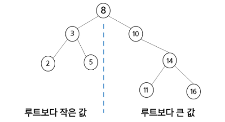
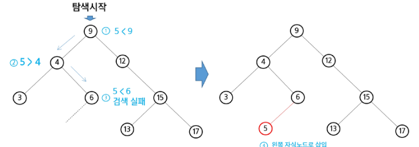
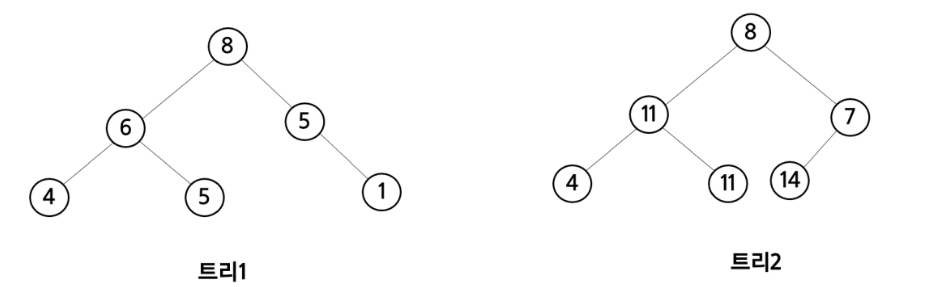
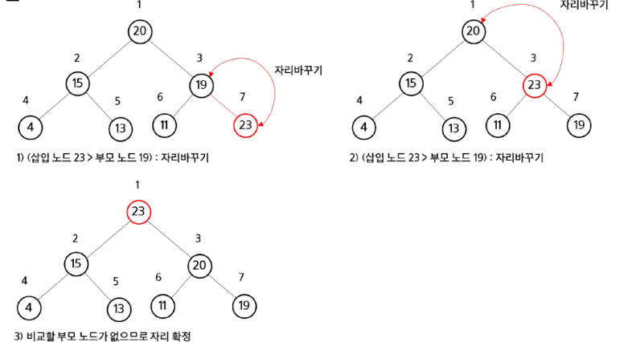
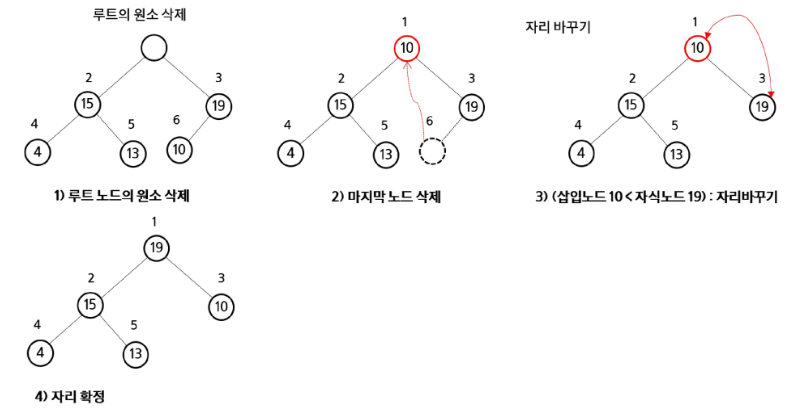
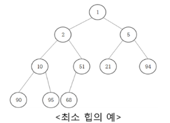

# 이진 탐색 트리(BST, Binary Search Tree)

- Data 들을 빠르게 검색할 수 있도록 체계적으로 저장을 해 두고, 최대 O(log n)의 빠른 속도로 값을 검색할 수 있는 자료구조
- 빠르게 **검색**될 수 있도록, 특정 규칙을 갖는 이진트리 형태로 값을 저장

### 리스트 vs BST

- BST는 리스트보다 더 빠른 삽입/ 삭제/ 탐색이 가능하다
- 리스트 성능
    - 삽입 : O(n), 단 맨 끝 삽입은 O(1)
    - 삭제 : O(n), 단 맨 끝 삭제는 O(1)
    - 탐색 : O(n)
- BST 성능
    - 삽입 : 평균 O(logN)
    - 삭제 : 평균 O(logN)
    - 탐색 : 평균 O(logN)

### 이진 탐색 트리

- 탐색 작업을 효율적으로 하기 위한 자료구조
- 모든 원소는 서로 다른 유일한 키를 갖는다
- key(왼쪽 서브트리) < key(루트 노드) < key(오른쪽 서브트리)
- 왼쪽 서브트리와 오른쪽 서브트리도 이진 탐색 트리
- 중위 순회하면 오른차순으로 정렬된 값을 얻을 수 있음



### 탐색 연산

- 루트에서 시작한다
- 탐색할 키 값 x를 루트 노드의 키 값과 비교한다
    - (키 값 x = 루트노드의 키 값)인 경우 : 원하는 원소를 찾았으므로 탐색연산 성공
    - (키 값 x < 루트노드의 키 값)인 경우 : 루트노드의 왼쪽 서브트리에 대해서 탐색연산 수행
    - (키 값 x > 루트노드의 키 값)인 경우 : 루트노드의 오른쪽 서브트리에 대해서 탐색연산 수행
- 서브트리에 대해서 순환적으로 탐색 연산을 반복한다

### 삽입연산

- 먼저 탐색 연산을 수행
    - 삽입할 원소와 같은 원소가 트리에 있으면 삽입할 수 없으므로, 같은 원소가 트리에 있는지 탐색하여 확인한다
    - 탐색에서 탐색 실패가 결정되는 위치가 삽입 위치가 된다
- 탐색 실패한 위치에 원소를 삽입
    - ex) 5를 삽입하는 예시
        
        
        

### 이진 탐색 트리의 성능

- 탐색(searching), 삽입(insertion), 삭제(deletion) 시간은 트리의 높이만큼 시간이 걸린다
    - O(h), h : BST의 깊이 (height)\
- 평균의 경우
    - 이진 트리가 균형적으로 생성되어 있는 경우
    - O(log n)
- 최악의 경우
    - 한쪽으로 치우친 경사 이진트리의 경우
    - O(n)
    - 순차탐색과 시간 복잡도가 같다

- 검색 알고리즘의 비교
    - 배열에서의 순차 검색: O(N)
    - 정렬된 배열에서의 순차 검색: O(N)
    - 정렬된 배열에서의 이진탐색: O(logN)
        - 고정 배열 크기와 삽입, 삭제 시 추가 연산 필요
    - 이진 탐색트리에서의 평균: O(logN)
        - 최악의 경우 : O(N)
        - 완전 이진 트리 또는 균형 트리로 바꿀 수 있다면 최악의 경우를 없앨 수 있다
            - 새로운 원소를 삽입할 때 삽입 시간을 줄인다
            - 평균과 최악의 시간이 같다. O(logN)
            

### 삭제 연산

# 힙 (heap)

- 완전 이진 트리에 있는 노드 중에서 키 값이 가장 큰 노드나 키값이 가장 작은 노드를 찾기 위해서 만든 자료 구조
- 최대 힙 (max heap)
    - 키값이 가장 큰 노드를 찾기 위한 완전 이진 트리
    - {부모노드의 키값 > 자식노드의 키값}
    - 루트 노드 : 키값이 가장 큰 노드
- 최소 힙 (min heap)
    - 키값이 가장 작은 노드를 찾기 위한 완전 이진 트리
    - {부모노드의 키값 < 자식노드의 키값}
    - 루트 노드 : 키값이 가장 작은 노드
- 힙이 아닌 이진 트리의 예
    
    
    
- **힙 연산**
    - 삽입
        - 최대 힙 삽입코드
        
        ```python
        def enq(n):
        		global last
        		last += 1
        		heap[last] = n
        		
        		c = last
        		p = c//2
        		while p and heap[p] < heap[c]:
        				heap[p], hean[c] = heap[c], heap[p]
        				c = p
        				p = c//2
        ```
        
        - 예시
        
        
        
    - 삭제
        - 힙에서는 루트 노드의 원소만을 삭제할 수 있다
        - 루트 노드의 원소를 삭제하여 반환
        - 힙의 총류에 따라 최대값 또는 최소값을 구할 수 있음
        - 최대 힙 삭제 코드
        
        ```python
        def deq(n):
        		global last
        		tmp = heap[1]
        		heap[1] = heap[last]
        		last -= 1
        		p = 1
        		c = p * 2
        		while c <= last:
        			  if c+1 <= last and heap[c] < hean[c+1]:
        				    c += 1
        				if heap[p] < heap[c]:
        						heap[p], heap[c] = heap[c], heap[p]
        						p = c
        						c = p * 2
        				else:
        						break
        		return tmp
        ```
        
        - 예시
        
        
        

### 힙을 이용한 우선순위 큐

- 완전 이진 트리로 구현된 자료구조로서, 키 값이 가장 큰 노드나 가장 작은 노드를 찾기에 적합한 자료구조
    - 삽입은 맨 뒤에서,, 삭제는 맨 위에서,, 이때 ‘힙’이기 때문에 맨 위의 값은 우선순위 1순위가 위치에 있음
- 아래 예시는 Min heap, 가장 작은 키 값을 가진 노드가 항상 루트에 위치
