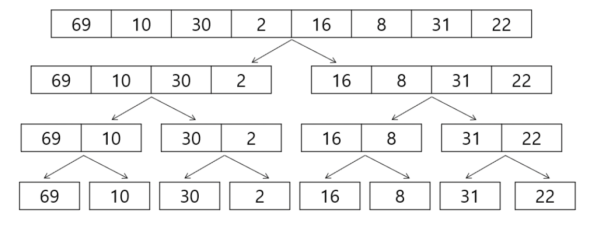
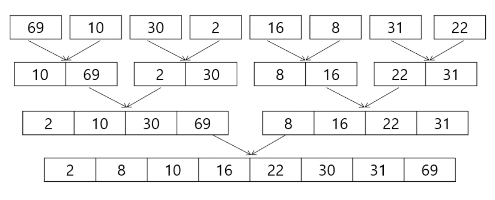

# **분할 정복 (Divide and Conquer)**

문제를 작은 하위 문제로 나누고(분할) 각각을 해결(정복)한 뒤, 그 결과를 결합(통합)하여 원래 문제를 해결하는 알고리즘 기법

### **분할 정복의 3단계 과정**

분할 정복은 일반적으로 아래 세 가지 단계를 `재귀`적으로 따름.

**1단계: 분할 (Divide)**

해결하려는 원래 문제를, **더 이상 나눌 수 없을 때까지** 의미 있는 여러 개의 작은 하위 문제로 나눈다.

- **(예시)** 1000장의 시험지를 정렬해야 할 때, 먼저 500장씩 두 묶음으로 나눈다.

**2단계: 정복 (Conquer)**

나누어진 각 하위 문제를 해결한다. 만약 하위 문제가 여전히 크다면, 이 문제가 아주 작아져 **곧바로 해결 가능한 수준**이 될 때까지 다시 1단계 분할부터 재귀적으로 반복한다.

- **(예시)** 500장 묶음을 계속 나누다 보면, 결국 시험지가 **'한 장'**만 남게 됨. 시험지 한 장은 그 자체로 이미 정렬된 상태이므로, '정복'이 완료된 것. (이것이 재귀의 **기저 조건(Base Case)**이 됨.)

**3단계: 통합 (Combine)**

해결된 하위 문제들의 답을 **다시 하나로 합쳐** 원래 문제의 답을 구함.

- **(예시)** 정렬된 시험지 한 장짜리 묶음들을, 두 묶음씩 정렬하며 합침(병합). 
이 과정을 계속 반복하면, 최종적으로 1000장의 시험지 전체가 정렬됨.

### **분할 정복의 대표 알고리즘**

이러한 분할 정복 철학을 따르는 대표적인 알고리즘은 다음과 같습니다.

- **병합 정렬 (Merge Sort):** 데이터를 절반으로 계속 나누고, 정렬된 작은 부분들을 다시 합쳐 전체를 정렬합니다. (분할 정복의 가장 교과서적인 예시)
- **퀵 정렬 (Quick Sort):** 특정 '기준(pivot)'을 정해, 그보다 작은 값과 큰 값으로 리스트를 나눈 뒤, 각 부분을 재귀적으로 정렬합니다.
- **이진 탐색 (Binary Search):** 정렬된 배열의 '중간'을 확인하여, 탐색 범위를 절반씩 줄여나갑니다. (통합 과정이 없는 특수한 형태)

---

# 병합 정렬(Merge Sort)

**병합 정렬이란 무엇일까?**

> `병합 정렬(Merge Sort)`은 **'분할 정복(Divide and Conquer)'** 기법을 사용하는 대표적인 정렬 알고리즘이다.
> 

### **개념: 도서관 사서의 책 정리 방법**

수천 권의 책을 정리해야 하는 도서관 사서를 상상해 봅시다. 혼자 모든 책을 한 번에 정렬하는 것은 매우 비효율적입니다.

1. 사서는 먼저 책 더미를 **절반으로 나눔 (Divide).**
2. 나눠진 각 더미를 또 절반으로 나누는 과정을 **책이 한 권만 남을 때까지** 반복. (책 한 권은 그 자체로 이미 '정렬된' 상태.)
3. 이제, 정렬된 한 권짜리 더미 두 개를 가져와 **순서대로 합쳐** 정렬된 두 권짜리 더미를 만듬 **(Merge).**
4. 이 **'정렬하며 합치기'** 과정을 계속 반복하면, 최종적으로 수천 권의 책 전체가 완벽하게 정렬됨.

병합 정렬은 바로 이 원리를 사용함. 일단 잘게 쪼갠 뒤, 작은 단위부터 정렬하여 합쳐나가는 안정적이고 강력한 정렬 방식.

**동작 과정 (Step-by-Step)**

**1단계: 분할 (Divide)**

- 배열의 길이가 1이 될 때까지 계속해서 절반으로 나눔.
    
    ```
    [69, 10, 30, 2, 16, 8, 31, 22]
    
    [69, 10, 30, 2]  |  [16, 8, 31, 22]
    
    [69, 10] | [30, 2]  |  [16, 8] | [31, 22]
    
    [69] | [10] | [30] | [2]  |  [16] | [8] | [31] | [22]
    ```
    
    
    

**2단계: 정복 및 병합 (Conquer & Merge)**

- 길이가 1인 배열들은 이미 정렬된 상태임. 이제 이들을 **정렬하면서 다시 합쳐(병합) 올라온다.**
    
    ```
    [10, 69] | [2, 30]  |  [8, 16] | [22, 31]
    
    [2, 10, 30, 69]  |  [8, 16, 22, 31]
    
    [2, 8, 10, 16, 22, 30, 31, 69]  **<-- 최종 정렬 완료**
    ```
    
    
    

**코드 구현 및 해설**

병합 정렬은 보통 두 개의 함수로 역할을 나누어 구현한다.

- **`merge_sort(arr)`:** 분할과 재귀 호출을 담당하는 **'매니저'** 함수
- **`merge(left, right)`:** 정렬된 두 배열을 합치는 **'실무자'** 함수

```python
def merge(left_arr, right_arr):
		'''
		이미 정렬된 left와 right를 
		하나의 정렬된 배열로 '병합'하는 함수
		'''
		merged_arr = []
		left_idx, right_idx = 0, 0
		
		# 두 배열 중 하나라도 원소가 남아있는 동안 반복
		while left_idx < len(left_arr) and right_idx < len(right_arr):
				if left_arr[left_idx] <= right_arr[right_idx]:
						merged_arr.append(left_arr[left_idx])
						left_idx += 1
						
				else:
						merged_arr.append(right_arr[right_idx])
						right_idx += 1
						
						
		# 루프가 끝난 후, 아직 남아있는 원소들을 뒤에 그대로 붙여줌
		# 한쪽 배열은 이미 모두 소진되었으므로 하나만 실행되게 될것
		merged_arr.extend(left_arr[left_idx:])
		merged_arr.extend(right_arr[right_idx:])
		
		return merged_arr
		
		
def merge_sort(arr):
		if len(arr) <= 1:
				return arr
		
		# 1. 분할
		mid = len(arr) // 2
		left_half = arr[:mid]
		right_half = arr[mid:]
		
		# 2. 정복
		left_sorted = merge_sort(left_half)
		right_sorted = merge_sort(right_half)
		
		# 3. 통합
		return merge(left_sorted, right_sorted)
```

**병합 정렬의 특징**

- **시간 복잡도**: **`$O(NlogN)$`**
    - 데이터를 계속 절반으로 나누는 과정이 `$O(logN)$` 만큼 걸리고, 각 단계에서 모든 데이터를 한 번씩 비교하며 병합하므로 `$O(N)$`이 걸린다.
- **공간 복잡도**: **`$O(N)$`**
    - 병합 과정에서 정렬된 결과를 담을 추가적인 배열이 필요하다.
- **안정 정렬 (Stable Sort)**
    - 값이 같은 원소들의 상대적인 순서가 정렬 후에도 유지됨.

---

# 퀵 정렬 (Quick Sort)

## **퀵 정렬이란 무엇일까?**

> `퀵 정렬(Quick Sort)`은 **'분할 정복'** 기법을 사용하는 매우 빠른 정렬 알고리즘이다. 
이름처럼, 평균적으로 가장 빠른 성능을 자랑한다.
> 

### **개념: 반장 뽑아 줄 세우기**

작동 방식은 마치 **'반장(기준)'**을 한 명 뽑아 줄을 세우는 것과 같음.

1. 아무나 한 명을 **'반장(피벗, Pivot)'**으로 임명함.
2. 나머지 학생들에게 **"반장보다 키가 작으면 왼쪽, 크면 오른쪽으로 서!"**라고 지시하여 두 그룹으로 나눈다 **(분할, Partition)**.
3. 이제 반장은 자기 키에 맞는 올바른 위치에 서게 됨.
4. 왼쪽 그룹과 오른쪽 그룹에서 각각 **새로운 반장을 뽑아** 이 과정을 되풀이함 **(재귀, Recursion)**.

모든 그룹의 인원이 한 명이 되면, 전체 줄이 완벽하게 키 순서대로 정렬됨.

**Lomuto 파티션의 동작 원리**

Lomuto 파티션은 **하나의 포인터(`j`)가 전체 배열을 순회**하며 피벗보다 작은 값들을 왼쪽으로 모으는 직관적인 방식.

1. **피벗 선택:** 보통 배열의 **마지막 원소**를 피벗으로 설정함.
2. **경계 포인터 설정:** 피벗보다 작은 값들의 경계를 나타낼 `i` 포인터를 `start - 1` 위치에 둠.
3. **탐색 포인터 이동:** 
    - `j` 포인터가 `start`부터 `end - 1`(피벗 직전)까지 이동하며 다음을 반복.
    - 만약 `arr[j]`의 값이 **피벗보다 작다면**, `i`를 1 증가시킨 후 `arr[i]`와 `arr[j]`를 교환(swap)한다. 이 과정을 통해 `i`의 왼쪽에는 항상 피벗보다 작은 값들만 모이게 됩.
4. **피벗 교환:** 
    - 반복이 모두 끝나면, `i + 1` 위치가 피벗이 들어갈 최종 자리.
    - `arr[i + 1]`과 피벗(`arr[end]`)을 교환함.

**코드 구현 및 해설 (Lomuto 파티션)**

퀵 정렬은 재귀 호출을 관리하는 `quick_sort` 함수와, 실제 분할을 담당하는 `partition` 함수로 나누어 구현한다.

```python
def partition(arr, start, end):
		'''
		분할(partition)을 담당하는 실무자 함수
		- 가장 오른쪽 원소(arr[end])를 피벗으로 설정
		- 피벗보다 작은 값들을 왼쪽으로, 큰 값들을 오른쪽으로 재배치
		- 최종적으로 피벗이 있어야할 위치의 인덱스 반환
		'''
		pivot = arr[end]
		i = start - 1
		
		for j in range(start, end):
				if arr[j] < pivot:
						# 피벗보다 작은 값에 경계선을 하나 늘려주고
						i += 1
						# 값 교환!
						# 계속 작은값이면 제자리 교환이지만 
						# 큰값이 있다가 작은 값을 만나게 되면 작은 값을 왼쪽으로 보내는 원리가 됨
						arr[i], arr[j] = arr[j], arr[i]
		
		# 모든 순회가 끝나면, i+1 위치(경계 다음이니까 피벗보다 큼)가 피벗이 들어갈 위치이므로 
		# 피벗과 경계 다음 위치의 값과 교환
		# 원본 배열을 정렬하는 in place 방식이라서 반환이 없어도 원본이 정렬됨
		arr[i + 1], arr[end] = arr[end], arr[i + 1]
		return i + 1
		
		
def quick_sort(arr, start, end):
		'''
		퀵 정렬을 재귀적으로 지시하는 '매니저' 함수
		'''
		if start < end:
				pivot_idx = partition(arr, start, end)
				quick_sort(arr, start, pivot_idx - 1)
				quick_sort(arr, pivot_idx + 1, end)
```

**호어(Hoare) 파티션의 동작 원리**

1. **피벗 선택:** 보통 배열의 **첫 번째 원소**를 피벗으로 설정함.
2. **포인터 설정:** `left` 포인터는 배열의 시작에서, `right` 포인터는 배열의 끝에서 출발함.
3. **포인터 이동:**
    - `left`는 피벗보다 **크거나 같은 값**을 만날 때까지 오른쪽으로 이동.
    - `right`는 피벗보다 **작거나 같은 값**을 만날 때까지 왼쪽으로 이동.
4. **교환 (Swap):**
    - 만약 `left`와 `right` 포인터가 아직 교차하지 않았다면(`left < right`), `arr[left]`와 `arr[right]`의 값을 교환함.
    - 교차했다면(`left >= right`) 반복을 중단함.
5. **피벗 교환:** 반복이 중단되면, **피벗(시작점)과 `arr[right]`의 값을 교환**합니다. 이 `right` 인덱스가 이번 분할의 기준점이 됩니다.

**Hoare 파티션 코드 구현**

```python
def partition_hoare(arr, start, end):
		'''
		Hoare 파티션 방식
		- arr[start]를 피벗으로 사용
		- left, right 포인터가 교차할 때까지 값을 교환
		'''
		pivot = arr[start]
		left = start + 1
		right = end
		
		while True:
				# left 포인터 이동: 피벗보다 큰 값을 찾을 때 까지
				while left <= end and arr[left] < pivot:
						left += 1
				
				# right 포인터 이동: 피벗보다 작은 값을 찾을 때 까(단 left가 본 값들은 볼 필요가 없음)
				while left <= right and arr[right] > pivot:
						right -= 1
				
				# 포인터가 교차했다면 반복 종료
				if left > right:
						break
					
				# 교차 전이면 두 값의 위치를 교환
				arr[left], arr[right] = arr[right], arr[left]
		# 교차했다면 right포인터의 값과 시작점을 교환
		arr[start], arr[right] = arr[right], arr[start]
		
		# 피벗의 최종 위치인 right를 반환
		return right
		
		
def quick_sort_hoare(arr, start, end):
		if start < end:
				pivot_idx = partition_hoare(arr, start, end)
				
				quick_sort_hoare(arr, start, pivot_idx - 1)
				quick_sort_hoare(arr, pivot_idx + 1, end)
```

**Lomuto vs. Hoare 파티션 비교**

| 구분 | **로무토 (Lomuto)** | **호어 (Hoare)** |
| --- | --- | --- |
| **피벗 (Pivot) 위치** | 주로 **마지막 원소** | 주로 **첫 번째 원소** |
| **핵심 동작** | 하나의 포인터(`j`)가 전체를 순회하며 피벗보다 작은 값들을 왼쪽으로 보냄 | 두 개의 포인터(`left`, `right`)가 **양 끝에서 중앙으로** 이동하며 교환 |
| **피벗의 최종 위치** | 파티션 종료 시, 피벗이 **자신의 최종 위치에 고정됨** | 파티션 종료 시, 피벗이 최종 위치에 있다고 **보장할 수 없음** |
| **재귀 호출 범위** | 피벗을 제외한 `[start, pivot-1]`, `[pivot+1, end]` | 피벗이 포함될 수 있는 `[start, pivot-1]`, `[pivot+1, end]` |
| **구현 난이도** | 코드가 더 단순하고 직관적 | 포인터 두 개를 제어해야 해서 조금 더 복잡함 |
| **성능** | Hoare 방식보다 비교 및 교환 횟수가 많은 경향이 있음 | **일반적으로 더 빠르고 효율적** (교환 횟수가 적음) |

### **퀵 정렬의 특징**

- **시간 복잡도**
    - **평균: `$O(NlogN)$`**
        - 재귀의 깊이가 평균적으로 `$O(log N)$`이고, 각 깊이에서 `$O(N)$`의 비교를 수행.
    - **최악: `$O(N^2)$`**
        - 이미 정렬된 배열에서 항상 가장 크거나 작은 값을 피벗으로 선택하는 경우, 트리가 한쪽으로 치우쳐 분할이 비효율적으로 일어남.
- **공간 복잡도**: **`$O(logN)$`**
    - 재귀 호출 스택의 깊이에 따라 공간이 필요함.
- **제자리 정렬 (In-place Sort)**
    - 병합 정렬과 달리, 정렬 과정에서 추가적인 배열을 거의 사용하지 않아 메모리 면에서 효율적.

<aside>
💡

**로무토(Lomuto) vs. 호어(Hoare) 파티션**

퀵 정렬의 핵심인 `partition` 함수는 여러 구현 방식이 있으며, 가장 대표적인 것이 **로무토(Lomuto)**와 **호어(Hoare)** 방식이다.

- **로무토 파티션:** 구현이 더 직관적이고 이해하기 쉬움. 피벗을 보통 맨 끝 원소로 잡음.
- **호어 파티션:** 퀵 정렬을 처음 고안한 토니 호어가 만든 방식으로, 양쪽 끝에서부터 인덱스를 동시에 줄여나가며 교환함. 평균적으로 로무토 방식보다 교환 횟수가 적어 더 효율적이라고 알려져 있음.

어떤 파티션 방식을 쓰든 퀵 정렬의 분할 정복 원리는 동일하며, 실제 성능은 입력 데이터나 피벗 선택 방식에 따라 달라질 수 있음.

</aside>

---

# 이진 검색 (Binary Search)

### 기본 개념

### **1.1 동작 원리: `사전에서 단어 찾기`**

'이진 검색'은 **정렬된 자료**를 마치 우리가 사전에서 단어를 찾듯이 검색하는 알고리즘이다.

사전의 아무 페이지나 펼친 뒤(중간 지점), 찾으려는 단어가 그 페이지의 단어보다 앞에 있으면 앞부분만, 뒤에 있으면 뒷부분만 다시 찾아보는 것처럼, 탐색 범위를 **매번 반씩 효율적으로 줄여나간다.**

### **1.2 특징 요약**

- **정의**: 정렬된 자료에서 **중간 지점(mid)**을 기준으로 탐색 범위를 **반씩 줄여가며** 목표 값을 찾는 검색 알고리즘
- **전제 조건**: 데이터가 반드시 **정렬**되어 있어야 함.
- **시간 복잡도**: `$O(logn)$` (순차 검색의 `$O(n)$`보다 훨씬 빠름)
- **단점**: 데이터의 삽입/삭제가 잦을 경우, 정렬 상태를 유지하는 비용이 추가로 발생함.

### 1.3 이진검색 과정

1. 자료의 중앙에 있는 원소를 고른다.
2. 중앙 원소의 값과 찾고자 하는 목표 값을 비교한다.
3. 목표 값이 중앙 원소의 값보다 
작으면 자료의 왼쪽 반에 대해서 새로 검색을 수행하고, 
크다면 자료의 오른쪽 반에 대해서 새로 검색을 수행한다.
4. 찾고자 하는 값을 찾을 때까지 ①~③의 과정을 반복한다.

---

## 2. 구현 방법

### 2.1 반복문 방식

```python
def binary_search(arr, target):
    left, right = 0, len(arr) - 1

    while left <= right:
        mid = (left + right) // 2

        # 중간 값이 목표 값과 일치하는 경우
        if arr[mid] == target:
            return mid  # 검색 성공 시 인덱스 반환
        
        # 목표 값이 더 작은 경우, 왼쪽 절반을 탐색
        elif arr[mid] > target:
            right = mid - 1
        
        # 목표 값이 더 큰 경우, 오른쪽 절반을 탐색
        else:
            left = mid + 1

    return -1  # 검색 실패 시 -1 반환

# 예시
numbers = [2, 4, 7, 9, 11, 19, 23]
print(f"'11'은 인덱스 {binary_search(numbers, 11)}에 있습니다.") # '11'은 인덱스 4에 있다.
print(f"'10'의 검색 결과: {binary_search(numbers, 10)}")     # '10'의 검색 결과: -1
```

- **주요 로직**
    - `while left <= right` 루프는 탐색할 범위가 남아있는 동안 계속됨.
    - `left`가 `right`보다 커지는 순간은 탐색 범위가 교차하여 더 이상 탐색할 곳이 없다는 의미이므로, 검색 실패로 간주하고 반복을 종료.

### 2.2 재귀 방식

> 탐색 범위를 줄여나가는 과정을 함수가 자기 자신을 다시 호출하는 방식으로 구현.
> 

```python
def binary_search_recursive(arr, left, right, target):
    '''
    - arr  : 정렬된 리스트 (오름차순)
    - left : 현재 검색 범위의 시작 인덱스
    - right: 현재 검색 범위의 끝 인덱스
    - target: 찾고자 하는 값

    반환값:
    - target이 arr 안에 존재하면 해당 인덱스
    - 존재하지 않으면 -1
    '''

    # 1. 탐색 범위가 더 이상 유효하지 않으면 검색 실패
    if left > right:
        return -1

    # 2. 중앙(mid) 인덱스 계산
    mid = (left + right) // 2

    # 3. 중앙 값과 target 비교
    if arr[mid] == target:
        return mid  # 검색 성공
    elif arr[mid] > target:
        # 4. 왼쪽 절반을 대상으로 자기 자신을 다시 호출
        return binary_search_recursive(arr, left, mid - 1, target)
    else:
        # 5. 오른쪽 절반을 대상으로 자기 자신을 다시 호출
        return binary_search_recursive(arr, mid + 1, right, target)

# 예시
numbers = [2, 4, 7, 9, 11, 19, 23]
result = binary_search_recursive(numbers, 0, len(numbers) - 1, 9)
print(f"'9'는 인덱스 {result}에 있습니다.")  # '9'는 인덱스 3에 있다.

```

- **핵심 로직**
    - 검색 범위를 줄인 새로운 `left`와 `right` 값을 인자로 하여 함수 자기 자신을 호출함.
        - 더 큰 경우: **왼쪽 구간** `[left, mid - 1]`를 재귀 탐색
        - 더 작은 경우: **오른쪽 구간** `[mid + 1, right]`를 재귀 탐색
    - `left > right`가 되는 순간이 재귀 호출이 멈추는 **종료 조건(Base Case)**이 됨.

---

## 3. 언제 이진 검색을 사용할까?

- **장점:** 데이터가 **한번 정렬**되면, 이후 **매우 빠른 속도로 여러 번의 검색**을 수행해야 할 때 압도적으로 유리함.
- **단점:** 데이터가 **수시로 추가되거나 삭제**된다면, 정렬 상태를 유지하는 비용이 검색의 이점보다 더 클 수 있음.
- **참고:** 파이썬의 `bisect` 라이브러리를 사용하면, 정렬된 리스트에 데이터를 삽입할 위치를 찾는 등 이진 검색 관련 기능을 더욱 간편하게 구현할 수 있음.

## **파라메트릭 서치(Parametric Search)**

**언더 바운드(lower bound)** / **어퍼 바운드(upper bound)**

### 기본 개념

- **파라메트릭 서치**: "정답이 될 수 있는 범위"를 이진 탐색으로 줄여가며, 조건을 만족하는 최적값을 찾는 기법.
    
    → 흔히 **최소값/최대값** 문제에서 사용됨.
    
- **Lower Bound (언더 바운드)**
    - "찾고자 하는 값 이상이 처음으로 나오는 위치"
    - 즉, `arr>= target`을 처음 만족하는 인덱스
- **Upper Bound (어퍼 바운드)**
    - "찾고자 하는 값보다 큰 값이 처음으로 나오는 위치"
    - 즉, `arr> target`을 처음 만족하는 인덱스

---

### 그림으로 이해

정렬된 배열:

```
arr = [1, 2, 4, 4, 4, 7, 9]
```

- `target = 4`일 때

| 개념 | 의미 | 인덱스 | 값 |
| --- | --- | --- | --- |
| **Lower Bound** | 4 이상이 처음 나타나는 곳 | 2 | arr[2] = 4 |
| **Upper Bound** | 4 초과가 처음 나타나는 곳 | 5 | arr[5] = 7 |

---

### 코드 (파이썬 구현)

```python
def lower_bound(arr, target):
    left, right = 0, len(arr)
    while left < right:
        mid = (left + right) // 2
        if arr[mid] < target:
            left = mid + 1
        else:
            right = mid
    return left   # arr[left] >= target 인 첫 위치

def upper_bound(arr, target):
    left, right = 0, len(arr)
    while left < right:
        mid = (left + right) // 2
        if arr[mid] <= target:
            left = mid + 1
        else:
            right = mid
    return left   # arr[left] > target 인 첫 위치

```

---

### 활용

- **원소 존재 여부 확인**
    
    ```python
    lb = lower_bound(arr, target)
    ub = upper_bound(arr, target)
    if lb < ub:  # 구간이 비어있지 않다면
        print("존재함, 개수:", ub - lb)
    else:
        print("존재하지 않음")
    
    ```
    
- **조건 만족하는 최소/최대값 찾기**
    
    → 예: "길이가 X 이상인 막대를 몇 개 잘라낼 수 있는가?" → 파라메트릭 서치로 최적 길이 탐색
    

---

정리

- **Lower Bound**: `>= target`인 첫 위치
- **Upper Bound**: `> target`인 첫 위치
- **개수 구하기**: `upper_bound - lower_bound`