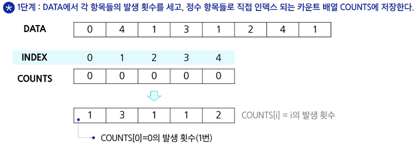
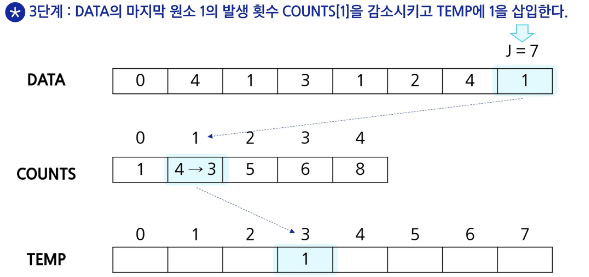
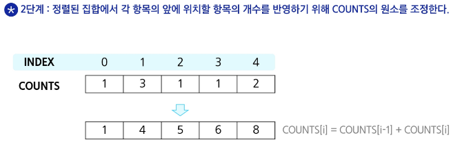

### **카운팅 정렬 (Counting Sort)**

- **정의**
카운팅 정렬은 비교 기반 정렬 알고리즘이 아니라, 
각 원소의 빈도수를 이용하여 정렬하는 알고리즘
    - **누적 합을 활용하여 배치하는 원리**
        - 먼저, 입력 배열의 각 원소에 대해 빈도수를 기록한 후 누적합을 구한다. 이때, 누적합 배열의 값 `counting_arr[i]`는 `0`부터 `i`까지의 값들이 배열에 등장한 총 개수를 나타낸다.
        - 누적합 배열은 정렬된 결과에서 각 원소가 최종적으로 들어가야 할 위치를 결정하는 기준이 된다.
        - 예를 들어, 특정 값 `v`의 누적합이 `X`라면, `v`는 정렬된 배열에서 `X`번째 위치(`0부터 시작하는 indexed로는 X-1`)에 마지막으로 배치 되어야 한다.
        - 입력 배열을 역순으로 순회하면서 각 원소 v에 대해 `counting_arr[v]`의 값을 1 감소시키고, 그 위치에 v를 배치한다. 이렇게 하면 v보다 작은 값들의 개수에 기반해 정확한 위치에 원소가 들어가게 되고, 동일한 값의 원소들 간에도 원래 순서가 유지되어 안정적인 정렬이 이루어진다.
- **특징**
    - 데이터 범위(`k`)가 크지 않은 경우 매우 효율적이다.
    - 시간 복잡도는 `$O(n + k)$`로, 데이터의 개수(n)와 데이터 범위(k)에 따라 결정.
    - 정렬 과정에서 안정성을 보장할 수 있으며, 주로 정수형 데이터에 사용.
        - 맨 뒤부터 포문을 돌기 때문에 안정성이 보장됨
        - 안정성: 같은 숫자는 기존의 순서를 유지한다
- **용도**
데이터의 값 범위가 제한적일 때 빠른 정렬이 필요할 경우 사용

### 카운팅 정렬 알고리즘







```python
def counting_sort(input_arr, k):
		'''
		카운팅 정렬 함수
		input_arr : 정렬할 입력 배열 (각 원소는 0 이상 k 이하의 정수)
		k : 입력 배열 내 원소의 최대값 (데이터 범위를 의미) 
		'''
		counting_arr = [0] * (k+1)
		for num in input_arr:
				counting_arr[num] += 1
		
		# 카운팅한 리스트 누적합 하는 코드
		for i in range(1, k+1):
				counting_arr[i] += counting_arr[i-1]
		
		# 정렬 결과 저장할 리스트 생성		
		result_arr = [0] * len(input_arr)
		
		for num in reserved(input_arr):
				counting_arr[num] -= 1
				result_arr[counting_arr[num]] = num
		
		return result_arr
```

# ✍️추가 학습

## 누적 합의 기본 개념

- 정의
    - 누적 합은 어떤 배열의 각 인덱스까지의 모든 값의 합을 저장한 배열
    - 예를 들어, 원본 배열이 `[a, b, c, d]` 일 때, 누적 합 배열은 `[a, a+b, a+b+c, a+b+c+d]` 가 됨
- 활용
    - 누적 합은 “특정 구간의 합을 빠르게 계산”하거나, “데이터의 분포를 누적해서 나타내어 각 원소가 전체에서 차지하는 위치를 결정”하는 데 사용

## 결론

- 누적 합의 핵심
    - 누적 합 배열은 입력 배열의 각 원소가 전체에서 몇 번째 순서에 위치해야 하는지 알려줌
    - 카운팅 정렬에서 이 누적 합 배열을 사용하여 각 원소의 최종 위치를 계산함으로써, 비교 없이도 데이터를 정렬할 수 있음
- 활용의 장점
    - 데이터 범위가 작을 때 매우  빠른 정렬이 가능
    - 정렬의 안정성을 보장
    - 누적 합 계산은 단순 반복문으로 구현되므로 이해하기 쉽고, 다양한 문제 해결에 응용할 수 있음

---

### 완전 검색

- 문제의 해법으로 생각할 수 있는 모든 경우의 수를 나열해보고 확인하는 기법
- Brute-force 혹은 generate-and-test 기법이라고도 불림
- 모든 경우의 수를 테스트한 후, 최종 해법을 도출하는 방법으로 일반적으로 경우의 수가 상대적으로 작을 때 유용함

### 완전 검색의 필요성

- 완전 검색으로 시작
- 모든 경우의 수를 생성하고 테스트하기 때문에 수행 속도는 느리지만, 해답을 찾아낼 확률이 큼
- 자격검정 등에서 문제를 풀 때, 완전 검색으로 해답을 도출한 후, 성능 개선을 위해 다른 알고리즘을 사용하고 해답을 확인하는 것이 바람직

---

### 순열

- 서로 다른 것들 중 몇 개를 뽑아서 한 줄로 나열하는 것입니다.
- 서로 다른 n개 중 r개를 택하는 순열은 `nPr` 같이 표현합니다.
- nPn = n!이라고 표기하며 Factorial 이라 부름 `n! = n * (n-1) * (n-2) * (···) * 2 * 1`

### 단순하게 순열을 생성하는 방법

```python
# {1, 2, 3}을 포함하는 모든 순열 생성
for i1 in range(1, 4):
		for i2 in range(1, 4):
				if i2 != i1:
						for i3 != i1 and i3 != i2:
								print(i1, i2, i3)
```

---

### 탐욕 알고리즘 Greedy

- 여러 경우 중 하나를 결정해야 할 때마다 그 순간에 최적이라고 생각되는 것을 선택해 나가는 방식으로 진행하여 최종적인 해답에 도달하는 방식

### 탐욕 알고리즘 특징

- 최적해를 구하는 데 사용되는 근시안적인 방법
- 각 선택의 시점에서 이루어지는 결정은 지역적으로는 최적이지만, 그 선택들을 계속 수집하여 최종적인 해답을 만들었다고 하여, 그것이 최적이라는 보장은 없음
- 일반적으로, 머릿속에 떠오르는 생각을 검증 없이 바로 구현하면 Greedy 접근임

### 탐욕 알고리즘 과정

1. 해 선택 
    - 현재 상태에서 부분 문제의 최적 해를 구한 뒤, 이를 부분 해 집합에 추가
2. 실행 가능성 검사
    - 새로운 부분 해 집합이 실행 가능한지를 확인. 곧, 문제의 제약 조건을 위반하지 않는지를 검사
3. 해 검사
    - 새로운 부분 해 집합이 문제의 해가 되는지를 확인. 아직 전체 문제의 해가 완성되지 않았다면 1번의 해 선택으로 다시 돌아간다.