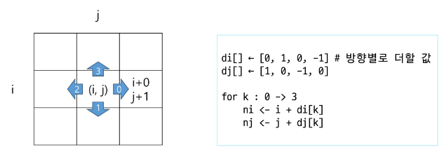

# 2차원 List

### 2차원 배열

- 2차원 배열의 선언
    - 1차원 List를 묶어놓은 List
    - 2차원 이상의 다차원 List는 차원에 따라 Index를 선언
    - 2차원 List의 선언 : 세로길이(행의 개수), 가로길이(열의 개수)를 필요로 함
    - Python 에서는 데이터 초기화를 통해 변수선언과 초기화가 가능함
    

**숫자가 공백 없이 붙어있는 경우**

- ‘12435465’ 공백없이 숫자가 주어질때 `split()` 불필요
- `map` 함수가 iterable한 문자열을 하나씩 꺼내서 각 수를 리스트로 저장

| 표현 | 설명 |
| --- | --- |
| `map(int, input())` | 입력된 문자열의 **각 문자에** `int()` 적용 |
| `list(map(int, "123"))` | `[1, 2, 3]` 반환 |
| `split()` 없음 | 공백이 없으므로 불필요 |

**0으로 채워진 3 x 4 배열 만들기**

```python
# 좋은 예시
arr = [[0] * 4 for _ in range(3)]

# 나쁜 예시
arr = [[0] * 4] * 3

## 겉으로 보면 같아보이지만 
## 나쁜 예시는 얕은 복사를 한 것이라서  
## 만약 [1][1] = 10 으로 바꾸면 [0][1], [2][1]도 싹다 10으로 변함
```

### 배열 순회

- **행 우선 순회**

```python
# i 행의 좌표
# j 열의 좌표

for i in range(n):
		for j in range(m):
				print(array[i][j])
```

- **열 우선 순회**

```python
# i 행의 좌표
# j 열의 좌표

for j in range(m):  # 열의 좌표(j)를 크게돌면 열 우선 순회 -> 우선하고싶은 것을 크게돌며 고정
		for i in range(n):
				print(array[i][j])		
```

- **지그재그 순회**

```python
# i 행의 좌표
# j 열의 좌표

for i in range(n):
		for j in range(m):
				print(array[i][j + (m-1-2*j) * (i%2)])
				
# i행이 짝수인경우 i%2 == 0 -> [i][j]
# i행이 홀수인경우 i%2 == 1 -> [i][m-1-j]
```

- (i, j) 크기의 큰 배열 속에서 (3,4) 크기의 작은 배열 형태로 돌기

```python
for i in range(0, n-3+1):
		for j in range(0, m-4+1):
				for p in range(i, i+3):
						for q in range(j, j+4):
```

---

### 델타

- 델타를 활용한 2차원 배열 탐색
    - 2차 배열의 한 좌표에서 4방향의 인접 배열 요소를 탐색하는 방법
    - 인덱스 (i, j)인 칸의 상하좌우 칸 (ni, nj)



**델타 이동 활용 예시**

```python
## 1
arr = [[0]*N for _ in range(N)]
di = [0, 1, 0, -1]
dj = [1, 0, -1, 0]
for i in range(N):
		for j in range(N):
				for d in range(4):
						ni = i + di[d]
						nj = j + dj[d]
						if 0<=ni<N and 0<=nj<N:
								arr[ni][nj]
```

```python
## 2
arr = [[0]*N for _ in range(N)]
for i in range(N):
		for j in range(N):
				for di, dj in [[0,1], [1,0], [0,-1], [-1,0]]:
						ni, nj = i+di, j+dj
```

**8방향 델타 이동**

- 대각선까지 포함한 8방향 탐색이 필요할 경우, 델타 배열을 8개로 확장

```python
# 8방향 델타: 상, 하, 좌, 우, 좌상, 우상, 좌하, 우하

dr = [-1, 1, 0, 0, -1, -1, 1, 1]
dc = [0, 0, -1, 1, -1, 1, -1, 1]
```

**전치 행렬(Transpose)**

- ‘전치’는 2차원 배열의 행과 열을 서로 맞바꾸는 작업. `zip` 함수를 활용하면 파이썬에서 매우 간결하게 구현할 수 있음.

```python
arr = [[1, 2, 3], [4, 5, 6], [7, 8, 9]]

transpose_arr = list(map(list, zip(*arr)))
print(transpose_arr)
# [[1, 4, 7], [2, 5, 8], [3, 6, 9]]
```

- 반복문을 활용해서도 전치할 수 있음

```python
for r in range(3):
		for c in range(3):
				# 행 인덱스보다 열 인덱스가 크면 자리를 바꿔준다
				if r < c:
						arr[r][c], arr[c][r] = arr[c][r], arr[r][c]
```

**90도 회전**

- 전치 행렬의 원리를 응용하면 90도 회전을 간결하게 구현 가능
- **오른쪽으로 90도 회전 (시계 방향)**
    
    > 원리: 행의 순서를 뒤집고(`[::-1]`), 그 결과를 전치
    > 

```python
arr = [
		[1, 2, 3],
		[4, 5, 6],
		[7, 8, 9],
]

## 행을 뒤집으면 
# arr[::-1] => [[7, 8, 9], [4, 5, 6], [1, 2, 3]]

rotated_90_right = list(map(list, zip(*arr[::-1])))
```

- **왼쪽으로 90도 회전 (반시계 방향)**
    
    > 원리: 먼저 전치한 뒤, 그 결과의 행 순서를 뒤집음
    > 

```python
rotated_90_right = list(map(list, zip(*arr)))[::-1]
```