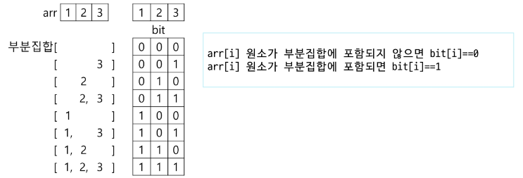
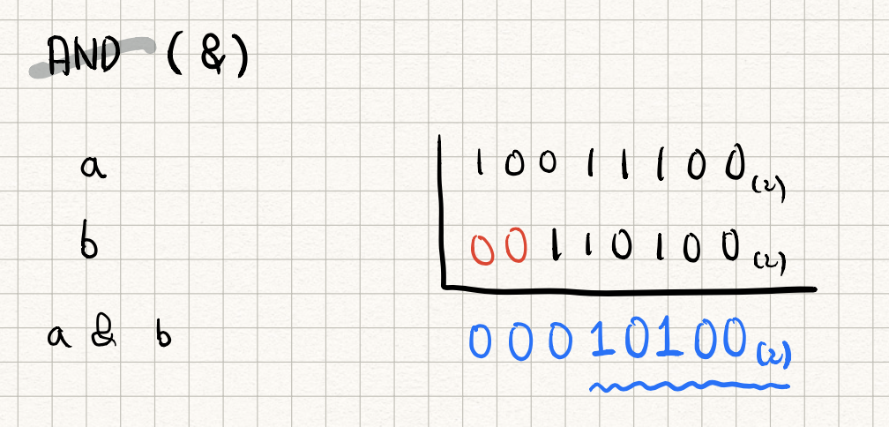
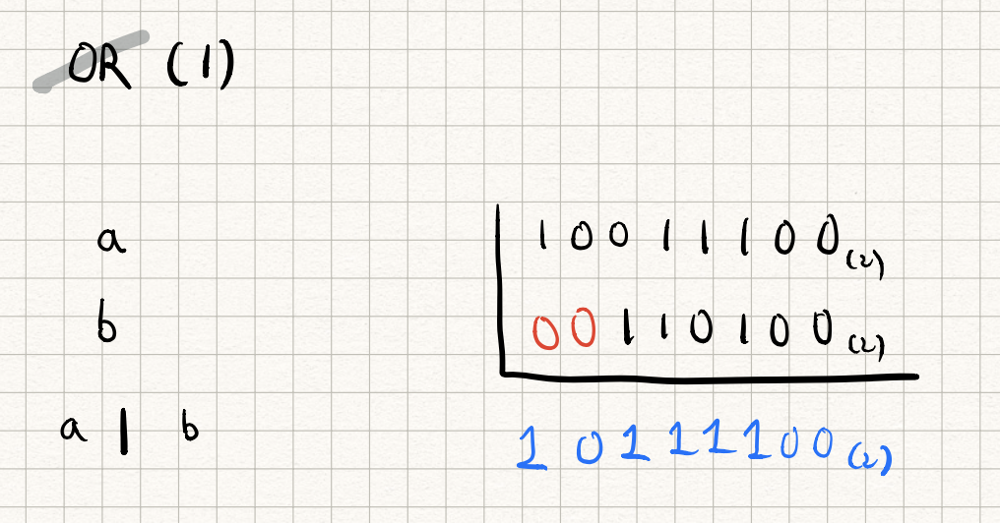
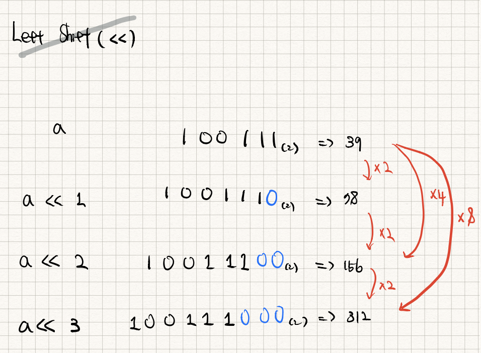
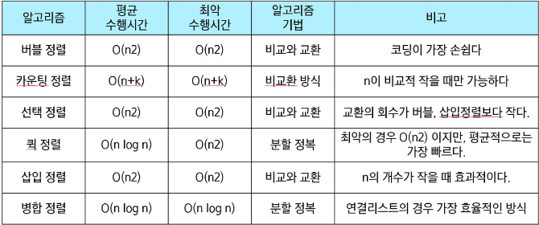

## 부분집합

**부분집합의 수**

- 집합의 원소가 n개일 때, 공집합을 포함한 부분집합의 수는 2^n개
    - 이는 각 원소를 부분집합에 포함시키거나 포함시키지 않는 2가지 경우를 모든 원소에 적용한 경우의 수와 같음
- 부분집합의 원소를 표현하는 방법
    
    
    

**각 원소가 부분집합에 포함되었는지를 loop를 이용하여 확인하고 부분집합을 생성하는 방법**

- 원소 개수가 늘어나면 for문도 늘어나야 되므로 실전에선 잘 사용하지 않음

```python
def print_subset(bit):
		for i in range(4):
				if bit[i]: #bit[i]가 0이 아니면
						print(arr[i], end=' ')
		print(bit)

bit = [0, 0, 0, 0]
for i in range(2):
		bit[0] = i
		for j in range(2):
				bit[1] = j
				for k in range(2):
						bit[2] = k
						for l in range(2):
								bit[3] = l
								print_subset(bit)
```

### 비트

- 메모리 상에서 정보를 구분하는 최소 단위

### 비트 연산자

- `&` : 비트 단위로 AND 연산
- `|` : 비트 단위로 OR 연산
- `<<` : 피연산자의 비트 열을 왼쪽으로 이동
- `>>` : 피연산자의 비트 열을 오른쪽으로 이동

### ‘<<’ 연산자 활용

- 1<<n : 2^n즉, 원소가 n개일 경우의 모든 부분집합의 수를 의미
- `a<<b` : a x 2**b
- `a>>b` : a % (2**b)

### ‘&’ 연산자 활용

- i & (1<<j) : i의 j번째 비트가 1인지 아닌지를 검사

# ✍️추가 학습

## 1. Binary System

### 이진법

사용 가능한 자릿수를 표현하는 방법

- 10진수 → 0~9까지 10개의 숫자를 활용
- 2진수 → 0&1 2개의 숫자를 활용

- 이진법
    - 0과 1로 표현하는 숫자 체계
    - 컴퓨터가 이해하는 숫자 체계 → 모든 것을 0과 1의 모음으로 이해
- 십진법
    - 0~9까지 10개로 표현하는 숫자 체계
    - 인간에게 가장 직관적인 숫자 표현 방식

하지만 10진법을 사용했을 때보다 더 많은 숫자를 사용해야 하므로 더 효율적이지 않을까?

실제로 10진법보다 2진법은 많은 숫자를 사용해야 한다. 
예를 들어, 13을 표현한다고 할 때 10진법으로는 `13`이라고 표현하면 되지만 2진법으로는 `1101`이라고 표현해야 한다. 
표현하는 수가 많아진다는 것은 더 많은 메모리를 사용해야 함을 의미한다.

그럼에도 왜 사용하는 걸까? 
→ 0과 1 두가지의 상태만 갖기 때문에 실제 물리적인 하드웨어 시스템을 구현할 때 훨씬 간편하기 때문

**십진수와 이진수 예시**

| 십진수 | 이진수 |
| --- | --- |
| 1 | $1_{(2)}$ |
| 2 | $10_{(2)}$ |
| 3 | $11_{(2)}$ |
| 4 | $100_{(2)}$ |
| 5 | $101_{(2)}$ |
| 6 | $110_{(2)}$ |
| 7 | $111_{(2)}$ |
| 8 | $1000_{(2)}$ |

## 2. 비트 논리 연산자

대부분의 프로그래밍 언어에서 거의 동일

비트 연산자를 활용하면 개별 비트에 Boolean Logical 연산 수행이 가능

### 비트 연산자 표기법

| 연산자 | 예시 | 복합 연산자 | 의미 | 설명 |
| --- | --- | --- | --- | --- |
| &  | a & b | &= | 비트 AND |  |
| | | a | b | |= | 비트 OR |  |
| ^ | a ^ b | ^= | 비트 XOR (Exclusive) | 남자이면서 여자일 수 없음 |
| ~ | ~a |  | 비트 NOT |  |
| << | a << n  | <≤ | 비트를 왼쪽 시프트  | 부등호의 방향으로 비트 이동 |
| >> | a >> n  | >≥ | 비트를 오른쪽 시프트 | 부등호의 방향으로 비트 이동 |

`AND` 



> 두 비트가 켜져있는 경우만 1, 그 외의 모든 경우 0
> 

`OR`



> 두 비트에서 적어도 하나만 1이면 1을 반환한다.
> 

**비트 시프트 연산자**

`<<`



> 첫 번째 피연산지의 비트를 두 번째 피연산자에 지정된 자릿수 만큼 왼쪽으로 이동
> 
- 단일 비트를 왼쪽으로 한자리 이동하면 값이 두 배가 된다.
    - 즉 3번 이동하면 처음과 비교했을때 2를 3번 제곱한 만큼의 배가 된다.

`비트를 왼쪽으로 이동하는 것은 숫자에 2배씩 증가하는 것`

## 부분집합에서의 활용

- 부분 집합의 개수 및 모든 부분집합 요소 출력하기
- `(1, 1 << n)` 으로 공집합을 빼고 되고 최종적인 결과에 `-1` 을 통해 빼도 됨
    
    ```python
    3 6 7 1 5 4
    ```
    
    ```python
    # 원소 6개가 담긴 리스트
    nums = [3, 6, 7, 1, 5, 4]
    
    # 해당 리스트의 길이
    n = len(nums)
    
    # 부분집합의 개수를 더해 갈 변수 초기화
    cnt = 0
    
    # n번 시프트를 통해 모든 경우의 수를 체크하자 -> 2^6 -> 64
    for i in range(1 << n):
    		cnt += 1
    		for j in range(n):
    				if i & (1<<j):
    						print(nums[j], end=', ')
    		print()
    print(cnt)
    ```
    

`for i in range(1 << n)`

> 모든 부분집합의 개수 만큼 반복하자
> 
- n만큼 왼쪽으로 시프트 → `"n개 원소의 부분집합 개수"`
- 아래의 표의 결과를 통해 알 수 있듯 결국 최상위 비트 1개만 1이고 나머지는 모두 0이다.

| n (원소의 개수) | `1 << n` 결과 (2진수) -> `$2^n$` | `1 << n`의 결과 (10진수) |
| --- | --- | --- |
| 1 | 10 (하나 왼쪽 시프트) | 2 |
| 2 | 100 (두개 왼쪽 시프트) | 4 |
| 3 | 1000 (세 개 왼쪽 시프트) | 8 |
| 4 | 10000 (네 개 왼쪽 시프트) | 16 |
| .... |  | ... |
| 10 | 10000000000 (열 개 왼쪽 시프트) | 1024 |

`if i & (1 << j)` 

<aside>
💡

`&와 <<를 활용해` 몇 번째 비트 열이 1인지를 확인하기 위함

</aside>

> `i` 와 `(1 << j)` 의 `&` 비트 연산 결과를 조건문으로 필터링하자
—> “ `i` 의 `j` 번째 비트가 1인지 확인하자”
> 
- 파이썬에서는 비트 연산자 `&` 를 만나면 내부적으로 2진수로 변환해서 처리함
- 여기서 `i` 가 `13` 이면 `001101` 이 되는거임
- `(1<<j)` 는 숫자 `1` 을 j만큼 shift하라는 것.
- 즉 `j` 가 `4` 이면 `0001` , `0010` , `0100` , `1000` 인거임.
- 그럼 `001101` 에서 `1의 위치` 가 곂치는 경우는 j가 `0` `2` `3` 인 경우가 됨.
- 그래서 `num[j]` 가 프린트되는 경우는 `num[0]` , `num[2]` , `num[3]` 인 경우가 되고 `3 7 1` 인 부분집합이 프린트 되는 것!!

---

## 검색과 정렬

- 검색: 저장되어 있는 자료 중에서 원하는 항목을 찾는 작업
    - 목적하는 탐색 키를 가진 항목을 찾는 것

### 순차검색

- 일렬로 되어 있는 자료를 순서대로 검색하는 방법
    - 가장 간단하고 직관적인 검색 방법
    - 배열이나 연결 리스트 등 순차구조로 구현된 자료구조에서 원하는 항목을 찾을 때 유용
    - 알고리즘이 단순하여 구현이 쉽지만, 검색 대상의 수가 많은 경우에는 수행시간이 급격히 증가해 비효율적임

- 정렬 여부에 따라
    - **순차 검색 대상이 정렬되어 있지 않은 경우**
        1. 첫 번째 원소부터 순서대로 검색 대상과 키 값이 같은 원소가 있는지 비교하며 찾는다.
        2. 키 값이 동일한 원소를 찾으면 그 원소의 인덱스를 반환한다.
        3. 자료구조의 마지막에 이를 때까지 검색 대상을 찾지 못하면 검색 실패
        - 시간 복잡도 : O(n)
        
    - **순차 검색 대상이 정렬되어 있는 경우**
        1. 자료가 오름차순으로 정렬된 상태에서 검색을 실시한다.
        2. 자료를 순차적으로 검색하면서 키 값을 비교하여, 원소의 키 값이 검색 대상의 키 값보다 크면 찾는 원소가 없다는 것이므로 더 이상 검색하지 않고 검색을 종료함.
        - 시간 복잡도 : O(n)

### 이진 검색

- 자료의 가운데에 있는 항목의 키 값과 비교하여 다음 검색의 위치를 결정하고 검색을 진행하는 방법
    - 목적 키를 찾을 때까지 이진 검색을 순환적으로 반복 수행
    - 검색 범위를 계속 반으로 즐이면서 보다 빠르게 검색 가능
- 이진 검색을 하기 위해서는 자료가 정렬된 상태여야 함
- 시간복잡도 : O(logN)

- **검색 과정**
    1. 자료의 중앙에 있는 원소를 고름
    2. 중앙 원소의 값과 찾고자 하는 목표 값을 비교
    3. 목표 값이 중앙 원소의 값보다 작으면 자료의 왼쪽 반에 대해서 새로 검색 수행
        
        크면 자료의 오른쪽 반에 대해서 검색 수행
        
    4. 찾고자 하는 값을 찾을 때까지 1~3 과정 반복

## 선택 정렬(selection sort)

- 선택 정렬
    - 주어진 자료들 중 가장 작은 값의 원소부터 차례대로 선택하여 위치를 교환하는 방식
- 정렬 과정
    - 주어진 리스트 중에서 최소값을 찾기
    - 그 값을 리스트의 맨 앞에 위치한 값과 교환
    - 맨 처음 위치를 제외한 나머지 리스트를 대상으로 위의 과정을 반복
- 시간 복잡도
    - O(n^2)
- **선택 정렬 알고리즘**
```python
selection_sort(a[], n):
		for i in range(n-1):  # 정렬 구간의 시작 인덱스
				min_idx = i  # 첫 원소를 최소로 가정0
				for j in range(i+1, n):
						if a[min_idx] > a[j]:  # 최소 원소 위치 갱신
								min_idx = j
				a[i], a[min_idx] = a[min_idx], a[i]  # 구간 최솟값을 구간 맨 앞으로
```
