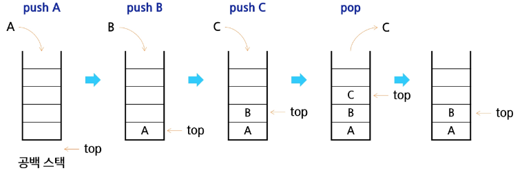
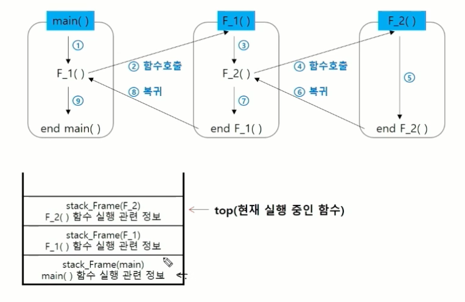

# Stack(스택)

- 물건을 쌓아 올리듯 자료를 쌓아 올린 형태의 자료구조

### 기본 개념

- **선형 자료구조(Linear)**
  - 자료 간 관계가 `1:1` 형태를 이룸
  - 데이터들이 일렬로 나열되어 있는 형태로, 각 데이터가 순서대로 연결되어 있음
  - 스택은 선형 구조 tmxo중에서도 **마지막에 삽입한 자료를 가장 먼저 꺼내는** `LIFO`(Last In First Out) 방식
  - 배열, 스택, 큐
- **스택의 일상 예시**
  - 브라우저 '뒤로 가기'
  - 실행 취소(Undo) 기능
- **(참고) 비선형 자료구조**
  - 데이터들이 계층적 또는 복잡하게 연결되어 있는 형태로, 한 데이터가 여러 데이터와 연결될 수 있음
  - 자료 간 관계가 `1:N` 혹은 복잡한 구조를 가짐
  - 트리, 그래프

### Stack 구현

- 스택(Stack)은 **선형 자료구조**로, 파이썬 리스트를 이용해 쉽게 구현 가능

- **마지막**에 삽입된 원소를 `top`이라고 부르며,
  파이썬에서는 `[-1]` 인덱스로 접근

- **스택의 연산**
  
  - `삽입(Push)` : 저장소에 자료를 저장하는 연산
    
    ```python
    # append 메소드를 통해 삽입
    def my_push(item):
            s.append(item)
    
    # 인덱스 연산을 활용한 구현
    def my_push(item, size):
            global top
            top += 1
            if top == size:
                    print('overflow')
            else:
                    stack[top] = item
    ```
  
  - `삭제(Pop)` : 저장소에 삽입한 자료를 역순으로 꺼내는 연산
    
    ```python
    def my_pop():
            if len(s) == 0:
                    print('underflow')
                    return
            else:
                    return s.pop()
    
    # 인덱스 연산을 활용한 구현
    def my_pop():
            global top
            if top == -1:
                    print('underflow')
                    return 0
            else:
                    top -= 1  # top 포인터를 하나 내리고
                    return stack[top+1] # 삭제한 원소 값을 return
    ```
  
  - `isEmpty` : 스택이 공백인지 아닌지를 확인하는 연산 (True / False)
  
  - `peek` : 스택의 top에 있는 item(원소)를 반환하는 연산 (삭제는 하지 않음)

- **시간 복잡도**
  
  - 파이썬 리스트에서 `append` 와 `pop` 은 평균 `O(1)` 시간에 동작

### 1.2.1 코드 구현

- 코드 구현 (함수 버전)
  
  ```python
  # 빈 스택 생성
  s = []
  a = 10
  
  def push(item):
      '''스택에 item을 삽입합니다.'''
      s.append()
  
  def pop():
      '''스택의 top(마지막 원소)을 제거하고 반환합니다.'''
      if len(s) == 0:  # 공백 스택 검사
          # underflow 상황
          return None
      else:
          return s.pop()  # 마지막 원소 반환 및 제거
  
  def is_empty():
      '''스택이 비어 있으면 True, 그렇지 않으면 False를 반환합니다.'''
      return len(s) == 0
  
  def peek():
      '''스택의 top(마지막 원소)을 반환하되, 제거하지 않습니다.'''
      if not is_empty():
          return s[-1]
      return None
  
  # 예시 사용
  push(10)
  push(20)
  print(f's: {s}')       # s: [10, 20]
  print(f'pop: {pop()}') # pop: 20
  print(f'peek: {peek()}') # peek: 10
  print(f's: {s}')       # s: [10]
  ```
  
  - 파이썬 리스트는 내부적으로 동적 배열을 사용하므로, C언어처럼 크기를 엄격히 미리 선언할 필요 없음

- 코드 구현 (클래스 버전 참고)
  
  ```python
  class Stack:
      def __init__(self, size):
          self.size = size  # 스택 크기 저장
          self.capacity = [None] * size  # 고정 크기 배열 사용
          self.top = -1  # 초기 top 포인터는 -1
  
      def push(self, item):
          if self.top >= self.size - 1:
              return "Stack Overflow"  # 스택이 가득 찬 경우
          self.top += 1
          self.capacity[self.top] = item  # top 위치에 값 저장
  
      def is_empty(self):
          return self.top == -1  # top 포인터가 -1이면 스택이 비어 있음
  
      def pop(self):
          if self.is_empty():
              return "Stack Underflow"
          item = self.capacity[self.top]
          self.capacity[self.top] = None  # top 위치의 값 제거
          self.top -= 1  # top 포인터 감소
          return item
  
      def peek(self):
          if self.is_empty():
              return "Stack is empty"
          return self.capacity[self.top]  # top 위치의 값 반환
  
  # 사용 예제
  stack = Stack(3)
  stack.push(5)
  stack.push(10)
  stack.push(15)
  print(stack.push(100))  # Stack Overflow
  print(stack.pop())  # 15
  print(stack.pop())  # 10
  print(stack.pop())  # 5
  print(stack.pop())  # Stack Underflow
  ```

### 스택의 삽입/삭제 과정

  

### 스택 구현 고려 사항

- 1차원 배열을 사용하여 구현할 경우
  - 장점: 구현이 용이함
  - 단점: 스택의 크기를 변경하기 어려움
- 해결 방법: 저장소를 동적으로 할당하여 스택 구현(동적 연결리스트를 이용하여 구현하는 방법)
  - 장점: 메모리를 효율적으로 사용
  - 단점: 구현이 복잡함

<aside>
💡

**동적 메모리 할당**

- 필요한 만큼 메모리를 할당하고 해제하여 유연하게 크기를 조절할 수 있음

**연결리스트**

- 데이터와 다음 노드의 주소를 함께 저장하여 요소들이 순차적으로 연결된 자료구조

**메모리**

- 컴퓨터에서 데이터를 저장하고 처리하기 위해 사용하는 일시적인 저장 공간
  
  </aside>

---

## **Stack의 응용 1 - 괄호 검사**

- 괄호 종류: 소괄호 `()`, 중괄호 `{}`, 대괄호 `[]` 등
- **검사 조건**
  1. 왼쪽 괄호와 오른쪽 괄호 개수가 같아야 함
  2. 같은 종류의 괄호에서 왼쪽이 오른쪽보다 먼저 나와야 함
  3. 괄호는 서로 ‘포함 관계’를 이룸 (올바른 중첩)

**알고리즘 개요**

1. 문자열을 왼쪽부터 오른쪽까지 순회
2. 왼쪽 괄호를 만나면 **push**
3. 오른쪽 괄호를 만나면 **pop** 후, 짝이 맞는지 확인
   1. 도중에 스택이 비어 있는데 오른쪽 괄호가 나오거나,
      짝이 맞지 않는 경우 → 실패
4. 모든 문자를 처리한 후에도 스택이 비어 있지 않다면 → 실패
5. 그 외 경우에는 성공

### **괄호 검사 문제**

**[지문]**

여러 종류의 괄호(`()`, `[]`, `{}`)와 숫자가 섞인 문자열이 주어졌을 때,

괄호 짝이 올바른지 검사하는 프로그램을 작성하세요.

- 괄호는 반드시 ‘여는 괄호’ 뒤에 그에 대응하는 ‘닫는 괄호’가 정확히 순서대로 나와야 합니다.
- 문자열에 등장하는 숫자나 기타 문자들은 괄호 짝 검사에 영향을 주지 않습니다.
- 짝이 맞으면 `1`, 그렇지 않으면 -`1`을 출력합니다.

**[입력 설명]**

1. 첫 번째 줄에 테스트 케이스의 수 `T`가 주어진다.

2. 이후 `T`개의 줄에, 각각 소괄호(), 대괄호[], 중괄호{}와 숫자가 섞여 있는 문자열이 주어진다.
   
   ```
   3
   (12[3]{45}[])
   ([{)]}999
   ([]{})((12345){[67]})
   ```
   
   ```
   #1 1
   #2 -1
   #3 1
   ```
- 문제 코드
  
  ```python
  import sys
  sys.stdin = open('input.txt')
  
  def check_brackets_no_dict(string):
      pass
  
  T = int(input().strip())
  for tc in range(1, T + 1):
      line = input().strip()
      result = check_brackets_no_dict(line)
      print(f'#{tc} {result}')
  ```

- 해답 코드 1
  
  ```python
  import sys
  
  sys.stdin = open('input.txt')
  
  def check_brackets(string):
      '''
      여러 종류의 괄호 ((), [], {})와 숫자가 섞인 문자열에서
      괄호 짝이 올바른지 스택을 통해 검사한다.
      '''
      stack = []
  
      for char in string:
          # 여는 괄호 -> 스택에 push
          if char in '([{':
              stack.append(char)
  
          # 닫는 괄호 -> 스택에서 pop 후 매칭 확인
          elif char in ')]}':
              # pop하기 전에 스택이 비어있는지 확인 / 비어있다면 짝 불일치
              if len(stack) == 0:
                  return -1
  
              # 스택이 비어있지 않다면 pop 진행
              top_char = stack.pop()
  
              # 닫는 괄호와 pop해서 나온 여는 괄호를 비교
              # 그런데 비교를 했는데 짝이 맞지 않으면 그대로 종료
              if char == ')' and top_char != '(':
                  return -1
              elif char == ']' and top_char != '[':
                  return -1
              elif char == '}' and top_char != '{':
                  return -1
          # 숫자나 기타 문자들은 무시
          else:
              continue
  
      # 모든 괄호를 처리 후, 스택이 비어 있어야만 올바른 짝
      if len(stack) == 0:
          return 1
      else:
          return -1
  
  T = int(input().strip())
  for tc in range(1, T + 1):
      line = input().strip()
      result = check_brackets(line)
      print(f'#{tc} {result}')
  ```

- 해답 코드 2 (딕셔너리 활용)
  
  ```python
  import sys
  
  sys.stdin = open('input.txt')
  
  def check_brackets_mixed(string):
      '''
      여러 종류의 괄호 ((), [], {})와 숫자가 섞인 문자열에서
      괄호 짝이 올바른지 스택을 통해 검사한다.
      '''
      # 괄호 대응을 위한 매핑 (닫는 괄호 -> 여는 괄호)
      bracket_map = {')': '(', ']': '[', '}': '{'}
  
      stack = []
  
      for char in string:
          # 여는 괄호이면 스택에 push
          if char in '([{':
              stack.append(char)
          # 닫는 괄호이면 스택에서 pop하여 짝이 맞는지 확인
          elif char in ')]}':
              if len(stack) == 0:
                  # 스택이 비어있으면 짝 불일치
                  return -1
              top_char = stack.pop()
              # 매핑과 일치해야 짝이 맞음
              if bracket_map[char] != top_char:
                  return -1
          # 숫자나 기타 문자는 무시
          else:
              continue
  
      # 모든 괄호 처리 후, 스택이 비어 있어야 올바른 짝
      if len(stack) == 0:
          return 1
      else:
          return -1
  
  T = int(input().strip())
  for tc in range(1, T + 1):
      line = input().strip()
      result = check_brackets_mixed(line)
      print(f'#{tc} {result}')
  ```

## **Stack의 응용 2 - 함수 호출(Function Call)**

- 프로그램에서 함수를 호출하면, 해당 함수의 실행이 끝나기 전까지는 이전 함수가 대기

- **가장 마지막에 실행한 함수가 가장 먼저 처리 완료** (LIFO)
  

- 아래 예시에서 `func1`은 `func2`가 끝나야 종료를 계속 진행
  
  ```python
  def func2():
      print('함수 2 시작')
      print('함수 2 종료')
  
  def func1():
      print('함수 1 시작')
      func2()
      print('함수 1 종료')
  
  print('메인 시작')
  func1()
  print('메인 끝')
  
  # <출력 예시>
  # 메인 시작
  # 함수 1 시작
  # 함수 2 시작
  # 함수 2 종료
  # 함수 1 종료
  # 메인 끝
  ```
  
  > 실제 동작
  
  - 내부적으로 함수가 호출될 때마다 ‘호출 스택(Call Stack)’에 해당 함수 정보가 저장되고,
    함수가 종료되면 스택에서 제거(pop)

## **추가 내용**

- **시간 복잡도**
  - 파이썬 리스트 기반 스택의 `push`/`pop` 연산은 평균적으로 `$O(1)$` (상수 시간)
- **오버플로(Overflow), 언더플로(Underflow)**
  - 일반 배열로 구현 시, 스택에 빈 공간이 없는데 `push`를 시도하면 **오버플로**
  - 스택이 비었는데 `pop`을 시도하면 **언더플로**
  - 파이썬 리스트는 동적으로 크기를 조정하므로, 일반적으로 오버플로는 발생하지 않음

## 정리

- 스택은 ‘**마지막에 삽입된 데이터가 가장 먼저 삭제되는 구조**’
- 함수 호출 흐름 관리나 괄호 검사, Undo/Redo 기능 등 다양한 곳에서 쓰이며,
  LIFO(Last In First Out) 특징이 핵심
