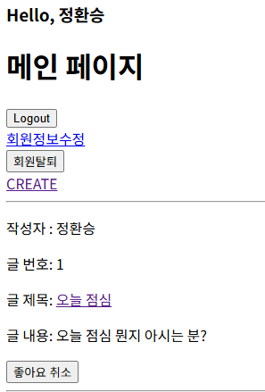
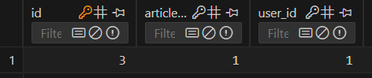

# Many to many relationships

한 테이블의 0개 이상의 레코드가 다른 테이블의 0개 이상의 레코드와 관련된 경우

### N:1 의 한계

- 동일한 환자지만 다른 의사에게도 진료 받기 위해 새로운 예약 데이터를 만들어야 하며, 이 때 동일한 환자 정보를 또 작성하여 저장됨(**일관성이 깨질 문제가 있음**)
    - 이런 구조로 의사와 환자의 진료 관계를 설정한다면
    - 환자 한 명의 두 의사 모두에게 진료를 받고자 할 때, 환자 테이블에 같은 환자가 중복으로 입력된다
- 제 1 정규형을 만족하지 못한다
    - 환자가 진료 받을 의사 정보를 `1,2` 이렇게 동시에 저장을 시도하면 에러가 발생함

```python
class Doctor(models.Model):
    name = models.TextField()

    def __str__(self):
        return f'{self.pk}번 의사 {self.name}'

class Patient(models.Model):
    doctor = models.ForeignKey(Doctor, on_delete=models.CASCADE)
    name = models.TextField()

    def __str__(self):
        return f'{self.pk}번 환자 {self.name}'
```

### 1. 1:N 한계를 중개 모델로 해결

중개 모델: 다대다 관계에서 `두 모델을 연결하는 역할`을 하는 기능을 가진 모델 

- 예약 정보 조회 : 중개 테이블의 역참조를 통해 가능
    - `doctor1.reservation_set.all()`
    - `patient1.reservation_set.all()`

```python
class Doctor(models.Model):
    name = models.TextField()

    def __str__(self):
        return f'{self.pk}번 의사 {self.name}'

# 외래키 삭제
class Patient(models.Model):
    name = models.TextField()

    def __str__(self):
        return f'{self.pk}번 환자 {self.name}'

# 중개모델 작성
class Reservation(models.Model):
    doctor = models.ForeignKey(Doctor, on_delete=models.CASCADE)
    patient = models.ForeignKey(Patient, on_delete=models.CASCADE)

    def __str__(self):
        return f'{self.doctor_id}번 의사의 {self.patient_id}번 환자'
```

### 2. ManyToManyField

- 장점
    - M:N 관계 설정 모델 필드로 중개 모델을 자동으로 생성할 수 있다.
    - `.add()` 와 `.remove()` 메서드 사용 가능
        - `patient.doctors.add(doctor1)`
        - `patient.doctors.add(doctor1, doctor3)`
        - `patient.doctor.remove(doctor1)`
        - `patient.doctors.remove(doctor2, doctor3)`
- 한계
    - 기본 ManyToManyField로 생성된 예약 중개 테이블은 의사와 환자의 외래 키 정보만 저장하고 있음
    - 만약 예약 중개 테이블에 병의 증상, 예약 일정, 방문 횟수에 대한 추가 정보가 필요한 경우 ManyToManyField를 그대로 사용할 수 없음
    - 추가 정보를 저장하기 위해서는 사용자가 직접 중개 테이블을 정의해야 함
        - 하지만 이렇게 되면 `.add()` , `.remove()` 에 메서드를 사용할 수 없음

```python
class Doctor(models.Model):
    name = models.TextField()

    def __str__(self):
        return f'{self.pk}번 의사 {self.name}'

class Patient(models.Model):
    # ManyToManyField 작성
    doctors = models.ManyToManyField(Doctor)
    name = models.TextField()

    def __str__(self):
        return f'{self.pk}번 환자 {self.name}'
```

### 3. ‘through’ argument

‘through’ 속성 : 중개 테이블에 ‘추가 데이터’를 사용해 M:N 관계를 형성하려는 경우에 사용

- `.add()` 와 `.remove()` 도 역시 사용 가능!

```python
class Doctor(models.Model):
    name = models.TextField()

    def __str__(self):
        return f'{self.pk}번 의사 {self.name}'

class Patient(models.Model):
    doctors = models.ManyToManyField(Doctor, through='Reservation')
    name = models.TextField()

    def __str__(self):
        return f'{self.pk}번 환자 {self.name}'

class Reservation(models.Model):
    doctor = models.ForeignKey(Doctor, on_delete=models.CASCADE)
    patient = models.ForeignKey(Patient, on_delete=models.CASCADE)
    symptom = models.TextField()
    reserved_at = models.DateTimeField(auto_now_add=True)

    def __str__(self):
        return f'{self.doctor.pk}번 의사의 {self.patient.pk}번 환자'
```

### M:N 관계 주요 사항 정리

- **M:N 관계로 맺어진 두 테이블에는 물리적인 변화가 없음**
- **ManyToManyField는 중개 테이블을 자동으로 생성**
- **ManyToManyField는 M:N 관계를 맺는 두 모델 어디에 위치해도 상관 없음**
    - 대신 필드 작성 위치에 따라 참조와 역참조 방향을 주의할 것
- **N:1은 완전한 종속의 관계**였지만 **M:N은 종속적인 관계가 아니며** ‘의사에게 진찰받는 환자’ & ‘환자를 진찰하는 의사’ 이렇게 2가지 형태 모두 표현 가능

### ManyToManyField 특징

- 어느 모델에서든 관련 객체에 접근할 수 있는 **양방향 관계**
- 동일한 관계는 한 번만 저장되며 **중복되지 않음**
- ManyToManyField의 대표 인자 3가지
    1. related_name
        - 역참조 이름을 변경할 때 설정하는 인자
        - 역참조시 사용하는 manager name을 변경
            - 아래는 ‘patients_set’(기본값) 을 → ‘patients’로 변경
            - 이름을 변경하면 더 이상 기본 값 사용 불가
        
        ```python
        class Patient(models.Model):
            # ManyToManyField - related_name 작성
            doctors = models.ManyToManyField(Doctor, related_name='patients')
            name = models.TextField()
        
            def __str__(self):
                return f'{self.pk}번 환자 {self.name}'
        ```
        
    2. symmetrical
        - 관계 설정 시 대칭에 대한 설정을 하는 인자
        - 예를 들어 한 명이 팔로우 하면 맞팔로우가 됨
    3. through
        - 직접 생성한 중개 테이블을 등록하는 인자

<aside>
💡

역참조의 필요성과 장점

1. 데이터 관계를 양방향으로 탐색할 수 있다
2. 쿼리 효율성이 향상한다
3. 코드 가독성이 올라간다
4. 관계를 객체지향적으로 접근할 수 있어 표현이 쉬워진다. 
</aside>

# N:M 관계로 게시글 좋아요 기능 추가해보자

### like url 생성

- 어떤 게시글에 좋아요를 남길지가 필요하기 때문에 variable routing을 활용

```python
# articles/urls.py
from django.urls import path
from . import views

app_name = 'articles'
urlpatterns = [
    path('', views.index, name='index'),
    path('<int:pk>/', views.detail, name='detail'),
    path('create/', views.create, name='create'),
    path('<int:pk>/delete/', views.delete, name='delete'),
    path('<int:pk>/update/', views.update, name='update'),
    path('<int:pk>/comments/', views.comments_create, name='comments_create'),
    path(
        '<int:article_pk>/comments/<int:comment_pk>/delete/',
        views.comments_delete,
        name='comments_delete',
    ),
    # 좋아요 url
    path('<int:article_pk>/likes/', views.likes, name='likes'),
]
```

### 좋아요 기능을 처리해줄 함수

- 기존에 좋아요를 누른 상태이면 취소, 아니면 좋아요를 처리해주기 위해서 if-else 활용

```python
# articles/views.py
# 좋아요 처리 함수
def likes(request, article_pk):
    # 어떤 게시글에 좋아요를 누르는 건지 조회
    article = Article.objects.get(pk=article_pk)

    # 좋야요 생성/취소인지 확인 -> 즉 확인해봐야함
    # 주체: 유저
    # 유저가 해당 게시글에 좋아요를 누른 유저 목록에 포함되어 있느냐 없느냐 
    if request.user in article.like_users.all():
        article.like_users.remove(request.user)
        # 이렇게해도됨: request.user.like_article.remove(article)
    else:
        article.like_users.add(request.user)
        # 이렇게해도됨: request.user.like_article.add(article)

    return redirect('articles:index')
```

### 좋아요 폼 추가

- 메인 페이지에 좋아요 폼 추가함

```html
      <form action="" method="POST">
        
        
          <input type="submit" value="좋아요 취소">
        
          <input type="submit" value="좋아요 취소">
        
      </form>
```

## 결과 화면

- 좋아요 누름
    
    
    
- 누르고 난 DB
    - 1번 게시글 쓴 유저가 스스로 좋아요를 달았음.
        
        