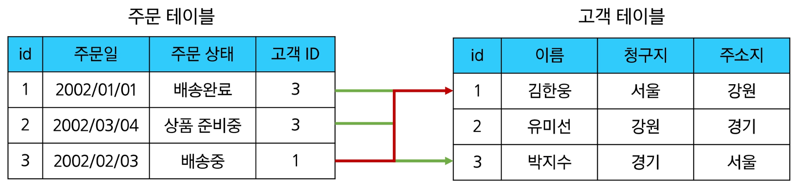
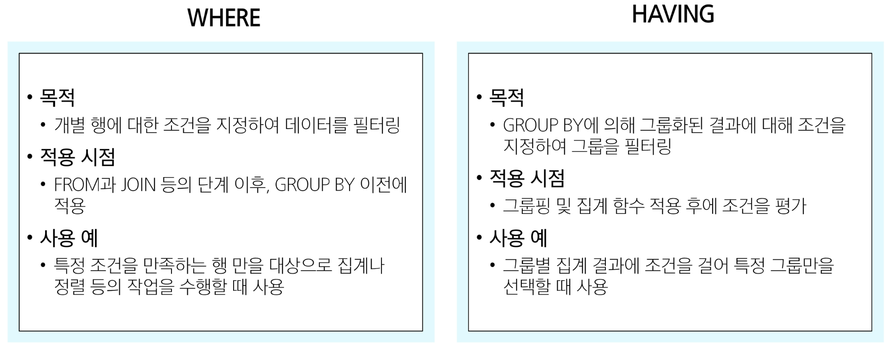

## 데이터 베이스

- 체계적으로 정리된 데이터의 모음

## 데이터

- 저장이나 처리를 위해 변환된 정보
- 표현한 정보들을 컴퓨터가 다룰 수 있도록 구조화한 것

### 데이터베이스 역할

데이터를 저장하고 조작 

- **Create**
- **Read**
- **Update**
- **Delete**

### 관계형 데이터베이스(Relational Database)

- 데이터 간에 관계가 있는 데이터 항목들의 모음



- 테이블, 행, 열의 정보를 구조화하는 방식
- 서로 관련된 데이터 포인터를 저장하고 이에 대한 액세스를 제공

### 관계

- 여러 테이블 간의 (논리적) 연결
- 데이터를 각각의 테이블에 나눠 저장하되, 공통된 키 값을 통해 서로 연결하여 필요할 때 함께 조회하거나 조작할 수 있도록 함

### 관계로 할 수 있는 것

- 두 테이블을 사용하여 데이터를 다양한 형식으로 조회할 수 있음

### 관계형 데이터베이스 예시

- 각 데이터에 고유한 식별 값 부여 : Primary Key
- 현재 테이블에서 다른 테이블을 조회하고자 할 때, 다른 테이블의 PK를 Foreign Key로 둔다.

### 관계형 데이터베이스 키워드

1. Table
    - 데이터를 기록하는 곳
2. Field (aka Column, Attribute)
    - 각 필드에는 고유한 데이터 형식(타입)이 지정됨
3. Record (aka Row, Tuple)
    - 각 레코드에는 구체적인 데이터 값이 저장됨
4. Database (aka Scheme)
    - 테이블의 집합
5. Primary Key (기본 키, PK)
    - 각 레코드의 고유한 값
    - 관계형 데이터베이스에서 레코드의 식별자로 활용
6. Foreign Key (외래 키, FK)
    - 테이블의 필드 중 다른 테이블의 레코드를 식별할 수 있는 키
    - 다른 테이블의 기본 키를 참조
    - 각 레코드에서 서로 다른 테이블 간의 관계를 만드는 데 사용

### DBMS : 데이터베이스를 관리하는 소프트웨어 프로그램

- 데이터 저장 및 관리를 용이하게 하는 시스템
- 데이터베이스와 사용자 간의 인터페이스 역할
- 사용자가 데이터 구성, 업데이트, 모니터링, 백업, 복구 등을 할 수 있도록 도움

### RDBMS : 관계형 데이터베이스 관리 소프트웨어 프로그램

종류

- SQLite
    - 경량의 오픈 소스 데이터베이스 관리 시스템
    - 설치 없이 가볍게 실행 가능해 모바일 앱이나 소규모 프로그램에 적합
    - 간단하고 효율적인 데이터 저장 및 관리를 제공
- MySQL
- PostgreSQL
- Oracle Database
- …

---

## SQL

테이블의 형태로 구조화 된 관계형 데이터베이스에게 요청을 질의(요청)

- DBMS에 데이터를 찾아달라고 요청하는 **표준화된 요청서 양식**
- **명확하게 약속된 형식**에 따라 요청을 전달하는 언어

### SQL Syntax

```sql
	SELECT column_name FROM table_name;
```

1. SQL 키워드는 대소문자를 구분하지 않음
    - 하지만 대문자로 작성하는 것을 권장
2. 각 SQL Statements 의 끝에는 세미콜론(’;’)이 필요
    - 세미콜론은 각 SQL Statements을 구분하는 방법

### SQL Statements

- SQL을 구성하는 가장 기본적인 코드 블록

### SQL Statements 예시

```sql
SELECT column_name FROM table_name;
```

- 해당 예시 코드는 SELECT Statement라 부름
- Statement는 SELECT, FROM 2개의 keyword로 구성

### 수행 목적에 따른 SQL Statements 4가지 유형

1. DDL - 데이터 정의
2. DQL - 데이터 검색
3. DML - 데이터 조작
4. DCL - 데이터 제어 


## Querying Data

### DQL: 데이터 검색 (SELECT)

```sql
SELECT LastName, FirstName FROM employees;

SELECT * FROM employees;

-- 'AS'를 활용해 필드 명 별칭 사용 
SELECT FirstName AS '이름' FROM employees;

-- 필드를 숫자로 나눠서 분 단위 값으로 출력할 수 있음 
SELECT Name, Milliseconds / 60000 AS '재생 시간(분)' FROM tracks;
```

## Sorting Data

### ORDER BY

```sql
SELECT FirstName FROM employees ORDER BY FirstName;

SELECT FirstName FROM employees ORDER BY FirstName DESC;

SELECT Country, City FROM customers ORDER BY Country DESC, City;

SELECT Name, Milliseconds / 60000 AS '재생 시간(분)' FROM tracks ORDER BY Milliseconds DESC;
```

**정렬에서의 NULL** : 오름차순 정렬 시 결과에 NULL이 먼저 출력 

### SELECT statement 실행 순서

1. FROM
2. SELECT
3. ORDER BY

때문에 ORDER BY문에서 SELECT에서 지정한 필드 별칭 사용 가능

---

## Filtering Data

- Clause
    - DISTINCT
    - WHERE
    - LIMIT
- Operator
    - BETWEEN
    - IN
    - LIKE
    - Comparison
    - Logical

### DISTINCT

- SELECT 키워드 바로 뒤에 작성
- SELECT DISTINCT 키워드 다음에 고유한 값을 선택하려는 하나 이상의 필드를 지정

```sql
-- 두개를 넣으면(Countrym City) 이 두개 합친걸 하나로 보고 합쳐서 겹친게 없으면 됨 
SELECT DISTINCT Country, City FROM customers ORDER BY Country;
```

### WHERE

```sql
SELECT LastName, FirstName, City FROM customers WHERE City = 'Prague';

SELECT LastName, FirstName, City FROM customers WHERE City != 'Prague';

-- NULL 비교(NULL은 실제 값이 아니라 '값이 없음'임)
-- 따라서 = 연산자 말고 IS, IS NOT 연산자 사용함 
SELECT LastName, FirstName, Company, Country FROM  customers
WHERE Company IS NULL AND Country = 'USA';

SELECT LastName, FirstName, Company, Country FROM customers
WHERE Company IS NULL OR Country = 'USA';

-- 범위를 지정하는 두 가지 방법
SELECT Name, Bytes FROM tracks
WHERE Bytes >= 10000 AND Bytes <= 500000;

SELECT Name, Bytes FROM tracks
WHERE Bytes BETWEEN 10000 AND 500000;

-- ORDER BY는 맨 뒤에 쓰자(정렬은 항상 마지막)
SELECT Name, Bytes FROM tracks
WHERE Bytes BETWEEN 10000 AND 500000
ORDER BY Bytes;

-- 포함 관계 표현 
SELECT LastName, FirstName, Country FROM customers
WHERE Country = 'Canada' OR Country = 'Germany' OR Country = 'France';

SELECT LastName, FirstName, Country FROM customers
WHERE Country IN ('Canada', 'Germany', 'France'); 

SELECT LastName, FirstName, Country FROM customers
WHERE Country NOT IN ('Canada', 'Germany', 'France'); 

-- **Wildcard Characters
-- '%' : 0개 이상의 문자열과 일치하는지 확인
-- '_' : 단일 문자와 일치하는지 확인** 
-- son으로 끝나는 것
SELECT LastName, FirstName FROM customers
WHERE LastName LIKE '%son';

-- 4자리 이면서 a로 끝나는 것
SELECT LastName, FirstName FROM customers
WHERE FirstName LIKE '___a';
```

### LIMIT

```sql
-- 내림차순으로 7개만 조회
SELECT TrackId, Name, Bytes FROM tracks
ORDER BY Bytes DESC
LIMIT 7;

-- 4번째부터 7번째 데이터만 조회 
SELECT TrackId, Name, Bytes FROM tracks
ORDER BY Bytes DESC
LIMIT 3, 4;
-- LIMIT 4 OFFSET 3;
```

## Grouping Data

### GROUP BY

```sql
SELECT Composer, AVG(Bytes) AS avgOfBytes FROM tracks GROUP BY Composer ORDER BY avgOfBytes DESC;
```

### HAVING

```sql
-- 그룹바이의 세부 조건은 HAVING절을 사용해야함 
SELECT department, COUNT(*) AS num_employees
FROM employees
GROUP BY department
HAVING num_employees > 5;
```

### WHERE와  HAVING 비교



### SELECT statement 실행 순서

1. FROM
2. WHERE
3. GROUP BY
4. HAVING
5. SELECT
6. ORDER BY
7. LIMIT