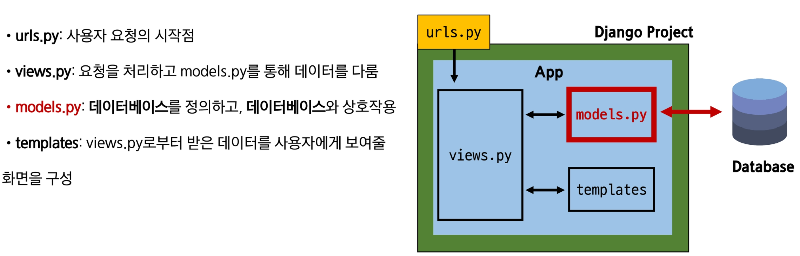
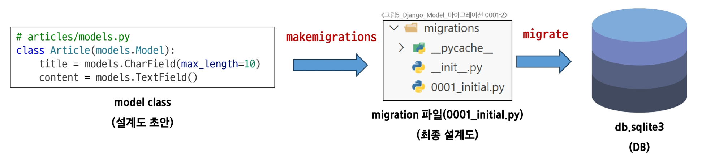

[앱만들면 settings에 app추가하는거 잊지말자]

## Model

- 모델은 데이터베이스를 정의하고 관리함
- 개발자와 데이터베이스의 중간다리의 역할을 하는 것이 model

model이 데이터베이스구나? 아니다 다른존재임

데이터베이스를 조작하기 위해서 모델을 활용하는 것



## Model class

- DB의 테이블을 **정의**하고 데이터를 **조작**할 수 있는 기능들을 제공
- 어떤 데이터를 저장할지 그 데이터 형태는 어떻게 할지를 Python으로 정의
- `models.py`위치
    - App폴더 안에 존재
- Model 클래스 작성
    - 상속 받은 models.Model은 2000줄 짜리 코드임
    - 개발자는 가장 중요한 테이블 구조를 어떻게 설계할지에 대한 코드만 작성하면 됨
    
    ```python
    # 내장된 django 패키지 안에 db 서프배키지 안에 models.py라는 모듈을 import
    # 미리 써져있음 -> 사용할 수 밖에 없을 것 이라는 의미라고 생각하면됨
    from django.db import models
    
    # articles/models.py
    class Article(models.Model):
    		# CharField, TextField는 파스칼케이스 인것을 보니 클래스구나
    		# 그러면 title, content는 이 클래스의 인스턴스구나 알수있음
    		title = models.CharField(max_length=10)
    		content = models.TextField()
    ```
    
    | id | title | content |
    | --- | --- | --- |
    | .. | .. | .. |
    | .. | .. | .. |
    - 위와 같은 title, content 컬럼을 만든 것.
    - id는 데이터를 구분할 수 있는 번호(식별자), 직접 정의하진 않음
    - **Model Field**
        - 데이터베이스 테이블의 열(column)을 나타내는 중요한 구성 요소
        - “데이터의 유형”과 “제약 조건”을 정의
            - `CharField` : 문자열이구나
            - `(max_length=10)` : 제약 조건
                - SQLite는 문자열 컬럼의 길이에 대한 엄격한 제한을 강제하지 않아서 CharField의 제약조건 지정은 선택사항이다.
                - 하지만 유효성 검사 및 데이터의 명확성을 위해 명시적으로 설장하는 것은 매우 권장된다.
    
    - **Field Types**
        - 데이터베이스에 저장될 “데이터의 종류”를 정의(models모듈의 클래스로 정의되어 있음)
        - `CharField()` : 제한된 길이의 문자열을 저장(max_length는 선택 옵션)
        - `TextField()` : 길이 제한이 없는 대용량 텍스트를 저장(무한대는 아니며 사용하는 시스템에 따라 달라짐)
        - 공식 문서를 찾아보며 활용하자
            - 공식 문서보는 팁: 페이지 윗단으로 무슨 문서인지 파악하고 오른쪽 정리된 대주제와 중주제를 살펴보면서 찾기
    
    - **Field Options**
        - 필드의 “동작”과 “제약 조건”을 정의
        - Constraint(제약 조건)
            - 특정 규칙을 강제하기 위해 테이블의 열이나 행에 적용되는 규칙이나 제한사항
            - 주요 필드 옵션
                - null
                    - 데이터 베이스에서 NULL값을 허용할지 여부(기본값: False)
                - blank
                    - form에서 빈 값을 허용할지 여부(기본값: False)
                - default
                    - 필드의 기본값을 설정
                    

> 여기까지가 DB설계임
> 
> 
>  이대로는 runserver해도 아무런 동작이 없음
> 
> 이 설계도 기반으로 실제로 제작해보자.
> 
> 아직 설계도만 제작한 것이기 때문에, 데이터베이스는 비어있음. 장고 프로젝트를 만들고 서버 처음으로 키면 파일 목록에 df.splite3가 생기는 것을 볼 수 있는데 이게 데이터베이스임. (눌러보면 현재 비어있음)
> 

## Migrations

- Model 클래스의 변경 사항(필드 생성, 수정 삭제 등)을 DB에 최종 반영하는 방법
- 마이그레이션 파일 생성 명령어
    - `python manage.py makemigrations`
- 여전히 아직 비어있음(최종 설계도를 만들어라가 Migrations)
- 되도록이면 직접 건들이지 말자

## Migrate

- 파이썬 언어로 작성된 makemigrations파일을 DB가 알아들을 수 있는 SQL로 번역되서 전달
- 마이크레이트 명령어
    - `python [manage.py](http://manage.py) migrate`
    
    
    

### 참고: Migration 경고 메시지

서버를 킬 때 원래 빨간색 글씨떳는데 이는 미적용 migration 파일이 있다 라는 뜻이었음. 

- 해결방법
    - python [manage.py](http://manage.py) migrate 명령어 실행
- 중요한 이유
    - 변경 사항이 데이터베이스에 반영되지 않아 프로젝트가 제대로 작동하지 않을 수 있음.

### 추가: 이미 생성된 테이블에 필드를 추가해야 된다면?

- [`models.py`](http://models.py) 에 새로운 필드 작성
    - 모델 클래스 수정(models.py)
        - DateTimeField 의 필드 옵션
            - `auto_now` : 데이터가 저장될 때마다 자동으로 현재 날짜 시간을 저장
            - `auto_now_add` : 데이터가 처음 생성될 때만 자동으로 현재 날짜 시간을 저장
- 새로운 필드 추가 후 `python manage.py makemigrations` 명령어 입력
    - 이런 문구가 뜸
    
    ```
    $ python manage.py makemigrations
    It is impossible to add the field 'created_at' with 'auto_now_add=True' to article without providing a default. This is because the database needs something to populate existing rows.
     1) Provide a one-off default now which will be set on all existing rows
     2) Quit and manually define a default value in models.py.
    Select an option:
    ```
    
    빈 값을 추가할 수 없기 때문에 장고가 2개의 옵션을 주는 것임
    
    1. 다음 화면으로 넘어가서 기본값을 같이 정해나가는 것 (날짜 데이터 이기 때문에 직접 입력하기 보다 Django가 제안하는 기본 값을 사용하는 것을 권장)
        1. 장고가 제공하는 기본값을 enter만 치면 가능하게 해줌(잘모를때 좋다)
        2. 그럼 두 번째 설계도가 만들어지게 됨.
    2. 이 화면에서 나가서 models.py 에 기본값을 정의해.
    
    만들고 나면 새로운 migrations파일이 생기는데 이는 앞서 만든 1번 설계도에 의존 되어있음 
    
    1번 설계도
    
    - Article 테이블 생성
    - id, title, content 필드 생성
    
    2번 설계도
    
    - 1번 설계도를 기반으로 ..
    - 기존 Article 테이블에 2개 필드 추가
    
    → 이 역시 migrate로 DB에 반영해주자
    

**언제 Migration이 필요할까**

- model class 변경사항(1) 이 생겼다면
- 반드시 새로운 설계도를 생성(2)하고
- 이를 DB에 반영(3)해야 한다

model class 생성/수정 → migrations → migrate

## Admin site: 관리자 인터페이스

- Django가 추가 설치 및 설정 없이 자동으로 제공하는 웹 기반 관리자 인터페이스
- 주요기능: 데이터베이스 모델의 CRUD(생성, 읽기, 업데이트, 삭제) 작업을 간편하게 수행할 수 있음
- 활용: 빠른 프로토타이핑, 비개발자 데이터 관리, 내부 시스템 구축

1. 관리자 계정이 필요함
    - 서버를 켜보면 admin페이지가 이미 존재하는데 로그인을 해야 함
    - 서버를 일단 종료하고 `python manage.py createsuperuser` 명령어 입력(계정 생성)
    - 그럼 username, email, password치라고 나옴
        - password는 출력이 안되니까 안쳐진다고 당황하지 않아도됨
        - 비밀번호 8미만, 그리고 너무 1234이런 느낌으로 하면 주의 문구 줌 → y하면 그냥 해주긴 한다
        
         
        
2. 계정이 생성되었다는건 계정이 존재한다는 것. df.sqlite 들어가보면 auth_user테이블에 있을 거임. (비번은 단방향 암호화되어서 들어가있음, 복호화 불가능) 
    - DB가 있으니까 admin도 만들 수 있는 것
        - 관리자 계정 만들 때, DB migrate하고 계정을 만들어야 함
        - 그렇지 않으면 그냥 허공에다가 만들어 버린 것임

1. 서버를 켜 보고 로그인하면 관리자 페이지 나옴. 

**서버를 켜보면 아직 article은 없음 → admin.py에 등록해야함**

```python
from django.contrib import admin
from .models import Article

# admin site에 등록한다
admin.site.register(Article)
```

→ 그럼 이제 admin 페이지에서 게시글 추가가 가능함

근데 여기에 Title/ Content 밖에없네. 왜냐면 id/ create_at/ updated_at 이런건 자동으로 되는 것이기 때문이다. 

그리고 칸을 보면 Title , Content알아서 input size를 다르게 인식했는데 이것은 아까 models.py에서 작성한 CharField, TextField의 클래스들 때문임.   

데이터를 등록하게 되면  id/ create_at/ updated_at 자동으로 입력되고 시간은 UTC기준으로 적혀있음 

## 데이터베이스 초기화

1. Migration 파일 삭제
    - makemigrations 명령어로 생성되는 설계도(ex. 0001_initial.py)
2. db.sqlite3 파일 삭제 

## Migrations 기타 명령어

- `python manage.py showmigrations`
    - migrations파일들이 migrate 됐는지 여부를 확인하는 명령어
    - [X]  표시가 있으면 migrate가 완료되었음을 의미
- `python manage.py sqlmigrate articles 0001`
    - 해당 migrations 파일이 SQL 언어로 어떻게 번역 되어 DB에 전달되는지 확인하는 명령어

**최초 migrate 시 출력 내용이 많은 이유는?**

- Django 프로젝트가 동작하기 위해 미리 작성 되어있는 기본 내장 app들에 대한 migration파일들이 함께 migrate되기 때문이다.

## SQLite

- 데이터베이스 관리 시스템 중 하나이며 Django의 기본 데이터베이스로 사용됨
- 파일 기반
- 가볍고 빠름
- 높은 호환성
- 주의사항
    - 꼭 .gitignore 파일에 추가하여 Git 버전 관리에서 제외하자