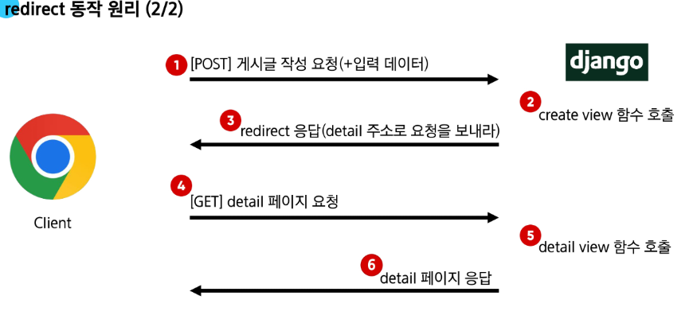

## ORM을 View에서 활용하는 방법

## Read

2가지 Read(조회) 진행

1. 전체 게시글 조회
2. 단일 게시글 조회

**variable routing**: url의 일부를 재활용하는 법 (경로를 변수화 하겠다)

지난번에 배운 variable routing을 본격적으로 활용해보자

## 단일 게시글 조회

1. ulrs파일에서 단일 게시글을 조회할 path를 설정해준다.
    - 단일 게시글을 조회할 때, url에 넣을 게시글 번호를 variable routing으로 넣어준다
    - path에 넣을 ‘url’은 `articles/` 이후에 ‘url’이기 때문에 아래와 같이 적으면 `articles/숫자/` 로 요청이 가게 됨.

```python
# urls.py

app_name = 'articles'
urlpatterns = [
		path('', views.index, name='index'),
		path('<int:pk>/', views.detail, name='detail'),
]
```

1. views파일에서 어떤 게시글을 조회할 것인지 함수를 만들어줌
    - 몇번 게시글인지를 DB에 조회
    - 조회한 상세 게시글 데이터를 템플릿과 함께 응답

```python
# views.py
def detail(request, pk): # url에서 인자를 추가로 받기 때문에 파라미터 추가
		# 1. 단일 게시글 조회
		# get은 찾고자 하는게 없거나 여러개일 때 예외상황을 알려줌.
		article = Article.objects.get(pk=pk)
		
		context = {
				'article': article,
		}
		return render(request, 'articles/detail.html', context)
```

1. html파일에서 views파일에서 받는 context의 키 값인 `article`을 활용해 사용자에게 보여줄 페이지 구성
    - article의 인자들은 .으로 받음(ex. article.title)

```html
<!DOCTYPE html>
<html lang="en">
<head>
  <meta charset="UTF-8">
  <meta name="viewport" content="width=device-width, initial-scale=1.0">
  <title>Document</title>
</head>
<body>
  <h1>Detail</h1>
  <h2>{{ article.pk }} 번째 글</h2>
  <hr>
  <p>제목: {{ article.title }}</p>
  <p>내용: {{ article.content }}</p>
  <p>작성일: {{ article.created_at }}</p>
  <p>수정일: {{ article.updated_at }}</p>
  <hr>
  <a href="">[메인 페이지로]</a>
</body>
</html>

```

- 바로 `articles/1/` 조회를 하면 `DoesNotExist` 발생. → 조회된 데이터가 없다는 뜻 → 조회될 데이터를 넣으면 됨
- `메인 페이지로` 는 뭘까. 뒤로 가기랑 `메인 페이지로`을 눌러서 메인 페이지로 가게 하는 건 다른 것이다.
    - a 태그를 활용해서 메인페이지로 보내주면 됨.

## 전체 게시글에서 단일 게시글로 이동할 수 있도록 해보자

- 왜냐하면, 단일 게시글을 조회하려면 url을 일일이 번호를 변경해줘야 하는 번거로움이 있음
- 전체 게시글에 링크를 걸어보자

1. 메인페이지의 html파일에서 p태그를 a태그로 바꿔서 링크를 건다

```html
<!DOCTYPE index.html>
<!DOCTYPE html>
<html lang="en">
<head>
  <meta charset="UTF-8">
  <meta name="viewport" content="width=device-width, initial-scale=1.0">
  <title>Document</title>
</head>
<body>
  <h1>메인 페이지</h1>
  <hr>
   전체 게시글 출력 
  
    <p>글 번호: {{ article.pk }}</p>
    <a href="">
      글 제목: {{ article.title }}
    </a>
    <p>글 내용: {{ article.content }}</p>
    <hr>
  
</body>
</html>
```

마주치게 될 에러 `NoReverseMatch` 에러. 

- URL에서 문제가 발생했다는 것!
- 알아두자. 디버깅이 쉬워지기 때문.

이 에러가 발생한 이유

- detail url 뒤에 인자(게시글 번호)가 하나 더 있어야 함!
    
    ```html
    <a href="">
    ```
    
    - 인자를 넘겨주는 방식은 공백을 주고 뒤에 넣어주면 됨.

---

## Create

- create로직 구현에는 두 개의 view함수가 필요함
- throw-catch 구조와 유사하지만 이건 저장을 하기 때문에 데이터가 휘발하지 않음

입력을 받을 페이지 → `new` : 사용자 입력 데이터를 받을 페이지를 렌더링

위 페이지에서 보낸 요청을 받을 페이지 → `create` : 사용자가 입력한 요청 데이터를 받아 DB에 저장 

1. urls파일에 new url을 만들자

```python
# urls.py
app_name = 'articles'
urlpatterns = [
    path('', views.index, name='index'),
    path('<int:pk>/', views.detail, name='detail'),
    path('new/', views.new, name='new'),
]
```

1. views파일에 게시글 생성을 위한 작성 페이지를 응답하는 함수를 만들자

```python
# views.py
def new(request):
		return render(request, 'articles/new.html')
```

1. html페이지로 가서 작성 페이지를 구성하자

```html
<!DOCTYPE html>
<html lang="en">
<head>
  <meta charset="UTF-8">
  <meta name="viewport" content="width=device-width, initial-scale=1.0">
  <title>Document</title>
</head>
<body>
  <h1>New</h1>
  <form action="" method="POST">
    <div>
      <label for="title">Title: </label>
      <input type="text" name="title" id='title'>
    </div>
    <div>
      <label for="content">Content: </label>
      <textarea name="content" id="content"></textarea>
    </div>
    <input type="submit">
  </form>
  <hr>

  <a href="">[back]</a>
</body>
</html>
```

- ‘name’이라는 속성이 중요함. 사용자가 입력한 데이터는 저 name이라는 속성에 붙어서 넘어가게 됨.
- textarea태그는 많은 텍스트가 들어가게 할 수 있음
- label 태그에 for 속성은 이 텍스트를 입력했을 때 for가 가리키는 id 박스가 활성화 되도록 하게 해줌
- form태그에 action에는 이 요청을 보낼 주소를 적는데, 여기가 create주소가 들어갈 자리임. 아직 없으니 만들러가보자.

1. urls파일에 create를 만들기 

```python
# urls.py
app_name = 'articles'
urlpatterns = [
    path('', views.index, name='index'),
    path('<int:pk>/', views.detail, name='detail'),
    path('new/', views.new, name='new'),
    path('create/', views.create, name='create'),
]
```

1. views파일에 create함수를 만들자
    - 사용자로부터 입력 받은 데이터를 추출하고
    - 추출한 데이터를 DB에 저장
    - 저장하고 완료되었다는 페이지를 응답하면됨

```python
# views.py
def create(request):
    # 1. 
    title = request.POST.get('title') # html에 name속성에 넣어놓은 key값 쓰면됨
    content = request.POST.get('content')

    # 2. DB에 저장방식 3개
    # # 2.1 
    # article = Article()
    # article.title = title
    # article.content = content
    # article.save()

    # 2.2 # 정비를 하고 저장을 하는 
    article = Article(title=title, content=content) 
    article.save()

    # # 2.3 # 유효성 검사 등이 불가능 
    # Article.objects.create(title=title, content=content)
    # return render(request, 'articles/create.html')

    # client한테 새로운 주소로 요청을 보내게끔 시켜야 함
    # return redirect('articles:index')
    return redirect('articles:detail', article.pk)
```

- GET이 아니라 `POST` 로 데이터를 받자
    - 요청을 보내는 것에 대해 고민을 해봐야 하기 때문! **HTTP request methods**
- 저장 방식은 2번으로 하는게 좋음.
    - 사용자에게 입력받은 데이터기 때문에 받고 저장하는 단계를 나눠서 중간에 유효성 검사 등 과정을 거치는 것이 필요하기 때문이다.

### **HTTP request methods(HTTP 요청 메서드)**
- HTTP = 네트워크 상에서 데이터(리소스)를 주고 받기위한 약속
- 대표적인 메서드
    - GET은 조회의 용도
        - 단점: URL에 데이터가 노출됨(URL을 보면 내가 작성한 데이터가 URL에 포함되어있음을 확인할 수 있다)
        - 장점: 캐싱 가능(자주 사용하는 데이터나 결과를 임시 저장해서 재활용해서 처리 속도를 높이는 기술)
    - POST는 데이터 생성, 전송 등
        - 요청 객체 덩어리 어딘가에 데이터가 있음. (http body에 있음, url에 보내지 않는다!)
        - 때문에 URL에 데이터 노출이 없음
### 정리

- GET : 서버로 부터 데이터를 요청하고 받아오는 조회에 사용
    - 검색 쿼리 전송/웹 페이지 요청/API에서 데이터를 조회 등
    - 특징
        1. 데이터 전송
            - url의 쿼리 문자열을 통해 데이터를 전송
        2. 데이터 제한
            - url 길이에 제한이 있어 대량의 데이터 전송에는 적합하지 않음
        3. 브라우저 히스토리
            - 요청 url이 브라우저 히스토리에 남음
        4. 캐싱 
            - 브라우저는 GET요청의 응답을 로컬에 저장할 수 있음
            - 동일한 url로 다시 요청하면 페이지 로딩 시간을 크게 단축
- POST :  서버에 데이터를 제출하여 리소스를 변경(생성, 수정, 삭제) 하는 데 사용
    - 로그인 정보 제출/파일 업로드/ 새 데이터 생성/ API에서 데이터 변경을 요청
    - 특징
        1. 데이터 전송
            - HTTP Body를 통해 데이터 전송
        2. 데이터 제한
            - GET에 비해 더 많은 양의 데이터를 전송할 수 있음
        3. 브라우저 히스토리
            - POST 요청은 브라우저 히스토리에 남지 않
        4. 캐싱 
            - POST 요청은 기본적으로 캐시 할 수 없음
    

이렇게 되면 `Forbidden (403)` 에러가 발생함. 

- 무엇인가 인증이 실패한 것 → CSRF 토큰이 누락됬다!
- 먼저 HTTP response status code를 알아보자
    - 서버가 클라이언트의 요청에 대한 처리 결과를 나타내는 3자리 숫자
    - 현재 예시 에서는 403 에러 = 서버에 요청이 전달되었지만 권한 때문에 거절되었다는 것을 의미
- **CSRF(Cross-Site-Request-Forgery)**
    - 사이트 간 요청 위조
    - 사용자가 자신의 의지와는 무관하게 해커가 의도한 대로 공격하는 것(해킹 방식)
    - 위조된 인감도장
        1. 신뢰할 수 있는 관계(로그인)
            - 사용자는 은행에 정상적으로 로그인하여, 은행은 사용자를 신뢰한다는 증표(세션 쿠키)를 부라우저에 발급
        2. 악성 위임장(악성 링크)
            - 해커는 미끼 링크를 사용자에게 보냄. 이 링크의 실제 내용은 “내 돈 100만원을 해커에게 송금하라”는 내용이 담겼음.
            - 이를 사용자가 누르면 인증서가 브라우저에 있기 때문에 인증서까지 보내짐
        3. 나도 모르는 날인(요청 전송)
            - 브라우저는 bank.com에 보낼 때마다 인감도장을 자동으로 찍어서 보냄
        4. 은행의 착각(공격 성공) 
            - 은행 입장에서는 정상적인 인감도장이 찍힌 위임장이 도착했으므로, 이 요청이 당신의 진짜 의사라고 믿고 송금을 실행.
- CSRF 공격의 방어
    - Django는 이러한 공격을 막기 위해 CSRF 토큰 이라는 안전장치를 사용
    - 이는 모든 중요한 요청에 대해 “내가 직접 보낸 요청이 맞다”는 일회용 비밀 코드를 함께 보내도록 하여 위조된 요청을 막아줌
    - 그래서 장고는 페이지와 토큰을 주고 사용자는 그 페이지에서 데이터와 토큰을 같이 보냄으로 진짜 서명임을 표현할 수 있음.
- CSRF Token 적용

```html
# new.html
<!DOCTYPE html>
<html lang="en">
<head>
  <meta charset="UTF-8">
  <meta name="viewport" content="width=device-width, initial-scale=1.0">
  <title>Document</title>
</head>
<body>
  <h1>New</h1>
  <form action="" method="POST">
    
    <div>
      <label for="title">Title: </label>
      <input type="text" name="title" id='title'>
    </div>
    <div>
      <label for="content">Content: </label>
      <textarea name="content" id="content"></textarea>
    </div>
    <input type="submit">
  </form>
  <hr>
  <a href="">[back]</a>
</body>
</html>
```

`` 이게 없으면 장고가 똑같은 페이지를 만들어 요청을 보내도 “내가 보낸 페이지가 아니잖아?” 하면서 요청을 거부함. 

- new 페이지를 들어가서 개발자 환경을 키면 form태그 안에 토큰이 숨겨져 있음을 볼 수 있다.

**요청 시 CSRF Token을 함께 보내야 하는 이유**

- Django 서버는 해당 요청이 DB에 데이터를 하나 생성하는(DB에 영향을 주는) 요청에 대해 “Django가 직접 제공한 페이지에서 데이터를 작성하고 있는 것인지”에 대한 확인 수단이 필요한 것(POST는 서버 상태를 변경한다!)
- 겉모습이 똑같은 위조 사이트나 정상적이지 않은 요청에 대한 방어 수단
- 기존 요청 형태
    - 요청 데이터 → 게시글 작성
- 변경 요청 형태
    - 요청 데이터 + 인증 토큰 → 게시글 작성
- POST는 단순 조회(GET)와 달리 리소스의 변경을 요청하는 의미와 기술적 특성을 지님 → DB에 조작을 가하는 요청은 반드시 인증 수단이 필요
    - 토큰을 사용해 최소한의 신원 확인을 하는 것이다.

1. POST요청을 보내면 어떤 응답을 받아야 할까?
    - 예를 들면 “게시글이 생성 되었습니다.” 페이지를 받아야하나?
        - 이것이 어색한 로직임을 알아야 함.(페이지를 줘도 되긴 하다)
        - 이유
            - 클라이언트: 게시글 생성해줘 라고 요청함.(페이지를 원한게 아님)
            - POST
            - 그렇기 때문에 `render` 말고 다른게 필요함
    - `Redirect`
        - 서버는 데이터 저장 후 페이지를 응답하는 것이 아닌 사용자를 적절한 기존 페이지로 보내야 함 → 실제로 서버가 클라이언트를 직접 다른 페이지로 보내는 것이 아닌 클라이언트가 GET 요청을 한번 더 보내도록 응답하는 것!!
        - redirect() : 클라이언트가 인자로 작성된 주소로 다시 요청을 보내도록 하는 함수
        - 동작원리
            1. redirect응답을 받은 클라이언트는 detail url로 다시 요청을 보내게 됨
            2. 결과적으로 detail view 함수가 호출되어 detail view함수의 반환 결과인 detail페이지를 응답 받게 되는 것
            
            → 결국 사용자는 게시글 작성 후 작성된 게시글의 detail 페이지로 이동하는 것으로 느끼게 됨 
            

```python
def create(request):
    # 1. 
    title = request.POST.get('title') # html에 name속성에 넣어놓은 key값 쓰면됨
    content = request.POST.get('content')

    # 2. DB에 저장
    # # 2.1 
    # article = Article()
    # article.title = title
    # article.content = content
    # article.save()

    # 2.2 # 정비를 하고 저장을 하는 
    article = Article(title=title, content=content) 
    article.save()

    # # 2.3 # 유효성 검사 등이 불가능 
    # Article.objects.create(title=title, content=content)
    # return render(request, 'articles/create.html')

    # client한테 새로운 주소로 요청을 보내게끔 시켜야 함
    # return redirect('articles:index')
    return redirect('articles:detail', article.pk)
```

- `return redirect('articles:index')` : 작성 후 메인 페이지
- `return redirect('articles:detail', article.pk)` : 작성 후 글을 쓴 그 페이지를 확인하는 페이지
- 결국 사용자는 글을 쓰고 전송(요청)을 한번 하는데 로그는 POST와 GET 두 개가 찍힘



---

### Delete

상세 페이지에 삭제 버튼을 만들어보자 → 역시 POST 

1. urls파일에서 delete할 파일의 path를 만들어준다 

```python
app_name = 'articles'
urlpatterns = [
    path('', views.index, name='index'),
    path('<int:pk>/', views.detail, name='detail'),
    path('new/', views.new, name='new'),
    path('create/', views.create, name='create'),
    path('<int:pk>/delete/', views.delete, name='delete'),
```

1. views함수에서 delete함수 작성하자
    - 삭제나 수정을 하려면 일단 조회를 해야 함

```python
def delete(request, pk):
    # 1. 어떤 게시글 삭제할 건지 조회
    article = Article.objects.get(pk=pk)

    # 2. 조회한 게시글을 삭제
    article.delete()

    # 3. 메인페이지로 리다이렉트
    return redirect('articles:index')
```

1. detail html파일로 가서 삭제 버튼을 만들자
    - 토큰을 입력하고(POST)
    - input태그의 type속성 submit으로 삭제 버튼 생성
    - form태그의 action속성에 url을 준다

```html
<!DOCTYPE html>
<html lang="en">
<head>
  <meta charset="UTF-8">
  <meta name="viewport" content="width=device-width, initial-scale=1.0">
  <title>Document</title>
</head>
<body>
  <h1>Detail</h1>
  <h2>{{ article.pk }} 번째 글</h2>
  <hr>
  <p>제목: {{ article.title }}</p>
  <p>내용: {{ article.content }}</p>
  <p>작성일: {{ article.created_at }}</p>
  <p>수정일: {{ article.updated_at }}</p>
  <hr>
  <form action="" method="POST">
    
    <input type="submit" value='삭제'>
  </form>
  <a href="">[메인 페이지로]</a>
</body>
</html>

```

---

### Update

두 개의 view함수가 필요함 

- 사용자 입력 데이터를 받을 페이지를 렌더링: edit
- 사용자가 입력한 요청 데이터를 받아 DB에 저장: update

1. urls가서 update 생성하자 

```python
app_name = 'articles'
urlpatterns = [
    path('', views.index, name='index'),
    path('<int:pk>/', views.detail, name='detail'),
    path('new/', views.new, name='new'),
    path('create/', views.create, name='create'),
    path('<int:pk>/delete/', views.delete, name='delete'),
    path('<int:pk>/edit/', views.edit, name='edit'),
]
```

1. views에 edit 함수 정의
    - 조회를 먼저 진행

```python
# 사용자에게 수정하는 form이 담긴 페이지를 응답
def edit(request, pk):
    article = Article.objects.get(pk=pk)
    context = {
        'article': article,
    }
    return render(request, 'articles/edit.html', context)
```

1. 업데이트 데이터를 입력받을 페이지 생성

```html
<!DOCTYPE html>
<html lang="en">
<head>
  <meta charset="UTF-8">
  <meta name="viewport" content="width=device-width, initial-scale=1.0">
  <title>Document</title>
</head>
<body>
  <h1>Edit</h1>
    <form action="" method="POST">
    
    <div>
      <label for="title">Title: </label>
      <input type="text" name="title" id='title' value="{{ article.title }}">
    </div>
    <div>
      <label for="content">Content: </label>
      <textarea name="content" id="content">{{ article.content }}</textarea>
    </div>
    <input type="submit">
  </form>
</body>
</html>
```

- 수정을 할 때에 기존 값이 있어야 함(사용자 편의성)
    - input과 textarea에 value 값을 추가해주면 됨.
    - `<input type="text" name="title" id='title' value="{{ article.title }}">`
    - `<textarea name="content" id="content">{{ article.content }}</textarea>`

1. urls에 update할 파일의 path 추가

```python
app_name = 'articles'
urlpatterns = [
    path('', views.index, name='index'),
    path('<int:pk>/', views.detail, name='detail'),
    path('new/', views.new, name='new'),
    path('create/', views.create, name='create'),
    path('<int:pk>/delete/', views.delete, name='delete'),
    path('<int:pk>/edit/', views.edit, name='edit'),
    path('<int:pk>/update/', views.update, name='update'),
]
```

1. views에서 update함수 정의
```python
def update(request, pk): 
		# 수정도 조회 먼저!!
    article = Article.objects.get(pk=pk)
    # 기존 값을 새롭게 입력받은 값으로 변경 
    article.title = request.POST.get('title')
    article.content = request.POST.get('content')

    article.save()

    return redirect('articles:detail', article.pk)
```