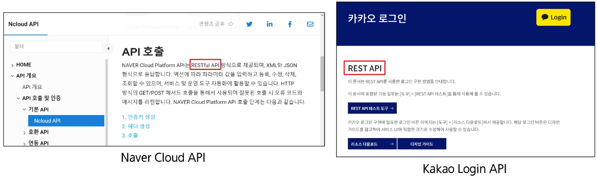
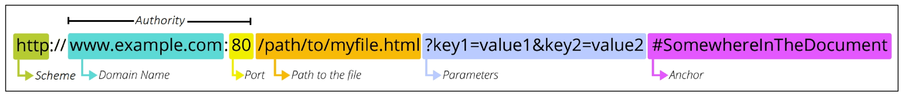
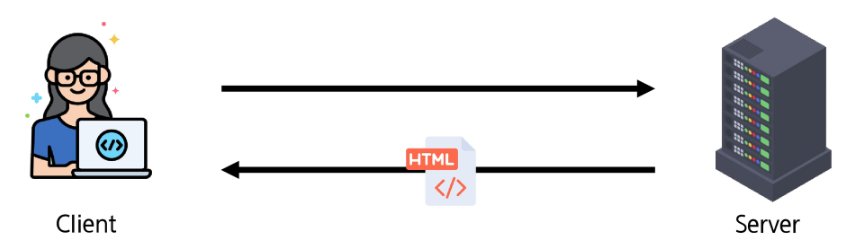
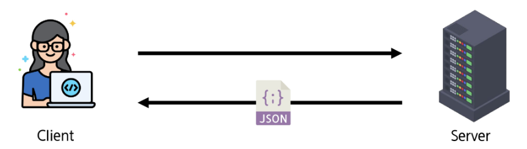
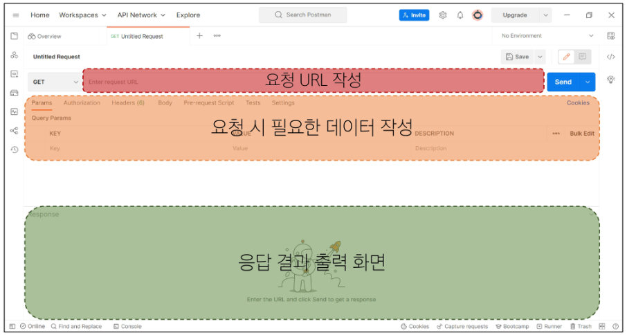
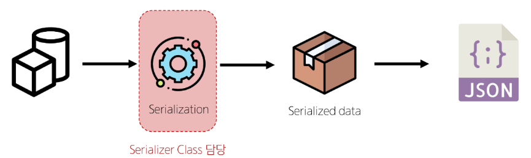

### API

- 두 소프트웨어가 서로 통신 할 수 있게 하는 메커니즘
- 이렇게 요청을 보내면 이렇게 정보를 제공 해줄 것이다 라는 메뉴얼이다.

### Web API

- 웹 서버 또는 웹 브라우저를 위한 API
- 현대 웹 개발은 하나부터 열까지 직접 개발하기보다 여러 **Open API** 들을 활용
- 대표적인 Third Party Open API
    - Youtube API
    - Google Map API
    - Naver Papago API
    - Kakao Map API

## REST API

- API Server를 개발하기 위한 일종의 **소프트웨어 설계 방법론**
- 정의
    - **RESTful API** : “자원을 정의”하고 “자원에 대한 주소를 지정” 하는 전반적인 방법을 서술



### REST에서 자원을 정의하고 주소를 지정하는 방법

- 자원의 `“식별”`
    - **URI(의 하위구조가 URL)** : 인터넷에서  리소스를 식별하는 문자열(웹에서 주어진 리소스의 주소)
        - 즉, 리소스가 어디에 있는지 알려주기 위한 약속
- 자원의 `“행위”`
    
    HTTP Methods : GET, POST + $alpha$
    
- 자원의 `“표현”`
    - JSON 데이터
    

# 자원의 식별

## URL(Uniform Resource Lacator 통합 자원 위치)



### Schema (or Protocol)

- 브라우저가 리소스를 요청하는 데 사용해야 하는 규약
- URL의 첫 부분은 브라우저가 어떤 규약을 사용하는지를 나타냄
- 기본적으로 웹은 http(s)를 요구

### Domain Name

- 요청 중인 웹 서버를 나타냄
- 어떤 웹 서버가 요구되는 지를 가리키며 직접 IP 주소를 사용하는 것도 가능하지만, 사람이 외우기 어렵기 때문에 주로 Domain Name으로 사용
- 예) 도메인 google.com의 IP 주소는 142.251.42.142

### Port

- 웹 서버의 리소스에 접근하는데 사용되는 기술적인 문(Gate)
- HTTP 프로토콜의 표준 포트
    - HTTP - 80
    - HTTPS - 443
- 표준 포트만 작성 시에는 생략이 가능하다

### Path

- 웹 서버의 리소스 경로
- 초기에는 실제 파일이 위치한 물리적 위치를 나타냈지만, 오늘날은 실제 위치가 아닌 추상화된 형태의 구조를 표현
- 예) /articles/create/ 라는 주소가 실제 articles 폴더 안에 create 폴더 안을 나타내는 것은 아님

### Parameters

- 웹 서버에 제공하는 추가적인 데이터
- `'&'` 기호로 구분되는 key-value 쌍 목록
- 서버는 리소스를 응답하기 전에 이러한 파라미터를 사용하여 추가 작업을 수행할 수 있음

### Anchor

- 일종의 “북마크”를 나타내며 브라우저에 해당 지점에 있는 콘텐츠를 표시
- `'#'` 이후 부분은 서버에 전송하지 않음
- 서버에 전달되지 않고 브라우저에게 해당 지점으로 이동할 수 있도록 함

# 자원의 행위

## HTTP Request Methods

- 리소스에 대한 행위 **수행하고자 하는 동작**을 정의
- 종류
    - **GET**
        - 서버에 리소스의 표현을 요청
        - GET을 사용하는 요청은 데이터만 검색해야 함
    - **POST**
        - 데이터를 지정된 리소스에 제출
        - 서버의 상태를 변경
    - **PUT**
        - 요청한 주소의 리소스를 수정
    - **DELETE**
        - 지정된 리소스를 삭제

## HTTP response status codes

특정  HTTP 요청이 **성공적으로 완료 되었는지** 여부를 나타냄 

- Informational responses(100-199)
- Successful responses(200-299)
- Redirection messages(300-399)
- Client error responses(400-499)
- Server error responses(500-599)

# 자원의 표현

### 그동안 서버가 응답(자원을 표현)했던 것

- 장고 서버는 사용자에게 페이지(html)만 응답하고 있었음
- 하지만 서버는 페이지 뿐만 아니라 **다양한 데이터 타입을 응답할 수 있다!!**
- REST API는 이중에서도 **JSON** 타입 응답을 권장함

**BEFORE**

- 페이지 만을 응답하는 서버



**AFTER**

- JSON 데이터를 응답하는 REST API 서버로의 변환
- 이제 장고는 Template 부분에 대한 역할을 담당하지 않게 되고
- Front-end와 Back-end가 분리되어 구성됨



# RESTful API 서버를 구축해보자

## JSON 데이터 응답

1. 가상 환경 생성, 활성화 및 패키지 설치
2. migrate 진행
3. fixtures파일을 load하여 초기 데이터 입력 
4. 서버 실행
5. 터미널 분할(별도의 파이썬 코드를 실행하기 위함!)
    
    5-1. python-request-sample.py 준비
    
    ```python
    import requests
    from pprint import pprint
    
    response = requests.get('http://127.0.0.1:8000/api/v1/articles/')
    
    result = response.json()
    
    print(type(result))
    ```
    
    5-2. 분할한 터미널에서 코드실행 
    
    ```bash
    python python-request-sample.py
    ```
    

### DRF : Django REST framework

- Django에서 Restful API 서버를 쉽게 구축할 수 있도록 도와주는 오픈소스 라이브러리

**설치하고 등록 까지 해주기!**

```bash
pip install djangorestframework
```

```python
INSTALLED_APPS = [
    'articles',
    # DFR는 install 뿐만 아니라 settings에 추가해줘야함 
    'rest_framework',
    "django.contrib.admin",
    "django.contrib.auth",
    "django.contrib.contenttypes",
    "django.contrib.sessions",
    "django.contrib.messages",
    "django.contrib.staticfiles",
]
```

### Postman 설치

Workspaces - My workspace



### Serialization

여러 시스템에서 활용하기 위해 **데이터 구조나 객체 상태를 재구성할 수 있는 포맷으로 변환하는 과정**

- 데이터 구조나 객체 상태를 나중에 재구성할 수 있는 포맷으로 변환하는 과정
    
    
    

### Serializer

- Serialization을 진행하여 Serialized data를 반환해주는 클래스

### ModelSerializer

- Django 모델과 연결된 Serializer 클래스
    - 일반 Serializer와 달리 사용자 입력 데이터를 받아 자동으로 모델 필드에 맞추어 Serialization을 진행

- ModelSerializer class 사용 예시
    - Article 모델을 토대로 직렬화를 수행하는 ArticleSerializer 정의
    
    ```python
    # articles/serializers.py
    from rest_framework import serializers
    from .models import Article
    
    class ArticleSerializer(serializers.ModelSerializer):
    		class Meta:
    				model = Article
    				fields = '__all__'
    ```
    

## CRUD with ModelSerializer

### GET method - 조회

- 게시글 데이터 목록을 제공하는 ArticleListSerializer 정의
    
    ```python
    from rest_framework import serializers
    from .models import Article
    
    class ArticleListSerializer(serializers.ModelSerializer):
        class Meta:
            model = Article
            fields = ('id', 'title', 'content',)
    ```
    
- url 및 view 함수 작성
    - 이제 장고는 template역할을 하지 않기 때문에 app_name과 name이 필요하지 않다
    
    ```python
    urlpatterns = [
        # 전체 게시글을 달라고 요청을 보낼 url, 근데 name이 없네??
        # app_name도 없네?
        # 왜냐면 이제 template가 없어져서 안쓰기 때문이다. 
        path('articles/', views.article_list),
        ]
    ```
    
    ```python
    from rest_framework.decorators import api_view
    from rest_framework.response import Response
    
    from .models import Article
    from .serializers import ArticleListSerializer
    
    @api_view(['GET'])
    def article_list(request):
        # 전체 게시글 데이터 조회
        articles = Article.objects.all()
        # Serialization 진행
        serializer = ArticleListSerializer(articles, many=True)
        # serializer 덩어리에서 데이터 추출 (.data 속성)한 것을 응답 
        return Response(serializer.data)
    ```
    

### ModelSerializer의 인자 및 속성

- many 옵션
    - Serialize 대상이 QuerySet인 경우 입력
    
    ```python
    serializer = ArticleListSerializer(articles, many=True)
    ```
    
    **many 옵션을 지정하지 않으면 단일 객체로 처리됩니다**
    
- data 속성
    - Serialized data 객체에서 실제 데이터를 추출
    
    ```python
    return Response(serializer.data) 
    ```
    

### 과거 view 함수와의 응답 데이터 비교

**BEFORE :** HTML에 출력되도록 페이지와 함께 응답했던 view 함수

```python
def index(request):
		articles = Article.objects.all()
		context = {
				'articles': articles,
				}
		return render(request, 'articles/index.html', context)
```

**AFTER** : JSON 데이터로 serialization 하여 페이지 없이 응답하는 view 함수

```python
@api_view(['GET'])
def article_list(request):
    articles = Article.objects.all()
    serializer = ArticleListSerializer(articles, many=True)
    return Response(serializer.data)
```

### ‘api_view’ decorator

- DRF view함수에서는 **필수로 작성**되며 view 함수를 실행하기 전 HTTP 메서드를 확인
- 허용하도록 지시한 메서드에 대해서만 올바르게 답변하며, 목록에 추가하지 않은 다른 메서드 요청에 대해서는 **405 Method Not Allowed**로 응답
- DRF view 함수가 응답해야 하는 HTTP 메서드 목록을 작성

### GET - Detail (단일 게시글 조회)

```python
from rest_framework import serializers
from .models import Article

class ArticleSerializer(serializers.ModelSerializer):
    class Meta:
        model = Article
        fields = '__all__'
```

- url 및 view 함수 작성

```python
# articles/urls.py

urlpatterns = [
		path('articles/<int:article_pk>/', view.article_detail),
```

```python
# articles/articles.py
from .serializers import ArticleListSerializer, ArticleSerializer

@api_view(['GET'])
def article_detail(request, article_pk):
		article = Article.objects.get(pk=article_pk)
		serializer = ArticleSerializer(article)
		return Response(serializer.data)
```

### POST method - 생성

- 게시글 데이터 생성하기
    1. 데이터 생성이 성공했을 경우 201 Created 응답
    2. 데이터 생성이 실패 했을 경우 400 Bad request 응답

```python
# articles/views.py 
from rest_framework import status

@api_view(['GET', 'POST'])
def article_list(request):
    if request.method == "GET":
        # 전체 게시글 데이터 조회
        articles = Article.objects.all()
        # Serialization 진행
        serializer = ArticleListSerializer(articles, many=True)
        # serializer 덩어리에서 데이터 추출 (.data 속성)한 것을 응답 
        return Response(serializer.data)
    elif request.method == 'POST':
        # 1. 사용자가 보낸 입력 데이터를 직렬화
        serializer = ArticleSerializer(data=request.data)
        # 2. 직렬화된 데이터를 유효성 검사
        if serializer.is_valid():
            # 3. 저장
            serializer.save()
            # 4. 저장이 성공했다는 응답(201)
            return Response(serializer.data, status=status.HTTP_201_CREATED)
        # 5. 저장이 실패했다는 응답
        return Response(serializer.errors, status=status.HTTP_400_BAD_REQUEST)
```

### DELETE method - 삭제

- 게시글 데이터 삭제하기
    - 요청에 대한 데이터 삭제가 성공했을 경우는 204 No Content 응답
- DELETE 응답 시 Response()는 기본적으로 data 인자를 필요로 하지 않음
    - `status=status.HTTP_204_NO_CONTENT` 처럼 키워드 인자형태로 값 전달

```python
@api_view(['GET', "DELETE"])
def article_detail(request, article_pk):
    # 단일 게시글 조회
    article = Article.objects.get(pk=article_pk)
    if request.mothod == "GET":
        # 조회 한 결과를 직렬화
        serializer = ArticleSerializer(article)
        return Response(serializer.data)
    
    elif request.method =='DELETE':
        article.delete()
        return Response(status=status.HTTP_204_NO_CONTENT)
```

### PUT method - 수정

- 게시글 데이터 수정하기
    - 요청에 대한 데이터 수정이 성공했을 경우는 200 OK 응답
- ‘partial’ argument
    - 부분 업데이트를 허용하기 위한 인자
    - partial 인자의 기본 값은 **False**
    - partial 인자를 False로 설정하면 title만 수정하려고 해도 content같은 다른 필드들도 함께 전송해야함
        - 즉 그래서 `partial=True` 해줘야 함

```python
@api_view(['GET', "DELETE", "PUT"])
def article_detail(request, article_pk):
		...
    elif request.method == "PUT":
        #1. 사용자로부터 새로운 입력 데이터를 입력받아 직렬화 진행(+기존 데이터)
        serializer = ArticleSerializer(instance=article, data=request.data, partial=True)
        #2. 직렬화 결과를 유효성 검사
        if serializer.is_valid():
            serializer.save()
            # 3. 수정이 성공했다는 응답
            return Response(serializer.data)
        # 4. 수정이 실패했다는 응답 
        return Response(serializer.errors, status=status.HTTP_400_BAD_REQUEST)
```

### PATCH 메서드 - 일부 필드만 수정하기

- PATCH는 리소스의 전체가 아닌, 일부만 수정할 때 사용하는 HTTP 메서드
- Django REST framework에서는 partial=True 설정을 통해 부분 수정을 구현

```python
@api_view(['GET', "DELETE", "PATCH"])
def article_detail(request, article_pk):
    ...
    elif request.method == "PATCH":
        #1. 사용자로부터 새로운 입력 데이터를 입력받아 직렬화 진행(+기존 데이터)
        serializer = ArticleSerializer(instance=article, data=request.data, partial=True)
        #2. 직렬화 결과를 유효성 검사
        if serializer.is_valid():
            serializer.save()
            # 3. 수정이 성공했다는 응답
            return Response(serializer.data)
        # 4. 수정이 실패했다는 응답 
        return Response(serializer.errors, status=status.HTTP_400_BAD_REQUEST)
```

### PUT vs PATCH

| 항목 | PUT | PATCH |
| --- | --- | --- |
| 수정 대상 | 전체 리소스 | 리소스의 일부 필드 |
| 요청 데이터 요구 | 모든 필수 필드 포함 | 수정할 필드만 포함 가능 |
| 사용 목적 | 전체 덮어쓰기 (교체) | 부분 수정 (일부 필드만 갱신) |
| DRF 설정 | 기본 (partial=False) | 반드시  partial=True 필요  |