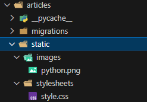
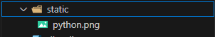
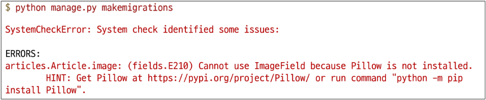

## Static files

- 정적 파일: 서버 측에서 변경되지 않고 고정적으로 제공되는 파일
- 대표적인 종류: CSS, JavaScript파일, 이미지 파일, 폰트 파일

### 웹 서버와 정적 파일

- 웹 서버의 기본 역할: 요청 받은 주소(URL)에 해당하는 자원을 찾아 응답해주는 것
- 정적 파일과 URL의 관계
    - **정적 파일**: 웹 서버가 제공하는 가장 기본적인 자원
    - 정적 파일 제공
        - 웹 서버는 요청 받는 URL을 보고, 서버 컴퓨터의 특정 폴더에 저장된 정적 파일을 찾아 제공
    - URL의 필요성
        - 결국 “정적 파일이 사용자에게 보이려면, 그 파일에 접근할 수 있는 고유한 주소 URL이 반드시 필요하다는 의미

### Static files 경로의 종류

1. 기본 경로 : app/templates/ ..
2. 추가 경로 : settings.py에 TEMPLATES라는 리스트 변수 안에 directories안에 추가함

### 1. Static files 기본 경로

- app폴더/static/
- 기본 경로 CSS 스타일 & 이미지 파일 제공하기
    - 앱 안에 약속된 static폴더 생성하고 (그 안엔 자유) css파일과 image 파일을 넣어놓는다
    
    
    

- 메인 페이지(html)에서 CSS파일과 IMAGE파일을 불러온다.
- 이때 static files 경로는 DTL의 static tag를 사용해야 함
    - built-in tag가 아니기 때문에 import해야함(html에서는 load tag를 사용해 import)
    
    ```html
    <!-- articles/index.html -->
    
    
    <link rel="stylesheet" href="">
    
    ```
    

`` 

- 특정 라이브러리의 태그와 필터를 현재 템플릿에서 사용할 수 있도록 불러오는 역할
- 은 태그를 사용하기 위해, Django 템플릿 시스템에 “이제부터 static 관련 태그를 사용하겠다” 고 알리는 선언문
    - 주의 사항: 맨 위 상단에 쓰되, extends보다는 위에 쓰지 않는다.

``

- [settings.py](http://settings.py) 파일의 STATIC_URL 값을 기준으로, 해당 정적 파일의 전체 URL 경로를 계산하여 생성
- 예를 들어, `STATIC_URL = 'static/'` 이고, CSS파일이 static/css/style.css에 위치한다면, 경로가 필요한 위치에 `` 로 작성

- **STATIC_URL** 이란?
    - 정적 파일의 ‘웹 주소’
    - 이는 서버 컴퓨터에 저장된 실제 파일 경로가 아닌, 오직 웹(브라우저)에서만 사용되는 주소
    - 기본 값: ‘static/’

- 정적 파일 URL이 만들어지기까지
    - **URL + STATIC_URL + 정적 파일 경로**

### 2. Static files 추가 경로

- `STATICFILES_DIRS`에 문자열로 추가 경로를 설정
    - `STATICFILES_DIRS` 란? : 기본 경로 외에 추가적으로 탐색할 경로의 목록을 지정하는 리스트
- `STATICFILES_DIRS` 설정
    
    ```python
    # settings.py
    
    STATICFILES_DIRS = [
    		BASE_DIR / 'static',
    ]
    ```
    
    - 이처럼 설정하면, Django는 기본 경로인 각 앱의 static/ 폴더를 모두 확인한 후, 프로젝트의 최상위 폴더에 있는 static/ 폴더도 추가로 탐색하게 됨
- 추가 경로 이미지 파일 제공하기
    - 설정한 추가 경로에 이미지 파일 배치
        
        
        
    
    - DTL의 static tag를 사용해 이미지 경로 작성
        
        ```html
        <!-- articles/index.html -->
        
        
        ```
        

**정적 파일의 핵심 원리: 주소(URL)가 있어야 찾아갈 수 있다.**

- 컴퓨터에 파일이 존재하는 것만으로는 웹 페이지에 보일 수 없음
- 외부의 손님(브라우저)이 파일을 찾아올 수 있도록 반드시 ‘웹 주소(URL)’라는 문패를 달아줘야 함

| 구분 | 개념 | 비유 |
| --- | --- | --- |
| 서버 (내 컴퓨터) | 실제 파일 경로 | "내 방 책상 위 세 번째 서랍” |
| 웹 (인터넷 세상) | URL (웹 주소) | "서울시 강남구 테헤란로 999” |

## Media files

- 사용자가 웹사이트를 통해 직접 업로드하는 파일

`Static Files` 이 사이트 개발자가 미리 준비해 둔 ‘고정된’ 파일이라면, Media Files는 사이트 운영 중 사용자에 의해 생성되고 변경되는 ‘동적인’ 파일

### 이미지 업로드

**ImageField()**

- 이미지 파일을 업로드하기 위해 사용하는 Django 모델 필드
- 데이터베이스 저장 방식
    - 이미지 파일 자체가 데이터베이스에 저장되는 것이 아님!
    - 데이터베이스에는 upload_to 경로를 기준으로 한 이미지 파일의 경로(문자열)만 저장되고, 실제 파일은 서버의 특정 폴더(MEDIA_ROOT)에 저장
        
        ```python
        # models.py
        
        class Article(models.Model):
        		# 이미지는 'MEDIA_ROOT경로/images/' 경로에 저장되고,
        		# DB에는 'images/sample.png' 와 같은 경로 문자열이 저장됨
        		image = models.ImageField(upload_to='images/')
        ```
        

### 미디어 파일을 제공하기 전 준비사항

1. settings.py에 MEDIA_ROOT, MEDIA_URL 설정
    - MEDIA_ROOT: 미디어 파일의 ‘실제 창고’ 주소
        - 사용자가 업로드한 미디어 파일들이 서버 컴퓨터 어디에 저장될지를 지정하는 절대 경로
        - 서버 내부에서만 사용하는 물리적인 폴더 주소로, Django는 파일을 저장하거나 읽어올 때 이 경로를 사용함
        
        ```python
        # 프로젝트 폴더(BASE_DIR) 안에 'media'라는 폴더를 실제 저장소로 사용
        MEDIA_ROOT = BASE_DIR / 'media' 
        ```
        
    - MEDIA_URL: 미디어 파일의 ‘웹 주소’ 별명
        - MEDIA_ROOT에 저장된 파일들을 웹 페이지에서 접근할 때 사용할 URL의 시작 부분을 지정함
        - STATIC_URL과 동일한 역할로, 실제 저장 위치를 숨기고 웹에서 사용할 공개 주소 별명을 만들어주는 것
        
        ```python
        # media/ 라는 주소로 파일을 요청하면 MEDIA_ROOT 폴더에서 찾아 응답
        MEDIA_URL = 'media/'
        ```
        
    - 정리
        - MEDIA_ROOT는 파일을 저장하고 관리하기 위한 서버의 실제 경로
        - MEDIA_URL은 그 파일을 웹에서 보여주기 위한 가상의 주소
    
2. 작성한 MEDIA_ROOT와 MEDIA_URL에 대한 URL 지정 
    
    ```python
    from django.conf import settings
    from django.conf.urls.static import static
    
    urlpatterns = [
    		path('admin/', admin.site.urls),
    		path('articles/', include('articles.urls')),
    ] + static(settings.MEDIA_URL, document_root=settings.MEDIA_ROOT)
    ```
    
    - settings.MEDIA_URL: ‘media/로 시작하는 URL 요청이 오면’
    - document_root=settings.MEDIA_ROOT: ‘MEDIA_ROOT에 지정된 실제 폴더에서 파일을 찾아라’
    

### 이미지 업로드 구현

- Article 모델 클래스에 image 필드 작성
- blank=True 속성을 작성해 빈 문자열이 저장될 수 있도록 제약 조건 설정
    - 게시글 작성 시 이미지 첨부 없이도 작성 할 수 있도록 하기 위함
        
        ```python
        # articles/models.py
        
        class Article(models.Model):
        		title = models.CharField(max_length=10)
        		content = models.TextField()
        		image = models.ImageField(upload_to='images/', blank=True)
        		created_at = models.DateTimeField(auto_now_add=True)
        		updated_at = models.DateTimeField(auto_now=True) 
        ```
        
    - migration 진행 → 에러 발생
        
        
        
    - Pillow 설치 후 migrations 재진행
        - Pillow: 파이썬에서 이미지를 열고, 크기 조절이나 필터 적용 같은 다양한 편집 작업을 수행한 후 저장할 수 있게 해주는 필수 이미지 처리 라이브러리
    - form요소의 enctype 속성 추가
        
        ```html
        <!-- articles/create.html -->
        
        <h1>CREATE</h1>
        <form action="" method="POST" enctype="multipart/form-data">
        	
        	{{ form }}
        	<input type="submit">
        </form> 
        
        ```
        
    - ModelForm의 2번째 인자로 요청 받은 파일 데이터 작성
        
        ```python
        # articles/views.py
        
        def create(request):
        		if request.method == 'POST':
        				form = ArticleForm(request.POST, request.FILES)
        ```
        
    - 게시글 작성 페이지에서 새로 추가된 input 태그 확인
    - 이미지 업로드 후 이미지 파일 위치 확인
        - MEDIA_ROOT 경로에 업로드 된 이미지 파일
            
            
            
    - 이미지 업로드 후 DB 확인

### 업로드 이미지 제공

- ImageField의 .url 속성
    - 업로드 파일의 웹 주소
    - ImageField나 FileField에 저장된 파일 객체에서 .url 속성을 사용하면, 해당 파일을 웹에서 접근할 수 있는 전체 URL 주소를 얻을 수 있음
        
        ```html
        <!-- articles/detail.html -->
        
        
        	
        
        ```
        
        - 이미지를 업로드하지 않은 게시물도 detail 템플릿을 렌더링 할 수 있도록 if 태그 활용

### 업로드 이미지 수정

- 수정 페이지 form 요소에 enctype 속성 추가
    
    ```html
    <!-- articles/update.html -->
    
    <h1>UPDATE</h1>
    <form action="" method="POST" enctype="multipart/form-data">
    	
    	{{ form }}
    	<input type="submit">
    </form>
    ```
    
- update view 함수에서 업로드 파일에 대한 추가 코드 작성
  ```python
# articles/views.py

def update(request, pk):
		article = Article.objects.get(pk=pk)
		if request.method == "POST":
				form = ArticleForm(request.POST, request.FILES, instance=article)
```