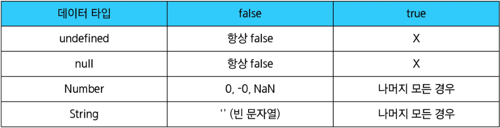
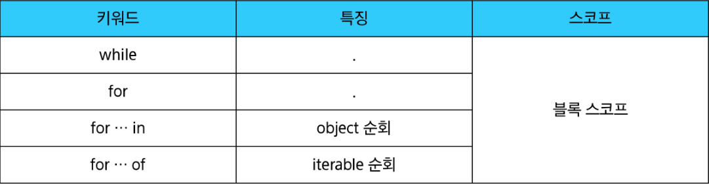
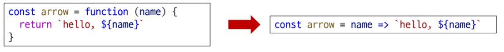

# 데이터 타입

## 원시 자료형(Primitive type)

- 값(value) 자체가 변수에 직접 저장되는 자료형
- 불변(immutable)이며(수정이 불가), 변수 간 할당 시 값이 복사
- Number, String, Boolean, null, undefined
- 예시
    - 변수에 할당될 때 값이 복사됨 → 변수 간에 서로 영향을 미치지 않음
    
    ```jsx
    const a = 'bar'
    console.log(a) // bar
    
    a.toUpperCase()
    console.log(a) // bar
    
    let a = 10
    let b = a
    
    b = 20
    
    console.log(a) // 10
    console.log(b) // 20 
    ```
    

## 참조 자료형(Reference type)

- 데이터가 저장된 메모리의 주소가 변수에 저장되는 자료형
- 가변(Mutable)이며, 변수 간 할당 시 주소가 복사
- Objects(Object, Array, Function)
- 예시
    - 객체를 생성하면 각체의 메모리 주소를 변수에 할당 → 변수 간에 서로 영향을 미침
    
    ```jsx
    const obj1 = {name: 'Alice', age: 30}
    const obj2 = obj1
    
    obj2.age = 40
    console.log(obj1.age) // 40
    console.log(obj2.age) // 40
    ```
    

### 원시 자료형 - Number

- 정수 또는 실수형 숫자를 표현하는 자료형
- 사칙연산 및 나머지 연산 가능
- 문자열과 + 연산 시, 숫자가 문자열로 자동 형 변환되어 연결
- 정수와 실수 구분이 없고, 모든 숫자를 단일 타입으로 처리

### 원시 자료형 - String

- 텍스트 데이터를 표현하는 자료형
- ‘+’ 연산자를 사용해 문자열 끼리 결합
- 뺄셈, 곱셈, 나눗셈 불가능

### 원시 자료형 - Template literals

- 파이썬으로 따지면 f-string이라고 할 수 있겠다
- 내장된 표현식을 허용하는 향상된 문자열 작성 방식
- Backtick(``)을 이용하며, 여러 줄에 걸쳐 문자열을 정의할 수도 있고, JavaScript의 변수를 문자열 안에 바로 연결할 수 있음
- 표현식은 ‘&’와 중괄호({expression})로 표기
- ES6+ 부터 지원

```jsx
const age = 100
const message = `홍길동은 ${age}세입니다.`
console.log(message) // 홍길동은 100세입니다. 
```

### 원시 자료형 - null

- 프로그래머가 의도적으로 ‘값이 없음’을 나타낼 때 사용

```jsx
let a = null
console.log(a) // null
```

### 원시 자료형 - undefined

- 시스템이나 JavaScript 엔진이 ‘값이 할당되지 않음’을 나타낼 때 사용

```jsx
let b
console.log(b) // undefined 
```

### 원시 자료형 - Boolean

- 참과 거짓을 나타내는 논리적인 자료형
- 조건문 또는 반복문에서 Boolean이 아닌 데이터 타입은 **“자동 형변환 규칙”**에 따라 true 또는 false로 변환됨



```jsx
console.log(Boolean([]) // true
console.log(Boolean({}) // true
// 결국 false => 0, "", null, undefined, NaN 이외의 모든 값은 true로 평가된다
// 암묵적인 변환보다는 명시적인 게 좋다
// if(arr.length > 0)
// 코드를 읽기 쉽게 짜보자 
```

## 연산자

### 할당 연산자

- 오른쪽에 있는 피연산자의 평가 결과를 왼쪽 피연산자에 할당하는 연산자
- 단축 연산자 지원

```jsx
let a = 0

a += 10
console.log(a) // 10

a -= 3
console.log(a) // 7

a *= 10
console.log(a) // 70

a %= 7
console.log(a) // 0  
```

### 증가 & 감소 연산자

- 증가 연산자(’++’)
    - 피연산자를 증가(1을 더함)시키고 연산자의 위치에 따라 증가하기 전이나 후의 값을 반환
- 감소 연산자(’--’)
    - 피연산자를 감소(1을 뺌)시키고 연산자의 위치에 따라 감소하기 전이나 후의 값을 반환

→ 코드의 가독성을 위해 a += 1, a -= 1과 같이 더 명시적인 표현을 권장

```jsx
let x = 3
const y = x++
console.log(x, y) // 4 3

let a = 3
const b = ++a
console.log(a, b) // 4 4
```

### 비교 연산자

- 피연산자들(숫자, 문자, Boolean 등)을 비교하고 결과 값을 boolean으로 반환하는 연산자

```jsx
3 > 2 // true
3 < 2 // false

'A' < 'B' // true
'Z' < 'a' // true
'가' < '나' // true 
```

### 동등 연산자(==)

- 두 피연산자가 같은 값으로 평가되는지 비교한 후 boolean 값을 반환
- ‘암묵적 타입 변환’통해 타입을 일치시킨 후 같은 값인지 비교
- 두 피연산자가 모두 객체일 경우 메모리의 같은 객체를 바라보는지 판별

```jsx
console.log(1 == 1) // true
console.log('hello' == 'hello') // true
console.log('1' == 1) // true
console.log(0 == false) // true 
```

### 일치 연산자(===)

- 두 피연산자의 값과 타입이 모두 같은 경우 true를 반환
- 같은 객체를 가리키거나, 같은 타입이면서 같은 값인지를 비교
- 엄격한 비교가 이뤄지며 암묵적 타입 변환이 발생하지 않음
- 특별한 경우를 제외하고는, 예측하지 못한 결과를 방지하기 위해 일치 연산자(===) 사용을 권장

```jsx
console.log(1 === 1) // true
console.log('hello' === 'hello') // true
console.log('1' === 1) // false
console.log(0 === false) // false 
```

### 논리 연산자

- and 연산 : &&
- or 연산 : ||
- not 연산 : !
- 단축 평가 지원

```jsx
true && false // false
true && true // true

false || true // true
false || false // false

!true // false

1 && 0 // 0
0 && 1 // 0
4 && 7 // 7
1 || 0 // 1
0 || 1 // 1
4 || 7 // 4
```

## 조건문

### if : 조건 표현식의 결괏값을 boolean 타입으로 변환 후 참/거짓을 판단

```jsx
<!-- if-statement.html -->

const name = 'customer'
if (name === 'admin') {
	console.log('관리자님 환영해요')
} else if (name === 'customer') {
	console.log('고객님 환영해요')
} else {
	console.log(`반갑습니다. ${name}님`)
} 
```

### 삼항 연산자

- 간단한 조건부 로직을 간결하게 표현할 때 사용한다
- 복잡한 로직이나 대다수의 경우엔 가독성이 떨어지므로 적절한 상황에서만 사용하자

`condition ? expression1 : expression2`

- condition
    - 평가할 조건(true 또는 false로 평가)
- expression1
    - 조건이 true일 경우 반환할 값 또는 표현식
- expression2
    - 조건이 false일 경우 반환할 값 또는 표현식

```jsx
const age = 20
const message = (age >= 18) ? '성인' : '미성년자'
console.log(message) // '성인' 
```

## 반복문

### while 반복문 : 조건문이 참이면 문장을 계속해서 수행

```jsx
while (조건문) {
	// do something
}

<!-- loops-and-iteration.html -->

let i = 0
while (i < 6) {
  console.log(i)
  i += 1
}
```

### for : 특정한 조건이 거짓으로 판별될 때까지 반복

```jsx
for ([초기문]; [조건문]; [증감문]) {
	// do something
}

<!-- loops-ad-iteration.html -->

for (let i = 0; i < 6; i++) {
		console.log(i)
}
```

### for ··· in 반복문 : 객체의 열거 가능한(enumerable) 속성(property)의 키(key)에 대해 반복

```jsx
for (varible in object) {
	statement
}

<!-- loops-and-iteration.html -->

const fruits = {a: 'apple', b: 'banana'}
for (const property in object) {
	console.log(property) // a,b
	console.log(object[property]) // apple, banana
}
```

### for ··· of 반복문 : 반복 가능한(iterable) 객체(배열, 문자열 등)의 값(value)에 대해 반복

```jsx
for (variable in iterable) {
	statement
}

<!-- loops-and-iteration.htm -->

const numbers = [0, 1, 2, 3]
for (const number of numbers) {
	console.log(number) // 0, 1, 2, 3
}
```

### for ··· in 과 for ··· of

```jsx
// for ··· in
// Array
const arr = ['a', 'b', 'c']
for (const elem in arr) {
	console.log(elem) // 0 1 2
}
// Object 
const capitals = {
	korea: '서울',
	japan: '도쿄',
	china: '베이징',
}

for (const capital in capitals) {
	console.log(capital) // korea japan china
}
```

```jsx
// for ··· of
// Array
const arr = ['a', 'b', 'c']
for (const elem in arr) {
	console.log(elem) // a b c
}
// Object 
const capitals = {
	korea: '서울',
	japan: '도쿄',
	china: '베이징',
}

for (const capital in capitals) {
	console.log(capital) // TypeError: capitals is not iterable
}
```

- 객체의 관점에서 보면, 배열의 인덱스도 “
정수 형태의 이름을 가진 열거 가능한 속성”
- for ··· in은 정수가 아닌 이름과 속성을 포함하여 열거 가능한 모든 속성을 반환
- 내부적으로 for ··· in은 배열의 반복자가 아닌 속성 열거를 사용하기 때문에 특정 순서에 따라 인덱스를 반환하는 것을 보장할 수 없음(인덱스가 문자열로 처리되서 인덱스의 숫자로써의 순서가 보장안될 수 있다)
- 즉 인덱스의 순서가 중요한 배열에선 사용 x

### 반복문 사용 시 const 사용 여부

- for 문
    - for (let i = 0; i < arr.length; i++){…}의 경우에는 최초 정의한 i를 ‘재할당’ 하면서 사용하기 때문에 const를 사용하면 에러 발생
- for ··· in, for ··· of
    - 재할당이 아니라, 매 반복마다 다른 속성 이름이 변수에 지정되는 것이므로 const를 사용해도 에러가 발생하지 않음
    - 단 const 특징에 따라 블록 내부에서 변수를 수정할 수 없음



## 함수

- 참조 자료형에 속하며 모든 함수는 Function object

### 함수 구조

```jsx
function name ([param[, param, [..., param]]]) {
	statements
	return value
}
```

- function 키워드
- 함수의 이름
- 함수의 매개변수
- 함수의 body를 구성하는 statements

⚠️return 문이 없거나 return 뒤에 값이 없으면, 함수는 undefined를 반환함

### 함수 정의 2가지 방법

**선언식**

```jsx
function add (num1, num2) {
	return num1 + num2
}
add(1, 2) // 3
```

**표현식**

```jsx
const sub = function (num1, num2) {
	return num1 - num2
}
sub(2, 1) // 1
```

### 함수 선언식 특징

- 호이스팅 됨
- 코드의 구조와 가독성 면에서는 표현식에 비해 장점이 있음

```jsx
add(1, 2) // 3

function add (num1, num2) {
	return num1 + num2
}
```

### 함수 표현식 특징

- 호이스팅 되지 않음
    - 변수 선언만 호이스팅되고 함수 할당은 실행 시점에 이루어짐
- 함수 이름이 없는 ‘익명 함수’를 사용할 수 있음

```jsx
sub(2, 1) // ReferenceError: Cannot access 'sub' before initialization

const sub = function (num1, num2) {
	return num1 - num2
}
```

### 함수 표현식 사용을 권장!!! 그 이유

- 예측 가능성
    - 호이스팅의 영향을 받지 않아 코드 실행 흐름을 더 명확하게 예측할 수 있다
- 유연성
    - 변수에 할당되므로 함수를 값으로 다루기 쉬움
- 스코프 관리
    - 블록 스코프를 가지는 let이나 const와 함께 사용하여 더 엄격한 스코프 관리가 가능

## 매개변수

### 기본 함수 매개변수

### 나머지 매개변수

- 함수 호출 시 인자를 전달하지 않거나 undefined를 전달할 경우, 지정된 기본값으로 매개변수를 초기화

```jsx
const greeting = function (name = 'Anonymous') {
  return `Hi ${name}`
}
greeting() // Hi Anonymous
```

- 정해지지 않은 개수의 인자들을 배열로 모아서 받는 방법
- 작성 규칙
    - 함수 정의 시 나머지 매개변수는 하나만 작성할 수 있음
    - 나머지 매개변수는 함수 정의에서 매개변수 마지막에 위치해야 함

```jsx
const myFunc = function (param1, param2, ...restPrams) {
	return [param1, param2, restPrams]
	}
	
	myFunc(1, 2, 3, 4, 5) // [1, 2, [3, 4, 5]]
	myFUnc(1, 2) // [1, 2, []]
```

### 매개변수와 인자 개수가 불일치 할 때

- 매개변수 개수 > 인자 개수 → 누락된 인자는 undefied로 할당
- 매개변수 개수 < 인자 개수 → 초과 입력한 인자는 사용하지 않음

## Spread syntax

- 전개 구문
- 배열이나 문자열처럼 반복 가능한(iterable) 항목들을 개별 요소로 펼치는 것
- 전개 대상에 따라 역할이 다름
    
    → 배열이나 객체의 요소를 개별적인 값으로 분리하거나 다른 배열이나 객체의 요소를 현재 배열이나 객체에 추가하는 등
    
- 전개 구문 활용
    1. 함수와의 사용
        1. 함수 호출 시 인자 확장
            
            ```jsx
            function myFunc(x, y, z) {
            	return x + y + z
            }
            
            let numbers = [1, 2, 3]
            console.log(myFunc(...numbers)) // 6
            ```
            
        2. 나머지 매개변수(압축) 
            
            ```jsx
            function myFunc2(x, y, ...restArgs) {
            	return [x, y, restArgs]
            }
            
            console.log(myFunc2(1, 2, 3, 4, 5)) // [1, 2, [3, 4, 5]]
            console.log(myFunc2(1, 2)) // [1, 2, []] 
            ```
            
    2. 객체와의 사용
    3. 배열과의 사용

## 화살표 함수 표현식

- 함수 표현식의 간결한 표현법
    1. function 키워드 제거 후 매개변수와 중괄호 사이에 화살표 작성
    2. 함수의 매개변수가 하나 뿐이라면, 매개변수의 ‘()’제거 가능(단 생략하지 않는 것을 권장)
    3. 함수 본문의 표현식이 한 줄이라면, ‘{}’와 ‘return’제거 가능
