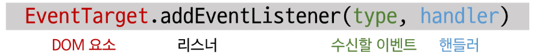
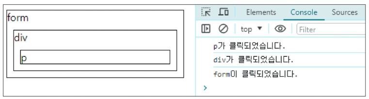
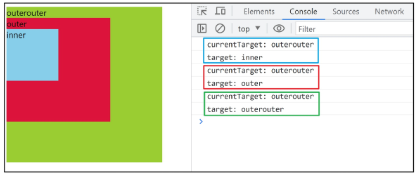

# 이벤트

### 웹에서의 이벤트

- 화면을 스크롤하는 것
- 버튼을 클릭했을 때 팝업 창이 출력되는 것
- 마우스 커서의 위치에 따라 드래그 앤 드롭하는 것
- 사용자의 키보드 입력 값에 따라 새로운 요소를 생성하는 것

→ 웹에서의 거의 모든 상호작용은 이벤트와 함께 함 

## event

- 웹 페이지 상에서 ‘무언가 일어났다는 신호 또는 사건’

### DOM 요소와 이벤트

- 모든 DOM 요소는 다양한 형태의 이벤트를 발생시킬 수 있음
- 예) button 을 클릭하면 click 이벤트, input 값 변경 시 input 이벤트 ···

## event object

- DOM에서 이벤트가 발생하면, 브라우저는 해당 이벤트에 관한 정보를 담은 ‘event object’를 자동으로 생성
- 이벤트 종류
    - mouse
    - input
    - keyboard
    - ···

<aside>
💡

DOM 요소에서 event가 발생하면, 해당 event는 연결된 이벤트 처리기(event handler)에 의해 처리 됨 

</aside>

## event handler

- 특정 이벤트가 발생했을 때 실행되는 (콜백)함수

## .addEventListener()

- 특정 DOM요소에, 지정한 이벤트가 발생했을 때 실행할 이벤트 핸들러를 등록하는 메서드
- 연결(요소 - 이벤트 핸들러(함수))하는 역할
- 예시
    - handleClick 함수가 이벤트 핸들러이며,
    - button.addEventListener()는 그 핸들러를 click 이벤트에 연결해주는 역할
    
    ```jsx
    // 1. 요소 가져오기
    const button = document.querySelector('button')
    
    // 2. 이벤트 핸들러 작성하기(함수 작성하기)
    const handleClick = function () {
    	window.alert('버튼이 클릭 되었습니다!')
    }
    
    // 3. 요소와 이벤트를 리스너로 연결한다.
    button.addEventListener('click', handleClick)
    ```
    

### 이벤트 등록(addEventListener)

- DOM 요소: HTML 문서의 각 태그를 하나의 객체로 변환한 것
- 수신할 이벤트: 무언가 일어났다는 신호 또는 사건
- 핸들러: 특정 이벤트가 발생했을 때 실행되는 (콜백)함수



### addEventListener 구조

- 메서드 구문
    - .addEventListener(type, handler)
    
    ```jsx
    element.addEventListener('click', function (event) {
    })
    ```
    
- type
    - 수신할 이벤트 유형
    - 문자열로 작성(ex. ‘click’, ‘mouseover’ 등)
- handler
    - 이벤트 발생 시 호출되는 콜백 함수
    - 자동으로 event 객체를 첫번째 매개변수로 받음
    - 반환 값 없음

### 이벤트 객체 전달

- 이벤트 발생 시, 이벤트 객체는 자동으로 이벤트 핸들러 함수에 인자로 전달됨
- 핸들러 함수는 이 인자를 통해 이벤트에 대한 상세 정보(이벤트 발생 요소, 이벤트 타입, 추가 데이터 등)에 접근하고 적절한 동작을 수행

```jsx
<button id="btn">버튼</button>
```

```jsx
// 1. 버튼 요소 선택
const btn = document.querySelector("#btn")

// 2. 이벤트 핸들러
const detectClick = function (event) {
	console.log(event) // PointerEvent
	console.log(event.type) // click
}

// 3. 버튼에 이벤트 핸들러를 등록
btn.addEventListener('click', detectClick)
```

### 이벤트 핸들러에서의 this

- 일반 함수를 핸들러로 사용 시, this는 이벤트 리스너가 연결된 요소를 가리킴(event 객체의 currentTarget 속성 값과 동일)
- 그래서 내부에서 `this`를 사용하면
    
    → “지금 이벤트 받은 HTML 요소”를 의미한다.
    
- 하지만 **화살표 함수(⇒)** 는 `this`를 바인딩하지 않아서
    
    → 상위 스코프의 `this`를 그대로 가져오므로
    
    → 이벤트 핸들러에서 요소를 가리키지 않는다.
    
- **즉, 예측하기 어렵고 버그를 만들기 쉬워서**
    
    이벤트 핸들러에서는 `this` 사용하는 걸 비추천하고
    
    → **대신 `event.currentTarget` 사용하는 게 안전하다.**
    

## 버블링

<aside>
💡

form > div > p 형태의 중첩된 구조에 각각 이벤트 핸들러가 연결되어 있을 때, 만약 <p> 요소를 클릭하면 어떻게 될까?

</aside>

```jsx
<form id="form">
	form
	<div id="div">
		div
		<p id="p">p</p>
	</div>
</form>
```

```jsx
const formElement = document.querySelector('#form')
const divElement = document.querySelector('#div')
const pElement = document.querySelector('#p')

const clickHandler1 = function (event) {
	console.log('form이 클릭되었습니다.')
}
const clickHandler2 = function (event) {
	console.log('div가 클릭되었습니다.')
}
const clickHandler3 = function (event) {
	console.log('p가 클릭되었습니다.')
}

formElement.addEventListener('click', clickHandler1)
divElement.addEventListener('click', clickHandler2)
pElement.addEventListener('click', clickHandler3) 
```



- <p> 요소만 클릭했는데도 불구하고 모든 핸들러가 동작함
- 이게 버블링이다

### 버블링

- 한 요소에 이벤트가 발생하면, 해당 요소의 핸들러가 동작한 후 이어서 부모 요소의 핸들러가 동작하는 현상
- 가장 최상단의 조상 요소(document)를 만날 때까지 이 과정이 반복되면서 요소 각각에 할당된 핸들러가 동작

→ 최하위 <p> 요소를 클릭하면 p → div → form 순서로 3개의 이벤트 핸들러가 모두 순차적으로 동작했던 것 

### 이벤트가 정확히 어디서 발생했는지 접근할 수 있는 방법

1. event.currentTarget
    - ‘현재’ 요소
    - 항상 이벤트 핸들러가 연결된 요소만을 참조하는 속성
    - ‘this’ 와 같음
2. event.target
    - 이벤트가 발생한 가장 안쪽의 요소(target)를 참조하는 속성
    - 실제 이벤트가 시작된 요소
    - 버블링이 진행 되어도 변하지 않음

### ‘target’ & ‘currentTarget’ 예시 (1/3)

- 세 요소 중 가장 최상위 요소인 outerouter 요소에만 핸들러가 연결
- 각 요소를 클릭 했을 때 event의 target과 currentTarget의 차이 비교

### ‘target’ & ‘currentTarget’ 예시 (2/3)

- 핸들러는 outerouter에만 연결되어 있지만, 하위 요소 outer와 inner를 클릭해도 해당 핸들러가 동작함
- 클릭 이벤트가 어디서 발생했든 상관없이 outerouter까지 이벤트가 버블링 되어 핸들러를 실행시키기 때문

```jsx
#outer {
  width: 200px;
  height: 200px;
  background-color: crimson;
}

#inner {
  width: 100px;
  height: 100px;
  background-color: skyblue;
}

#outerouter {
  width: 300px;
  height: 300px;
  background-color: yellowgreen;
}
```

```jsx
<div id="outerouter">
  outerouter
  <div id="outer">
    outer
    <div id="inner">inner</div>
  </div>
</div>

<script>
  const outerOuterElement = document.querySelector('#outerouter')

  const clickHandler = function (event) {
    console.log('currentTarget:', event.currentTarget.id)
    console.log('target:', event.target.id)
  }

  outerOuterElement.addEventListener('click', clickHandler)
</script>
```



### 캡처링

- 이벤트가 최상위 조상에서 타겟 요소까지 하위로 전파되는 단계(버블링과 반대)
- table 의 하위 요소 td를 클릭하면, 이벤트는 먼저 최상위 요소부터 아래로 전파됨(캡쳐링)
- 실제 이벤트가 발생한 지점(event.target)에서 실행된 후 다시 위로 전파(버블링)

### 버블링의 필요성

- 만약 다음과 같이 각자 다른 동작을 수행하는 버튼이 여러 개가 있다고 가정하면, 각 버튼마다 서로 다른 이벤트 핸들러를 등록해야 할까
    
    ```jsx
    <div>
    	<button></button>
    	<button></button>
    	<button></button>
    	...
    	<button></button>
    </div> 
    ```
    
- 요소들의 공통 조상에 이벤트 핸들러를 하나만 등록하면, 여러 자식 요소에서 발생하는 이벤트를 한곳에서 효율적으로 다룰 수 있음
- 공통 조상(div)에 할당한 핸들러에서 event.target을 이용하면 실제 어떤 버튼에서 이벤트가 발생했는지 알 수 있기 때문
    
    ```jsx
    const divTag = document.querySelector('div')
    
    divTag.addEventListener('click', function (event) {
    	console.log(event.target)
    })
    ```
    

### event handler 활용

1. 버튼 클릭하면 숫자 1씩 증가해서 출력하기 
    
    ```jsx
    <!-- click-event.html -->
    
    <!DOCTYPE html>
    <html lang="en">
      <head>
        <meta charset="UTF-8" />
        <meta name="viewport" content="width=device-width, initial-scale=1.0" />
        <title>Document</title>
      </head>
    
      <body>
        <button id="btn">버튼</button>
        <p>
          클릭횟수 :
          <span id="counter">0</span>
        </p>
    
        <script>
          // 목표: 버튼을 클릭하면 숫자를 1씩 증가시키기 
    
          // 1. 버튼 클릭 횟수 초기값 설정 
          let initValue = 0
          // 2. 버튼 요소 선택
          const btn = document.querySelector('#btn')
          // 3. 이벤트 핸들러(콜백 함수) 작성 - 버튼 클릭 시 발생할 이벤트 
          const clickHandler = function() {
            console.log("버튼이 눌리는지 확인해보자!")
            // 3.1 버튼 클릭 횟수 +1
            initValue += 1
            // 3.2 클릭 횟수를 보여주는 태그 선택
            const spanTag = document.querySelector("#counter")
            // 3.3 태그의 콘텐츠를 +1 된 버튼 클릭 횟수로 변경
            spanTag.textContent = initValue
          }
    
          // 4. 버튼에 이벤트 핸들러 등록
          btn.addEventListener("click", clickHandler)
        </script>
      </body>
    </html>
    
    ```
    
2. 사용자 입력 값을 실시간으로 출력하기
    
    ```jsx
    <!-- input-event.html -->
    
    <!DOCTYPE html>
    <html lang="en">
      <head>
        <meta charset="UTF-8" />
        <meta name="viewport" content="width=device-width, initial-scale=1.0" />
        <title>Document</title>
      </head>
    
      <body>
        <input type="text" id="text-input" />
        <p></p>
    
        <script>
          // 1. input 요소 선택
          const inputTag = document.querySelector("#text-input")
          // 2. p 요소 선택
          const pTag = document.querySelector("p")
          // 3. 콜백 함수 (input 요소에 input 이벤트가 발생할때마다 실행할 코드)
          const inputHandler = function (event) {
            console.log(event.currentTarget.value)
            // 3.1 작성하는 데이터가 어디에 누적되고 있는지 찾기
            // console.log(event)
            // console.log(event.currentTarget)
            // console.log(event.currentTarget.value)
            // 3.2 p요소의 컨텐츠에 작성하는 데이터를 추가
            pTag.textContent = event.currentTarget.value
          }
    
          // 4. input 요소에 이벤트 핸들러 등록 (input 이벤트)
          inputTag.addEventListener("input", inputHandler)
        </script>
      </body>
    </html>
    ```
    
    - ‘currentTarget’ 주의사항
        - console.log()로 event 객체를 출력할 경우, currentTarget 키의 값은 null을 가짐
        - currentTarget은 이벤트가 처리되는 동안에만 사용할 수 있기 때문
        - 대신 console.log(event.currentTarget)로 확인 가능
        - currentTarget 이후의 속성 값들은 ‘target’을 참고해서 사용하기
3. 사용자 입력 값을 실시간으로 출력하기 + 버튼을 클릭하면 출력된 값의 CSS 스타일을 변경하기
    
    ```jsx
    <!-- click-input-event.html -->
    
    <!DOCTYPE html>
    <html lang="en">
    
    <head>
      <meta charset="UTF-8">
      <meta name="viewport" content="width=device-width, initial-scale=1.0">
      <title>Document</title>
      <style>
        .blue {
          color: blue;
        }
      </style>
    </head>
    
    <body>
      <h1></h1>
      <button id="btn">클릭</button>
      <input type="text" id="text-input">
    
      <script>
        // input 구현
        const inputTag = document.querySelector('#text-input')
        const h1Tag = document.querySelector('h1')
    
        const inputHandler = function (event) {
          h1Tag.textContent = event.currentTarget.value
        }
    
        inputTag.addEventListener('input', inputHandler)
    
        // click 구현
        const btn = document.querySelector('#btn')
    
        const clickHandler = function () {
          // 1. add 방법
          h1Tag.classList.add('blue')
    
          // 2. toggle 방법
          // h1Tag.classList.toggle('blue')
    
          // 3. if 방법
          // if (h1Tag.classList.value) {
          //   h1Tag.classList.remove('blue')
          // } else {
          //   h1Tag.classList.add('blue')
          // }
        }
    
        btn.addEventListener('click', clickHandler)
      </script>
    </body>
    
    </html>
    
    ```
    
4. todo 프로그램 구현
    
    ```jsx
    <!-- todo.html -->
    
    <!DOCTYPE html>
    <html lang="en">
    
    <head>
      <meta charset="UTF-8">
      <meta name="viewport" content="width=device-width, initial-scale=1.0">
      <title>Document</title>
    </head>
    
    <body>
      <input type="text" class="input-text">
      <button id="btn">+</button>
      <ul></ul>
    
      <script>
        // 1. 필요한 요소 선택
        const inputTag = document.querySelector('.input-text')
        const btn = document.querySelector('#btn')
        const ulTag = document.querySelector('ul')
    
        const addTodo = function (event) {
          // 2.1 사용자 입력 데이터 저장
          const inputData = inputTag.value
    
          // 추가 기능) 
          // if(inputData.trim()){} else { alert('할 일을 입력하세요.')}
    
          // 2.2 데이터를 저장할 li 요소를 생성
          const liTag = document.createElement('li')
    
          // 2.3 li 요소 컨텐츠에 데이터 입력
          liTag.textContent = inputData
    
          // 2.4 li 요소를 부모 ul 요소의 자식 요소로 추가
          ulTag.appendChild(liTag)
    
          // 2.5 todo 추가 후 input의 입력 데이터는 초기화
          inputTag.value = ''
        }
    
        // 2. 버튼에 이벤트 핸들러를 등록
        btn.addEventListener('click', addTodo)
    
        const addTodo = function (event) {
          const inputData = inputTag.value
          if (inputData.trim()) { // 빈 문자열 입력 방지
            const liTag = document.createElement('li')
            liTag.textContent = inputData
            ulTag.appendChild(liTag)
            inputTag.value = ''
          } else {
            alert('할 일을 입력하세요..') // 입력이 없을 경우 경고 대화상자를 띄움 
          }
        }
    
      </script>
    </body>
    
    </html>
    ```
    
5. 로또 번호 생성기 구현
    
    ```jsx
    <!DOCTYPE html>
    <html lang="en">
      <head>
        <meta charset="UTF-8" />
        <meta name="viewport" content="width=device-width, initial-scale=1.0" />
        <title>Document</title>
      </head>
    
      <body>
        <h1>로또 추천 번호</h1>
        <button id="btn">행운 번호 받기</button>
        <div></div>
    
        <script src="https://cdn.jsdelivr.net/npm/lodash@4.17.21/lodash.min.js"></script>
        <script>
          // 1. 필요한 요소 선택
          const btn = document.querySelector("#btn")
          const divTag = document.querySelector("div")
    
          // 2. 로또 번호를 화면에 출력하는 함수 (이벤트 핸들러)
          const getLottery = function (event) {
            // 2.1 1부터 45까지의 배열 생성
            const numbers = _.range(1, 46)
            // 2.2 45개의 요소가 있는 배열에서 6개 번호 추출
            const sixNumbers = _.sampleSize(numbers, 6)
            
            // 2.3 6개의 li 요소를 담을 ul 요소 생성
            const ulTag = document.createElement("ul")
            // 2.4 추출한 번호 배열을 "반복하면서 li 요소를 생성
            sixNumbers.forEach((number) => {
              // 2.5 번호를 담을 li 요소 생성 후 입력
              const liTag = document.createElement("li")
              // 2.6 번호를 li 요소에 입력
              liTag.textContent = number
              // 2.7 만들어진 li를 ul 요소에 추가
              ulTag.appendChild(liTag)
            })
            // 2.8 완성한 ul 요소를 div 요소에 추가
            divTag.appendChild(ulTag)
          }
    
          // 3. 버튼 요소에 이벤트 핸들러를 등록
          btn.addEventListener("click", getLottery)
        </script>
      </body>
    </html>
    ```
    

### lodash

- 모듈성, 성능 및 추가 기능을 제공하는 JavaScript 유틸리티 라이브러리 array/object 등 자료구조를 다룰 때, 간편하고 유용한 함수들을 제공

### 이벤트 기본 동작 취소하기

- HTML의  각 요소가 기본적으로 가지고 있는 이벤트가 때로는 방해가 되는 경우가 있어 이벤트의 기본 동작을 취소할 필요가 있음
- 예시
    - form 요소의 제출 이벤트를 취소하여 페이지 새로고침을 막을 수 있음
    - <a> 태그를 클릭했을 때 페이지 이동을 막고, 대신 다른 로직을 수행하게 할 수 있음

### .preventDefault()

- 해당 이벤트에 대한 기본 동작을 실행하지 않도록 지정

### 이벤트 동작 취소 실습

1. copy 이벤트 동작 취소 
    
    ```jsx
      <script>
        // 복사 이벤트 금지 
        const h1Tag = document.querySelector('h1')
    
        h1Tag.addEventListener('copy', function (event) {
          console.log(event)
          event.preventDefault()
          alert('복사 할 수 없습니다.')
        })
    ```
    
2. form 제출 시 페이지 새로고침 동작 취소 
    
    ```jsx
      <form id="my-form">
        <input type="text" name="username">
        <button type="submit">Submit</button>
      </form>
      
        // 폼 제출 시 페이지 새로고침 동작 취소 
        const formTag = document.querySelector('#my-form')
    
        const handleSubmit = function (event) {
          event.preventDefault()
        }
    
        formTag.addEventListener('submit', handleSubmit)
    ```