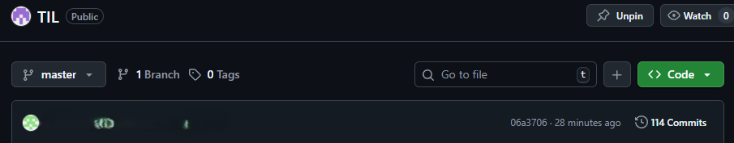

## Git 커밋 작성자(author) 잘못 표시된 문제 해결 정리
### 1. 상황 요약

- 자리를 자주 옮겨서 작업하는 과정에서
어느 날 내 GitHub 레포지토리에 다른 사람 계정으로 커밋이 올라간 것을 확인했다.


- 당시 작업 증명 관리자는 내 계정으로 변경하여 사용했기 때문에 괜찮을 줄 알았으나,
- Git 자체에도 user.name과 user.email 설정이 필요하다는 점을 뒤늦게 기억했다...

결국 로컬 Git 설정을 수정하여 정상적으로 되돌렸다

###  2. 문제 원인

- Git은 커밋 시 로컬 환경에 설정된 사용자 정보를 사용는데

- 즉, 시스템의 Git 설정이 다른 사람 계정으로 되어 있으면
내 GitHub 계정이 아닌 그 사용자 정보로 커밋이 기록됨.

- GitHub은 커밋 메타데이터의 이메일 주소를 기준으로 계정을 식별함.

### 3. 현재 Git 사용자 정보 확인
```bash
git config user.name
git config user.email
```

전역(global) 설정을 확인하려면:
```
git config --global user.name
git config --global user.email
```
### 4. 내 계정으로 사용자 정보 변경
```bash
git config --global user.name "정환승"
git config --global user.email "my_github_email@example.com"
```

⚠️ my_github_email@example.com은 반드시 GitHub에 등록된 이메일이어야 함.
(GitHub → Settings → Emails 메뉴에서 확인 가능)

### 5. 이전 커밋의 작성자 되돌리기 (단일 커밋 수정)

가장 최근 커밋의 작성자 정보를 바꾸려면:
```bash
git commit --amend --author="정환승 <my_github_email@example.com>"
```

수정 후 저장(:wq) → 
```
git push origin master --force
```
### 6. 여러 커밋의 작성자 일괄 수정 (rebase 이용)

최근 10개의 커밋을 수정하고 싶다면:
```bash
git rebase -i HEAD~10
```

에디터가 열리면 바꾸고 싶은 커밋의 pick을 edit으로 변경 후 저장.

Git이 멈출 때마다 다음 명령 실행:
```bash
git commit --amend --author="정환승 <my_github_email@example.com>"
git rebase --continue
```

모두 완료되면 강제 푸시로 덮어쓰기:
```bash
git push origin master --force
```

### 앞으로,,

GitHub 계정이 아닌 Git 설정(user.name, user.email) 로 커밋 작성자가 결정되기 때문에, 이를 인지하자

여러 환경(PC, 노트북, 실습실 등)에서 작업할 경우 항상 Git 설정을 먼저 확인할 것.

커밋 히스토리 수정 시에는 --force 푸시가 필요하므로 신중하게 진행하도록 하자.
