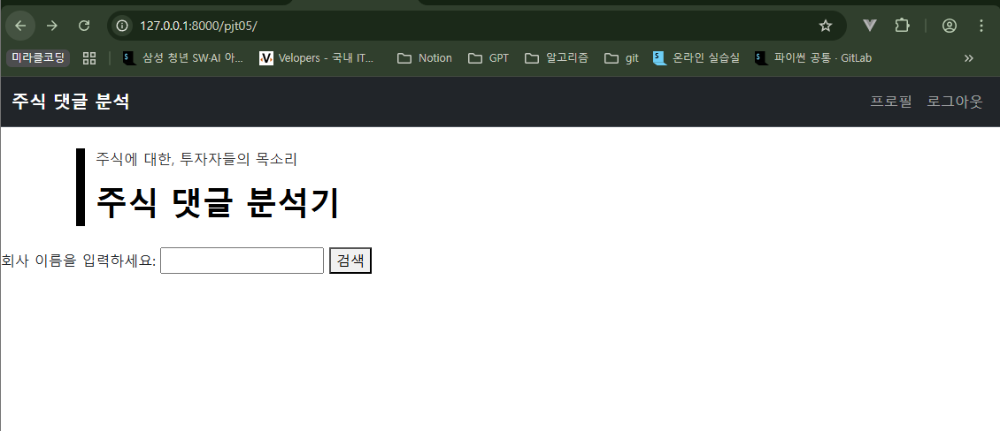
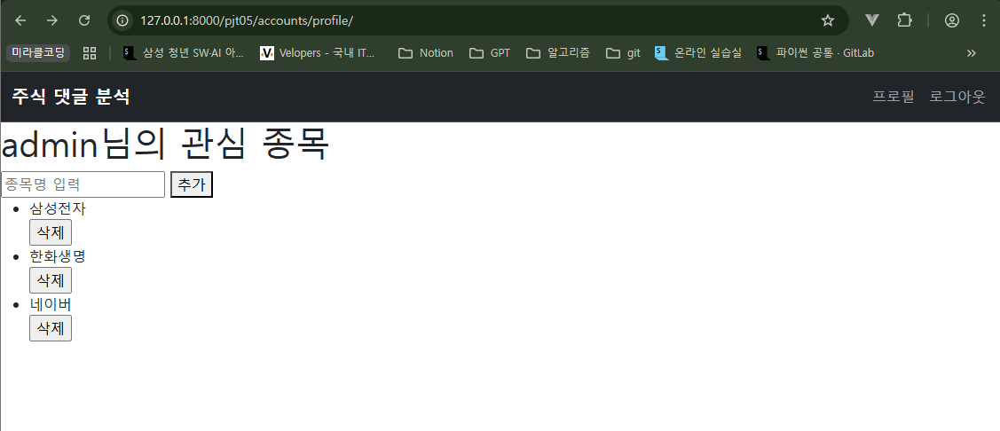
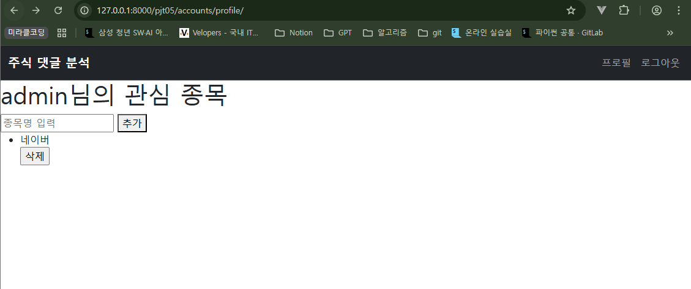

## 프로젝트 개요

기존 주식 데이터 수집 프로젝트에 Django 인증 시스템을 활용한 회원 기능을 추가합니다. 사용자별 프로필 페이지에서 관심 종목을 저장, 조회, 삭제하고 , 종목 클릭 시 크롤링 데이터와 연동하여 보여주는  개인화된 웹 서비스 개발을 목표로 합니다.

### 요구사항

- **회원 관리 기능**
    - **네비게이션 바 구현**: 로그인 상태에 따라 '회원가입/로그인' 또는 '로그아웃/프로필' 메뉴가 동적으로 표시되어야 합니다.
    - **회원가입**: Django의 기본 User 모델을 활용하며, `username`과 `password`를 입력받아 가입을 처리합니다. 가입 성공 시 자동으로 로그인 상태가 되고 메인 페이지로 이동합니다.
    - **로그인/로그아웃**: Django의 인증 시스템(`django.contrib.auth`)을 사용하여 안전한 로그인 및 로그아웃 기능을 구현합니다.
- **관심 종목 기능**
    - **모델 구현**: 사용자별로 관심 종목을 저장하는 모델을 설계합니다. 한 사용자가 동일한 종목을 중복 저장할 수 없도록 `UniqueConstraint`를 적용해야 합니다.
    - **프로필 페이지**: 사용자는 프로필 페이지에서 관심 종목을 조회, 추가, 삭제할 수 있어야 합니다. 등록된 종목이 없으면 안내 메시지를 출력합니다.
    - **크롤링 연동**: 프로필 페이지에서 특정 종목을 클릭하면, DB에 데이터가 있으면 즉시 출력하고, 데이터가 없으면 크롤링을 수행하여 결과를 저장하고 출력해야 합니다.
- **문서화 및 환경 관리**
    - **README 작성**: 프로젝트의 분석 과정, 학습 내용, 어려웠던 점 등을 `README.md` 파일에 상세히 기록해야 합니다.
    - **환경변수 관리**: `.gitignore` 파일을 작성하여 민감한 정보(Secret Key 등)나 불필요한 파일이 Git에 포함되지 않도록 관리해야 합니다.

## 담당 기능 및 구현 화면

- **회원 관리**: 로그인, 로그아웃 기능 `views.login`, `views.logout`
- **모델 구현**: 사용자(User)와 관심 종목(UserinterestStock) 간의 관계 모델링 `CustomUserCreationForm`, `StockForm`
- **프로필 페이지**: `views.profile`
    - 로그인한 사용자의 관심 종목 목록 조회
    - 신규 관심 종목 추가 기능
    - 관심 종목 삭제 기능







## 주요 해결 과정 및 배운점

### 1. 회원가입 시 CustomUserCreationForm 쓰는 이유

```python
# accounts/forms.py
from django.contrib.auth.forms import UserCreationForm
from django.contrib.auth import get_user_model

class CustomUserCreationForm(UserCreationForm):
    class Meta(UserCreationForm.Meta):
        # model = 과거의 기본 User 클래스
        #       => 우리의 현재 User 클래스로 대체
        # get_user_model 함수는 현재 프로젝트에 활성화 되어있는 유저 클래스를 자동으로 반환
        model = get_user_model()
```

- get_user_model 함수를 통해 현재 프로젝트에 활성화 되어있는 유저 클래스를 자동으로 반환받는다.
- 그냥 UserCreationForm을 사용하게 되면, 우리가 만든 accounts.User를 참조하고 있는데 model은 User를 사용하고 있어 오류가 발생한다.

### 2. Form 과 ModelForm의 차이

```python
def signup(request):
    if request.method == "POST":
        form = CustomUserCreationForm(request.POST)  # Form
        if form.is_valid():
            user = form.save()
            auth_login(request, user)
            return redirect('contentfetch:stock_finder')
    else:
        form = CustomUserCreationForm()
    context = {
        'form': form,
    }
    return render(request, 'accounts/signup.html', context)

def login(request):
    if request.method == "POST":
        form = AuthenticationForm(request, request.POST)  # ModelForm
        if form.is_valid():
            auth_login(request, form.get_user())
            return redirect('contentfetch:stock_finder')
    else:
        form = AuthenticationForm()

    context = {
        'form': form,
    }
    return render(request, 'accounts/login.html', context)
```

- **`ModelForm`**: **모델과 직접 연결**되어 모델의 필드를 기반으로 폼을 자동 생성합니다. `.save()` 메서드로 객체를 쉽게 생성/수정할 수 있습니다. `CustomUserCreationForm`이 여기에 해당합니다.
- **`Form`**: 모델과 직접적인 관련 없이, 독립적인 폼 필드를 정의합니다. 데이터베이스에 저장되지 않는 로그인 폼(`AuthenticationForm`), 검색 폼 등에 적합합니다.

`signup` 기능에서는 `ModelForm`을 사용해 사용자 객체를 DB에 직접 저장했고, `login` 기능에서는 `Form`을 사용해 입력된 정보의 유효성만 검증하고 DB와는 별개인 인증 로직을 수행했습니다.

### 3. `ForeignKey`와 `UniqueConstraint`를 이용한 관계 모델링

```python
class UserinterestStock(models.Model):
    user_name = models.ForeignKey(
        settings.AUTH_USER_MODEL,
        on_delete=models.CASCADE
    )
    stock_name = models.CharField(max_length=255)
    created_at = models.DateTimeField(auto_now_add=True)

    class Meta:
        constraints = [
            models.UniqueConstraint(
                fields=["user_name", "stock_name"],
                name='unique_user_stock',
            )
        ]
```

### 4. FK

필드명에 _id 붙음

- **`ForeignKey` (외래 키)**: `User`와 `UserinterestStock` 모델 간의 1:N 관계를 설정했습니다. Django ORM이 `ForeignKey` 필드(`user`)를 실제 데이터베이스에는 `user_id`라는 컬럼으로 생성한다는 것을 확인했습니다.
- **`UniqueConstraint` (고유성 제약)**: **한 명의 사용자가 동일한 주식을 중복으로 등록하는 것을 방지**하기 위해 `Meta` 클래스에 제약 조건을 추가했습니다. `fields`에 `['user', 'stock_name']`을 함께 지정하여, 두 필드의 조합이 테이블 전체에서 고유하도록 설정했습니다. 이는 애플리케이션 레벨이 아닌 **데이터베이스 레벨에서 데이터의 무결성을 보장**하는 강력한 방법임을 배웠습니다.

### 5. UniqueConstraint → IntegrityError

```python
from django.db import IntegrityError
from django.contrib import messages

@login_required
def stock_add(request):
    if request.method == "POST":
        form = StockForm(request.POST)
        if form.is_valid():
            try:
                # 1. commit=False로 객체 생성
                interest_stock = form.save(commit=False)
                # 2. user 할당
                interest_stock.user_name = request.user
                # 3. 최종 저장
                interest_stock.save()
            # UniqueConstraint 위반 시 오류 발생
            except IntegrityError:
                messages.error(request, '이미 등록된 관심 종목입니다.')

            return redirect('accounts:profile')
    else:
        form = StockForm()
    context = {
        'form': form,
    }
    return render(request, 'accounts/profile.html', context)
```

### 배운 점

이번 프로젝트를 통해 Django 인증과 데이터 모델링, 그리고 서비스 흐름을 한 덩어리로 연결하는 감각을 얻었다. 먼저 회원가입은 `UserCreationForm`을 그대로 쓰기보다 `get_user_model()`을 참조하는 `CustomUserCreationForm`으로 구현해야 한다는 점을 체득했다. 이렇게 하면 현재 프로젝트에서 활성화된 사용자 모델(기본 User이든 커스텀 User이든)에 유연하게 대응할 수 있어, 나중에 사용자 모델이 바뀌어도 폼 코드를 거의 손대지 않아도 된다. 또한 `signup`은 모델과 직접 연결되는 **ModelForm**을 사용해 `.save()`로 사용자 객체를 DB에 생성하고, `login`은 DB 저장 목적이 아니기 때문에 **Form** 기반의 `AuthenticationForm`으로 인증만 수행하는 구조 차이를 명확히 이해했다.

관심 종목 관리에서는 `ForeignKey`와 `UniqueConstraint`로 데이터 무결성을 확실히 잡는 패턴을 익혔다. 파이썬 필드가 `user`여도 실제 DB에는 `user_id`로 컬럼이 생성되는 ORM 매핑을 확인했고, `(user, stock_name)` 복합 고유 제약을 두어 한 사용자가 동일 종목을 중복 등록하지 못하게 했다. 이 제약은 애플리케이션 레벨 조건문보다 신뢰성이 높고 동시성에도 강하다. 그에 따라 중복 삽입 시 발생하는 `IntegrityError`를 `transaction.atomic()` 블록이나 `get_or_create()`로 다루는 예외 처리 흐름도 몸에 익혔다.

UI 측면에서는 네비게이션 바를 `user.is_authenticated`로 분기해 비로그인 상태(회원가입/로그인)와 로그인 상태(프로필/로그아웃)를 동적으로 렌더링하는 패턴을 확실히 했다. 로그아웃은 보안상 POST로 처리하고 CSRF 토큰을 포함하는 것이 안전한 기본값이라는 점도 정리했다. 프로필에서 종목을 클릭했을 때는 먼저 DB를 조회해 데이터가 있으면 즉시 보여주고, 없으면 크롤링을 수행해 저장 후 출력하는 “조회-없음-수집” 흐름을 정립했다. 불필요한 크롤링을 줄이고 응답 속도를 유지하는 실전형 전략이다.

마지막으로 프로젝트 구조와 설정 관리의 중요성을 체감했다. `settings.py`에는 설정만 두고, `views/urls/models/forms`는 각각의 파일로 분리해 import 순환과 초기화 시점을 깔끔하게 유지해야 한다. 커스텀 유저를 쓸 경우 `AUTH_USER_MODEL`을 초기에 확정하고, 코드에서는 가능하면 문자열 `'app.Model'` 대신 `settings.AUTH_USER_MODEL`과 `get_user_model()`을 일관되게 사용하면 안전하다. 세션 테이블 오류 같은 기본 테이블 부재 문제는 마이그레이션만 제때 적용하면 해결되고, 초기 세팅이 꼬였을 때는 개발 환경에 한해 DB와 마이그레이션을 재정렬하는 절차도 익혀두었다. 전반적으로, 인증–데이터–UI–설정이 하나의 흐름으로 맞물려 돌아가야 서비스가 안정적으로 동작한다는 것을 실제로 체감한 프로젝트였다.