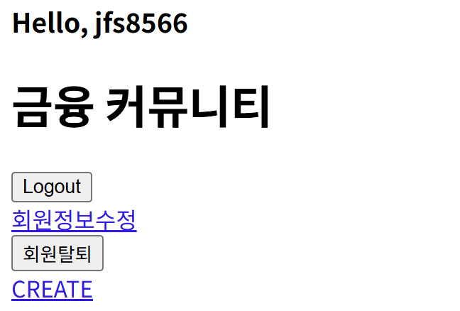
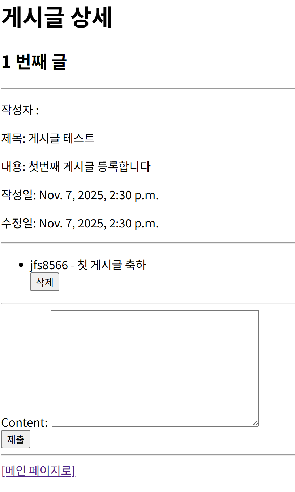
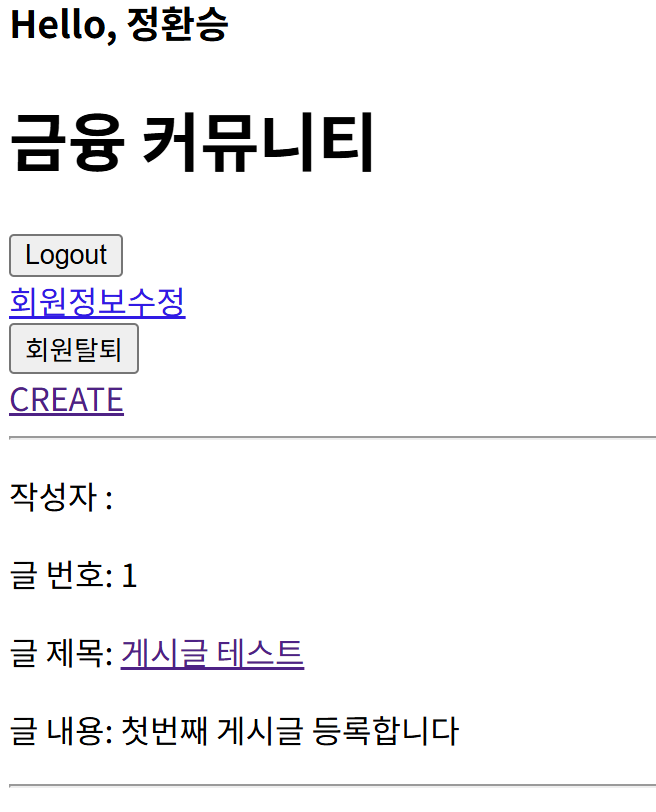
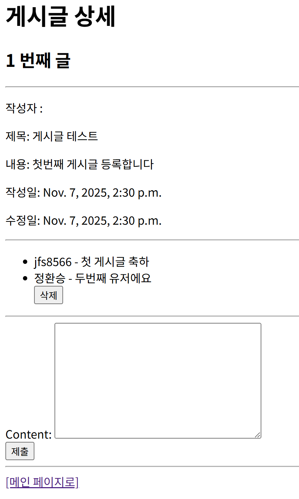
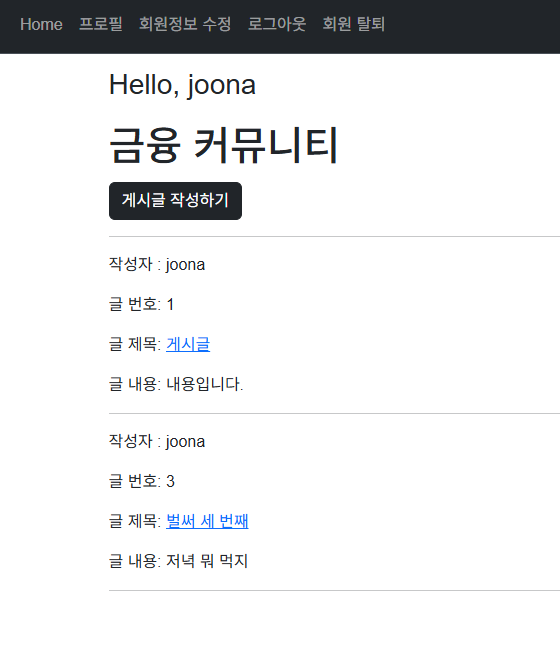
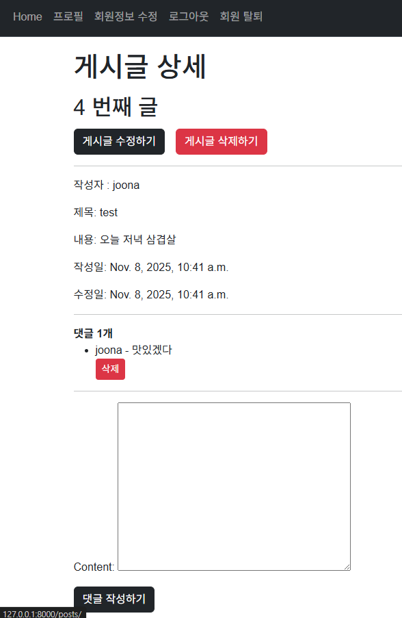
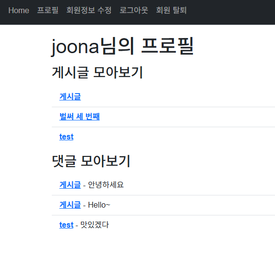

# PJT96 : 프로젝트 기획과 협업

### 목표

- 데이터를 생성, 조회, 수정, 삭제할 수 있는 Web application을 제작한다.
- Django Model과 ORM에 대하여 이해한다.
- Django Form에 대하여 이해한다.
- Django Authentication System에 대하여 이해한다.
- Many to one relationship(N:1)에 대하여 이해한다.

### github 세팅

- [ ]  branch 구조 - github flow
- [ ]  commit 컨벤션
- [ ]  wiki - 각종 컨벤션 등 문서 저장
- [x]  issues - 템플릿, 기능 단위로 할일 체크
- [x]  label - 프로젝트 전체에서 공유할 태그 설정
- [ ]  projects - 마일스톤, actions랑 연결됨
- [ ]  PR - 팀원이 코드리뷰 후 merge할 수 있도록, actions랑 연결
- [ ]  discussions - 기능 외적으로 토의가 필요할 때 사용

### F02

```python
# models.py
from django.db import models
from django.contrib.auth.models import AbstractUser

class User(AbstractUser):
    pass
```

```python
# admin.py
from django.contrib import admin
from django.contrib.auth.admin import UserAdmin
from .models import User

# Register your models here.
admin.site.register(User, UserAdmin)
```

```python
# settings.py
AUTH_USER_MODEL = 'accounts.User'
```

### F03

```python
# forms.py
from django.contrib.auth.forms import UserCreationForm, UserChangeForm
from django.contrib.auth import get_user_model

class CustomUserCreationForm(UserCreationForm):
    class Meta(UserCreationForm.Meta):
        model = get_user_model()

class CustomUserChangeForm(UserChangeForm):
    class Meta(UserChangeForm.Meta):
        model = get_user_model()
        fields = (
            'email',
            'first_name',
            'last_name',
        )
```

### F04, 05

```python
# models.py
from django.db import models
from django.contrib.auth import get_user_model

User = get_user_model()

# Create your models here.
class Post(models.Model):
    title = models.CharField(max_length=200)
    content = models.TextField()
    created_at = models.DateTimeField(auto_now_add=True)
    updated_at = models.DateTimeField(auto_now=True)

    def __str__(self):
        return self.title

class Comment(models.Model):
    post = models.ForeignKey(Post, on_delete=models.CASCADE)
    user = models.ForeignKey(User, on_delete=models.CASCADE)
    content = models.TextField()
    created_at = models.DateTimeField(auto_now_add=True)
```

### F06

```python
# forms.py
from django import forms
from .models import Article, Comment

class ArticleForm(forms.ModelForm):
    class Meta:
        model = Article
        # fields = '__all__'
        fields = ('title', 'content',)

class CommentForm(forms.ModelForm):
    class Meta:
        model = Comment
        fields = ('content',)
```

### F07, 08, 09, 10, 11, 12

```python
# urls.py
from django.urls import path
from . import views

app_name = 'accounts'
urlpatterns = [
    path("login/", views.login, name='login'),
    path("logout/", views.logout, name='logout'),
    path("signup/", views.signup, name='signup'),
    path("update/", views.update, name="update"),
    path("delete/", views.delete, name="delete"),
    path("change_password/", views.change_password, name="change_password"),
]
```

```python
# views.py
from django.shortcuts import render, redirect
from django.contrib.auth.forms import AuthenticationForm, PasswordChangeForm
from django.contrib.auth import login as auth_login
from django.contrib.auth import logout as auth_logout
from django.contrib.auth import update_session_auth_hash
from .forms import CustomUserCreationForm, CustomUserChangeForm

# Create your views here.
def login(request):
    # 현재 요청을 보낸 사용자가 로그인한 사용자인가?
    if request.user.is_authenticated:
        return redirect('posts:index')
    
    if request.method == 'POST':
        form = AuthenticationForm(request, request.POST)
        if form.is_valid():
            auth_login(request, form.get_user())
            return redirect('posts:index')
    else:
        form = AuthenticationForm()
    context = {
        'form': form,
    }
    return render(request, 'accounts/login.html', context)

def logout(request):
    auth_logout(request)
    return redirect('posts:index')

def signup(request):
    if request.user.is_authenticated:
        return redirect('posts:index')
    
    if request.method == "POST":
        form = CustomUserCreationForm(request.POST)
        if form.is_valid():
            # 회원가입이므로 DB에 유저저장 
            form.save()
            return redirect('posts:index')
    else:
        form = CustomUserCreationForm()
    context = {
        'form': form,
    }
    return render(request, 'accounts/signup.html', context)

def delete(request):
    request.user.delete()
    return redirect('posts:index')

def update(request):
    if request.method == "POST":
        form = CustomUserChangeForm(request.POST, instance=request.user)
        if form.is_valid():
            form.save()
            return redirect('posts:index')
    else:
        form = CustomUserChangeForm(instance=request.user)
    context = {
        'form': form,
    }
    return render(request, 'accounts/update.html')

def change_password(request):
    if request.method == "POST":
        form = PasswordChangeForm(request.user, request.POST)
        if form.is_valid():
            user = form.save()
            update_session_auth_hash(request, user)
            return redirect('posts:index')
    else:
        form = PasswordChangeForm(request.user)
    context = {
        'form': form,
    }
    return render(request, 'accounts/change_password.html', context)
```

### F13, 14, 15, 16, 17, 18, 19

```python
# urls.py
from django.urls import path
from . import views

app_name = 'articles'
urlpatterns = [
    path('', views.index, name='index'),
    path('<int:pk>/', views.detail, name='detail'),
    path('create/', views.create, name='create'),
    path('<int:pk>/delete/', views.delete, name='delete'),
    path('<int:pk>/update/', views.update, name='update'),
    # 댓글 생성
    path('<int:pk>/comments/', views.comments_create, name='comments_create'),
    # 댓글 삭제
    path(
        '<int:article_pk>/comments/<int:comment_pk>/delete/',
        views.comments_delete,
        name='comments_delete'
        ),
]
```

```python
# views.py
from django.shortcuts import render, redirect
from django.contrib.auth.decorators import login_required
from .models import Article, Comment
from .forms import ArticleForm, CommentForm

def index(request):
    articles = Article.objects.all()

    context = {
        'articles': articles,
    }
    return render(request, 'articles/index.html', context)

def detail(request, pk):
    article = Article.objects.get(pk=pk)
    comment_form = CommentForm()
    # 특정 게시글에 작성된 모든 댓글 조회 (역참조)
    comments = article.comment_set.all()
    context = {
        'article': article,
        'comment_form': comment_form,
        'comments': comments,
    }
    return render(request, 'articles/detail.html', context)

@login_required
def create(request):
    if request.method == 'POST':
        form = ArticleForm(request.POST)
        if form.is_valid():
            article = form.save(commit=False)
            article.user = request.user
            article.save()
            return redirect('articles:detail', article.pk)
    else:
        form = ArticleForm()
    context = {
        'form': form,
    }
    return render(request, 'articles/create.html', context)

@login_required
def delete(request, pk):
    article = Article.objects.get(pk=pk)
    if request.user == article.user:
        article.delete()
    return redirect('articles:index')

@login_required
def update(request, pk):
    article = Article.objects.get(pk=pk)
    # 현재 수정을 요청하는 유저와 게시글의 작성자가 같은지 확인
    if request.user == article.user:
        if request.method == 'POST':
            form = ArticleForm(request.POST, instance=article)
            if form.is_valid():
                form.save()
                return redirect('articles:detail', article.pk)

        else:
            form = ArticleForm(instance=article)
    else:
        return redirect('articles:index')
    context = {
        'article': article,
        'form': form,
    }
    return render(request, 'articles/update.html', context)

# 댓글 작성 함수
def comments_create(request, pk):
    # 게시글 조회
    article = Article.objects.get(pk=pk)
    # 댓글 데이터 받기
    comment_form = CommentForm(request.POST)
    # 유효성 검사
    if comment_form.is_valid():
        # commit False는 DB에 저장 요청을 잠시 보류하고,
        # 대신 comment 인스턴스는 반환 해줌
        comment = comment_form.save(commit=False)
        # 외래 키 데이터(어떤 게시글에 작성되는지)를 할당
        comment.article = article
        # 외래 키 데이터(누가 작성하는지)를 할당
        comment.user = request.user
        comment.save()
        return redirect('articles:detail', article.pk)
    context = {
        'article': article,
        'comment_form': comment_form,
    }
    return render(request, 'articles/detail.html', context)

# 댓글 삭제 함수
def comments_delete(request, article_pk, comment_pk):
    # 삭제할 댓글 조회
    comment = Comment.objects.get(pk=comment_pk)
    # 댓글 삭제를 요청하는 유저가 현재 삭제되는 댓글의 작성자가 맞는지 확인
    if request.user == comment.user:
        # 댓글 삭제
        comment.delete()
    # 삭제 후 게시글 상세 페이지로 리다이렉트
    return redirect('articles:detail', article_pk)
```

## 결과 화면

### 로그인



### 게시글 등록 및 댓글 달기



### 두번째 계정 회원가입 및 로그인



### 두번째 계정으로 첫번째 유저가 작성한 게시글에 댓글달기

- 첫번째 유저가 작성한 게시글과 댓글은 삭제할 수 없음
    
    
    

### 기능 추가

- Bootstrap 적용
- navbar
- base 템플릿 생성 및 적용
- 프로필 페이지 구현

### 메인페이지 (로그인 전/후)




### 게시글 상세 페이지

- 댓글 개수 추가



### 사용자 프로필 페이지

- 사용자가 작성한 게시글과 댓글 모아보기
    
    
    

## 구현 기능 설명

이 프로젝트는 **Django 기반 CRUD형 웹 서비스**로, 사용자 인증과 게시글·댓글 관리 기능을 중심으로 구성되었습니다.

주요 구현 내용은 다음과 같습니다.

- **회원 관리 (accounts app)**
    - 회원가입, 로그인, 로그아웃, 회원정보 수정, 비밀번호 변경, 회원 탈퇴 기능 구현
    - `CustomUserCreationForm`, `CustomUserChangeForm`으로 기본 `User` 모델 확장
    - Django 기본 인증 시스템(`AuthenticationForm`, `PasswordChangeForm`) 활용
- **게시글·댓글 관리 (articles app)**
    - 게시글 CRUD 기능 구현 (`ArticleForm`)
    - 로그인한 사용자만 글 작성·수정·삭제 가능하도록 `@login_required` 적용
    - 댓글 작성/삭제 기능 구현 (`CommentForm` + ForeignKey 관계 설정)
    - 사용자별 작성한 글·댓글을 **프로필 페이지**에서 조회 가능
- **UI/UX 개선**
    - `Bootstrap`으로 디자인 개선
    - `base.html` 템플릿을 통한 레이아웃 통합
    - `navbar` 추가 및 로그인 여부에 따른 메인페이지 분기
    - 댓글 개수 표시, 프로필 페이지 구현

---

## 학습 내용

- **Django ORM과 관계형 모델 구조 이해**
    
    → `User`, `Post`, `Comment` 간의 **1:N 관계 (ForeignKey)** 설정을 통해 데이터 모델링 실습
    
- **Form & Authentication System 활용**
    
    → Django의 `UserCreationForm`, `AuthenticationForm`, `PasswordChangeForm` 등을 활용해 사용자 인증 절차를 직접 구현
    
- **Template 상속 및 URL 구조화**
    
    → `base.html` 상속 구조로 효율적 템플릿 관리
    
    → 앱별 URL 분리와 `app_name`으로 네임스페이스 관리
    
- **Git 협업 및 브랜치 전략 (GitHub Flow)**
    
    → 브랜치 생성/이동(`git switch`), 로그 확인(`git log --graph`) 등 협업 환경 실습
    

---

## 느낀 점

이번 프로젝트를 통해 **Django의 핵심 흐름(모델 → 폼 → 뷰 → 템플릿)**을 실제로 구현하면서 웹 서비스의 전체 구조를 이해할 수 있었습니다.

처음에는 인증 시스템이나 ORM 관계 설정이 복잡하게 느껴졌지만, 직접 기능을 구현하고 테스트하면서 **데이터 흐름을 중심으로 구현하는 데 익숙해질 수 있었습니다**

또한 Git 브랜치 전략과 협업 구조를 연습하면서 **개발 과정에서의 팀워크와 버전 관리의 중요성**을 실감했습니다.