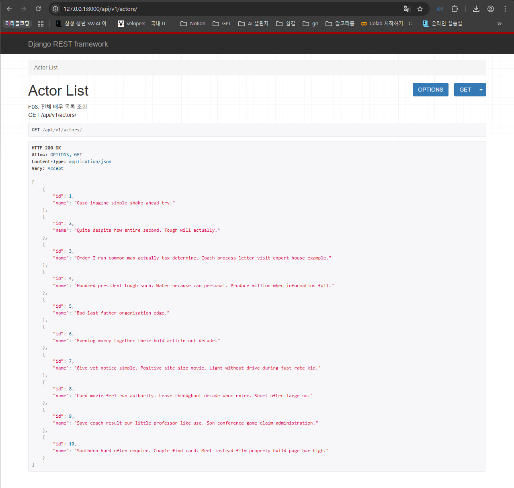
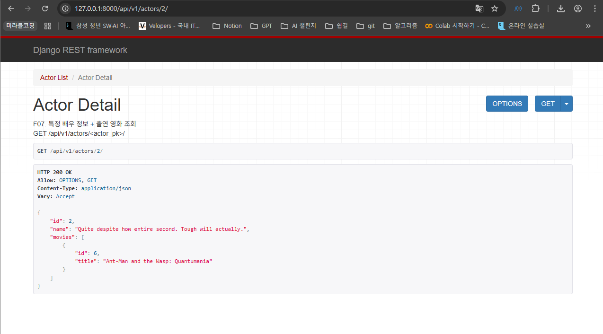
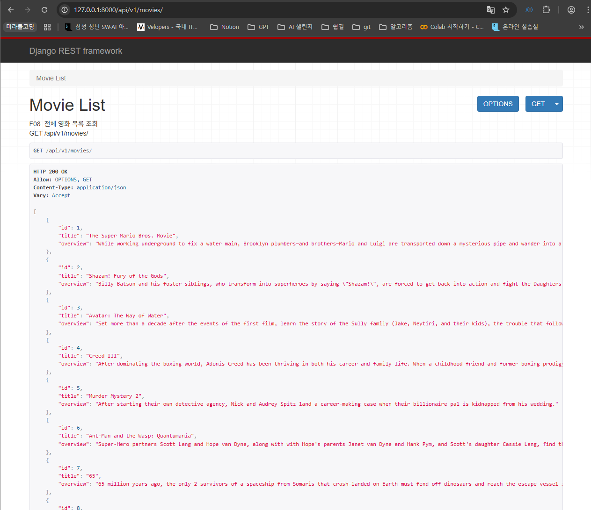
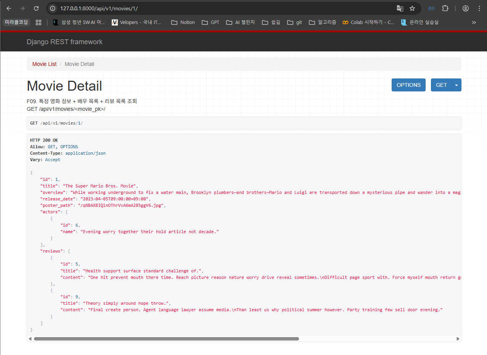
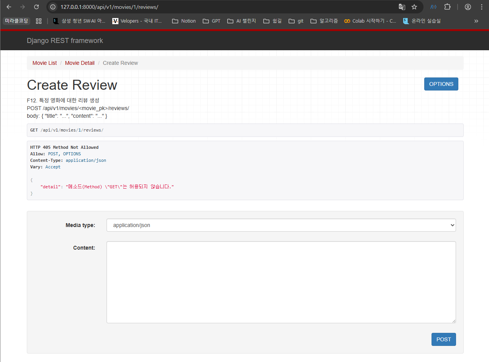
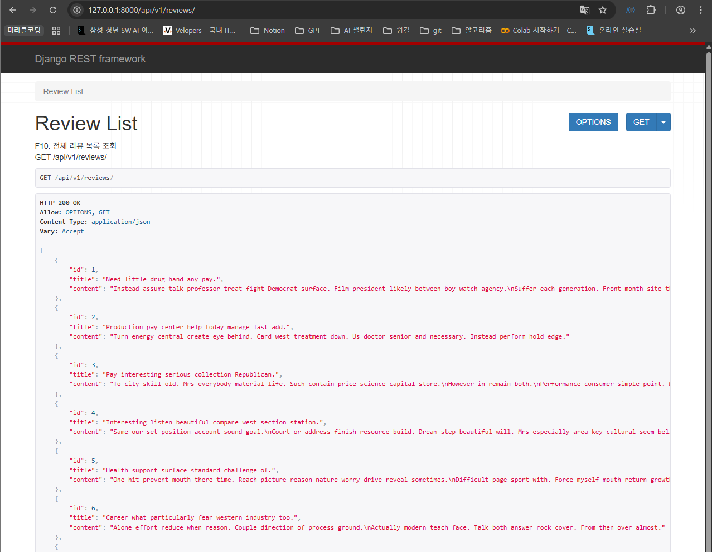
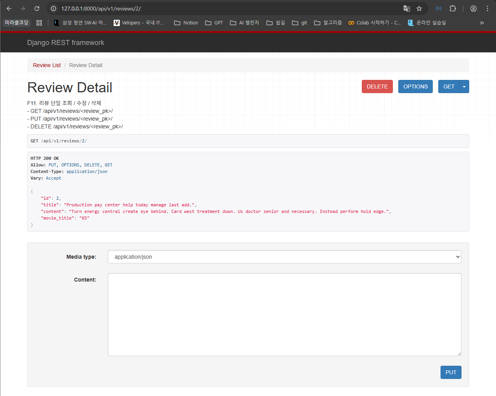
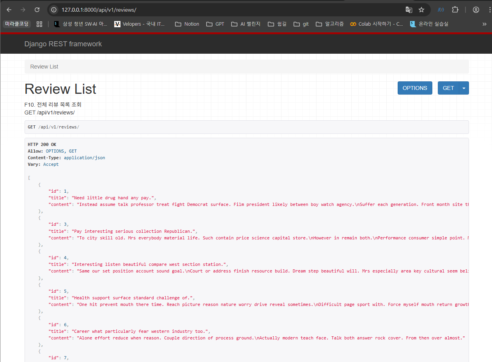

# [관통 PJT] 7회차 도전 과제 | 영화 서비스

## 프로젝트 개요

본 프로젝트는 Django REST Framework (DRF)를 사용하여 영화, 배우, 리뷰 정보를 관리하는 API 서버를 구축합니다.

Actor, Movie, Review 세 가지 모델을 기반으로, 각 모델에 대한 RESTful API 엔드포인트를 제공합니다. 이를 통해 데이터의 생성(Create), 조회(Read), 수정(Update), 삭제(Delete) 기능을 구현합니다.

## API 명세 (요구사항)

구현된 API 엔드포인트는 다음과 같습니다.

### 1. Actors

* **`GET /api/v1/actors/`**
    * 기능: 전체 배우 목록을 조회합니다.
    * 관련 Serializer: `ActorListSerializer`
* **`GET /api/v1/actors/<actor_pk>/`**
    * 기능: 특정 배우의 상세 정보를 조회합니다.
    * 응답: 배우 정보와 함께 해당 배우가 출연한 영화 목록(`movies`)을 포함합니다.
    * 관련 Serializer: `ActorDetailSerializer`

### 2. Movies

* **`GET /api/v1/movies/`**
    * 기능: 전체 영화 목록을 조회합니다.
    * 관련 Serializer: `MovieListSerializer`
* **`GET /api/v1/movies/<movie_pk>/`**
    * 기능: 특정 영화의 상세 정보를 조회합니다.
    * 응답: 영화 정보와 함께 출연 배우 목록(`actors`) 및 영화에 달린 리뷰 목록(`reviews`)을 포함합니다.
    * 관련 Serializer: `MovieDetailSerializer`

### 3. Reviews

* **`GET /api/v1/reviews/`**
    * 기능: 전체 리뷰 목록을 조회합니다.
    * 관련 Serializer: `ReviewListSerializer`
* **`GET /api/v1/reviews/<review_pk>/`**
    * 기능: 특정 리뷰의 상세 정보를 조회합니다.
    * 응답: 리뷰 정보와 함께 해당 리뷰가 작성된 영화의 제목(`movie_title`)을 포함합니다.
    * 관련 Serializer: `ReviewDetailSerializer`
* **`PUT /api/v1/reviews/<review_pk>/`**
    * 기능: 특정 리뷰를 수정합니다.
    * 관련 Serializer: `ReviewCreateUpdateSerializer`, `ReviewDetailSerializer`
* **`DELETE /api/v1/reviews/<review_pk>/`**
    * 기능: 특정 리뷰를 삭제합니다.
* **`POST /api/v1/movies/<movie_pk>/reviews/`**
    * 기능: 특정 영화에 대한 새 리뷰를 생성합니다.
    * 관련 Serializer: `ReviewCreateUpdateSerializer`, `ReviewDetailSerializer`

## 구현 화면

### Actor

- 전체 배우 목록 조회

- 특정 배우 정보와 출연 영화 조회

### Movie

- 전체 영화 목록 조회

- 특정 영화 정보 + 배우 목록 + 리뷰 목록 조회

- 특정 영화에 대한 리뷰 생성

### Reviews

- 전체 리뷰 목록 조회

- 리뷰 단일 조회

- 리뷰 단일 삭제
