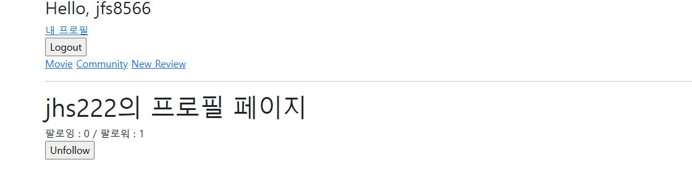
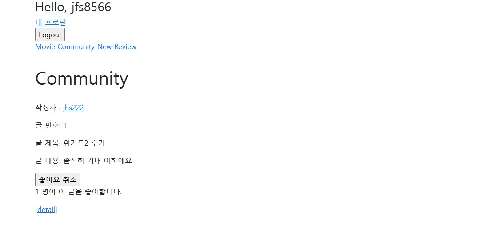
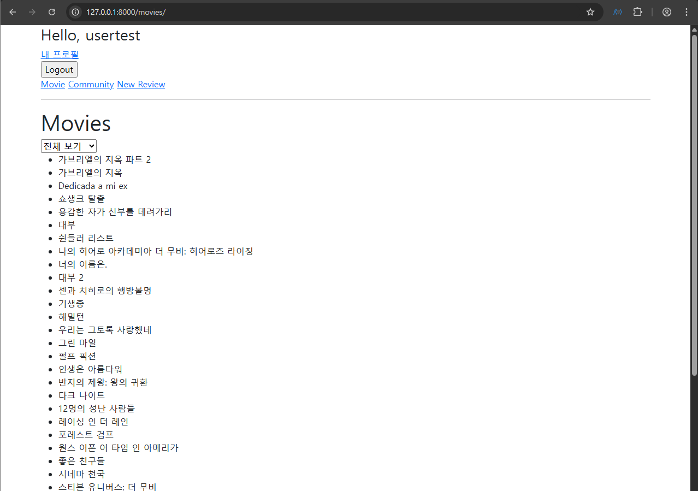
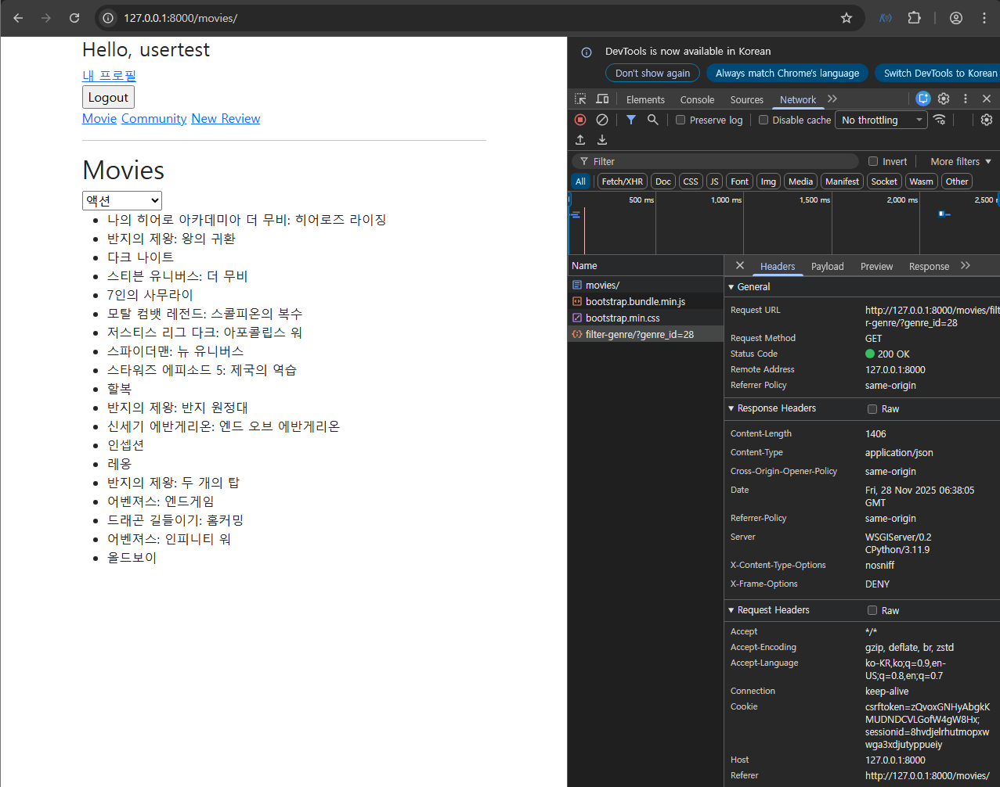

# [관통 PJT] 9회차 도전 과제 | 영화 서비스

## 프로젝트 개요

본 프로젝트는 Django와 AJAX 비동기 통신을 활용하여 사용자 경험을 강화한 영화 추천 커뮤니티 서비스 구축을 목표로 합니다. 페이지 새로고침 없는 유저 팔로우, 리뷰 좋아요, 실시간 영화 장르 필터링 기능을 중점적으로 구현하였으며 , Git을 활용하여 팀원 간의 체계적인 협업 및 프로젝트 관리를 수행했습니다.

---

## 요구사항

### F01: 유저 팔로우 기능
1. 기능 개요
    - 기능 개요특정 사용자를 팔로우하거나 이미 팔로우 중일 경우 언팔로우를 수행하는 기능을 구현. 프로필 페이지에서 즉시 팔로우 상태 및 팔로워/팔로잉 수의 변화를 확인할 수 있음.
2. 상세 구현 내용
    - URL 패턴
        - `/accounts/<user_pk>/follow/View`
    - 함수
        - accounts 앱의 `follow view` 함수 사용
    - 인증/제한
        - `@login_required` 데코레이터를 사용하여 인증된 사용자만 접근 가능
    - 모델 관계
        - User 모델에 ManyToManyField를 사용하여 팔로우 관계를 관리.
3. 구현 결과
   

### F02: 유저 좋아요 기능
1. 기능 개요
    - 사용자가 작성한 리뷰에 '좋아요'를 누르거나 취소할 수 있는 기능을 구현함. 상세 페이지에서 좋아요 상태 및 좋아요 수의 변화를 실시간으로 표시되도록 함.
2. 상세 구현 내용
    - URL 패턴
        - `/community/<review_pk>/like/`
    - 함수
        - community 앱의 `like view` 함수 사용
    - 인증 제한
        - @login_required 데코레이터를 사용하여 인증된 사용자만 좋아요를 진행할 수 있도록 제한
    - 모델 관계
        - Review 모델에 ManyToManyField (like_users)를 사용하여 좋아요 관계를 관리
3. 구현 결과
   

### F03: 장르별 영화 목록 필터링 기능

- 페이지 **새로고침 없이(Asynchronous)** 영화 장르를 필터링하는 비동기 방식
- 드롭다운 메뉴에서 값이 바뀔 때마다, 해당 장르의 id를 포함한 JSON을 `movies/filter-genres/`로 GET 요청을 보낸다.
- 서버는 해당 장르 id를 갖고 있는 Movie 객체를 모두 찾아 JSON Response를 보낸다.





```html
<!-- movies/index.html -->
...
  <script>
    const genreSelect = document.querySelector('#genre-select');

    genreSelect.addEventListener('change', function(event) {
      const genreId = event.target.value;

      // AJAX 요청 보내기
      fetch(`/movies/filter-genre/?genre_id=${genreId}`)
        .then(response => response.json())
        .then(data => {
          // 기존 영화 목록 비우기
          const movieList = document.querySelector('ul');
          movieList.innerHTML = '';

          // 새로운 영화 목록 추가하기
          data.movies.forEach(movie => {
            const li = document.createElement('li');
            li.textContent = movie.title;
            movieList.appendChild(li);
          });
        });
    })
  </script>
```

```python
# movies/views.py
def filter_genre(request):
    genre_id = request.GET.get('genre_id')

    if genre_id == 'all' or not genre_id:
        movies = Movie.objects.all()
    else:
        movies = Movie.objects.filter(genres__id=genre_id)

    # JSON 응답
    movies_data = []
    for movie in movies:
        movies_data.append({
            'title': movie.title,
        })

    return JsonResponse({'movies': movies_data})
```

---

## 문제 상황 및 해결 (Troubleshooting)

### 1. N:M 관계 데이터 필터링 (ORM)

**문제 상황**

ERD 상에서 `Movie`와 `Genre`가 **N:M(다대다)** 관계(`movies_movie_genres` 중계 테이블 존재)로 설정되어 있어, 단순히 `filter(genre=...)`와 같은 방식으로는 데이터를 조회할 수 없었다.

**해결 방법**

Django ORM의 **Lookup(`__`)** 기능을 사용하여 관계를 역참조 필터링했다.

- `views.py`에서 `genres__id`를 사용하여 특정 장르 ID를 가진 영화를 검색

```python
# 수정 전 (단순 필드 조회 시도 - 에러 발생 가능)
# movies = Movie.objects.filter(genre=genre_id)

# 수정 후 (N:M 관계 필터링)
movies = Movie.objects.filter(genres__id=genre_id)
```

### 2. JavaScript 문법 및 로직 오류

**문제 상황**

AJAX 요청 로직 작성 중 스크립트가 작동하지 않거나 목록이 제대로 갱신되지 않았다.

1. **주석 에러**: JS 코드 내부에 파이썬 주석 기호(`#`) 사용으로 인한 `SyntaxError`.
2. **DOM 생성 에러**: `createElement`를 반복문 외부에서 선언하여, 리스트에 마지막 영화 하나만 추가되는 현상 발생.

**해결 방법**

1. 주석 기호를 자바스크립트 표준인 `//`로 변경.
2. `createElement('li')`를 `forEach` 반복문 **내부**로 이동하여, 영화 데이터 개수만큼 요소가 생성되도록 수정.

```jsx
// 수정 전 (반복문 외부 선언)
const li = document.createElement('li'); 
data.movies.forEach(movie => { ... });

// 수정 후 (반복문 내부 선언)
data.movies.forEach(movie => {
    const li = document.createElement('li'); // 매 반복마다 새로운 li 생성
    li.textContent = movie.title;
    movieList.appendChild(li);
});
```

### 3. 404 Not Found 및 JSON 파싱 에러

**문제 상황**

장르 선택 시 콘솔에 다음과 같은 에러 발생:

- `GET ... 404 (Not Found)`
- `Uncaught (in promise) SyntaxError: Unexpected token '<', "<!DOCTYPE "... is not valid JSON`

**원인 분석**

- **404 Error**: `fetch` 요청을 보낸 URL이 `urls.py`에 정의된 경로와 불일치.
- **SyntaxError**: 404 에러로 인해 서버가 JSON 데이터 대신 **HTML 에러 페이지(`<!DOCTYPE html>...`)**를 반환했고, `response.json()`이 이를 파싱하려다 실패했다.

**해결 방법**

`urls.py`와 `script`의 URL 경로를 정확히 일치시킴 (오타 수정).

- **urls.py**: `path('filter-genre/', ...)` (하이픈 사용)
- **JS Fetch**: `fetch('/movies/filter_genre/...')` (언더바 사용) ❌ -> `fetch('/movies/filter-genre/...')` (하이픈으로 수정) ✅

---

## 배운 점

1. **404와 JSON 에러의 관계**: `Unexpected token '<'` 에러가 발생하면, 서버가 JSON이 아닌 HTML(주로 에러 페이지)을 반환하고 있는지 의심해야 한다.
2. **URL 일관성**: Django `urls.py`의 경로와 프론트엔드 요청 URL은 문자 하나(하이픈 vs 언더바)까지 정확히 일치해야 한다.
3. **DOM 조작의 이해**: `createElement`는 호출할 때마다 하나의 객체만 생성하므로, 여러 개를 만들 때는 반드시 반복문 안에서 호출해야 한다.
