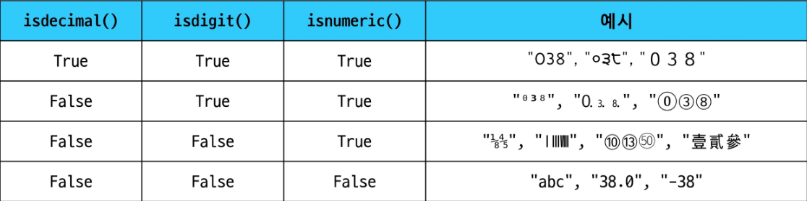

# Data Structure

- 여러 데이터를 효과적으로 사용 관리하기 위한 구조(**str, list, dict 등**) -데이터를 관리하기 위한 ‘정리함’
- **자료구조** : 컴퓨터 공학에서 칭하는 말
    - 효율적인 저장, 관리를 위한 구조를 나눠 놓은 것
    - 단순히 묶는 것을 넘어, **프로그램의 성능과 효율성, 유지보수성에 큰 영향을 미치는 핵심적인 개념**

### 데이터 구조의 활용

- **메서드** : 문자열, 리스트, 딕셔너리 등 각 데이터 구조의 메서드를 호출하여 다양한 기능을 활용
    - 해당 데이터 구조의 데이터를 **효율적으로 조작**하거나 **특정 기능을 수행**하기 위해 제공

### 메서드

**객체에 속한 함수** : 프로그래밍에서 **메서드(Method)**는 **객체(Object)**가 특정 작업을 수행하도록 정의된 함수

- 클래스(class) 내부에 정의되는 함수
- 클래스는 파이썬에서 “타입을 표현하는 방법”
- EX) help 함수를 통해 str을 호출해보면 class 였다는 것을 확인 가능

**지금 시점에 알아야 할 것** : 메서드는 어딘가(클래스)에 속해 있는 함수이며, 각 데이터 타입별로 다양한 기능을 가진 메서드가 존재.

**메서드 호출 방법**

- 데이터 타입 객체.메서드()

# 시퀀스 데이터 구조

### 문자열

- 보통 ‘is’라는 말이 들어있으면 True / False를 반환한다

| 메서드 | 설명 |
| --- | --- |
| `s.find(x)` | x의 첫 번째 위치를 반환, 없으면 -1을 반환 |
| `s.index(x)` | x의 첫 번째 위치를 반환, 없으면 오류 발생 |
| `s.isupper()` | 문자열 내의 모든 문자가 대문자인지 확인 |
| `s.islower()` | 문자열 내의 모든 문자가 소문자인지 확인 |
| `s.isalpha()` | 문자열 내의 모든 문자가 알파벳 인지 확인(단순 알파벳이 아닌 유니코드 상 Letter, 한국어도 포함) |
| `s.isdigit()` | 문자열 내의 모든 문자가 숫자 인지 확인 |
| `s.isspace()` | 문자열 내의 모든 문자가 공백 인지 확인 |

**문자열 조작 메서드(새로운 문자열 반환)**

- 문자열은 불변이라서 새로운 문자열을 반환하는 것
- `.replace(old, new[,count])` : 바꿀 대상 글자를 새로운 글자로 바꿔서 반환
    
    ```python
    text = "Hello, world! world world"
    new_text1 = text.replace("world", "Python")
    new_text2 = text.replace("world", "Python", 1)
    print(new_text1) # Hello, Python! Python Python
    print(new_text2) # Hello, Python! world world
    ```
    
- `.strip([chars])` : 문자열의 시작과 끝에 있는 공백 혹은 지정한 문자를 제거
    
    ```python
    text = '        Hello, world!             '
    new_text = text.strip()
    print(new_text) # 'Hello, world!'
    ```
    

# ✍️추가 학습

`lstrip()` / `rstrip()` : 왼쪽 / 오른쪽 공백 제거

`removeprefix(x)` : 문자열이 x로 시작하면 x 제거

`removesuffix(x)` : 문자열이 x로 끝나면 x 제거

```python
text = "      hello world      "
print(text.lstrip())  #"hello world      "
print(text.rstrip())  #"      hello world"

print(text.removeprefix('      h'))  #"ello world      "
print(text.removesuffix('d      '))  #"      hello worl" 
```

- `split(sep=None, maxsplit=-1)` : sep를 구분자 문자열로 사용하여 문자열에 있는 단어들의 리스트를 반환
    
    ```python
    text = 'Hello, world!'
    words1 = text.split(',')
    words2 = text.split()
    print(words1) # ['Hello', ' world!']
    print(words2) # ['Hello,', 'world!']
    
    text2 = 'hey, hey, hey, hey'
    split1 = text.split(',', 2)
    print(split1) # ['hey', ' hey', ' hey, hey']
    ```
    
- `'separator'.join(iterable)` : iterable 의 문자열을 연결한 문자열을 반환
    
    ```python
    words = ['Hello', 'world!']
    text1 = '-'.join(words)
    text2 = '--'.join(words)
    text3 = ''.join(words)
    print(text1) # 'Hello-world!'
    print(text2) # 'Hello--world!'
    print(text3) # 'Helloworld!'
    
    ```
    

- 대소문자 관련
    
    ```python
    # capitalize
    text = 'heLLo, woRld!'
    new_text1 = text.capitalize()
    print(new_text1)  # Hello, world!
    
    # title
    new_text2 = text.title()
    print(new_text2)  # Hello, World!
    
    # upper
    new_text3 = text.upper()
    print(new_text3)  # HELLO, WORLD!
    
    # lower
    new_text4 = text.lower()
    print(new_text4)  # hello, world!
    
    # swapcase
    new_text5 = text.swapcase()
    print(new_text5)  # HEllO, WOrLD!
    ```
    
- 형식 관련
    
    ```python
    # center(width, fill)
    print('hi'.center(10, "-")) #----hi----
    print('42'.zfill(5)) #00042
    ```
    

### 리스트 값 추가 및 삭제 메서드(원본을 바꿈 → 즉 반환값이 없다는  뜻)

- `.append(x)` : 리스트 마지막에 항목 x를 추가
    
    여러 개 한번에 불가능 !
    
    ```python
    # append
    my_list = [1, 2, 3]
    my_list.append(4)
    print(my_list)  # [1, 2, 3, 4]
    # append는 None을 반환합니다.
    print(my_list.append(5))  # None
    ```
    
- `.extend(iterable)` : 리스트에 다른 반복 가능한 객체의 모든 항목을 추가
    
    반복 가능한 객체가 아니면 추가 불가!
    
    ```python
    # extend
    my_list = [1, 2, 3]
    my_list.extend((4, 5, 6)) # (4, 5, 6) 이어도 결과 같음
    print(my_list)  # [1, 2, 3, 4, 5, 6]
    
    # extend와 append의 비교
    my_list.append([5, 6, 7])
    print(my_list)  # [1, 2, 3, 4, 5, 6, [5, 6, 7]]
    ```
    
- `.insert(i, x)` : 리스트의 지정한 인덱스 i 위치에 항목 x를 삽입
    
    ```python
    my_list = [1, 2, 3]
    my_list.insert(2, 5)
    print(my_list) # [1, 2, 5, 3]  <- 뒤에가 한 칸씩 밀림
    
    my_list.insert(100,9)
    print(my_list) # [1, 2, 5, 3, 9]  <- 인덱스 매우 크게주면 맨 뒤에 삽입
    ```
    

- `.remove(x)` : 리스트에서 첫 번째로 일치하는 항목을 삭제
    
    ```python
    my_list = [1, 2, 3, 2, 2, 2]
    my_list.remove(2)
    print(my_list)  # [1, 3, 2, 2, 2]
    ```
    
- `.pop(i)` : 리스트에서 지정한 인덱스의 항목을 제거하고 반환, 작성하지 않을 경우 마지막 항목을 제거
    
    ```python
    my_list = [1, 2, 3, 4, 5]
    item1 = my_list.pop()
    item2 = my_list.pop(0)
    print(item1) # 5
    print(item2) # 1
    print(my_list) # [2, 3, 4]
    ```
    
- `.clear()` : 리스트의 모든 항목을 삭제
    
    ```python
    my_list = [1, 2, 3]
    my_list.clear()
    print(my_list) # []
    ```
    

### 리스트 탐색 및 정렬 메서드

- `.index(x)` : 리스트에서 첫 번째로 일치하는 항목 x의 인덱스를 반환
    
    ```python
    my_list = [1, 2, 3, 3, 3]
    index = my_list.index(3)
    print(index)  # 2
    ```
    
- `.count(x)` : 리스트에서 항목 x의 개수를 반환
    
    ```python
    my_list = [1, 2, 2, 3, 3, 3]
    count = my_list.count(3)
    print(count) # 3
    ```
    
- `.reverse()` : 리스트의 순서를 역순으로 변경(정렬 X)
    
    ```python
    my_list = [1, 3, 2, 8, 1, 9]
    my_list.reverse()
    print(my_list) # [9, 1, 8, 2, 3, 1]
    ```
    
- `.sort(x)` : 원본 리스트를 오름차순으로 정렬
    
    ```python
    # sort
    my_list = [3, 2, 100, 1]
    my_list.sort()
    # sort는 None을 반환합니다.
    # print(my_list.sort())  # None
    # sort는 원본 리스트를 변경합니다.
    print(my_list)  # [1, 2, 3, 100]
    
    # sort(내림차순 정렬)
    my_list.sort(reverse=True)
    print(my_list)  # [100, 3, 2, 1]
    ```
    

# 복사

### 객체와 참조

**가변/불변 객체의 개념** : 객체 복사의 핵심을 파악하려면, 파이썬 자료구조의 가변과 불변 두 가지 종류를 살펴봐야함

- Mutable(가변) 객체
    - 생성 후 내용을 변경할 수 있는 객체
        - 예: 리스트(list), 딕셔너리(dict), 집합(set)
- Immutable(불변) 객체
    - 생성 후 내용을 변경할 수 없는 객체
        - 예: 정수(int), 실수(float), 문자열(str), 튜플(tuple)

**변수 할당의 의미**

- 객체에 대한 참조를 생성하는 과정
    - 변수는 객체의 메모리 주소를 가리키는 Label 역할을 함
    - ‘=’ 연산자를 사용하여 변수에 값을 할당
        
        > **새로운 객체 생성 후 참조**
        > 
        > - 할당되는 값이 새로운 객체일 경우, 파이썬은 먼저 해당 객체를 메모리에 생성하고 변수가 그 객체를 가리키도록 함
        > 
        > **기존 객체에 대한 참조**
        > 
        > - 이미 메모리에 존재하는 객체를 변수에 할당하면, 새로운 객체를 만들지 않고 해당 객체에 대한 참조만 생성
        

**id() 함수를 사용한 메모리 주소 확인**

```python
X = [1, 2, 3]
Y = X
Z = [1, 2, 3]

print(f'x의 id: {id(x}}') #1682231207424
print(f'y의 id: {id(y)}') #1682231207424
print(f'z의 id: {id(z)}') #1682231224896

print(f'x와 y는 같은 객체인가? {x is y}') # True
print(f'x와 z는 같은 객체인가? {x is z}') # False
```

**가변/불변 메모리 관리 방식**

- 가변 객체
    - 생성 후에도 그 내용을 수정할 수 있음
    - 객체의 내용이 변경되어도 같은 메모리 주소를 유지
- 불변 객체
    - 생성 후 그 값을 변경할 수 없음
    - 새로운 값을 할당하면 새로운 객체가 생성되고, 변수는 새 객체를 참조하게 됨

### 얕은 복사

- 객체의 최상위 요소만 새로운 메모리에 복사하는 방법, 내부에 중첩된 객체가 있다면 그 객체의 참조만 복사됨
- 얕은 복사 구현 방법
    - 리스트 슬라이싱
    - copy() 메서드
    - list() 함수
    
    ```python
    a = [1, 2, 3]
    b = a[:]
    c = a.copy()
    d = list(a)
    ```
    
- 얕은 복사의 한계
    - 2차원 리스트와 같이 변경 가능한 객체 안에 변경 가능한 객체가 있는 경우
    
    ```python
    a = [1, 2, [3, 4, 5]]
    b = a[:]
    
    b[0] = 999
    print(a) # [1, 2, [3, 4, 5]]
    print(b) # [999, 2, [3, 4, 5]]
    
    b[2][1] = 100
    print(a) # [1, 2, [3, 100, 5]]
    print(b) # [999, 2, [3, 100, 5]]
    
    print(f"a[2]와 b[2]가 같은 객체인가? {a[2] is b[2]} # True
    ```
    

### 깊은 복사

- 객체의 모든 수준의 요소를 새로운 메모리에 복사하는 방법, 중첩된 객체까지 모두 새로운 객체로 생성됨
- 깊은 복사 사용
    
    ```python
    import copy
    new_object = copy.deepcopy(original_object)
    ```
    
    - 깊은 복사 예시
        
        ```python
        import copy
        
        a = [1, 2, [3, 4, 5]]
        b = copy.deepcopy(a)
        
        b[2][1] = 100
        
        print(a)  # [1, 2, [3, 4, 5]]
        print(b)  # [1, 2, [3, 100, 5]]
        print(f'a[2]와 b[2]가 같은 객체인가? {a[2] is b[2]}')  # False
        ```
        

### List Comprehension :  간결하고 효율적인 리스트 생성 방법

**[표현식 for 변수 in 순회 가능한 객체 if 조건]**

**list(표현식 for 변수 in 순회 가능한 객체 if 조건)**

```python
# 2차원 배열 생성 시(인접행렬 생성)
data1 = [[0] * (5) for _ in range(5)]
data2 = [[0 for _ in range(5)] for _ in range(5)]
#결과
#[[0, 0, 0, 0, 0],
#[0, 0, 0, 0, 0],
#[0, 0, 0, 0, 0],
#[0, 0, 0, 0, 0],
#[0, 0, 0, 0, 0]]
```

<aside>
💡

**Comprehension을 남용하지 말자! : 파이썬은 가독성이 가장 중요!**

“Simple is better than complex”

“Keep it simple, stupid”

</aside>

### 메서드 체이닝

- 여러 메서드를 연속해서 호출하는 방식
- 모든 메서드가 체이닝을 지원하는 것은 아님
    - 메서드가 객체를 반환할 때만 체이닝이 가능
    - None을 반환하는 메스드는 체이닝이 불가능
        - ex) 리스트의 append(), sort()
- 리스트에서의 메서드 체이닝 예시
    - copy()로 리스트를 복사한 후, sorted() 함수로 정렬
    

### 문자 유형 판별 메서드

- `isdecimal()`
    - 문자열이 모두 숫자 문자(0~9)로만 이루어져 있어야 True
- `isdigit()`
    - isdecimal()과 비슷하지만, 유니코드 숫자도 인식 (’②’ 도 숫자로 인식)
- `isnumeric()`
    - isdigit()과 유사하지만, 몇 가지 추가적인 유니코드 문자들을 인식
    - 분수, 지수, 루트 기호도 숫자로 인식

