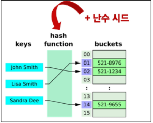

# 딕셔너리

**Key와 Value를 짝이어 저장하는 자료구조**

- 내부적으로 해시 테이블을 사용하여  키-값쌍을 관리합니다.
- 키를 통한 값의 삽입, 삭제, 검색이 데이터의 크기와 관계없이 매우 빠릅니다.
- Key는 hashable한 고유 값이어야 하지만, 값은 중복이 가능하고 어떤 자료형도 저장할 수 있습니다.

**딕셔너리 메서드**

| 메서드 | 설명 |
| --- | --- |
| `D.get(k)` | 키 k에 연결된 값을 반환 (키가 없으면 None을 반환) |
| `D.get(k, v)` | 키 k에 연결된 값을 반환하거나 키가 없으면 기본 값으로 v를 반환 |
| `D.keys()` | 딕셔너리 D의 키를 모은 객체를 반환 |
| `D.values()` | 딕셔너리 D의 값을 모은 객체를 반환 |
| `D.items()` | 딕셔너리 D의 키/값 쌍을 모은 객체를 반환 |
| `D.pop(k)` | 딕셔너리 D에서 키 k를 제거하고 연결됐던 값을 반환 (없으면 오류) |
| `D.pop(k, v)`  | 딕셔너리 D에서 키 k를 제거하고 연결됬던 값을 반환 (없으면 v를 반환) |
| `D.clear()`  | 딕셔너리 D의 모든 키/값 쌍을 제거 |
| `D.setdefault(k)`  | 딕셔너리 D에서 키 k와 연결된 값을 반환 |
| `D.setdefault(k, v)`  | 딕셔너리 D에서 키 k와 연결된 값을 반환, k가 D의 키가 아니면 값 v와 연결한 키 k를 D에 추가하고 v를 반환 |
| `D.update(other)` | other가 제공하는 키/값 쌍으로 딕셔너리를 갱신하고 기존 키는 덮어씀 |

```python
# setdefault
person = {'name': 'Alice', 'age': 25}
print(person.setdefault('country', 'korea'))
# {'name': 'Alice', 'age': 25, 'country': 'korea'}
print(person.setdefault('name', 'korea')) 
# {'name': 'Alice', 'age': 25}

# update([other]
person.update({'name': 'jane', 'country': 'KOREA'}
print(person) # {'name': 'jane', 'age': 25, 'country': 'KOREA'}
```

# ✍️추가 학습

### get(k, v) 과 setdefault(k, v) 의 차이점

```python
# 1. get 메서드를 사용한 방법
def dict_invert1(input_dict):
    new_dict = {}
    for k, v in input_dict.items():
        new_dict.get(v,[]).append(k) 
    return new_dict # AttributeError: 'NoneType' object has no attribute 'append' 
    
# 2. setdefault 메서드를 사용한 방법
def dict_invert2(input_dict):
    new_dict = {}
    for k, v in input_dict.items():
        new_dict.setdefault(v, []).append(k)
    return new_dict
```

- get(k, v)
    
    key가 있으면 값을 반환
    
    key가 없으면 `default` (기본값: `None`)을 반환 **하지만 딕셔너리에 새 key는 추가하지 않음**
    
- setdefault()
    
    key가 있으면 그 값을 반환
    
    key가 없으면 `default` 값을 **딕셔너리에 추가한 뒤 반환**
    
    <aside>
    💡
    
    get()은 읽기 전용이기 때문에 딕셔너리에 변화를 주지 않음. append()의 메서드를 쓰려면 리트가 이미 딕셔너리 안에 있어야 가능. 
    
    get(”b”, [])는 새 리스트 []를 만들어 반환했지만, 딕셔너리에 저장되지 않고 그냥 사라짐
    
    </aside>
    

### 1번 get()을 사용하려면 ??

 

```python
def dict_invert2(input_dict):
    new_dict = {}
    for k, v in input_dict.items():
        new_dict[v] = new_dict.get(v,[]) + [k]
    return new_dict
```

**new_dict에 값이 없으면 []를 반환하고 값을 저장하진 않음.**

- 때문에 `+ [k]` 를 통해서 값이 없었으면 [k]를 저장하고
- 기존에 있던 리스트가 나오면 그 리스트에 k를 추가

# 세트

**고유한 항목들의 정렬되지 않은 컬렉션**

- 내부적으로 해시 테이블을 사용하여 데이터를 저장
- 항목의 고유성을 효율적으로 보장, 항목의 추가, 삭제, 존재 여부 확인이 데이터 크기에 관계없이 빠름
- 합집합, 교집합, 차집합 간편 수행 가능
- 만약 순서를 보장하여 중복 제거를 하려면 리스트 → 세트 → 리스트 형변환으로 해결하면 안됨!

| 메서드 | 설명 |
| --- | --- |
| `S.add(x)` | 세트 s에 학목 x를 추가, 이미 x가 있다면 변화 없음 |
| `S.update(iterable)` | 세트 s에 다른 iterable 요소를 추가 |
| `S.clear()` | 세트 s의 모든 항목을 제거 |
| `S.remove(x)` | 세트 s에서 항목 x를 제거, 항목 x가 없을 경우 Key error |
| `S.pop()` | 세트 s에서 임의의 항목을 반환하고, 해당 항목을 제거 |
| `S.discard(x)` | 세트 s에서 항목 x를 제거, remove와 달리 에러가 없음 |

.pop() 임의의가 random 이라는 의미는 아님. 뒤에서 더 알아볼 것임.

| 메서드 | 설명 | 연산자 |
| --- | --- | --- |
| set1.difference(set2) | set1에는 들어있지만 set2에는 없는 항목으로 세트를 생성 후 반환 | set1 - set2 |
| set1.intersection(set2) | set1과 set2 모두 들어있는 항목으로 세트를 생성 후 반환 | set1 & set2 |
| set1.issubset(set2) | set1의 항목이 모두 set2에 들어있으면 True를 반환 | set1 ≤ set2 |
| set1.issuperset(set2) | set1가 set2의 항목을 모두 포함하면 True를 반환 | set1 ≥ set2 |
| set1.union(set2) | set1 또는 set2에(혹은 둘 다) 들어있는 항목으로 세트를 생성후 반환 | set1 | set2 |

# 해시 테이블

- 해시 테이블의 원리
    - 키를 해시 함수를 통해 해시 값으로 변환
    - 변환된 해시 값을 인덱스로 삼아 데이터를 저장하거나 찾음
    - 이로 인해 검색, 삽입, 삭제를 매우 빠르게 수행

### 해시란?

- 임의의 크기를 가진 데이터를 고정된 크기의 고유한 값으로 변환하는 것
    
    ex) 데이터 → 해시 함수 → 고유한 값(고정된 정수 값 == 해시 값)
    

<aside>
💡

해시 테이블이 매우 빠른 이유:

- 해시 함수는 key를 입력받아 데이터를 저장하거나 찾을 배열의 ‘정확한 인덱스’를 즉시 계산
</aside>

### 해시 함수

- 임의 길이 데이터를 입력 받아 고정 길이(정수)로 변환해 주는 함수, 이 ‘정수’가 바로 해시 값
- 정수를 변환할 땐 정수 그대로 사용, 문자는 정수로 변환.

### set의 요소 & dict의 키와 해시 테이블 관계

**set**

- 각 요소를 해시 함수로 변환해 나온 해시 값에 맞춰 해시 테이블 내부 버킷(bucket)에 위치시킴
- 그래서 ‘순서’ 라기보다 ‘버킷 위치(인덱스)’가 요소의 위치를 결정
- 따라서 set은 순서를 보장하지 않음

**dict**

- 키(Key) → 해시 함수 → 해시 값 → 해시 테이블에 저장
- 단 set와 달리 ‘삽입 순서’는 유지한다는 것이 언어 사양에 따라 보장 됨
    - 즉, 키를 추가한 순서대로 반복문 순회할 때 나오게 됨
    - 사용자에게 보여지는 키 순서는 삽입 순서가 유지되도록 설계된 것

### 파이썬에서의 해시 함수

- 정수
    - 같은 정수는 항상 같은 해시 값을 가짐
    - 예) hash(1)은 여러 번 호출해도 결과가 동일
- 문자열
    - 문자열 해시 시, 파이썬 인터프리터 시작 때 설정되는 난수 시드가 달라질 수 있음
    - 보안상 이유로 해시 난수화 도입
    - 각 실행마다 달라질 수 있어 ‘a’의 해시값도 매번 바뀔 수 있음

```python
print(hash(1)) # 1
print(hash(1)) # 1
print(hash('a')) # 실행마다 다름
print(hash('a')) # 실행마다 다름
```

### 해시 난수화와 난수 시드

- 파이썬 프로세스가 새로 시작될 때마다 해시를 계산할 때 사용하는 난수 시드가 달라짐
    - 해시 함수가 매번 바뀌는 것이 아니라, 해시 계산에 쓰이는 시드 값이 실행마다 달라지는 것
- 이로 인해 동일한 데이터라도 매번 해시 값이 달라져 결과적으로 버킷 배치가 달라짐



**set의 요소 & dict의 키와 해시테이블 관계**

- set의 pop()은 ‘임의의 요소’를 제거하고 반환함
    - 실행할 때마다 다른 요소를 얻는다는 의미에서의 “무작위”가 아니라 “임의”라는 의미에서의 “무작위”

**내부적으로 해시 테이블(버킷)을 참조하기 때문에, 실행 때마다 다른 요소가 먼저 나올 수 있음**

- 해시 난수화로 인해 문자열 같은 해시 값이 실행마다 달라질 수 있고, 따라서 set 내부 요소의 배치가 달라질 수 있음
- 정수는 해시 값이 항상 동일하기 때문에, 파이썬을 동일 프로세스에서 연속 실행할 때는 결과가 어느정도 일정해 보이기도 하지만, 여전히 set은 순서가 없으므로 pop되는 순서는 예측 불가

**hashable**

- hash() 함수에 넣어 해시 값을 구할 수 있는 객체를 의미
- 대부분의 불변 타입은 해시 가능
    - ex) int, float, str, tuple(단, 내부에 불변만 있을 경우)
- 가변형 객체(예: list, dict, set)는 기본적으로 해시 불가능
    - 이유: 값이 변하면 해시 값도 달라질 수 있어 해시 테이블 무결성이 깨짐

```python
print(hash(1))
print(hash(1.0))
print(hash('1'))
print(hash((1, 2, 3)))

# TypeError: unhashable type: 'list'
print(hash((1, 2, [3, 4])))
```

**hashable과 불변성 간의 관계**

- 해시 테이블(set, dict의 key)에는 hashable만 저장 가능
- 불변 객체는 생성 후 값 변경이 불가능하므로, 항상 같은 해시 값을 유지
    
    → 해시 테이블이 안정적으로 동작
    
- 다만, ‘hash 가능하다 ≠ 불변이다’가 절대적이지는 않지만 일반적으로 내장 자료형 기준에서는 불변이어야 해시 가능

**가변형 객체가 hashable 하지 않은 이유**

- 값이 변경될 수 있으므로, 같은 객체라도 값이 바뀌면 해시 값도 달라질 수 있다
- 해시 테이블에서는 “동일 키 → 동일 위치”로 가정하고 빠른 검색을 수행하는데 , 이 가정이 깨져버린다
- ex) 리스트, 집합, 딕셔너리 자체를 set이나 dict의 키로 사용할 수 없다

**hashable 객체가 필요한 이유**

1. 해시 테이블 기반 자료 구조 사용
    - set의 요소, dict의 키
    - 중복 방지 & 빠른 검색, 조회
2. 불변성을 통한 일관된 해시 값
    - 해시 값이 한번 정해지면 바뀌지 않아야 해시 테이블 무결성이 유지될 수 있다
3. 안정성과 예측 가능성 유지
    - 동일한 데이터는 항상 동일한 해시 값을 반환 → 로직을 단순화

<aside>
💡

정리

- 해시 테이블은 해시 값을 인덱스로 삼아 데이터를 저장하고 검색함
- 파이썬의 set은 순서가 없어서 pop()시 어떤 요소가 반환될지 정해지지 않았음
- dict의 내부 구현은 해시 테이블
- 해시 함수는 정수/문자열 등 타입에 따라 다르게 동작하고, 문자열 해시 시 난수화로 실행마다 달라질 수 있음
- hashable 객체만 set과 dict의 키로 사용 가능(일반적으로 불변 타입)
</aside>

# 파이썬 문법 규격

### BNF : “Backus-Naur Form”

- 프로그래밍 언어의 문법을 표현하기 위한 표기법

### EBNF : “Extended Backus-Naur Form”

- BNF를 확장한 표기법, 메타 기호를 추가하여 더 간결하고 표현력이 강해진 형태

| 메타 기호 | 의미 |
| --- | --- |
| [] | 선택적 요소 |
| {} | 0번 이상 반복 |
| () | 그룹화 |

<aside>
💡

EBNF 메타 기호의 실용적 활용:

- []와 같은 EBNF 기호는 파이썬 공식 문서에서 함수나 메서드의 파라미터를 설명할 때도 널리 사용
- pop(key[, default])처럼, 대괄호([]) 안에 있는 파라미터는 선택 사항임을 의미
- 이 기호를 통해 문서로 어떤 파라미터를 필수로 넣고 생략해도 되는지 한눈에 파악 가능
</aside>