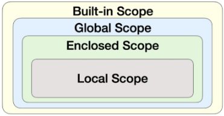

# 함수

- 특정 작업을 수행하기 위한 재사용 가능한 코드 묶음
- 함수를 사용하는 이유
    - 재사용성: 코드의 중복을 방지
    - 유지보수성
    - 가독성
- 함수 호출(function call)
    - 표기법 : **function_name(arguments)**
- 함수 구조
    
    ```python
    def make_sum(pram1, pram2): # prameter 
    		# Docstring : 함수에 대한 설명(선택)
    		""" 이것은 두 수를 받아  
    		두 수의 합을 반환하는 함수입니다.
    		>>> make_sum(1, 2)
    		3
    		"""
    		# 반환
    		return pram1 + pram2
    ```
    
- 함수 정의
    - 함수 정의는 def 키워드로 시작
    - def 키워드 이후 함수 이름 작성
    - 괄호 안에 매개변수를 정의할 수 있음
    - 매개변수는 함수에 전달되는 값
- 함수 body
    - 콜론 `:` 다음에 들여쓰기 된 코드 블록
    - 함수가 실행 될 때 수행되는 코드를 정의
- Docstring
    - 함수 body 앞에 선택적으로 작성 가능한 함수 설명서
- 함수 반환 값
    - 함수는 필요한 경우 결과를 반환할 수 있음 → 변수에 담을 수 있다
    - return 키워드 이후에 반환할 값을 명시
    - return 문은 함수의 실행을 종료하고, 결과를 호출 부분으로 반환
    - 함수 내에서 return 문이 없다면 None이 반환됨
- 함수 호출
    - 함수를 사용하기 위해서는 호출이 필요
    - 함수의 이름과 소괄호를 활용해 호출
    - 필요한 경우 인자(argument)를 전달해야 함
    - 호출 부분에서 전달된 인자는 함수 정의 시 작성한 매개변수에 대입됨

### 함수의 반환 값

- `print()` 함수는 반환 값이 없음
    - print() 함수는 화면에 값을 출력하기만 할 뿐, 반환값이 없음
    - 파이썬에서 반환 값이 없는 함수는 기본적으로 None을 반환한다고 간주하기 때문
    
    ```python
    return_value = print(1)
    print(return_value) -> None
    
    def my_func():
    	print('hello')
    	
    result = my_func()
    print(result) -> None
    ```
    

### 매개변수와 인자

- 매개변수(parameter)
    - 함수를 정의할 때, 함수가 받을 값을 나타내는 변수
- 인자(argument)
    - 함수를 호출할 때, 실제로 전달되는 값
    - 다양한 인자 종류
        1. 위치 인자
            - 함수 호출 시 인자의 위치에 따라 전달되는 인자
            - 위치 인자는 함수 호출 시 반드시 값을 전달해야 함
        2. 기본 인자 값
            - 함수 정의에서 매개변수에 기본 값을 할당하는 것
                
                ```python
                def greet(name, age = 30) ## 30으로 기본 값을 할당
                ```
                
            - 함수 호출 시 인자를 전달하지 않으면 기본 값이 매개변수에 할당됨
        3. 키워드 인자
            - 함수 호출 시 인자의 이름과 함께 값을 전달하는 인자
            - 매개변수와 인자를 일치시키지 않고, 특정 매개변수에 값을 할당할 수 있음
            - 인자의 순서는 중요하지 않고, 인자의 이름을 명시하여 전달
            - 단, 호출 시 키워드 인자는 위치 인자 뒤에 위치해야 함
        4. 임의의 인자 목록
            - 정해지지 않은 개수의 인자를 처리하는 인자
            - 함수 정의 시 매개변수(parameter) 앞에 `'*'` 를 붙여 사용
            - 여러 개의 인자를 tuple로 처리
            
            ```python
            def calculate_sum(*args):
            	print(args) -> (1, 100, 5000, 30)
            	print(type(args)) -> <class 'tuple'>
            
            calculate_sume(1, 100, 5000, 30)
            ```
            
        5. 임의의 키워드 인자 목록
            - 정해지지 않은 개수의 키워드 인자를 처리하는 인자
            - 함수 정의 시 매개변수 앞에 `"**”` 를 붙여 사용
            - 여러 개의 인자를 dictionary로 묶어 처리
            
            ```python
            def print_info(**kwargs):
            	print(kwargs)
            	
            print_info(name='Eve', age = 30) -> {'name': 'Eve', 'age': 30}
            ```
            
    - 함수 인자 권장 작성 순서
        - 위치 → 기본 → 가변 → 가변 키워드
        - 호출 시 인자를 전달하는 과정에서 혼란을 줄일 수 있도록 함
        - 단, 모든 상황에 적용되는 절대적 규칙은 아니고 상황에 따라 유연하게 조정될 수 있음
        
        ```python
        def func(pos1, pos2, default_arg = 'default', *args, **kwargs):
        	print('pos1:', pos1)
        	print('pos2:', pos2)
        	print('default_arg :', default_arg )
        	print('args:', args)
        	print('kwargs:', kwargs)
        	
        func(1, 2, 3, 4, 5, 6, key1='value1', key2='value2')
        
        '''
        pos1: 1
        pos2: 2
        pos3: 3
        args: (4, 5, 6)
        kwargs: {'keys': 'value1', 'key2' : 'value2'}
        '''
        ```
        
        # ✍️추가 학습 : 매개변수 Type을 설정할 수 있나?
        
        **Type Hint** (타입을 ‘가이드’하는 방식)
        
        ```python
        def greet(name: str, age: int) -> str:
        	return f"{name}님, {age}살이시군요."
        ```
        
        - 하지만 실제 타입 강제는 아니기 때문에 오류가 나진 않음
        - 타입 강제를 원한다면? → 우회하는 방식
            1. 직접 if문 등으로 검사
            2. `pydanic` , `typeguard` 같은 외부 라이브러리 사용
                
                예: `@typechecked`  데코레이터
                
        

# 재귀 함수

- 함수 내부에서 자기 자신을 호출하는 함수
- 예시 : 팩토리얼
    - factorial 함수는 자기 자신을 재귀적으로 호출하여 입력된 숫자 n의 팩토리얼을 계산
    - 재귀 호출은 n이 0이 될 때까지 반복되며, 종료 조건을 설저하여 재귀 호출이 멈추도록 함
    - 재귀 호출의 결과를 이용하여 문제를 작은 단위의 문제로 분할하고, 분할된 문제들의 결과를 조합하여 최종 결과를 도출
    
    ```python
    def factorial(n):
    	# 종료 조건: n이 0이면 1을 반환
    	if n == 0:
    		return 1
    	else:
    		# 재귀 호출: n 과 n - 1의 팩토리얼을 곱한 결과를 반환
    		return n * factorial(n - 1)
    	
    print(factorial(5))
    ```
    
- 재귀 함수 특징
    - 특정 알고리즘 식을 표현할 때 변수의 사용이 줄어들며, 코드의 가독성이 높아짐
    - 1개 이상의 base case(종료되는 상황)가 존재하고, 수렴하도록 작성
- 재귀 함수 활용 시 기억해야 할 것
    - 종료 조건을 명확히 할 것
    - 반복되는 호출이 종료 조건을 향하도록 할 것

<aside>
💡

# TIP

- 재귀 함수는 메모리 사용량이 많고 느릴 수 있음
- 종료 조건이 잘못되면 스택 오버플로우 에러가 발생할 수 있음
- 복잡한 재귀 함수는 오히려 코드의 가독성을 저하시킬 수 있음

**스택 오버플로우 : 작업 공간에 일이 너무 많이 쌓여 프로그램이 멈추는 오류 

</aside>

- 재귀 함수를 사용하는 이유
    - 문제의 자연스러운 표현
        - 복잡한 문제를 간결하고 직관적으로 표현 가능
    - 코드 간결성
        - 상황에 따라 반복문보다 알고리즘 코드가 더 간결하고 명확해질 수 있음
    - 수학적 문제 해결
        - 수학적 정의가 재귀적으로 표현되는 경우, 직접적인 구현 가능

# 내장 함수(Bulit-in function)

- 파이썬이 기본적으로 제공하는 함수(별도의 import 없이 바로 사용 가능)
- 예시)
    
    ```python
    numbers = [1, 2, 3, 4, 5]
    
    print(numbers) # [1, 2, 3, 4, 5]
    print(len(numbers)) # 5
    print(max(numbers)) # 5
    print(min(numbers)) # 1
    print(sum(numbers)) # 15
    print(sorted(numbers, reverse = True)) # [5, 4, 3, 2, 1]
    ```
    

# 함수와 Scope

- Python의 범위(Scope)
    - 함수는 코드 내부에 local scope를 생성하며, 그 외의 공간인 global scope로 구분
- 범위와 변수 관계
    - scope
        - global scope: 코드 어디에서든 참조할 수 있는 공간
        - local scope: 함수가 만든 scope (함수 내부에서만 참조 가능)
    - variable
        - global variable: global scope에 정의된 변수
        - local variable: local scope에 정의된 변수

**Scope 예시**

```python
def func():
	num = 20
	print('local', num) # local 20
func()
print('global', num) # NameError: name 'num' is not defined
```

→ num은 local scope에 존재하기 때문에 global scope에서 사용할 수 없음. 이는 변수의 **수명주기**와 관련이 있음

- 변수 수명주기(lifecycle)
    - 변수의 수명주기는 변수가 선언되는 위치와 scope에 따라 결정됨
    1. built-in scope
        - 파이썬이 실행된 이후부터 영원히 유지
    2. global scope
        - 모듈이 호출된 시점 이후 혹은 인터프리터가 끝날 때까지 유지
    3. local scope
        - 함수가 호출될 때 생성되고, 함수가 종료될 때까지 유지
- 이름 검색 규칙
    - 파이썬에서 사용되는 이름(식별자)들은 특정한 이름공간에 저장되어 있음
    - 아래와 같은 순서로 이름을 찾아 나가며, **LEGB Rule 이라고 부름**
    
    1. Local scope : 현재 작업 중인 범위
    2. Enclosed scope: 지역 범위 한 단계 위 범위
    3. Global scope: 최상단에 위치한 범위
    4. Built-in scope: 모든 것을 담고 있는 범위(정의하지 않고 사용할 수 있는 모든 것)
    
    **함수 내에서는 바깥 Scope의 변수에 접근 가능하나 수정은 불가**
    
    
    

**LEGB Rule 예시**

```python
print(sum) # <built-in function sum>
print(sum(range(3))) # 3

sum = 5

prnt(sum) # 5
print(sum(range(3))) # TypeError: 'int' object is not callable

## sum 변수 객체 삭제를 하려면 `del sum` 입력 후 진행
```

```python
x = 'G'
y = 'G'

def outer_func():
	x = 'E'
	y = 'E'
	
	def inner_func(y):
		z = 'L'
		print(x, y, z) # E P L
	
	inner_func('P')
	print(x, y)
	
outer_func()
print(x, y) # G G

## 함수의 정의가 어디서 되는지와 어디서 호출이 되는지 잘 봐야함~!!
```

### global 키워드

- 함수 내에서 전역 변수를 사용 가능, 수정은 불가능
- 수정하려면? → ‘global’키워드 사용
- 주의사항
    1. global 키워드 선언 전에 참조 불가
    
    ```python
    num = 0
    def increment():
    	# SyntaxError: name 'num' is used
    	# prior to global declaration
    	print(num)
    	global num
    	num += 1
    ```
    
    1. 매개변수에는 global 키워드 사용 불가
    
    ```python
    num = 0
    def increment(num):
    	# "num" is assigned before global
    	# declaration
    	global num
    	num += 1
    ```
    

# 함수 스타일 가이드

- 함수 이름 작성 규칙
    - **기본 규칙**
        - 소문자와 언더스코어(_) 사용
        - 동사로 시작하여 함수의 동작 설명
        - 약어 사용 지양
    - **함수 이름 구성 요소**
        - 동사 + 명사
            - save_user()
        - 동사 + 형용사 + 명사
            - calculate_total_price()
        - get/set 접두사
            - get_username(), set_username()
- 단일 책임 원칙
    - 모든 객체는 하나의 명확한 목적과 책임만을 가져야 함
    - 함수 설계 원칙
        1. 명확한 목적
            - 함수는 한 가지 작업만 수행
            - 함수 이름으로 목적을 명확히 표현
        2. 책임 분리
            - 데이터 검증, 처리, 저장 등을 별도 함수로 분리
            - 각 함수는 독립적으로 동작 가능하도록 설계
        3. 유지보수성
            - 작은 단위의 함수로 나누어 관리
            - 코드 수정 시 영향 범위를 최소화

# Packing & Unpacking

- 패킹
    - 여러 개의 데이터를 하나의 컬렉션으로 모아 담는 과정
    - 기본원리
        - 여러 개의 값을 하나의 튜플로 묶는 파이썬의 기본 동작
        - 한 변수에 콤마 `,` 로 구분된 값을 넣으면 자동으로 튜플로 처리
    - `'*'` 을 활용한 패킹 (함수 매개변수 작성 시)
        - 남는 위치 인자들을 튜플로 묶기
        - `'*'` 를 붙인 매개변수가 남는 위치 인자들을 모두 모아 하나의 튜플로 만듦
    - `'**'` 을 활용한 패킹 (함수 매개변수 작성 시)
        - 남는 키워드 인자들을 딕셔너리로 묶기
        - `**` 를 붙인 매개변수가 남는 키워드 인자들을 모두 모아 하나의 딕셔너리로 만듦
- 언패킹
    - 컬렉션에 담겨있는 데이터들을 개별 요소로 펼쳐 놓는 과정
    
    | 구분 | 상황 | * 연산자 | ** 연산자 |
    | --- | --- | --- | --- |
    | 패킹 | 함수 정의 시 | 여러 위치 인자를 하나의 튜플로 받음 | 여러 키워드 인자를 하나의 딕셔너리로 받음 |
    | 언패킹 | 함수 호출 시 | 리스트/튜플을 개별 위치 인자로 전달 | 딕셔너리를 개별 키워드 인자로 전달 |
    
    # ✍️추가 학습
    
    **함수에 언패킹으로 인자를 넣을 때, 인자가 하나 부족하거나 이름이 다르면??**
    
    ```python
    # 인자 부족 예시
    def my_function(x, y, z):
    	print(x, y, z)
    	
    name = ['alice', 'jane']
    my_function(*name) -> TypeError: my_function() missing 1 required positional argument: 'z'
    
    # 인자 이름이 다른 예시
    def my_function(x, y, z):
        print(x, y, z)
    
    my_dict = {'a': 1, 'b': 2, 'c': 3}
    my_function(**my_dict) -> TypeError: my_function() got an unexpected keyword argument 'a'
    ```
    

### 함수의 return, 반환의 원칙

- 파이썬 함수는 언제나 단 하나의 값(객체)만 반환할 수 있음
- 여러 값을 반환하는 경우에도 하나의 튜플로 패킹하여 반환

```python
def get_user_info():
	name = 'Alice'
	age = 30
	# 콤마(,)로 여러 값을 반환하는 것처럼 보이지만
	return name, age
# 확인해보면	
user_data = get_user_info()
# 단 하나의 튜플을 반환하는 것
print(user_data) # ('Alice', 30)
```

# 람다 표현식

- 익명 함수를 만드는 데 사용되는 표현식
- 한 줄로 간단한 함수를 정의

### 람다 표현식 구조

- lambda 키워드
    - 람다 함수를 선언하기 위해 사용되는 키워드
- 매개변수
    - 함수에 전달되는 매개변수들
    - 여러 개의 매개변수가 있을 경우 쉼표로 구분
- 표현식
    - 함수의 실행되는 코드 블록으로, 결과값을 반환하는 표현식으로 작성

```python
def addition(x, y):
	return x + y
	
result = addition(3, 5)
print(result)

addition = lambda x, y: x + y
result = addition(3, 5)
print(result)
```

**람다 표현식 활용 (with map 함수)**

```python
numbers = [1, 2, 3, 4, 5]

def square(x):
	return x**2
	
# lambda 미사용
squared1 = list(map(square, numbers))
print(squared1) # [1, 4, 9, 16, 25]

# lambda 사용
squared2 = list(map(lambda x: x**2, numbers))
print(squared2) # [1, 4, 9, 16, 25]
```

# ✍️추가 학습 : map 함수

실습 중, map함수를 통해 정의해놓은 함수에 인자 전달을 해보는 과정에서 결과가 반환이 안돼서 이유를 찾아보게 되었다.

### map 함수란?

- 반복 가능한(iterable) 객체의 각 요소에 함수를 적용해주는 기능을 함

```python
map(function, iterable)
```

- function: 각 요소에 적용할 함수(def, lambda 등..)
- iterable: 리스트, 튜플, 문자열 등 반복 가능한 객체

### 지연 평가

- 즉시 게산하지 않고 필요할 때까지 계산을 미루는 방식

```python
nums = [1, 2, 3, 4]
result = map(lambda x: x*2, nums)
print(result) # <map object ...>
```

### map과 지연 평가: ‘이터레이터’의 이해

1. `map` 객체는 ‘이터레이터(iterator)’ 입니다
    
    리스트와 같은 이터러블(iterable) 객체를 받아, 그 결과로 이터레이터를 반환
    
    - 이터레이터 (iterator) : 값을 차례대로 꺼낼 수 있는 ‘흐름’을 가진 객체.
        
        next() 함수를 호출하여 다음 값을 생성할 수 있으며, 한 번 소비하면 다시 사용할 수 없음
        
    
    → 이터레이터는 어떻게 계산할지 방법만 알고 있고, 아직 실제 값을 메모리에 만들어두지 않은 상태임. **이것이 바로 지연평가의 핵심 원리**
    
2. 이터레이터를 ‘소비(Comsume)’하여 결과 보기
    
    이터레이더가 가진 값을 실제로 보려면 ‘소비’ 해야함. 소비란 이터레이터에게 next()를 계속 요청하여 모든 값을 소진 시키는 행위를 말함.
    
    1. list()로 이터레이터 소비하기
        
        ```python
        result_list = list(iterator_obj)
        print(result_list)
        ```
        
    2. for문으로 이터레이터 소비하기
        
        ```python
        for item in iterator_obj:
        	print(item)
        ```
        
3. 왜 지연 평가를 사용할까? “메모리 효율성”
    
    데이터가 커져도 값을 요청받을 때마다 단 하나만 계산해서 돌려주므로, 아무리 큰 데이터라도 최소한의 메모리만 사용하여 처리할 수 있다!
    

### map 이외에 지연 평가되는 함수/기능
| 함수/기능 | 설명 |
| --- | --- |
| map() | 각 요소에 함수 적용(게으름) |
| filter() | 조건 만족 요소만 |
| zip() | 여러 시퀀스 묶기 |
| range() | start,stop,step만 저장 |