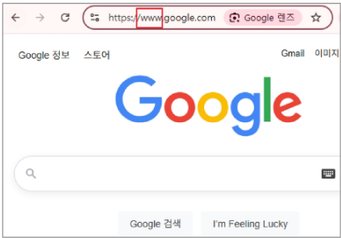
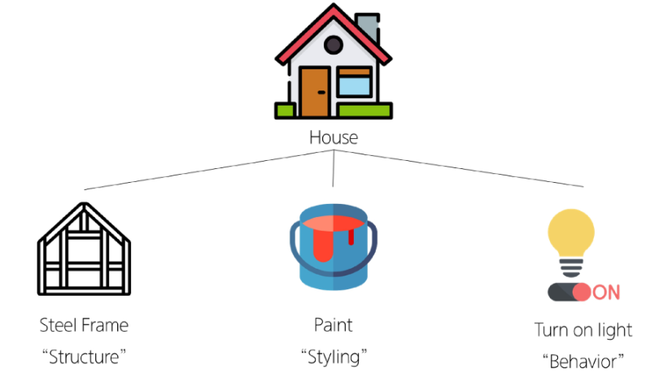
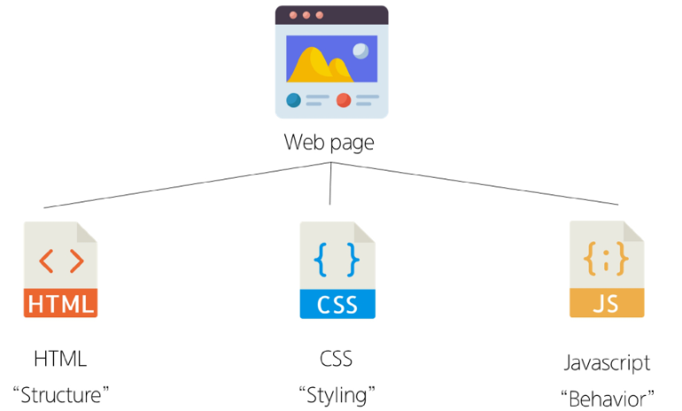
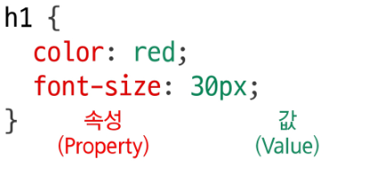
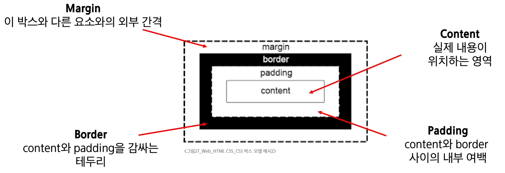
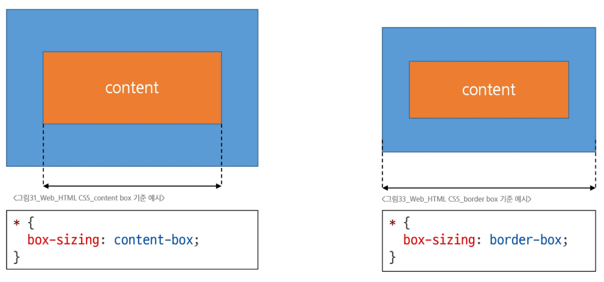

# 웹

## WWW (World Wide Web)

인터넷으로 연결된 컴퓨터들이 정보를 공유하는 거대한 정보 공간



### Web

Web site, Web application 등을 통해 사용자들이 정보를 검색하고 상호 작용하는 기술

- **Web site** : 인터넷에서 여러 개의 Web page가 모인 것으로, 사용자들에게 정보나 서비스를 제공하는 공간
- **Web page** : HTML, CSS 등의 웹 기술을 이용하여 만들어진, “Web site”를 구성하는 하나의 요소
    
    
    
    
    
    

## HTML (HyperText Markup Language)

웹 페이지의 **의미**와 **구조**를 정의하는 언어

- **Hyper Text** : 웹 페이지를 다른 페이지로 연결하는 링크
    - 참조를 통해 사용자가 한 문서에서 다른 문서로 즉시 접근할 수 있는 텍스트
    - 비선형성 / 상호연결성 / 사용자 주도적 탐색
- **Markup Language** : 태그 등을 이용하여 문서나 텍스트의 구조를 명시하는 언어
    - 인간이 읽고 쓰기 쉬운 형태이며, 데이터의 구조와 의미를 정의하는 데 집중
    - ex) HTML, Markdown

# Structure of HTML

**HTML 구조**

- **<!DOCTYPE html>**
    - 해당 문서가 HTML로 문서라는 것을 나타냄
- <html></html>
    - 전체 페이지의 콘텐츠를 포함
- <title></title>
    - 브라우저 탭 및 즐겨찾기 시 표시되는 제목으로 사용
    - 즐겨찾기 시 “Naver”로 되는 건 title이 Naver로 되어있기 때문
- <head></head>
    - HTML 문서에 관련된 설명, 설정 등 컴퓨터가 식별하는 메타데이터(추가적으로 설명하기 위한 데이터)를 작성
    - 사용자에게 보이지 않음
- <body></body>
    - HTML 문서의 내용을 나타냄
    - 페이지에 표시되는 모든 콘텐츠를 작성
    - 한 문서에 하나의 body 요소만 존재
    

### HTML element(요소)

- 하나의 요소는 여는 태그와 닫는 태그 그리고 그 안의 내용으로 구성됨
- 닫는 태그는 태그 이름 앞에 슬래시가 포함됨
    - 닫는 태그가 없는 태그도 존재(내용이 없는 경우..)

### HTML Attributes(속성)

- 사용자가 원하는 기준에 맞도록 요소를 설정하거나 다양한 방식으로 요소의 동작을 조절하기 위한 값
- 목적
    - 나타내고 싶지 않지만 추가적인 기능, 내용을 담고 싶을 때 사용
    - CSS에서 스타일 적용을 위해 해당 요소를 선택하기 위한 값으로 활용됨
- 작성 규칙
    1. 속성은 요소 이름과 속성 사이에 공백이 있어야 함
    2. 하나 이상의 속성들이 있는 경우엔 속성 사이에 공백으로 구분
    3. 속성 값은 열고 닫는 따옴표로 감싸야 함

<aside>
💡

<a></a> 태그는 하이퍼링크 담당

 이미지를 담당(닫는 태그가 없음!, 컨텐츠가 없기 때문, 이미지는 이미지를 가져올 경로가 필요한데 이건 속성에 의해서 전달되고 내용은 사실 없음

</aside>

## HTML Text Structure

- HTML의 주요 목적 중 하나는 텍스트 구조와 의미를 제공하는 것
- 예를 들어 h1 요소는 단순히 텍스트를 크게만 만드는 것이 아닌 현재 문서의 최상위 제목이라는 의미를 부여하는 것
    - <h1>Heading</h1>

# CSS (Cascading Style Sheet)

웹 페이지의 디자인과 레이아웃을 구성하는 언어

### CSS 적용 방법

1. 인라인(Inline) 스타일
    - HTML 요소 안에 style 속성 값으로 작성
2. 내부(Internal) 스타일 시트
    - head 태그 안에 style 태그에 작성
3. 외부(External) 스타일 시트
    - 별도 CSS 파일 생성 후 HTML link 태그를 사용해 불러오기

<aside>
💡

인라인이 우선순위가 가장 크지만 재사용성, 가독성 문제로 되도록 쓰진 않는다.

</aside>

### CSS 기본 구조와 문법

- **선택자(Selector)**
    - ‘누구를’ 꾸밀지 지정하는 부분
- **선언(Declaration)**
    - ‘어떻게’ 꾸밀지에 대한 구체적인 한 줄의 명령
    - 속성과 값이 한 쌍으로 이루어지며, 세미콜론(;) 으로 끝남
- **속성(Property)**
    - 바꾸고 싶은 스타일의 종류를 나타냄
- **값(Value)**
    - 속성에 적용할 구체적인 설정을 나타냄

### CSS Selectors

- HTML 요소를 선택하여 스타일을 적용할 수 있도록 하는 선택자
    
    ```css
    h1 {
    	color: red;
    	font-size: 30px;
    }
    ```
    
- CSS Selectors 종류
    - 기본 선택자
        - 전체(*) 선택자
            - HTML 모든 요소를 선택
        - 요소(tag) 선택자
            - 지정한 모든 태그를 선택
        - 클래스(class) 선택자 (’.’ (dot))
            - 주어진 클래스 속성을 가진 모든 요소를 선택
        - 아이디(id) 선택자 (’#’)
            - 주어진 아이디 속성을 가진 요소 선택
            - 문서에는 주어진 아이디를 가진 요소가 하나만 있어야 함
        - 속성(attr) 선택자 (’[]’ (대괄호))
            - 주어진 속성이나 속성값을 가진 모든 요소 선택
            - 속성의 존재 여부, 값의 일치/포함 등 다양한 조건으로 요소를 정교하게 선택 가능
    - 결합자 (Combinators)
        - 자손 결합자 (” “ (space))
            - 첫 번째 요소의 자손 요소들 선택
            - 예) p span은 <p> 안에 있는 모든 <span>를 선택 (하위 레벨 상관 없이)
        - 자식 결합자 (”>”)
            - 첫 번째 요소의 직계 자식만 선택
            - 예) ul > li은 <ul> 안에 있는 모든 <li>를 선택 (한단계 아래 자식들만)

### CSS Declaration

- 선택된 요소에 적용할 스타일을 구체적으로 명시하는 부분

**속성(Property)**

- 스타일링하고 싶은 기능이나 특성을 의미
- CSS가 미리 정의해 둔 키워드를 사용해야 함
- font-size, background-color, width, margin, padding 등

**값(value)**

- 속성에 적용될 구체적인 설정
- 속성이 받을 수 있는 값의 종류는 정해져 있음
- 16px, lightgray, 100%, 10rem 등



### 값의 단위(Units)

- color: red; 처럼 키워드로 끝나는 값도 있지만, 크기나 간격을 나타낼 때는 단위가 필수적
- 단위는 크게 절대 단위와 상대 단위로 나뉨
    
    
    | 구분 | 단위 종류 | 특징 |
    | --- | --- | --- |
    | 절대 단위 | px, pt, cm 등 | 다른 요소의 영향을 받지 않는 고정된 크기 |
    | 상대 단위 | %, em, rem, vw, vh 등 | 다른 요소(부모, 화면 표시 영역 등)의 크기에 따라 상대적으로 결정 |

<aside>
💡

- 웹 디자인에서는 반응형 웹과 접근성 때문에 “상대 단위의 중요성”이 매우 높다
- 값이 0일 때는 단위를 생략하는 것이 권장됨
</aside>

### 절대 단위의 대포: “px”

- 화면을 구성하는 가장 작은 단위의 “픽셀”을 기준으로 하는 절대 단위
- 모니터 해상도에 따라 크기가 결정되며, 직관적이고 예측이 쉬움
- 장점
    - 디자인 시안과 거의 동일한 결과물을 만들 수 있음
    - 요소의 크기를 명확하게 고정하고 싶을 때 유용
- 단점
    - 사용자가 브라우저의 기본 폰트 크기를 변경해도 요소의 크기가 함께 조절되지 않아 접근성에 불리
    - 다양한 디바이스 크기에 유연하게 대응하는 반응형 디자인에 한계가 있음

### 상대 단위: “em”

- 부모(parent) 요소의 font-size를 기준으로 크기가 결정되는 상대 단위
- 만약 부모 요소에 font-size가 없다면, 그 상위 부모의 font-size를 상속 받음
- **장점**
    - 부모 요소의 크기에 따라 자식 요소의 크기를 유연하게 조절할 수 있음
- **단점**
    - 중첩 문제
    - em 단위를 사용하는 요소가 중첩되면 기준 크기가 계속 변경되어 계산이 복잡해지고 예측이 어려워짐
    

### 상대 단위의 해결사: “rem”

- “Root em”
- em의 단점을 극복하기 위해 등장
- 부모 요소가 아닌, 최상위 요소인 <html>의 font-size를 기준으로 크기가 결정
- html의 기본 font-size는 대부분의 브라우저에서 16px

```css
.title {
	/* 16px * 2 = 32px */
	font-size: 2rem;
}
.content {
	/* 16px * 1 = 16px */
	font-size: 1rem;
	/* 16px * 1.5 = 24px */
	padding: 1.5rem;
}
```

### 상대 단위의 해결사: “rem”

- 일관성 및 예측 가능성
    - 요소가 아무리 깊게 중첩되어도 기준은 항상 html이므로, em처럼 계산이 복잡해지지 않음.
- 유지보수 용이성
    - html의 font-size만 변경하면 사이트 전체의 레이아웃과 폰트 크기를 일관되게 조절할 수 있음.
- 접근성 향상
    - 사용자가 브라우저에서 설정한 기본 폰트 크기를 html이 상속받으므로, 사용자의 설정에 맞춰 사이트 전체가 유연하게 확대/축소 됨.

| 단위 | 기준 | 장점 | 단점/주의사항 | 추천 사용처 |
| --- | --- | --- | --- | --- |
| `px` | 화면의 픽셀 | 직관적, 고정된 크기 | 접근성/반응형에 불리 | border-width 등 절대적 크기가 필요할 때 |
| `em` | 부모 요소의 font-size | 부모에 따라 유연하게 변경 | 중첩 시 계산 복잡 | 특정 컴포넌트 내부에서만 상대적 크기 조절이 필요할 때 |
| `rem` | <html>의 font-size | 일관성, 유지보수성, 접근성 | 루트 폰트 크기에 의존적 | 웹사이트 전반의 font-size, margin, padding 등 |
| `%` | 부모 요소의 크기 | 컨테이너에 맞춰 유동적으로 | font-size에 사용 시 em과 유사하게 동작 | width, height 등 레이아웃 구성 시 |

## 명시도 (Specificity)

**결과적으로 요소에 적용할 CSS 선언을 결정하기 위한 알고리즘**

### CSS

- Cascading Style Sheet
- 웹 페이지의 디자인과 레이아웃을 구성하는 언어

### Cascade

- 계단식
- 한 요소에 동일한 가중치를 가진 선택자가 적용될 때
- CSS에서 마지막에 나오는 선언이 사용됨

### 명시도가 높은 순 (중복되면 명시도가 높은 것으로 적용)

1. **!importance**
    - 다른 우선순위 규칙보다 우선 적용
    - Cascade의 구조를 무시하고 강제 적용 방식이므로 권장하지 않음
2. **Inline 스타일**
3. **선택자**
    - id 선택자 > class 선택자 > 요소 선택자
4. **소스 코드 선언 순서**

### CSS 상속

- 기본적으로 CSS는 상속을 통해 부모 요소의 속성을 자식에게 상속해 재사용성을 높임
- 상속 되는 속성
    - Text 관련 요소 (font, color, text-align), opacity, visibility 등
- 상속 되지 않는 속성
    - Box model 관련 요소(width, height, border, box-sizing …)
    - position 관련 요소(position, top/right/bottom/left, z-index) 등

### CSS Box Model

**웹 페이지의 모든 HTML 요소를 감싸는 사각형 상자 모델**

- 요소의 크기, 배치, 간격을 결정하는 규칙
- 구성 요소
    - 내용(content)
    - 안쪽 여백(padding)
    - 테두리(border)
    - 외부 간격(margin)



### shorthand 속성 (단축 속성)

**shorthand 속성: ‘border’**

- border-width, border-style, border-color를 한번에 설정하기 위한 속성

```css
border: 2px solid black;
```

**shorthand 속성: ‘margin’ & ‘padding’**

- 4방향의 속성을 각각 지정하고 않고 한번에 지정할 수 있는 속성

```css
/* 4개 - 상우하좌 */
margin: 10px 20px 30px 40px;
padding: 10px 20px 30px 40px;
/* 3개 - 상/좌우/하 */
margin: 10px 20px 30px;
padding: 10px 20px 30px;
/* 2개 - 상하/좌우 */
margin: 10px 20px;
padding: 10px 20px;
/* 1개 - 공통 */
margin: 10px;
padding: 10px;
```

### box-sizing 속성 (박스의 크기 계산법)

**The standard CSS box model**

1. 표준 상자 모델에서 width와 height 속성 값을 설정하면, 이 값은 content box의 크기를 조정하게 됨
2. CSS는 border box가 아닌 content box의 크기를 width 값으로 지정

**The alternative CSS box model**

- 대체 상자 모델에서 모든 width와 height는 실제 상자의 너비
- 실제 박스 크기를 정하기 위해 테두리와 패딩을 조정할 필요 없음



## HTML 스타일 가이드

- 대소문자 구분
    - HTML은 대소문자를 구분하지 않지만, 소문자 사용을 강력히 권장
    - 태그명과 속성명 모두 소문자로 작성
- 속성 따옴표
    - 속성 값에는 큰 따옴표(””)를 사용하는 것이 일반적
- 코드 구조와 포맷팅
    - 일관된 들여쓰기를 사용(보통 2칸 공백)
    - 각 요소는 한 줄에 하나씩 작성
    - 중첩된 요소는 한 단계 더 들여쓰기
- 공백 처리
    - HTML은 연속된 공백을 하나로 처리
    - Enter키로 줄 바꿈을 해도 브라우저에서 인식하지 않음(`<br>` 사용해야 함)
- 에러 출력 없음
    - HTML은 문법 오류가 있어도 별도의 에러 메세지를 출력하지 않음

## CSS 스타일 가이드

- 코드 구조와 포맷팅
    - 일관된 들여쓰기를 사용(보통 2칸 공백)
    - 선택자와 속성은 각각 새 줄에 작성
    - 중괄호 앞에 공백 넣기
    - 속성 뒤에는 콜론(:)과 공백 넣기
    - 마지막 속성 뒤에는 세미콜런(;) 넣기

- 선택자 사용
    - class 선택자를 우선적으로 사용
    - id, 요소 선택자 등은 가능한 피할 것
    
    → 여러 선택자들과 함께 사용할 경우 우선순위 규칙에 따라 예기치 못한 스타일 규칙이 적용되어 전반적인 유지보수가 어려워지기 때문
    
- 속성과 값
    - 속성과 값은 소문자로 작성
    - 0값에는 단위를 붙이지 않음

- 명명 규칙
    - 클래스 이름은 의미 있고 목적을 나타내는 이름을 사용
    - 케밥 케이스(kebab-case)를 사용
    - 약어보다는 전체 단어를 사용
    
- CSS 적용 스타일
    - 인라인 스타일은 되도록 사용하지 말 것
    - CSS와 HTML 구조 정보가 혼합되어 작성되기 때문에 코드를 이해하기 어렵게 만듦

# MDN Web Docs

**Mozilla Developer Network에서 제공하는 온라인 문서로, 웹 개발자와 디자이너를 위한 종합적인 참고 자료**

- 정확성 및 신뢰성
    - Mozilla와 웹 커뮤니티의 전문가들에 의해 작성되고 유지 관리
    - 웹 표준을 정확하게 반영하고 있으며, 신뢰할 수 있는 정보 소스를 제공
- 최신 웹 기술
    - 최신 웹 표준과 기술을 다루고 있어, 웹 개발자들이 최신 정보를 쉽게 접할 수 있음
- 명확한 설명과 예제
    - 복잡한 개념을 이해하기 쉽게 설명하고, 실습 가능한 예제 코드를 제공

**MDN 문서의 중요성**

- MDN 문서는 웹 개발 학습의 모든 단계에서 중요한 참고 자료
- 개발 과정에서 발생하는 다양한 문제에 대한 솔루션을 찾는 데 유용
- 이 문서를 활용함으로써, 웹 기술에 대한 깊은 이해를 얻고, 실무에 필요한 능력을 갖출 수 있음