# Bootstrap

CSS 프론트엔드 프레임워크 (Toolkit)

- 미리 만들어진 다양한 디자인 요소들을 제공하여 웹 사이트를 빠르고 쉽게 개발할 수 있도록 함
- 현재 가장 인기있는 프론트엔드 프레임워크
    
    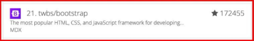
    

### Bootstrap 사용해보기

```html
<!doctype html>
<html lang="en">
  <head>
    <meta charset="utf-8">
    <meta name="viewport" content="width=device-width, initial-scale=1">
    <title>Bootstrap demo</title>
    <link href="https://cdn.jsdelivr.net/npm/bootstrap@5.3.8/dist/css/bootstrap.min.css" rel="stylesheet" integrity="sha384-sRIl4kxILFvY47J16cr9ZwB07vP4J8+LH7qKQnuqkuIAvNWLzeN8tE5YBujZqJLB" crossorigin="anonymous">
  </head>
  
  <body>
    <h1>Hello, world!</h1>
    <script src="https://cdn.jsdelivr.net/npm/bootstrap@5.3.8/dist/js/bootstrap.bundle.min.js" integrity="sha384-FKyoEForCGlyvwx9Hj09JcYn3nv7wiPVlz7YYwJrWVcXK/BmnVDxM+D2scQbITxI" crossorigin="anonymous"></script>
  </body>
</html>

/* Bootstrap은 CSS와 JavaScript로 만들어져 있음
	- link와 script 요소로 HTML에 추가
	 cdn.jsdelivr은 CDN 회사 이름임 */
```

### what is “CDN”

- 서버와 사용자 사이의 물리적인 거리를 줄여 콘텐츠 로딩에 소요되는 시간을 최소화
    - 웹 페이지 로드 속도를 높임
- 지리적으로 사용자와 가까운 CDN 서버에 콘텐츠를 저장해서 사용자에게 전달


## Bootstrap 사용 가이드

- Bootstrap 기본 사용법
    - 특정한 규칙이 있는 클래스 이름으로 스타일 및 레이아웃이 미리 작성되어 있음
    
    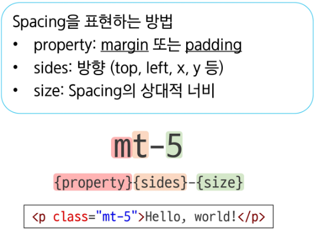
    

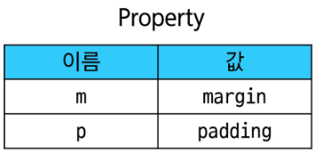

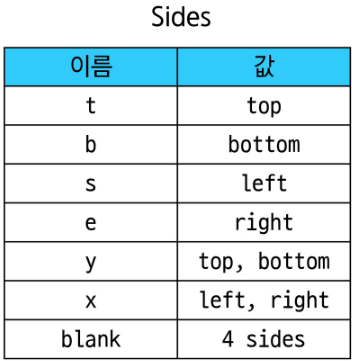

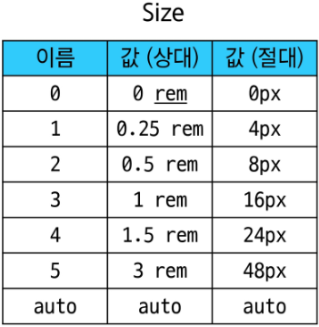

<aside>
💡

공식 문서를 통해 Bootstrap의 클래스 이름으로 Spaccing표현을 확인 가능 

</aside>

## Reset CSS

모든 HTML 요소 스타일을 일관된 기준으로 재설정하는 간결하고 압축된 규칙 시트

- HTML Element, Table, List 등의 요소들에 일관성 있게 스타일을 적용 시키는 기본 단계임

Bootstrap 적용 전/후 비교

- Bootstrap을 HTML에 반영하면 일부 스타일이 바뀜
    - h1 요소의 폰트 변경됨
    - body와의 여백 사라짐

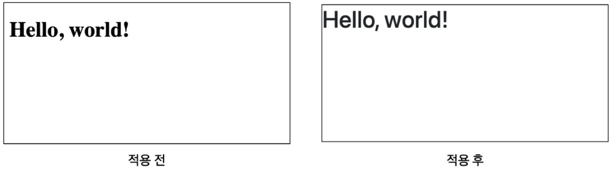

### Reset CSS 사용 배경

- 모든 브라우저는 각자의 “user agent stylesheet”를 가지고 있음
    - 웹사이트를 보다 읽기 편하게 하기 위해
        
        <aside>
        💡
        
        User-agent stylesheets: 모든 문서에 기본 스타일을 제공하는 기본 스타일 시트
        
        </aside>
        
- 문제는 이 설정이 브라우저마다 상이하다는 것
- 모든 브라우저에서 웹사이트를 동일하게 보이게 만들어야 하는 개발자에겐 매우 골치 아픈 일
    
    → 모두 똑같은 스타일 상태로 만들고 스타일 개발을 시작하자!
    

### Normalize CSS

- Reset CSS 방법 중 대표적인 방법
- 웹 표준 기준으로 브라우저 중 하나가 불일치 한다면 차이가 있는 브라우저를 수정하는 방법
    - 경우에 따라 IE 또는 EDGE 브라우저는 표준에 따라 수정할 수 없는 경우도 있는데, 이 경우 IE 또는 EDGE의 스타일을 나머지 브라우저에 적용시킴

### Bootstrap에서의 Reset CSS

- Bootstrap은 bootstrap-reboot.css라는 파일명으로 normalize.css를 자체적으로 커스텀해서 사용하고 있음

# Bootstrap 활용

### Typography

```html
  <!-- heading -->
  <h1>h1. Bootstrap heading</h1>
  <h2>h2. Bootstrap heading</h2>
  <h3>h3. Bootstrap heading</h3>
  <h4>h4. Bootstrap heading</h4>
  <h5>h5. Bootstrap heading</h5>
  <h6>h6. Bootstrap heading</h6>
```

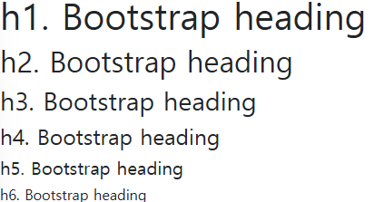

---

```html
  <!-- display heading -->
  <h1 class="display-1">Display 1</h1>
  <h1 class="display-2">Display 2</h1>
  <h1 class="display-3">Display 3</h1>
  <h1 class="display-4">Display 4</h1>
  <h1 class="display-5">Display 5</h1>
  <h1 class="display-6">Display 6</h1>
```

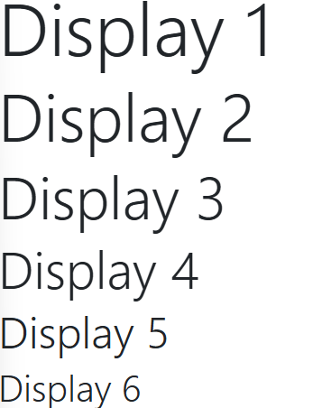

---

```html
<!-- inline text elements -->
<p>You can use the mark tag to <mark>highlight</mark> text.</p>
<p><del>This line of text is meant to be treated as deleted text.</del></p>
<p><s>This line of text is meant to be treated as no longer accurate.</s></p>
<p><ins>This line of text is meant to be treated as an addition to the document.</ins></p>
<p><u>This line of text will render as underlined.</u></p>
<p><small>This line of text is meant to be treated as fine print.</small></p>
<p><strong>This line rendered as bold text.</strong></p>
<p><em>This line rendered as italicized text.</em></p>
```

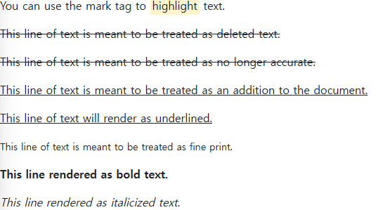

---

```html
<!-- lists stag -->
<ul class="list-unstyled">
  <li>This is a list.</li>
  <li>It appears completely unstyled.</li>
  <li>Structurally, it’s still a list.</li>
  <li>However, this style only applies to immediate child elements.</li>
  <li>Nested lists:
    <ul>
      <li>are unaffected by this style</li>
      <li>will still show a bullet</li>
      <li>and have appropriate left margin</li>
    </ul>
  </li>
  <li>This may still come in handy in some situations.</li>
</ul>
```

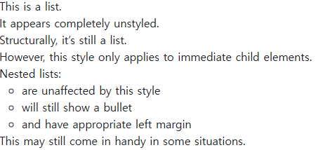

---

### Colors

```html
<!-- text colors -->
<p class="text-primary">.text-primary</p>
<p class="text-primary-emphasis">.text-primary-emphasis</p>
<p class="text-secondary">.text-secondary</p>
<p class="text-secondary-emphasis">.text-secondary-emphasis</p>
<p class="text-success">.text-success</p>
<p class="text-success-emphasis">.text-success-emphasis</p>
<p class="text-danger">.text-danger</p>
<p class="text-danger-emphasis">.text-danger-emphasis</p>
<p class="text-warning bg-dark">.text-warning</p>
<p class="text-warning-emphasis">.text-warning-emphasis</p>
<p class="text-info bg-dark">.text-info</p>
<p class="text-info-emphasis">.text-info-emphasis</p>
<p class="text-light bg-dark">.text-light</p>
<p class="text-light-emphasis">.text-light-emphasis</p>
<p class="text-dark bg-white">.text-dark</p>
<p class="text-dark-emphasis">.text-dark-emphasis</p>
```

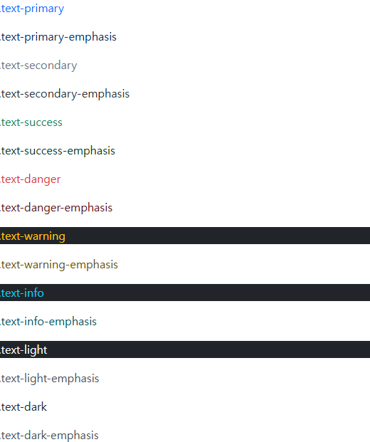

---

```html
<!-- background colors -->
<div class="p-3 mb-2 bg-primary text-white">.bg-primary</div>
<div class="p-3 mb-2 bg-primary-subtle text-primary-emphasis">.bg-primary-subtle</div>
<div class="p-3 mb-2 bg-secondary text-white">.bg-secondary</div>
<div class="p-3 mb-2 bg-secondary-subtle text-secondary-emphasis">.bg-secondary-subtle</div>
<div class="p-3 mb-2 bg-success text-white">.bg-success</div>
<div class="p-3 mb-2 bg-success-subtle text-success-emphasis">.bg-success-subtle</div>
<div class="p-3 mb-2 bg-danger text-white">.bg-danger</div>
<div class="p-3 mb-2 bg-danger-subtle text-danger-emphasis">.bg-danger-subtle</div>
<div class="p-3 mb-2 bg-warning text-dark">.bg-warning</div>
<div class="p-3 mb-2 bg-warning-subtle text-warning-emphasis">.bg-warning-subtle</div>
<div class="p-3 mb-2 bg-info text-dark">.bg-info</div>
<div class="p-3 mb-2 bg-info-subtle text-info-emphasis">.bg-info-subtle</div>
<div class="p-3 mb-2 bg-light text-dark">.bg-light</div>
<div class="p-3 mb-2 bg-light-subtle text-light-emphasis">.bg-light-subtle</div>
<div class="p-3 mb-2 bg-dark text-white">.bg-dark</div>
<div class="p-3 mb-2 bg-dark-subtle text-dark-emphasis">.bg-dark-subtle</div>
```

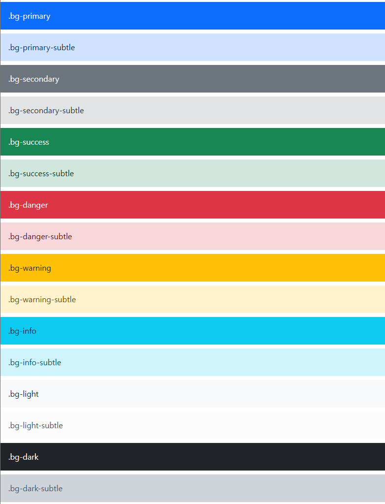

---

### Component

```html
<!-- alerts -->
<div class="alert alert-primary" role="alert">
  A simple primary alert—check it out!
</div>
<div class="alert alert-secondary" role="alert">
  A simple secondary alert—check it out!
</div>
<div class="alert alert-success" role="alert">
  A simple success alert—check it out!
</div>
<div class="alert alert-danger" role="alert">
  A simple danger alert—check it out!
</div>
<div class="alert alert-warning" role="alert">
  A simple warning alert—check it out!
</div>
<div class="alert alert-info" role="alert">
  A simple info alert—check it out!
</div>
<div class="alert alert-light" role="alert">
  A simple light alert—check it out!
</div>
<div class="alert alert-dark" role="alert">
  A simple dark alert—check it out!
</div>
```

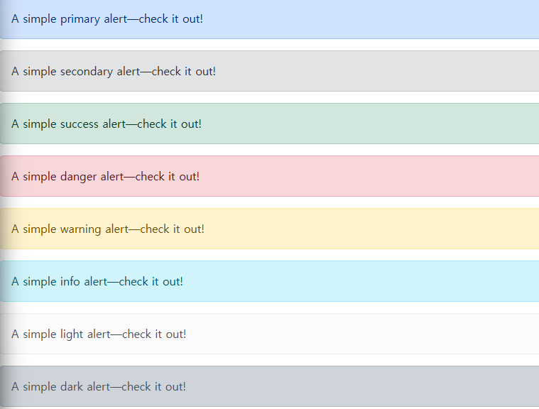

---

```html
<!-- badges -->
<h1>Example heading <span class="badge text-bg-secondary">New</span></h1>
<h2>Example heading <span class="badge text-bg-secondary">New</span></h2>
<h3>Example heading <span class="badge text-bg-secondary">New</span></h3>
<h4>Example heading <span class="badge text-bg-secondary">New</span></h4>
<h5>Example heading <span class="badge text-bg-secondary">New</span></h5>
<h6>Example heading <span class="badge text-bg-secondary">New</span></h6>
<button type="button" class="btn btn-primary position-relative">
Inbox
<span class="position-absolute top-0 start-100 translate-middle badge rounded-pill bg-danger">
  99+
  <span class="visually-hidden">unread messages</span>
</span>
</button>
<span class="badge text-bg-primary">Primary</span>
<span class="badge text-bg-secondary">Secondary</span>
<span class="badge text-bg-success">Success</span>
<span class="badge text-bg-danger">Danger</span>
<span class="badge text-bg-warning">Warning</span>
<span class="badge text-bg-info">Info</span>
<span class="badge text-bg-light">Light</span>
<span class="badge text-bg-dark">Dark</span>
```

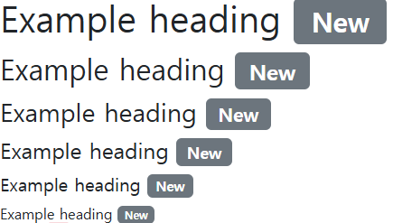

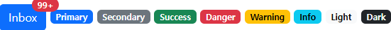

---

```html
<!-- Buttons -->
<button type="button" class="btn btn-primary">Primary</button>
<button type="button" class="btn btn-secondary">Secondary</button>
<button type="button" class="btn btn-success">Success</button>
<button type="button" class="btn btn-danger">Danger</button>
<button type="button" class="btn btn-warning">Warning</button>
<button type="button" class="btn btn-info">Info</button>
<button type="button" class="btn btn-light">Light</button>
<button type="button" class="btn btn-dark">Dark</button>

<button type="button" class="btn btn-link">Link</button>
```

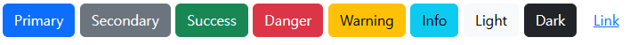

---

```html
<!-- Cards -->
<div class="card" style="width: 18rem;">

<div class="card-body">
  <h5 class="card-title">Card title</h5>
  <p class="card-text">Some quick example text to build on the card title and make up the bulk of the card’s content.</p>
  <a href="#" class="btn btn-primary">Go somewhere</a>
</div>
</div>
```

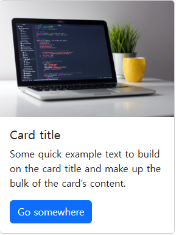

---

```html
<!-- navbar -->
<nav class="navbar navbar-expand-lg bg-body-tertiary">
  <div class="container-fluid">
    <a class="navbar-brand" href="#">Navbar</a>
    <button class="navbar-toggler" type="button" data-bs-toggle="collapse" data-bs-target="#navbarSupportedContent" aria-controls="navbarSupportedContent" aria-expanded="false" aria-label="Toggle navigation">
      <span class="navbar-toggler-icon"></span>
    </button>
    <div class="collapse navbar-collapse" id="navbarSupportedContent">
      <ul class="navbar-nav me-auto mb-2 mb-lg-0">
        <li class="nav-item">
          <a class="nav-link active" aria-current="page" href="#">Home</a>
        </li>
        <li class="nav-item">
          <a class="nav-link" href="#">Link</a>
        </li>
        <li class="nav-item dropdown">
          <a class="nav-link dropdown-toggle" href="#" role="button" data-bs-toggle="dropdown" aria-expanded="false">
            Dropdown
          </a>
          <ul class="dropdown-menu">
            <li><a class="dropdown-item" href="#">Action</a></li>
            <li><a class="dropdown-item" href="#">Another action</a></li>
            <li><hr class="dropdown-divider"></li>
            <li><a class="dropdown-item" href="#">Something else here</a></li>
          </ul>
        </li>
        <li class="nav-item">
          <a class="nav-link disabled" aria-disabled="true">Disabled</a>
        </li>
      </ul>
      <form class="d-flex" role="search">
        <input class="form-control me-2" type="search" placeholder="Search" aria-label="Search"/>
        <button class="btn btn-outline-success" type="submit">Search</button>
      </form>
    </div>
  </div>
</nav>
```

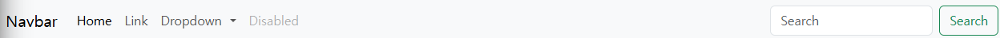

---

```html
<!-- carousel -->
<div id="carouselExample" class="carousel slide">
<div class="carousel-inner">
  <div class="carousel-item active">
    
  </div>
  <div class="carousel-item">
    
  </div>
  <div class="carousel-item">
    
  </div>
</div>
<button class="carousel-control-prev" type="button" data-bs-target="#carouselExample" data-bs-slide="prev">
  <span class="carousel-control-prev-icon" aria-hidden="true"></span>
  <span class="visually-hidden">Previous</span>
</button>
<button class="carousel-control-next" type="button" data-bs-target="#carouselExample" data-bs-slide="next">
  <span class="carousel-control-next-icon" aria-hidden="true"></span>
  <span class="visually-hidden">Next</span>
</button>
</div>

<!-- carous2 -->
 <!-- button에 data-bs-target을 해당 캐루젤의 id를 향하도록 해야 코드가 어떤 캐루젤을 움직이라는 것인지 인식함 !! -->
<div id="carousel2Example" class="carousel slide">
<div class="carousel-inner">
  <div class="carousel-item active">
    
  </div>
  <div class="carousel-item">
    
  </div>
  <div class="carousel-item">
    
  </div>
</div>
<button class="carousel-control-prev" type="button" data-bs-target="#carousel2Example" data-bs-slide="prev">
  <span class="carousel-control-prev-icon" aria-hidden="true"></span>
  <span class="visually-hidden">Previous</span>
</button>
<button class="carousel-control-next" type="button" data-bs-target="#carousel2Example" data-bs-slide="next">
  <span class="carousel-control-next-icon" aria-hidden="true"></span>
  <span class="visually-hidden">Next</span>
</button>
</div>
</div>
```

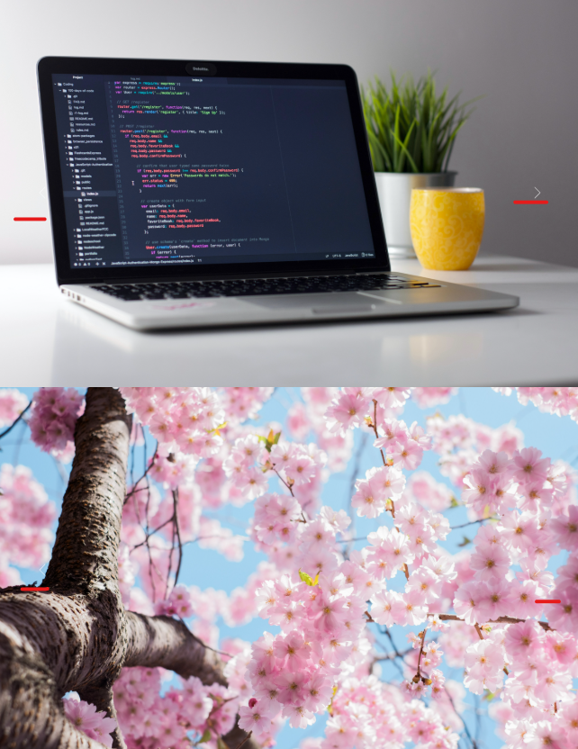

---

```html
  <!-- modal -->
  <!-- 모달도 캐루젤과 마찬가지로 data-bs-target과 컴포넌트의 id값이 일치하는지 확인 -->

  <!-- 주의 -->
  <!-- 1. 모달과 모달 버튼이 코드가 반드시 함께 다닐 필요 없음 -->
  <!-- 모달이 다른 코드들과 중첩될 경우 모달이 어떤 배경 뒤로 숨겨져 버릴 수 있음 -->
  <!-- 모달 코드를 주로 body태그가 닫히는 위치에 모아두는 것을 권장 -->
  <div class="modal" tabindex="-1">
  <!-- Button trigger modal -->
  <button type="button" class="btn btn-primary" data-bs-toggle="modal" data-bs-target="#exampleModal">
    Launch demo modal
  </button>

  <!-- Modal -->
  <div class="modal fade" id="exampleModal" tabindex="-1" aria-labelledby="exampleModalLabel" aria-hidden="true">
    <div class="modal-dialog">
      <div class="modal-content">
        <div class="modal-header">
          <h1 class="modal-title fs-5" id="exampleModalLabel">Modal title</h1>
          <button type="button" class="btn-close" data-bs-dismiss="modal" aria-label="Close"></button>
        </div>
        <div class="modal-body">
          ...
        </div>
        <div class="modal-footer">
          <button type="button" class="btn btn-secondary" data-bs-dismiss="modal">Close</button>
          <button type="button" class="btn btn-primary">Save changes</button>
        </div>
      </div>
    </div>
  </div>
```

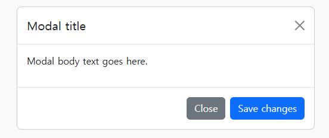

---

# Semantic Web

웹 데이터를 의미론적으로 구조화된 형태로 표현하는 방식

<aside>
💡

요소의 시각적 측면이 아닌 요소의 목적과 역할에 집중하는 방식

</aside>

## Semantic in HTML

**HTML 요소가 의미를 가진다는 것**

- 외형 보다는 요소 자체의 의미에 집중하는 것

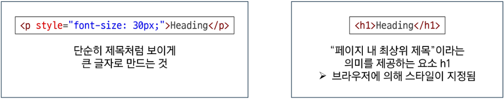

→ 외형은 유사하지만 `<h1>`태그를 사용함으로써 의미를 부여

### HTML Semantic Element

기본적인 모양과 기능 이외의 의미를 가지는 HTML 요소

<aside>
💡

검색엔진 및 개발자가 웹 페이지의 콘텐츠를 이해하기 쉽게 해줌

</aside>

### 예시)

- **header**
    - 소개 및 탐색에 도움을 주는 콘텐츠
- **nav**
    - 현재 페이지 내, 또는 다른 페이지로의 링크를 보여주는 구획
- **main**
    - 문서의 주요 콘텐츠
- **article**
    - 독립적으로 구분해 배포하거나될 수 있는 구성의 콘텐츠 구획
- **section**
    - 문서의 독립적인 구획
    - 더 적합한 요소가 없을 때 사용
- **aside**
    - 문서의 주요 내용과 간접적으로만 연관된 부분
- **footer**
    - 가장 가까운 조상 구획(main, article 등)의 작성자, 저작권 정보, 관련 문서

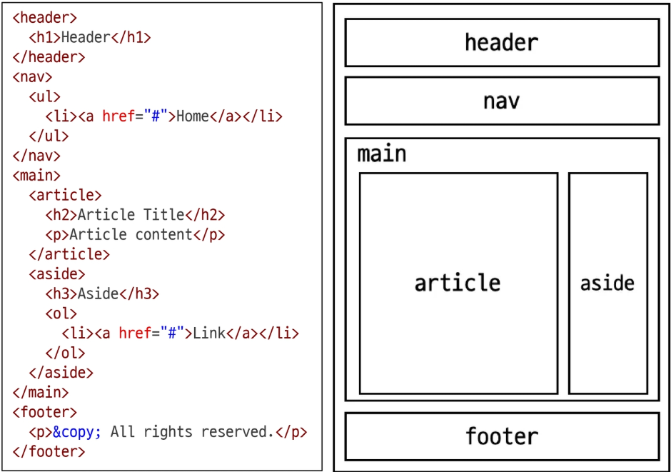

---

## Semantic in CSS

### CSS 방법론

CSS를 효율적이고 유지 보수가 용이하게 작성하기 위한 일련의 가이드라인

## OOCSS (Object Oriented CSS)

객체 지향적 접근법을 적용하여 CSS를 구성하는 방법론

<aside>

다음과 같은 순서로 진행

1. 구조와 스킨을 분리
2. 컨테이너와 콘텐츠를 분리
</aside>

1. 구조와 스킨을 분리함으로써 가능성을 높인다

```css
/* BEFORE */
.blue-button {
	border: none;
	font-size: 1em;
	padding: 10px 20px;
	background-color: blue;
	color: white;
}

.red-button {
	border: none;
	font-size: 1em;
	padding: 10px 20px;
	background-color: red;
	color: white;
}
```

```css
/* AFTER */
.button {
	border: none;
	font-size: 1em;
	padding: 10px 20px;
}

.blue-button {
	background-color: blue;
	color: white;
}

.red-button {
	background-color: red;
	color: white;
}
```

1. 컨테이너와 콘텐츠 분리
- 객체에 직접 적용하는 대신 객체를 둘러싸는 컨테이너에 스타일을 적용
- 스타일을 정의할 때 위치에 의존적인 스타일을 사용하지 않도록 함
- 콘텐츠를 다른 컨테이너로 이동시키거나 재배치할 때 스타일이 깨지는 것을 방지

```css
/* BEFORE */
.header h2 {
	font-size: 24px;
	color: white;
}

.footer h2 {
	font-size: 24px;
	color: black;
}
```

```css
/* AFTER */
.container .title {
	font-size: 24px;
}

.header {
	color: white;
}

.footer {
	color: black;
}
```

---

### Bootstrap을 사용하는 이유

- 가장 많이 사용되는 CSS 프레임워크
- 사전에 디자인된 다양한 컴포넌트 및 기능
    - 빠른 개발과 유지보수
- 손쉬운 반응형 웹 디자인 구현
- 커스터마이징이 용이함
- 크로스 브라우징 지원
    - 모든 주요 브라우저에서 작동하도록 설계되어 있음

## CDN 없이 사용하기

### Bootstrap 코드 파일을 다운받아 활용

1. Bootstrap 코드 파일 다운로드
2. bootstrap.css와 bootstrap.bundle.js 만 선택
3. CSS 파일은 HTML head 태그에 가져와서 사용
4. JS 파일은 HTML body 태그에 가져와서 사용

→ 파일 별 포함된 기능이 다르므로 공식문서를 통해 확인

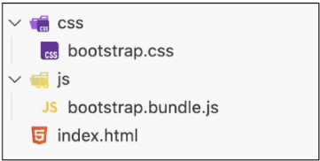

```html
<!DOCTYPE html>
<html lang="en">

<head>
	<meta charset="UTF-8">
	<meta name="Viewport" content="width=device-width, initial-scale=1.0">
	<link rel="stylesheet" href="css/bootstrap.css">
	<title>Document</title>
</head>

<body>
	<script src="js/bootstrap.bundle.js"></script>
</body>

</html>	
```

### 의미론적인 마크업이 필요한 이유

- “검색엔진 최적화(SEO)”
    - 검색 엔진이 해당 웹 사이트를 분석하기 쉽게 만들어 검색 순위에 영향을 줌
- “웹 접근성(Web Accessibility)”
    - 웹 사이트, 도구, 기술이 고령자나 장애를 가진 사용자들이 사용할 수 있도록 설계 및 개발하는 것
    - ex) 스크린 리더를 통해 전맹 시각장애 사용자에게 웹의 글씨를 읽어줌

- 책임과 역할
    - HTML: 콘텐츠의 구조와 의미
    - CSS: 레이아웃과 디자인