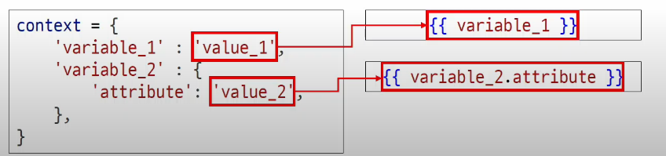
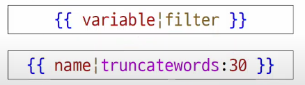
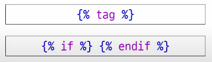
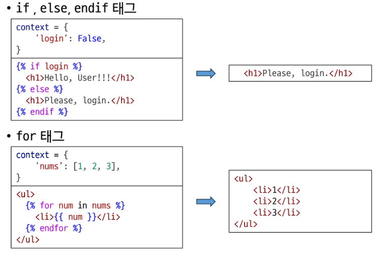
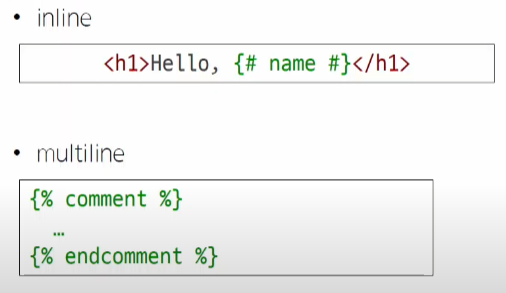
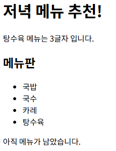
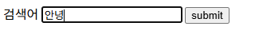
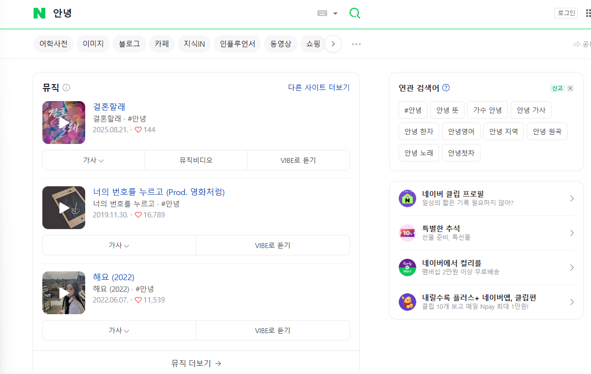
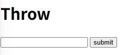

# Django: Template system

- 파이썬 데이터(context)를 HTML 문서(Template)와 결합하여 로직과 표현을 분리한 채 동적인 웹 페이지를 생성하는 도구
- 목적: 페이지 틀에 데이터를 동적으로 결합하여 수많은 페이지를 효율적으로 만들어 내기 위함

> 뉴스 같은 html파일을 보면 틀에 채워지는 데이터만 달라지고 구성은 바뀌지 않는다
> 
> 
> 이런 상황에서는 수 만 개를 만들지 않아도 될 것 같은데? → 장고는 어떻게 이를 해결하는가
> 

**주소를 http://127.0.0.1:8000/articles/ 이렇게 articles붙여서 호출해보자**

- 현재 `articles/index.html`에는 ‘메인페이지입니다’라고 되어있는데 이를 Hello, Django!로 변경하고 새로고침해보자
    - 네트워크 입장에서 새로고침이란? → 서버에 다시 요청을 하는 것.
    - 그래서 굳이 서버를 껏다킬 필요는 없다
    
- 주소에 값이 변할 수 있는 값이 오게 하고 싶다.
    - 그럼 변수가 와야지.
    - 근데 html에는 변수라는 개념이 없잖아.
    - 그럼 동적으로 어떻게 바꿀까?
    
- 근데 지금 Django를 쓰고 있고, 파일 형태를 보면 `Django HTML`이라고 되어있음.
- **그래서 장고 시스템의 추가 문법을 활용해보자**
    1. `views.py`  context 생성하고 렌더 함수에 세번째 인자로 줌
        
        ```python
        def index(request):
            context = {
                'name': 'Jane',
            }
            return render(request, 'articles/index.html', context)
        ```
        
        - 렌더 함수는 이렇게 3번째 인자를 파이썬 데이터로 받을 수 있는데 2번째 파일이 context데이터를 활용할 수 있게 되는 것임.
    
    1. 이후에 `index.html`로 가서 `{{ 콘텍스트에 적은 키값 }}` 적용
        
        ```html
        <body>
          <h1>Hello, {{ name }}!</h1>
        </body>
        ```
        
        - 이렇게 하게 되면 “Hello, Jane!” 이 된다. (일반 HTML은 불가능했을 )장고의 HTML이라서 기능을 부여하기 시작한 것임.
            
            → 이제 파일을 재활용할 수 있게 되었다.
            

---

# Django Template Language (DTL)

- template(T)에서 조건, 반복, 변수 등의 프로그래밍적 기능을 제공하는 시스템
1. Variable
    - Django Template에서의 변수
    - render함수의 세번째 인자로 딕셔너리 타입으로 전달(아까한 것)
    - key에 해당하는 문자열이 template에서 사용한 변수명이 됨
    - dot(’.’) 을 사용하여 변수 속성에 접근할 수 있음
        
        
        
2. Filters
    - 출력을 컨트롤 한다.
    - 표시할 변수를 수정할 때 (변수 + “|” + 필터)
    - 연결이 가능하며 일부 필터는 인자를 받기도 한다
    - 약 60개의 built-in template filters를 제공 → 공식 문서에서 찾으면서 사용
        
        
        
3. Tags
    - 반복 또는 논리를 수행하여 제어 흐름을 만든다
    - 일부 태그는 시작과 종료 태그가 필요
    - 약 24개의 built-in template tags를 제공
        
        
        
        
        
4. Comments
    - 주석
        
        
        

### DTL 실습)

### 1. 화면을 DTL을 활용해 구성해보자

`urls.py`→ `views.py` → `html` 순서로 가자

**urls.py**

```python
from django.contrib import admin
from django.urls import path
from articles import views

urlpatterns = [
    path('admin/', admin.site.urls),
    # 클라이언트로 부터 http://127.0.0.1:8000/articles/ 요청이 들어오면
    # articles 앱의 views 모듈의 index 함수가 호출된다.
    path('articles/', views.index),
    path('dinner/', views.dinner),
]

```

**views.py**

```python
def dinner(request):
    foods = [
        '국밥',
        '국수',
        '카레',
        '탕수육',
    ]
    picked = random.choice(foods)
    context = {
        'foods' : foods,
        'picked' : picked,
    } 
    return render(request, 'articles/dinner.html', context)
```

view함수에서 context 적을 때, 딕셔너리 키값과 벨류 값을 똑같이 해서 불필요한 고민을 줄이자

**html**

```html
<!DOCTYPE html>
<html lang="en">
<head>
  <meta charset="UTF-8">
  <meta name="viewport" content="width=device-width, initial-scale=1.0">
  <title>Document</title>
</head>
<body>
  <h1>저녁 메뉴 추천!</h1>
  <p>{{ picked }} 메뉴는 {{ picked|length }}글자 입니다.</p>
</body>
</html>
```

{{ key값 }} 을 통해 views 함수에서 렌더 받은 값을 바탕으로 DTL 화면 구성


### 2. 다음으로 메뉴판을 생성해보자

```html
<!DOCTYPE html>
<html lang="en">
<head>
  <meta charset="UTF-8">
  <meta name="viewport" content="width=device-width, initial-scale=1.0">
  <title>Document</title>
</head>
<body>
  <h1>저녁 메뉴 추천!</h1>
  <p>{{ picked }} 메뉴는 {{ picked|length }}글자 입니다.</p>

  <h2>메뉴판</h2>
  <ul>
    
      <li>{{ food }}</li>
    
  </ul>
  
    <p>메뉴가 모두 소진되었습니다.</p>
  
    <p>아직 메뉴가 남았습니다.</p>
  
</body>
</html>
```

- 원래 <li>를 계속 나열했어야 했지만 for 기능을 사용해서 한번에 가능해졌음
    
    
    

---

## 템플릿 상속

- 재사용성과 유지보수를 높임
- 유사한 구조가 반복되는데 이런 틀을 만들어내고 내용만 바꾸자

<aside>
💡

만약 모든 템플릿에 Bootstrap을 만드려면 모든 템플릿에 Bootstrap CDN을 작성해야 하나?

1. 페이지의 공통요소를 포함
2. 하위 템플릿이 재정의 할 수 있는 공간을 정의

→ 템플릿 상속! : 여러 템플릿이 공통요소를 공유할 수 있게 해주는 기능

</aside>

### 상속 구조를 만들어보자

- skeleton 역할을 하게 되는 상위 템플릿(base, html작성)
- articles안에 base.html 작성
    
    ```html
    <!DOCTYPE html>
    <html lang="en">
    <head>
      <meta charset="UTF-8">
      <meta name="viewport" content="width=device-width, initial-scale=1.0">
      <title>Document</title>
      <link href="https://cdn.jsdelivr.net/npm/bootstrap@5.3.8/dist/css/bootstrap.min.css" rel="stylesheet" integrity="sha384-sRIl4kxILFvY47J16cr9ZwB07vP4J8+LH7qKQnuqkuIAvNWLzeN8tE5YBujZqJLB" crossorigin="anonymous">
    </head>
    <body>
      
      
      <script src="https://cdn.jsdelivr.net/npm/bootstrap@5.3.8/dist/js/bootstrap.bundle.min.js" integrity="sha384-FKyoEForCGlyvwx9Hj09JcYn3nv7wiPVlz7YYwJrWVcXK/BmnVDxM+D2scQbITxI" crossorigin="anonymous"></script>
    </body>
    </html>
    ```
    
    - 여기서 block 뒤에 content라는 이름으로 이 블락을 구분할 것이다
    
- 그리고 `index.html`와 `dinner.html`을 이 `base.html`를 기반으로 만들어보자
    
    
    ```html
    
    
    
    <h1>Hello, {{ name }}!</h1>
    
    ```
    
    `` 이 코드로 `base.html` 에서 정의한 html 구조를 불러오고 이 파일에서만 다른 점은 사전에 정의 한구조에서 만들어놓은 block 위치에 넣어준다.
    
    ```html
    
    
      <h1>저녁 메뉴 추천!</h1>
      <p>{{ picked }} 메뉴는 {{ picked|length }}글자 입니다.</p>
    
      <h2>메뉴판</h2>
      <ul>
        
          <li>{{ food }}</li>
        
      </ul>
      
        <p>메뉴가 모두 소진되었습니다.</p>
      
        <p>아직 메뉴가 남았습니다.</p>
      
    
    ```
    

### 상속 관련 DTL 태그

- **extends 태그**
    - 자식 템플릿이 부모 템플릿을 확장한다는 것을 알림
    - 주의 사항
        - 최상단에 써야한다는 것
        - extends태그는 2개 이상 사용 불가능하다

- **block 태그**
    - 하위 템플릿에서 재정의 할 수 있는 블록을 정의
    - 상위 템플릿에서 작성하며 하위 템플릿이 작성할 수 있는 공간을 지정하는 것

---

## 요청과 응답 : **HTML form**

- 지금까지는 클라이언트에서 단순 요청을 보냈음
- 그런데 구글 네이버 사용 경험을 돌아보면 요청 + 알파(로그인, 검색) 을 보내게 됨.
- 이걸 하려면 데이터를 담을 수 있는 바구니가 필요함
- 이게 HTML form 태그이다 (사용자의 입력된 요청을 서버에 전송해주는 친구)

### form틀에 기본

- 로그인 템플릿을 만들려면 사용자는 아이디 패스워드를 입력하고 로그인을 누르게 됨
- 이걸 누르는 순간 담아서 요청을 보내게 됨
- 이 전체 틀이 form이다.
- 사용자의 입력을 받는 태그는 input태그이다.
- 이걸 잘 담아서 submit 제출하는것
- 어디로 보낼 건데? → action=”#” #에 서버 주소가 들어가고 거기로 보낼 것임

> 네이버의 검색을 보면 query태그로 되어있음.
> 
> 
> `https://search.naver.com/search.naver?sm=tab_hty.top&where=nexearch&ssc=tab.nx.all&query=안녕&oquery=d&tqi=jKyzCdqVOswssNR3qUVssssste4-190238&ackey=2vqf66pr`
> 이렇게 되어있는데 잘보면 `?`로 기본URL과 나누어놨고 그 뒤는 `키 벨류`와 `&`가 이어지는 패턴을 볼 수 있다.
> 
> 여기서 `query=안녕`를 볼 수 있는데…
> 
> `https://search.naver.com/search.naver?query=안녕` 이렇게만 하면 안녕이 검색되는 것을 볼 수 있음
> 

**그래서 이것을 활용해 가짜 네이버 검색창을 만들어 볼 것이다.**

### form을 이용해서 가짜 네이버 검색창을 만들고 이것을 네이버로 검색이 되도록 요청해보기

1. `search.html`  파일 안에 있는 `form태그` 속 `action` 클래스에는 서버 주소가 들어간다고 했으니 `?` 를 기준으로 앞에있는 기본URL을 넣어준다.
2. 그 다음에 `name`에 네이버가 우리의 데이터를 알게해주자 → `query`라고 넣어줌으로써 우리가 가진 데이터가 검색에 들어갈 데이터임을 서버에게 알려주자 



     이렇게 입력하고 submit을 해보면



검색이 되는것을 확인할 수 있다. 

- 즉 `action`에다가 어디에다 요청을 보낼지 주소를 적고
- `input` 태그안에 `name` 속성에 고정된 키나 이름인 `query(현재 예시인)`를 적어서 서버가 사용자가 입력한 데이터가 뭔지 알게 해준다.
- 그래서 우리가 담은 데이터가 네이버로 요청이가서 검색이 되는 것을 할 수 있는 것이다
- 이렇게 url로 요청이 가게됨 `https://search.naver.com/search.naver?query=안녕`
    - 실제 url은 더 길지만 위의 url만사용해도 정상적으로 검색이 됨

## action & method

- 데이터를 어디로 어떤방식으로 요청할지

| 개념 | 설명 | 추가 특징 / 비고 |
| --- | --- | --- |
| **action** | 입력 데이터를 **전송할 URL(목적지)**을 지정 | - 생략 시 **현재 페이지의 URL**로 전송됨 |
| **method** | 데이터를 어떤 방식으로 보낼지 정의 | - **GET**: 조회 (데이터를 URL 뒤에 붙여 전송)- **POST**: 생성, 수정, 삭제 등 변경 작업 |
| **input 요소** | 사용자의 입력을 받는 HTML 요소 | - `type` 속성에 따라 입력 방식 결정 (text, password, email 등)- **핵심 속성: `name`** → 서버에서 데이터를 읽어올 때 key로 사용 |
| **Query String Parameters** | URL 뒤에 `?key=value&key2=value2` 형태로 데이터를 붙여서 전송 | - `?` : URL과 파라미터 구분- `&` : 파라미터 여러 개 연결- 브라우저가 자동으로 붙여줌 |

### 우리 서버로 사용자 입력 데이터를 받아 그대로 출력하는 서버 만들어보자

view 함수는 몇개가 필요할까? → 2개

1. throw 함수 
    - 처음 페이지를 주고 사용자에게 요청을 받음
2. catch 함수
    - 그 요청에 따라 응답페이지를 보냄

**먼저 urls.py에 주소 등록하자**

```python
from django.contrib import admin
from django.urls import path
# 명시적 상대 경로
from . import views

app_name = 'articles'
urlpatterns = [
    path('admin/', views.index),
    path('dinner/', views.dinner),
    path('search/', views.search),
    path('throw/', views.throw),
]
```

**그 다음 views.py에 throw 함수 함수 정의**

```python
def throw(request):
    return render(request, 'articles/throw.html')
```

**마지막으로 html로 가서** 

```html
<!DOCTYPE html>
<html lang="en">
<head>
  <meta charset="UTF-8">
  <meta name="viewport" content="width=device-width, initial-scale=1.0">
  <title>Document</title>
</head>
<body>
  <h1>Throw</h1>
  <form action="/catch/" method="GET">
    <input type="text" name="message">
    <input type="submit" value="submit">
  </form>
</body>
</html>
```

**이렇게 되면 사용자가 http://127.0.0.1:8000/articles/throw/로 호출을 하게 되면,**



**이런 html파일이 나오게 되고,**

**사용자가 message를 입력하고 submit을 하여 호출을 하게되면**

**이 사용자가 입력한 데이터 덩어리와 함께 action에 있는 catch로 요청을 보내게 된다. (/상대주소/)**

**이제 catch를 설계 해보자.**

다시 순서대로 urls.py로 이동해서 catch 주소를 넣는다.

```python
from django.contrib import admin
from django.urls import path
# 명시적 상대 경로
from . import views

app_name = 'articles'
urlpatterns = [
    path('', views.index,),
    path('dinner/', views.dinner),
    path('search/', views.search),
    path('throw/', views.throw),
    path('catch/', views.catch),
]
```

**그 다음 views.py로 가서 catch함수를 정의해보자**

그런데 사용자 입력 데이터는 대체 어디에 있을까??

- 모든 뷰함수에는 request강제가 있는데 요기가 사용자가 보낸 요청 덩어리임.
    - 이 어딘가에 존재함
- request객체에는 GET이라는 함수가 있음. 그럼 요청 온 QueryDict 덩어리가 옴.
    - 위 예시에서는 `<QueryDict: {'message': ['ssafy']}>`
- 그럼 이 딕셔너리에서 message키에 접근하면 사용자가 보낸 메세지를 가져올 수 있음~

```python
# 사용자 입력 데이터를 추철해서 응답 페이지에 보여주기
def catch(request):
    # 사용자 입력데이터는 대체 어디에 있을까? -> request 객체
    print(request.GET) # <QueryDict: {'message': ['ssafy']}>
    print(request.GET.get('message')) # ssafy
    context = {
        'message': request.GET.get('message'),
    }
    return render(request, 'articles/catch.html', context)    
```

**마지막으로 catch.html에서 {{ message }} 이렇게 변수를 넣어주면서 사용자가 보낸 메시지에 따라서 응답할 수 있게 된다!**

```html
<!DOCTYPE html>
<html lang="en">
<head>
  <meta charset="UTF-8">
  <meta name="viewport" content="width=device-width, initial-scale=1.0">
  <title>Document</title>
</head>
<body>
  <h1>Catch</h1>
  <h2>{{ message }}를 잘 받았습니다.</h2>
</body>
</html>
```

---

## Django URLs

- 요청 URL에 따라 실행될 view 함수가 달라짐
- 그래서 URL dispatcher라고 부름 (운항 관리자, 분배기)
    - URL 패턴을 정의하고 해당 패턴이 일치하는 요청을 처리할 view함수를 연결(매핑)

url에 변수를 넣게 될 것인데…

- why? url을 만들다보니 중복된 걸 만들게되는 순간이 옴
- 엄청많은데 이걸 다만들어야돼? → 구조만 변수로 만들자
- 이게 **variable routing**

### Variable Routing

- URL 일부에 변수를 포함시키는 것
    - 변수는 view 함수의 인자로 전달할 수 있음
    - path(’articles/<int|num>/’, views.detail)
    - path(’hello/<str|name>/’, views.greeting)
    
    이렇게 해놓고
    
    views.detail(request, num=10) 이런식으로 전달하면 됨 
    

### 기존 URL 구조

- 프로젝트 urls.py에 모든 URL이 담겨있는데 계속 쌓이게 되면 이것을 컨트롤할 수 있는가?
- 그리고 심지어 한 앱의 +views에서 url을 썼으면 또 다른 앱의 views에서는 못씀 → 유지보수성도 문제가 있음
- 한 곳에 업무가 가중된 것을 위임해줄 필요가 있다. 어떻게?
    - 각 앱의 urls.py에서 각자의 URL 관리
- urls.py는 입력을 받고 일부만 처리해서 그 문자열 이후에 대한 처리는 위임함
    - 분배할 수 있는 특정 시점만 보면 됨

지금까지 **urls.py**에 적혀있는 모든 path에 담겨있는 url은 

→ articles라는 앱이 쓰고 있는 URL이었음

**articles 앱에 나머지 URL을 위임하자**

→ `urls.py`파일을 만들어서 이를 옮겨 넣음

```python
from django.contrib import admin
from django.urls import path
# 명시적 상대 경로
from . import views

urlpatterns = [
    path('', views.index),
    path('dinner/', views.dinner),
    path('search/', views.search),
    path('throw/', views.throw),
    path('catch/', views.catch),
    path('<int:num>/', views.detail),
]
```

views 폴더는 이제 같은 경로에 있으니 명시적 상대 경로인 `.` 으로 변경해주자

그럼 기존의 urls.py는??

```python
from django.contrib import admin
from django.urls import path, include
from articles import views

urlpatterns = [
    path('admin/', admin.site.urls),
    # 클라이언트 요청 주가 / articles/까지 일치 한다면,
    # 나머지 주소는 articles 앱의 urls.py로 넘긴다
    path('articles/', include('articles.urls'))
]
```

`include함수`를 불러와서 만약 입구인 나에게 `첫번째 인자(앱)`만큼 주소가 같은 요청이 들어오면

`articles.urls라는 주소`를 후속 시키겠다는 의미

즉 URL의 일치하는 부분까지 잘라내고 각 APP마다 URL을 관리할 수 있게 됨.

### URL 이름 지정

- 나중에 url 주소가 엄청 길어지고 많아져서 일일이 주소를 외워서 하드 코딩으로 사용할 수 가 없음
- 그래서 장고는 이를 해결하기 위해 각각의 주소마다 `이름`을 붙여 주기로 함
    
    ```python
    from django.contrib import admin
    from django.urls import path
    # 명시적 상대 경로
    from . import views
    
    urlpatterns = [
        path('', views.index, name='index'),
        path('dinner/', views.dinner, name='dinner'),
        path('search/', views.search, name='search'),
        path('throw/', views.throw, name='throw'),
        path('catch/', views.catch, name='catch'),
        path('<int:num>/', views.detail, name='detail'),
    ]
    ```
    
    - 그럼 이제 html파일에서 이 이름만 기억하면 사용 가능하다. 주소가 아무리 길어도 이름만 적으면 됨!
        
        ```html
        
        
        
        <h1>Hello, {{ name }}!</h1>
        
        <a href="">저녁 메뉴 확인하러 가기!!</a>
        
        ```
        
        - 원래는 “/dinner/” 이렇게 주소를 적었어야함
        - 장점 중 또 하나는 주소가 변경되었을 때, 이 주소를 쓰는 모든 파일을 찾아가서 변경된 주소를 바꿔야 하는데 이름을 사용하게 되면 그럴 필요가 없어서 편함
        - ``
            - **DTL URL tag**
            - arg1, arg2는 variable routing 이다. 변수 명을 써주면 됨(콤마없이 공백으로 구분)
            - 주어진 URL 패턴의 이름과 일치하는 절대 경로 주소를 반환

## app_name

```python
from django.contrib import admin
from django.urls import path
# 명시적 상대 경로
from . import views

app_name = 'articles' ## 이게 app_name
urlpatterns = [
    path('', views.index, name='index'),
    path('dinner/', views.dinner, name='dinner'),
    path('search/', views.search, name='search'),
    path('throw/', views.throw, name='throw'),
    path('catch/', views.catch, name='catch'),
    path('<int:num>/', views.detail, name='detail'),
]
```

app_name을 추가함으로써 서로 다른 app들이 서로 같은 이름으로 url을 사용할 수 있다!!

단 앞에 키를 붙여서! 

키는 어떻게 붙일까?

url의 최종 모습

```html
<a href="">저녁 메뉴 확인하러 가기!!</a>
```