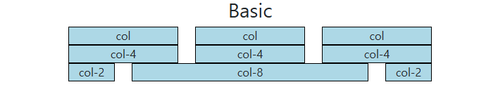
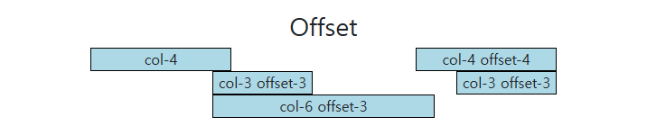
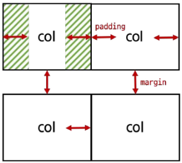
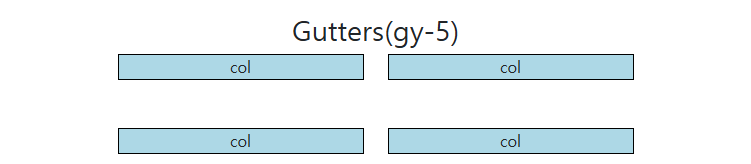
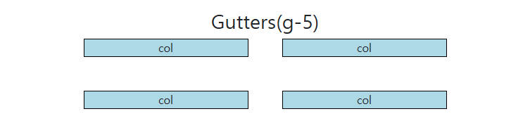
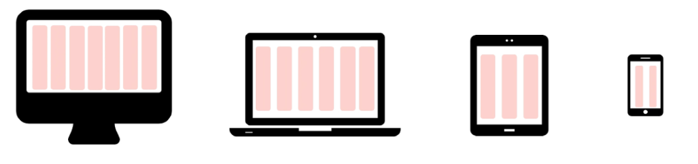
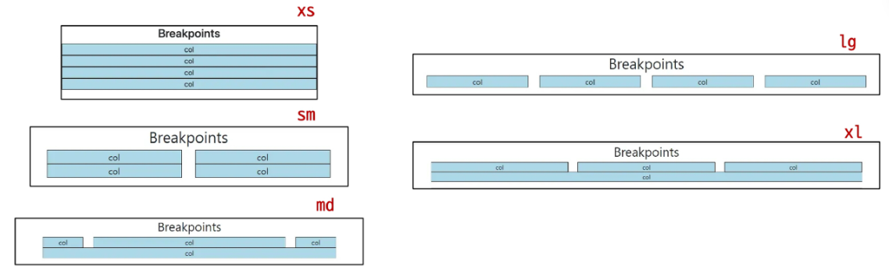
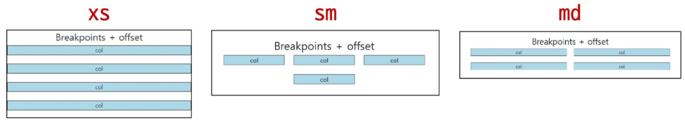
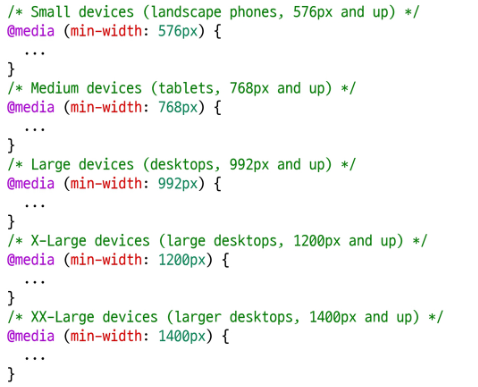

# Bootstrap Grid System

<aside>

웹 페이지의 레이아웃을 조정하는 데 사용되는 12개의 컬럼으로 구성된 시스템

→ 반응형 디자인을 지원해 웹 페이지를 모바일, 태블릿, 데스크탑 등 다양한 기기에서 적절하게 표시할 수 있도록 도와줌

</aside>

## 반응형 웹 디자인

**Responsive Web Design**

<aside>

디바이스 종류나 화면 크기에 상관없이, 어디서든 일관된 레이아웃 및 사용자 경험을 제공하는 디자인 기술

→ 32인치 모니터, 태블릿, 스마트폰 등, 화면 크기에 따라 요소의 배치를 변경하여 일관된 사용자 경험을 제공할 수 있음

</aside>

- 12칸 중 크기에 따라 필요한 만큼의 컬럼을 차지하게 요소를 배치
    - 내의 요소도 12칸으로 나눠서 활용

## Grid System 구조

- Grid system 기본 요소
    1. Container
        - Column들을 담고 있는 공간
    2. Column
        - 실제 컨텐츠를 포함하는 부분
    3. Gutter
        - 컬럼과 컬럼 사이의 여백 영역(상하좌우)
    4. 1개의 row안에 12개의 column 영역이 구성
        - 각 요소는 12개 중 몇 개를 차지할 것인지 지정됨

### Basic

```html
  <h2 class="text-center">Basic</h2>
  <div class="container">
    <div class="row">
      <div class="col">
        <div class="box">col</div>
      </div>
      <div class="col">
        <div class="box">col</div>
      </div>
      <div class="col">
        <div class="box">col</div>
      </div>
    </div>
    <div class="row">
      <div class="col-4">
        <div class="box">col-4</div>
      </div>
      <div class="col-4">
        <div class="box">col-4</div>
      </div>
      <div class="col-4">
        <div class="box">col-4</div>
      </div>
    </div>
    <div class="row">
      <div class="col-2">
        <div class="box">col-2</div>
      </div>
      <div class="col-8">
        <div class="box">col-8</div>
      </div>
      <div class="col-2">
        <div class="box">col-2</div>
      </div>
    </div>
  </div>
```



---

### Nesting

```html
<div class="container">
    <div class="row">
      <div class="col-4 box">
        <div>col-4</div>
      </div>
      <div class="col-8 box">
        <div class="row">
          <div class="col-6">
            <!-- 12칸을 넘으면 아래로 가는 점을 응용해서 6 6 6 6 하면 2 2칸으로 쌓임 -->
            <div class="box">col-6</div>
          </div>
          <div class="col-6">
            <div class="box">col-6</div>
          </div>
          <div class="col-6">
            <div class="box">col-6</div>
          </div>
          <div class="col-6">
            <div class="box">col-6</div>
          </div>
        </div>
      </div>
    </div>
  </div>
```


---

### Offset

```html
<div class="container">
  <div class="row">
    <div class="col-4">
      <div class="box">col-4</div>
    </div>
    <div class="col-4 offset-4">
	    <!-- offset은 상쇄하고 다음올 박스에 적음 -->
      <div class="box">col-4 offset-4</div>
    </div>
  </div>
  <div class="row">
    <div class="col-3 offset-3">
	    <!-- 결국 offset과 col의 합이 12가 된다 -->
      <div class="box">col-3 offset-3</div>
    </div>
    <div class="col-3 offset-3">
      <div class="box">col-3 offset-3</div>
    </div>
  </div>
  <div class="row">
    <div class="col-6 offset-3">
	    <!-- 3칸 상쇄하고 박스나오면 다음은 알아서 채워짐 -->
      <div class="box">col-6 offset-3</div>
    </div>
  </div>
</div>
```



### Gutters

- Grid system 에서 column 사이에 여백 영역
    - x축은 `padding`, y축은 `margin`으로 여백 생성
        
        → X축은 12칸으로 제한된 공간이므로, padding으로 컨텐츠가 줄어들며 간격을 조절한다.
        



```html
<h2 class="text-center">Gutters(gx-0)</h2>
<div class="container">
	<!-- gutter는 row가 통제한다 -->   
  <div class="row gx-0">
    <div class="col-6">
      <div class="box">col</div>
    </div>
    <div class="col-6">
      <div class="box">col</div>
    </div>
  </div>
</div>
```


---

```html
<h2 class="text-center">Gutters(gy-5)</h2>
<div class="container">
  <div class="row gy-5">
    <div class="col-6">
      <div class="box">col</div>
    </div>
    <div class="col-6">
      <div class="box">col</div>
    </div>
    <div class="col-6">
      <div class="box">col</div>
    </div>
    <div class="col-6">
      <div class="box">col</div>
    </div>
  </div>
</div>
```



---

```html
<h2 class="text-center">Gutters(g-5)</h2>
<div class="container">
	<div class="row g-5">
	  <div class="col-6">
	    <div class="box">col</div>
	  </div>
	  <div class="col-6">
	    <div class="box">col</div>
	  </div>
	  <div class="col-6">
	    <div class="box">col</div>
	  </div>
	  <div class="col-6">
	    <div class="box">col</div>
  </div>
</div>
</div>
```



---

# Grid system for responsive web

### Responsive Web Design



- Bootstrap grid system에서는 12개의 column과 6개의 breakpoints를 사용하여 반응형 웹 디자인을 구현

### Grid system breakpoints

- 웹 페이지를 다양한 화면 크기에서 적절하게 배치하기 위한 분기점


- 각 breakpoints마다 설정된 최대 너비 값 “이상으로” 화면이 커지면 grid system 동작이 변함

### 화면 사이즈가 변함에 따라 column 배치 변경

```html
<h2 class="text-center">Breakpoints</h2>
<div class="container">
  <div class="row">
    <!-- 디폴트 값은 xs -->
    <div class="col-12 col-sm-6 col-md-2 col-lg-3 col-xl-4">
      <div class="box">col</div>
    </div>
    <div class="col-12 col-sm-6 col-md-8 col-lg-3 col-xl-4">
      <div class="box">col</div>
    </div>
    <div class="col-12 col-sm-6 col-md-2 col-lg-3 col-xl-4">
      <div class="box">col</div>
    </div>
    <div class="col-12 col-sm-6 col-md-12 col-lg-3 col-xl-12">
      <div class="box">col</div>
    </div>
  </div>
</div>
```



### Offset을 함께 활용

```html
<h2 class="text-center">Breakpoints + offset</h2>
<div class="container">
  <div class="row g-4">
    <div class="col-12 col-sm-4 col-md-6">
      <div class="box">col</div>
    </div>
    <div class="col-12 col-sm-4 col-md-6">
      <div class="box">col</div>
    </div>
    <div class="col-12 col-sm-4 col-md-6">
      <div class="box">col</div>
    </div>
    <div class="col-12 col-sm-4 offset-sm-4 col-md-6 offset-md-0">
      <div class="box">col</div>
    </div>
  </div>
</div>
```



### 참고: 실제 Bootstrap에 작성된 Grid system 코드

- Media Query로 작성됨
    
    
    

---

# CSS Layout 종합 정리

- **Grid System**
- **Flexbox**
- **Position**

<aside>

CSS 레이아웃 기술들은 각각 고유한 특성과 장단점을 가지고 있음

이들은 상호 보완적이며, 특정 상황에 따라 적합한 도구가 달라짐

최적의 기술을 선택하고 효과적으로 활용하기 위해서는 다양한 실제 개발 경험이 필수적

</aside>

---

# UX

**User Experience**

<aside>

제품이나 서비스를 사용하는 사람들이 느끼는 전체적인 경험과 만족도를 개선하고 최적화하기 위한 디자인과 개발 분야

</aside>

- UX 예시
    - 백화점 1층에서 느껴지는 좋은 향수 향기
    - 러쉬 매장 근처만 가도 맡을 수 있는 러쉬 향기
    - 원하는 음식을 검색할 때, 검색 기능이 적절하게 작동하고 검색 결과가 정확하게 나오는 것

- UX 설계
    - 사람들의 마음과 생각을 이해하고 정리해서 제품에 녹여내는 과정
    - 유저 리서치, 데이터 설계 및 정제, 유저 시나리오, 프로토타입 설계

# UI

**User Interface**

<aside>

서비스와 사용자 간의 상호작용을 가능하게 하는 디자인 요소들을 개발하고 구현하는 분야

</aside>

- UI 예시
    - 리모콘
        - 사용자가 버튼을 누르면 TV가 켜지고, 채널을 변경하거나 볼륨을 조절할 수 있음
    - ATM
        - 사용자가 터치스크린을 통해 사용자 정보를 입력하고, 원하는 금액을 선택할 수 있음
    - 웹 사이트
        - 사용자가 로그인 버튼을 누르면, 이동하는 화면의 디자인 및 레이아웃
        
- UI 설계
    - 예쁜 디자인 보다는 사용자가 더 쉽고 편리하게 사용할 수 있도록 고려
    - 이를 위해서는 디자인 시스템, 중간 산출물, 프로토타입 등이 필요

### 디자이너와 기획자 그리고 개발자

- UX (직무: UX Researcher, User Researcher)
    - (구글) 사용자의 경험을 이해하기 위한 통계 모델을 설계
    - (MS) 리서치를 기획하고 사용자에 대한 지표를 정의
    - (Meta) 정성적인 방법과 정량적인 방법을 사용해서 사용자 조사를 실시
- UI (직무: Product Designer, Interaction Designer)
    - (구글) 다양한 디자인 프로토타이핑 툴을 사용해서 개발 가이드를 제공
    - (MS) 시각 디자인을 고려해서 체계적인 디자인 컨셉을 보여줌
    - (Meta) 제품을 이해하고 더 나은 UI Flow와 사용자 경험을 디자인